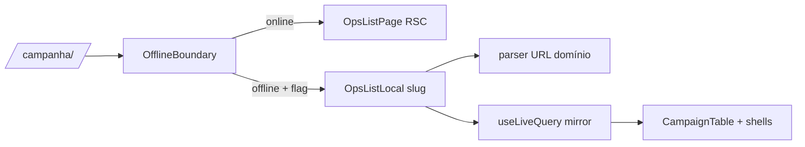

# OH12 — `OpsListLocal` read-only via registry unificada + mirror

Status: rascunho
Atualizado em: 2026-08-01
Issue: #174
Priority: P1
Model: cursor-grok-4.5-medium
Impeccable: B — mesmas listas staff, fallback Local offline
Appetite: ~2–3 dias eng
Depends: OH9, OH5, CL8
Responsável: —

## Premissas

1. CL8 fechada: registry estável (`opsListRegistry`) cobrindo os 8 slugs v1.
2. Modo offline **declarado reduzido**: query string aplica-se ao mirror via parsers canónicos; saved filters **readonly**; controles que precisam de server ficam disabled com tooltip “online-only”.
3. Leitura apenas — writes seguem OH10/OH13 nas ilhas já migradas.

→ Corrija agora ou sigo com estas.

## Objetivos

- `OpsListLocal({ slug })`: para cada slug `status: 'v1'` do registry, renderiza a lista do mirror com `CampaignTable` + shells, aplicando o parser de URL do domínio sobre as rows locais.
- `OfflineBoundary` em cada rota de lista: offline + flag → Local; online → RSC/factory actual.
- Paridade de layout (tabela/cards conforme domínio); estados honestos onde faltar dado (ex.: facets computadas no server).

## Dados → decisão → apresentação

Dados: N/A — mesmas listas; fonte alternativa offline.

## Decisões travadas

- **Filtragem/ordenação offline no client sobre o mirror, usando os parsers canónicos.** **Rejeitado:** reexecutar loaders no client (são server-only); ignorar query string offline (perde deep-link).
- **Saved filters readonly offline.** **Rejeitado:** escrever saved filters offline (storage local já é a fonte; sincronia de prefs é outro tema).
- **Facets/KPIs computados no server → “indisponível offline” quando não derivável do mirror.** **Rejeitado:** inventar aggregates no client sem pin.

## Abordagem proposta

Componentes:

- **`src/components/campaign/opsSync/OpsListLocal.tsx`** (novo): resolve slug → meta; lê collection(s) do mirror; aplica parse da query (mesmos helpers puros dos parsers — extrair para `lib/` se hoje estiverem em utilities client-inseguras); renderiza colunas do domínio (mesmo módulo de colunas que a factory usa).
- **Rotas de lista** (alteradas): envolvem a factory actual com `OfflineBoundary fallback={<OpsListLocal slug={…} />}` — uma a uma, começando por municipios/liderancas.
- **Registry:** consumo directo de `opsListRegistry` (CL) — nenhum registry paralelo.

## Fases verificáveis

### Fase 1 — Tracer: municipios offline

- **Quota:** ~0,5
- **Entrega:** `OpsListLocal('municipios')` com tabela, search, sort, paginação aplicados ao mirror.
- **Aceite:**
  - [ ] offline: lista renderiza; `?q=` filtra localmente; sort/paginação funcionam no client
  - [ ] saved filters: aplicar funciona (leitura), criar/apagar disabled com tooltip
  - [ ] edit-where-you-see controls disabled offline com tooltip “online-only”
- **Verify:** `pnpm gate:fast` + e2e offline lista municipios
- **Files:** `OpsListLocal.tsx`, rota municipios, spec e2e
- **Tamanho:** M

### Fase 2 — Demais slugs

- **Quota:** ~0,5
- **Entrega:** liderancas, dobradinhas, demandas, assessores, territorios, apoiadores, organizacoes.
- **Aceite:**
  - [ ] cada slug renderiza com o layout/colunas do domínio
  - [ ] facets/KPIs não deriváveis → mensagem “indisponível offline” (ex.: overview de apoiadores se o aggregate não for local)
  - [ ] leader: listas de ops fora do seu lockdown não renderizam (mirror inexistente → estado honesto, não erro)
- **Verify:** `pnpm gate:fast` + e2e offline por slug
- **Files:** rotas, `OpsListLocal.tsx`
- **Tamanho:** M

## Dependências

- OH9 (boundary provado), OH5 (mirror), CL8 (registry estável). Reusa colunas/peças de domínio já extraídas na CL.

## Não escopo

- Writes nas listas (ilhas OH10/OH13). Atividades (fora do registry). Mapa/TSE.

## Rabbit holes

- **Reimplementar parsers no client.** Duplicação B18. **Mitigação:** extrair partes puras para `lib/` se necessário (parsers já devem ser client-safe — verificar na implementação).
- **KPIs “aproximados” no client.** Sem pin = número mentiroso. **Mitigação:** estado “indisponível offline”.

## Referências

- [`src/lib/opsListRegistry/`](src/lib/opsListRegistry/) (CL2)
- [`src/components/campaign/shared/CampaignTable.tsx`](src/components/campaign/shared/CampaignTable.tsx)
- Parsers por domínio (`municipalityListUrl.ts`, `leadershipListUrl.ts`, …)
- OH9 (boundary), OH5 (mirror)
