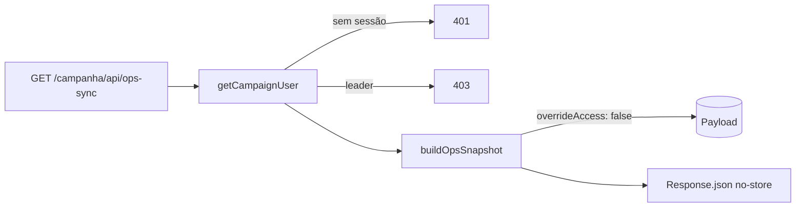

# OH4 — Route `GET /campanha/api/ops-sync` FULL + scoped + int access

Status: rascunho
Atualizado em: 2026-08-01
Issue: #166
Priority: P1
Model: cursor-grok-4.5-medium
Impeccable: A — N/A (endpoint server)
Appetite: ~1,5–2 dias eng
Depends: OH3
Responsável: —

## Premissas

1. Full-only: sem `?since=`, sem delta, sem gzip obrigatório (decisão de compressão fica para OH11 se o benchmark mandar).
2. Truncamento de `municipality_update` usa o número travado em OH3.
3. Leader recebe 403 (sem mirror de ops).

→ Corrija agora ou sigo com estas.

## Objetivos

- `buildOpsSnapshot(payload, actor)` (`server-only`) monta o snapshot scoped pelo actor com `overrideAccess: false` em todas as queries.
- `GET /campanha/api/ops-sync` autentica com `getCampaignUser()`, devolve JSON `no-store`, 403 para leader.
- Pins int: coordinator vê tudo; advisor só a carteira; candidate vê tudo; leader 403.

## Dados → decisão → apresentação

Dados: N/A — endpoint de dados; o consumo é o mirror (OH5).

## Abordagem proposta

Componentes:

- **`src/utilities/campaignOps/buildOpsSnapshot.ts`** (novo, `import 'server-only'`): uma função por collection. Todas `payload.find` com `user: actor`, `overrideAccess: false`, `depth: 0`, `select` mínimo dos DTOs de OH2 (`opsContract.ts` — campos exactos definidos lá; esta issue importa os tipos, não redefine). Escopo advisor: reusar `resolveActorScopedRead` / `advisorMunicipalityScopeWhere` ([`src/utilities/access/shared.ts`](src/utilities/access/shared.ts)) para o where de municípios e derivados — **não** reimplementar RBAC. Devolve `OpsSnapshot` com `revisedAt` e `schemaVersion`.
- **`src/app/(campaign)/campanha/api/ops-sync/route.ts`** (novo): `export async function GET()` — auth, role check, `Response.json(snapshot, { headers: { 'Cache-Control': 'no-store' } })`.
- **Defense in depth:** o `select` de `vote_pledge` **nunca** inclui `estimatedVotes` quando o actor não for staff (hoje só staff consome o endpoint; o pin int cobre leader 403 antes disto importar).

## Fases verificáveis

### Fase 1 — Tracer: builder + route com 1 collection (municipalities)

- **Quota:** ~0,4
- **Entrega:** route devolve `{ revisedAt, schemaVersion, municipalities }` scoped.
- **Aceite:**
  - [ ] 401 sem sessão; 403 leader; 200 coordinator/advisor/candidate
  - [ ] advisor recebe só municípios da carteira (pin int com fixtures)
- **Verify:** `pnpm gate:fast` + `tests/int/campaignOpsSync.int.spec.ts` (municipalities)
- **Files:** builder, route, spec int
- **Tamanho:** M

### Fase 2 — Collections restantes + truncamento

- **Quota:** ~0,6
- **Entrega:** snapshot completo conforme OH2 + updates truncadas (N de OH3).
- **Aceite:**
  - [ ] todas as collections presentes com select mínimo (sem `estimatedVotes` em payload destinado a roles que não devem ver — defense in depth além do client)
  - [ ] `municipality_update` limitado a N/município (pin int)
  - [ ] shape bate com `OpsSnapshot` (validação zod ou type-level no teste)
- **Verify:** `pnpm gate:fast` + spec int completa
- **Files:** builder, spec int
- **Tamanho:** M

## Dependências

- OH2 (DTOs), OH3 (truncamento). Reusa [`src/utilities/campaignAuth.ts`](src/utilities/campaignAuth.ts) (`getCampaignUser`) e access confirmado: `resolveActorScopedRead` / `advisorMunicipalityScopeWhere` ([`src/utilities/access/shared.ts`](src/utilities/access/shared.ts)).

## Não escopo

- Delta/`since`; compressão; cache; sync client (OH5).

## Rabbit holes

- **`depth: 1` “para facilitar joins”.** Explode tamanho e vaza shape para o client. **Mitigação:** IDs + `depth: 0`; joins no client (OH5/OH12).
- **Bypass de access “porque é endpoint interno”.** Invariante do repo. **Mitigação:** pin int de advisor/leader.

## Referências

- [`src/utilities/campaignAuth.ts`](src/utilities/campaignAuth.ts)
- [`src/utilities/access/`](src/utilities/access/)
- [`src/utilities/municipality/campaignMunicipalityScope.ts`](src/utilities/municipality/campaignMunicipalityScope.ts)
- OH2 — contrato `OpsSnapshot`
