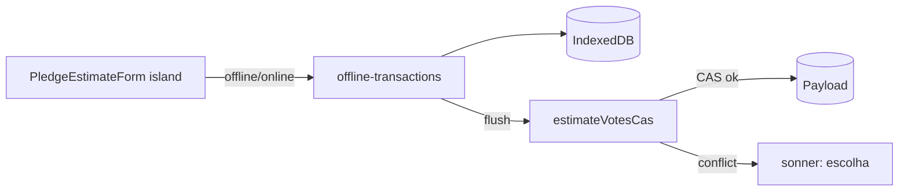

# OH6 — `estimateVotesCas` + outbox mínimo + toasts (tracer bullet)

Status: implementado
Atualizado em: 2026-08-01
Issue: #167
Priority: P1
Model: cursor-grok-4.5-medium
Impeccable: B — mesma ilha `PledgeEstimateForm`, estados novos (pending/conflict)
Appetite: ~2–3 dias eng
Depends: OH1
Responsável: —

## Freshness audit (2026-08-01)

- OH1 (#164) `done`/`in-prod`. Paths e assinaturas (`estimateVotesRecord`, `PledgeEstimateForm`, `estimateVotesSchema`, `estimatedAt` no hook) batem.
- OH2 (#163) mergeou durante a entrega — OH6 reusa `resolveOpsHybridEnabled` de `lib/campaignOps/opsHybridFlag.ts` + `OPS_HYBRID` via `next.config` `env`.
- `@tanstack/offline-transactions@1.0.42` exige collection TanStack DB — tracer usa `localOnlyCollectionOptions` (OH7 troca pelo mirror).

## Premissas

1. Tracer prova a dor do carro **antes** do mirror completo: outbox auto-contido (storage simples), sem depender de OH5.
2. Semântica actual preservada quando `baseEstimatedAt` **não** é enviado (último write ganha).
3. `PledgeEstimateForm` usa `useActionState` + `formAction` por rota — o outbox chama a action de domínio directamente, não o wrapper de form.

→ Confirmadas; a implementar.

## Objetivos

- `estimateVotesSchema` ganha `baseEstimatedAt` opcional; `estimateVotesCas` na action de domínio com CAS.
- Outbox client (`@tanstack/offline-transactions`) com retry; mutação sobrevive reload.
- Estados `pending|synced|conflict|error` na ilha + toasts Sonner (conflito com escolha “Manter o meu / Usar o novo”).

## Dados → decisão → apresentação

Dados: N/A.

## Decisões travadas

- **CAS opt-in por input.** `estimateVotesCas` sem `baseEstimatedAt` = comportamento actual. **Rejeitado:** mudar `estimateVotes` para sempre CAS (quebra call sites actuais: wizard, form actions).
- **Conflito via erro com mensagem estável.** `OPS_ESTIMATE_CONFLICT_MESSAGE` em `safeMessages` do wrapper; outbox detecta a mesma string. **Rejeitado:** tipo de retorno estruturado novo no form (não serializa bem com `useActionState` existente).
- **Outbox auto-contido neste tracer.** **Rejeitado:** esperar OH5 (mirror) para provar writes — atrasa o feedback da dor real.

## Abordagem proposta

Componentes:

- **`src/lib/schemas/votePledge.ts`** (alterado): `baseEstimatedAt: z.string().datetime().nullable().optional()` no `estimateVotesSchema`; export `OPS_ESTIMATE_CONFLICT_MESSAGE`.
- **`src/app/(campaign)/campanha/actions/votePledge.ts`** (alterado): `estimateVotesCas` — se `baseEstimatedAt !== undefined` e `pledge.estimatedAt ?? null !== baseEstimatedAt` → `throw new Error(OPS_ESTIMATE_CONFLICT_MESSAGE)`; senão delega ao fluxo actual (mesma transação/locks).
- **`src/components/campaign/opsSync/opsEstimateOutbox.ts`** (novo): `startOfflineExecutor` com `mutationFn` que chama `estimateVotesCas`; collapse por `pledgeId`; stop-retries em conflito.
- **`PledgeEstimateForm`** (alterado): caminho outbox quando `OPS_HYBRID` ON; mantém caminho `formAction` quando OFF — mesmo JSX, duas estratégias de submit.
- **Deps:** `pnpm add @tanstack/offline-transactions@^1.0.42`.

## Fases verificáveis

### Fase 1 — Tracer: CAS server-side

- **Quota:** ~0,4
- **Entrega:** schema + action + pins int.
- **Aceite:**
  - [x] sem `baseEstimatedAt`: escreve como hoje
  - [x] com base stale: lança conflito, **não** escreve
  - [x] com base igual: escreve e hook actualiza `estimatedAt/estimatedBy`
- **Verify:** `pnpm gate:fast` + `tests/int/votePledgeCas.int.spec.ts`
- **Files:** schema, action, spec int
- **Tamanho:** M

### Fase 2 — Outbox + reload + conflito UI

- **Quota:** ~0,6
- **Entrega:** outbox ligado à ilha; estados; toasts; resolução de conflito (re-enviar com base nova = “Manter o meu”; descartar = “Usar o novo”).
- **Aceite:**
  - [x] editar com rede cortada → badge pending; reload da página → mutação ainda na fila; online → aplica
  - [x] conflito → toast com escolha; “Manter o meu” re-envia com `baseEstimatedAt` do server mais recente
  - [x] flag OFF: form comporta-se exactamente como hoje (pin e2e existente)
- **Verify:** `pnpm gate:fast` + teste e2e flaky-network (Playwright route abort)
- **Files:** `opsEstimateOutbox.ts`, form, spec e2e
- **Tamanho:** M

## Dependências

- OH1. Reusa transação/locks actuais em `estimateVotesRecord` e wrappers em [`pledgeFormActions.ts`](<src/app/(campaign)/campanha/(app)/municipios/[slug]/pledgeFormActions.ts>).

## Não escopo

- Mirror completo (OH5/OH7). Outras writes (OH10/OH13).

## Rabbit holes

- **Chamar o wrapper de form do outbox.** `FormData` + `useActionState` não carrega `baseEstimatedAt` nem lê conflito bem. **Mitigação:** action de domínio directa.
- **Retry infinito em conflito.** Loop na estrada. **Mitigação:** classe de erro “stop retries”.

## Referências

- [`src/app/(campaign)/campanha/actions/votePledge.ts`](<src/app/(campaign)/campanha/actions/votePledge.ts>)
- [`src/lib/schemas/votePledge.ts`](src/lib/schemas/votePledge.ts)
- [`src/components/campaign/votePledge/PledgeEstimateForm.tsx`](src/components/campaign/votePledge/PledgeEstimateForm.tsx)
- [`@tanstack/offline-transactions`](https://www.npmjs.com/package/@tanstack/offline-transactions) (verificar docs da versão na implementação)
