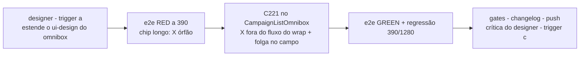

# Impl: C221 — "Limpar" do omnibox não pode quebrar linha no mobile

Status: aprovado
Atualizado em: 2026-09-24
Issue: #1313
Intenção: docs/plans/omnibox-limpar-mobile.md
Appetite restante: herdado (~2h eng, fill-in) — cabe: gate de design + e2e RED/GREEN + fix de classes no dono + gates; sem schema, sem server
Aprovação: `--auto` (work-issue) — plano auto-aprovado em 2026-09-24; pausa do GATE 3c dispensada pela flag

## Leitura da intenção

- **Outcome:** com chip de busca longo no mobile, o "X" de limpar do `CampaignListOmnibox` continua ancorado ao campo/chips — nunca vira linha órfã abaixo do chip, em **todas** as 17 listas que usam o shell — sem tocar desktop, a11y ou contrato de URL/filtros.
- **O que NÃO negociar:** comportamento do X (limpa tudo, refoca o input, não reabre o popover) e a11y (`aria-label="Limpar"`, `invisible`/fora da a11y tree quando vazio, anúncio sr-only); desktop `md:` (borda/ring/altura/label/"Limpar" texto/trailing cluster); barra mobile 44–48px no estado padrão (B196); marcador `campaign-list-omnibox-form` (contrato do `:has()` em `CampaignQuickActionsHost.tsx:17`) e o sticky no `<form>` do caller; font-size 16px touch (B183); URL/filtros e adaptadores intocados.
- **O que reavaliar:**
  1. "O cluster `flex-wrap` é o culpado" — **confirmada**, com a geometria: a 390 o conteúdo útil do campo é 342px (form 358 − `px-2` do campo); um chip entre ~166px e ~208px deixa chip + input (min `8rem` = 128px) na linha 1 e o X (`size-9`, `shrink-0`) **sozinho na linha 2**, encostado à esquerda (não há `justify`). A faixa vazia é essa linha do X.
  2. "X fora do fluxo é a estratégia mais simples" — é a recomendação de engenharia, mas **a estrutura visual final é do `designer`** (trigger (a)): o impl plan fixa o mecanismo e os invariantes, não as classes finais.
  3. "Limitar a largura do chip no mobile" — só vira decisão se o artefato aprovado optar por cap/truncamento; não é decisão de engenharia (mexe em legibilidade do filtro ativo).

## Abordagem recomendada

**Opções consideradas:** A | B | C | D
**Recomendação:** A — **tirar o X do fluxo de wrap** (abaixo de `md`, posicionado de forma absoluta dentro do próprio campo, que vira `relative`; a folga do final da linha é reservada por um padding mobile no campo, de modo que chips/input não passem sob o X). É o menor diff que garante o invariante por construção: um elemento fora do fluxo nunca quebra linha. Mantém o pai do input como o campo (âncora do popover), não muda ordem DOM/tab order, não existe no desktop (`md:hidden`), e tem precedente no repo (`relative` + filho `absolute right-*` em `RelationChipCell`, `MunicipalityRelationEditor`, `CampaignInlineEditableCell`).
**Rejeitadas:**

- **B — invólucro flex interno para chips+input + X ancorado à linha do input:** muda o pai do input, quebrando `omniboxInput.locator('..')` — locator que B184/B196 usam para medir o campo (`toHaveCSS('border-top-width', …)`, `boxShadow`) — e adiciona um nível de DOM/ARIA numa área pinada por e2e; risco desproporcional ao appetite.
- **C — cap de largura do chip abaixo de `md` (`max-md:max-w-[9rem]` etc.):** tecnicamente garante o encaixe, mas trunca agressivamente o rótulo do filtro ativo (perda de contexto do recorte) e é craft/copy — se o designer quiser o campo em uma linha, ele especifica o cap; não é o fix de engenharia.
- **D — `max-md:min-w-0` no input/chip para forçar linha única:** comprime o chip até sobrar só o botão de remover e o input a ~0; destrói a leitura do filtro e o alvo de toque.

### Decisões de engenharia

- **D1 — Mecanismo do não-órfão.**
  - **Opções:** A) X absoluto no campo com folga reservada por padding mobile; B) invólucro interno chips+input; C) cap de largura de chip; D) `min-w-0` no input/chip.
  - **Recomendação:** A — invariante por construção (fora do fluxo = nunca quebra), menor superfície, sem mudar o pai do input nem a âncora do popover.
  - **Rejeitadas:** B/C/D pelos motivos acima.
- **D2 — Fronteira engenharia × craft (designer).** Engenharia garante: o X permanece **dentro da div do campo** (o `PopoverAnchor`; o popover usa `var(--radix-popover-trigger-width)`), a folga é **padding no content box** do campo (não espaçador absoluto) para `max-w-full`/`truncate` dos chips e o `flex-1` do input continuarem corretos, e o móvel é escopado por variantes `max-md:`/`md:`. Craft (artefato do designer): offset e tamanho exato da folga, ancoragem vertical do X (centro do campo vs. linha do input), cap/truncamento de chip se houver, e se o campo pode permanecer em 2 linhas com chip longo (comportamento pré-existente; a intenção proíbe apenas o X órfão).
- **D3 — Camada de teste.**
  - **Opções:** A) estender o e2e de municípios (B184) com cenário de chip longo medindo geometria a 390; B) unit de componente com Testing Library; C) snapshot/visual regression.
  - **Recomendação:** A — é a única camada que mede layout de verdade (jsdom não faz layout; `getBoundingClientRect` é zero); o idioma de medição (`boundingBox` + `expect.poll`) já existe em B196; o spec irmão (`campaignMunicipalities`) já é acordado pelo prefixo do shell no manifesto.
  - **Rejeitadas:** B — não prova quebra de linha e pinaria strings de classe (frágil); C — o repo não tem infra de baseline visual (inventar infra viola o appetite).
- **D4 — Manifesto e2e / blast radius do PR.**
  - **Opções:** A) não tocar o manifesto (PR seleciona a família municípios, que já contém B184/B196); B) adicionar `campaignIosInputZoom` ao entry que contém o prefixo `src/components/campaign/shared/CampaignListOmnibox`; C) adicionar também os pesados (`campaignActivity`, `campaignSpeechAcervo`).
  - **Recomendação:** B — `campaignIosInputZoom` é o pin barato e direto do contrato do campo (font-size 16px touch) e hoje está **fora do manifesto** (só roda no full); este diff toca exatamente o dono do campo, então o check obrigatório `checks` deve vê-lo. A família municípios (A dentro dela: B184/B196) continua sendo o grosso da cobertura.
  - **Rejeitadas:** A — deixa um contrato tocado sem cobertura no gate de PR; C — encarece todo diff futuro da área com specs que pinam superfícies que este item não muda; o full verify do deploy cobre as verticais do acervo.

### Componentes / mudanças

- **`CampaignListOmnibox`** (`src/components/campaign/shared/CampaignListOmnibox.tsx`) — único arquivo de produto:
  - cluster do campo (`:213-223`): passa a `relative` e ganha folga de fim de linha **só abaixo de `md`** (padding mobile; `md:` restaura `px-2`/borda/ring/altura);
  - botão de limpar (`:293-322`): abaixo de `md` sai do fluxo (`absolute`, ancorado à direita do campo) mantendo `size-9 shrink-0 md:hidden`, o `invisible pointer-events-none` quando `!(hasChips || query.length > 0)` e todo o `onClick`/a11y atuais;
  - comentário do fix com tag **C221** (a convenção do arquivo cita B184/B196/B200/C100/C125);
  - **nada mais** muda: `campaignListOmniboxFormClassName`, chips, input, popover, trailing cluster desktop e regiões `sr-only` intocados.
- **`E2E_AFFECTED_MANIFEST`** (`scripts/lib/e2e-affected-manifest.mjs`): `campaignIosInputZoom` entra no entry que já contém `src/components/campaign/shared/CampaignListOmnibox` (D4).
- **Teste** (`tests/e2e/campaignMunicipalities.e2e.spec.ts`): novo `test` dentro do describe `Municípios — filtro e cards sem moldura no celular (B184)` (viewport 390 herdado).
- **Design:** `docs/plans/omnibox-limpar-mobile-ui-design.html` (novo artefato; o design da C219 não cobre o X dentro do campo nem a quebra — trigger (a)).
- **Changelog:** `docs/changelog/2026-09-24-c221.md` (uma entrada, formato dos recentes).
- **Migration:** sem migration.
- **Access / Consent:** nenhum (zero paths de escrita/PII; componente de apresentação).
- **UI:** Impeccable B — ajuste de encaixe do shell existente; shape→craft→critique→polish com o `designer` (trigger (a) antes do markup; trigger (c) no fechamento, screenshot 390/1280 contra o artefato; tier registrado no PR; `DEGRADED` fail-closed: `work-issue` para antes do push para sign-off, `agent-work-issue` comenta e bloqueia sem PR).

### Superfícies afetadas (17 call sites, zero edições por consumidor)

Todas usam o mesmo shell; o fix no dono as cobre sem tocar arquivo por arquivo:

- **Acervo — Câmara:** `speech/SpeechAcervoFilters.tsx:215`, `speech/SpeechCutLibraryFilters.tsx`
- **Acervo — Gravações:** `recording/RecordingAcervoFilters.tsx:232`
- **Fora do acervo (amostras de regressão):** `municipality/MunicipalityFilters`, `municipality/CampaignUpdatesFilters`, `municipality/TerritoryFilters`, `activity/ActivityFilters`, `activity/ActivityAgendaFilters`, `advisor/AdvisorFilters`, `contacts/ContactFilters`, `content/ContentPieceFilters`, `demand/DemandFilters`, `leadership/LeadershipFilters`, `organization/OrganizationFilters`, `people/PeopleFilters`, `stateDeputy/StateDeputyFilters`, `supporter/SupporterFilters`

### Dados → forma

N/A — nenhuma métrica/dado novo; é encaixe de superfície existente.

## Fases verificáveis

1. **Design (trigger a) — bloqueante, antes de qualquer markup.** O `designer` estende/cria o artefato hi-fi com cenas 390 (campo com chip de busca longo commitado, chip curto + texto digitado, vazio — X visível e invisível) e 1280 (intocado), usando os tokens da campanha. Saída: artefato certificado em tier primário, ou `DEGRADED` com sign-off humano registrado. Referências do débito: `/tmp/opencode/c219-shots/06-mobile-empty.png` e `11-mobile-camara-long-chip.png` (se ainda existirem na máquina da sessão).
2. **Tracer — e2e RED (~30–40min).** Adicionar ao describe B184: login, `page.goto('/campanha/municipios?q=<texto longo>')` (o `?q=` renderiza o chip `Busca: <texto>` de forma determinística, sem depender de sugestão do popover), esperar o chip e o X (`getByRole('button', { name: 'Limpar', exact: true })`), e assertar com `boundingBox` + `expect.poll` (idioma de B196):
   - **(1) X ancorado à direita do campo:** `field.x + field.width − (x.x + x.width) <= 16` (o bug deixa o X à esquerda: inset ≈ 300px);
   - **(2) X compartilha a faixa vertical do conteúdo:** centro do X `< input.y + input.height`;
   - **calibrar o texto do `?q=` até o teste ficar vermelho no código atual** (janela do órfão: chip entre ~166 e ~208px; documentar a aritmética num comentário do teste). Se o comprimento não cair na janela, ajustar o texto — nunca afrouxar a asserção. Prova: teste vermelho com o componente pré-fix.
3. **Fix (~30–45min).** Portar o artefato aprovado classe-a-classe, restrito ao dono (D1/D2). Invariantes: pai do input continua o campo; X dentro da âncora; `invisible` quando vazio; `md:` restaura tudo; nenhum adapter/URL tocado.
4. **Verde + regressão (~30min).** E2e novo verde; rodar localmente os e2e da mesma superfície — `campaignMunicipalities`, `campaignIosInputZoom`, `campaignUpdatesMobile`, `campaignActivity` (discricionário OPS72; o CI do PR seleciona a família municípios + `campaignIosInputZoom`); capturas manuais a **390** em uma lista de cada vertical do acervo (Câmara em `/campanha/comunicacao/acervo`, Gravações na mesma rota com `?source=enviadas`) + uma fora do acervo (`/campanha/municipios`), com chip longo, chip curto + digitado e vazio; desktop **1280** no mesmo estado. `pnpm gate:fast`.
5. **Fechamento (~15min).** `/simplify`; crítica final do `designer` (trigger c) contra o app renderizado; changelog; `pnpm push`; PR ready cuja descrição lista as superfícies, o tier de design e a nota do manifesto.

## Rabbit holes / Não escopo (engenharia)

- **Invólucro em volta do input** (para agrupar chips+input) — proibido: quebra `omniboxInput.locator('..')` de B184/B196 e a âncora do popover; se o artefato do designer propuser isso, é divergência material e volta ao humano.
- Renomear `campaign-list-omnibox-form` ou mover o sticky do `<form>` do caller — contrato do `:has()`/B196.
- Redesenhar a barra, os facet popovers, o `CampaignSearchModeControl` ou o trailing desktop.
- Cap/truncamento de chip como decisão de engenharia — só se o artefato pedir.
- "Consertar" o campo em 2 linhas com chip longo — comportamento pré-existente; o aceite é o X não ser linha própria.
- Unit de layout em jsdom ou infra de snapshot visual nova — não existe no repo; não inventar.
- Tocar `styles.css` (regra B183) ou o `text-sm` do input.
- Editar os 17 consumidores ou qualquer adapter/URL.

## Riscos e mitigação

- **Falso verde do e2e** (asserção que passa no código quebrado): mitigado por (i) **prova RED obrigatória** na Fase 2 antes do fix; (ii) asserção principal com margem enorme (inset ≈ 300px no bug vs ≤ 16px no fix); (iii) janela do órfão documentada no comentário para calibrar o texto. Se a fonte do CI mudar métricas, o teste pode voltar a passar por acidente — o segundo cenário de regressão manual (390, chip longo) é o backstop; gatilho para reabrir: B184 quebrar sem o teste acusar.
- **Regressão de desktop:** `relative` é inerte e a folga/posicionamento entram sob variantes `max-md:`; B184 já asserta a volta do desktop (borda 1px, label visível, "Limpar" texto); 1280 manual na Fase 4.
- **Altura da barra:** absoluto não adiciona linha; a folga horizontal não muda a altura; B196 segue pinando 44–48px no estado padrão.
- **X sumir/sobrepor conteúdo:** folga via padding de content box (chips `max-w-full`/`truncate` e input `flex-1` respeitam); X continua dentro da âncora, então o popover mantém `var(--radix-popover-trigger-width)` e a área de toque.
- **A11y:** ordem DOM/tab order inalterada; `invisible` continua tirando o X da a11y tree quando vazio (B184: `toHaveCount(0)`); `aria-label`/ring/sr-only intocados.
- **iOS 16px (B183):** nenhum font-size de form control é alterado; a regra `(pointer: coarse)` continua dona. `campaignIosInputZoom` entra no selecionado (D4).
- **Design `DEGRADED`:** fail-closed conforme pipeline — sem tier primário não há certificação; `work-issue` para antes do push, pool não abre PR.
- **Cobertura das verticais do acervo no PR:** o prefixo do shell no manifesto só acorda a família municípios; as demais verticais ficam com a rodada local discricionária + full verify do deploy — registrado no PR (D4).

## Débitos (triage do /simplify, 2026-09-24)

- **Deferido — viewports <390px (ex. iPhone SE, 375px):** o cap de 168px + o input `min-w-[8rem]` podem voltar a ocupar 2 linhas (a barra cresce ~46px), com o X ainda ancorado/centrado (aceite preservado). O design aprovado e o e2e cobrem o alvo 390. **Gatilho:** reporte real em aparelho estreito ou o próximo ajuste do shell de filtros.
- **Deferido — warning React de key (dev) no omnibox de assessores:** o console guard local acusa `Each child in a list should have a unique "key" prop — CampaignListOmnibox` na página de assessores (pré-existente, não determinístico, ausente em prod/build). **Gatilho:** warning determinístico no console guard ou a próxima passagem pelo `campaignColumnPicker`.
- **Descartados:** hidratação divergente do `AISidebarSurfaces` em capturas temporárias (intermitente, alheia); flakiness de login/POST do e2e local sob carga alta (ambiente, não débito do item).

## Aceite de engenharia

- [ ] Com chip de busca longo a 390, o X permanece ancorado ao campo/chips (novo e2e com **RED provado antes do fix**), em todas as listas (mesmo shell, sem edição por consumidor)
- [ ] A11y intacta: `aria-label="Limpar"`, ring de foco, `invisible` fora da a11y tree quando vazio, anúncio sr-only
- [ ] Desktop `md:` intocado (B184 desktop leg + captura 1280); barra mobile 44–48px (B196); font-size touch 16px (B183)
- [ ] URL/filtros e adaptadores intocados (diff não toca nenhum)
- [ ] Sem migration, sem access, sem Consent, sem PII
- [ ] Regressão manual 390: Câmara (acervo), Gravações (`?source=enviadas`) e uma lista fora do acervo (municípios), nos estados chip longo/curto+digitado/vazio
- [ ] `pnpm gate:fast` + e2e locais da superfície; changelog `docs/changelog/2026-09-24-c221.md`; `pnpm push`
- [ ] Design: artefato `docs/plans/omnibox-limpar-mobile-ui-design.html` estendido/certificado (trigger a) e crítica final (trigger c); tier registrado no PR

## Self-score (decision-quality, gate ≥4)

| Critério                      | Nota | Justificativa                                                                                        |
| ----------------------------- | ---- | ---------------------------------------------------------------------------------------------------- |
| Decisões caras com rejeitadas | 5/5  | D1–D4 no formato Opções/Recomendação/Rejeitadas; mecanismo, craft, teste e manifesto deliberados     |
| Abordagem cabe no appetite    | 5/5  | 1 arquivo de produto + 1 teste + 1 linha de manifesto; sem schema/server; ~2h                        |
| Rabbit holes nomeados         | 5/5  | Invólucro no input, cap de chip, campo em 2 linhas, unit jsdom, 17 consumidores, `styles.css`        |
| Depth check (reusa donos)     | 5/5  | Fix no dono do encaixe (`CampaignListOmnibox`), e2e no spec dono do B184, sem módulo/collection novo |
| Intenção preservada           | 5/5  | Aceite de produto (X nunca órfão) intacto; engenharia não reescreveu outcome nem escopo              |

**Agregado: 5/5 — aprovado em modo `--auto`.**
