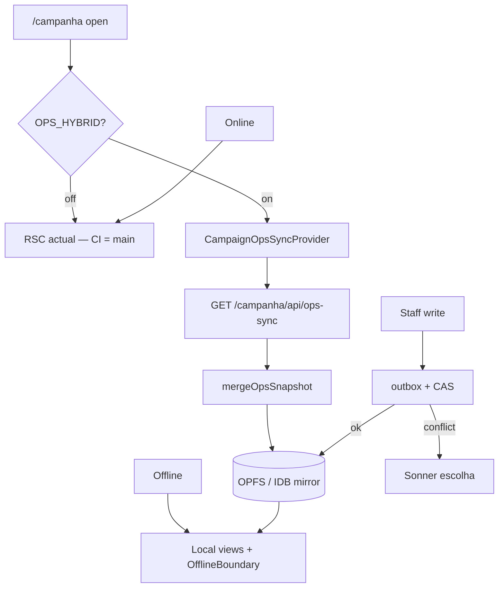

# Ops híbrido RSC/local — spec-mãe e critérios

Status: aprovado
Atualizado em: 2026-08-01
Issue: #164
Priority: P1
Model: cursor-grok-4.5-high
Impeccable: B — sync chrome + dual-path em superfícies staff existentes
Appetite: ~1 dia eng (só docs + decisões)
Responsável: —

## Premissas

1. Snapshot cobre o grafo operacional de staff; `supporter` fora (LGPD/volume) no v1.
2. Writes actuais são “último write ganha”; CAS muda semântica **só quando `baseUpdatedAt`/`baseEstimatedAt` é enviado** — call sites antigos continuam iguais.
3. Persistence OPFS/WA-SQLite pode falhar em iOS antigo — fallback IndexedDB obrigatório.
4. Sync full-only v1; deletes podem ficar no mirror até ao próximo full sync.
5. Leader sem mirror de ops (lockdown actual).
6. `OPS_HYBRID` compile-time env; sem rollout/cohort/kill switch.

Premissas confirmadas no gate de registo das Issues OH2–OH14 (2026-08-01).

## Design (Impeccable)

Âncoras: `PRODUCT.md` / `DESIGN.md` (register product) · tema `data-theme='campaign'`.

Na implementação (`work-issue` das Issues filhas B): craft compacto → critique → polish nas ilhas tocadas. Chrome de sync é texto discreto no shell (não banner SaaS). `harden`/`optimize` só sob gatilho.

Brief:

- **Persona / contexto:** coordenador geral na estrada (LTE intermitente); Little Hire compete com WhatsApp/planilha (`docs/CUSTOMER.md`).
- **Job principal:** abrir `/campanha`, ver “Actualizado”, trabalhar detalhe/listas e estimativas mesmo offline — sem perder write após reload.
- **Estratégia de cor:** Restrained (tokens campaign).
- **Edit where you see:** sim — writes offline nas mesmas ilhas (`PledgeEstimateForm`, células staff); CAS + toast de conflito; sem spreadsheet mode.
- **Anti-goals:** SPA paralela; banner sync intrusivo; inventar dados Local quando online; cachear Flight/RSC no SW.

### Wireframe (texto)

```text
┌─ shell /campanha (app) ─────────────────────────────────┐
│ [sidebar]  ┌─ top bar ────────────────────────────────┐ │
│            │ …  status: Actualizado há 2m | A sincronizar… │
│            │     | Dados podem estar desatualizados   │ │
│            └──────────────────────────────────────────┘ │
│            ┌─ detalhe município / lista ──────────────┐ │
│            │ online → RSC children                    │ │
│            │ offline + OPS_HYBRID → Local + OfflineBoundary │
│            │ região online-only → “Indisponível offline” │
│            └──────────────────────────────────────────┘ │
└─────────────────────────────────────────────────────────┘
  Fora do frame: Toaster (Sonner) para conflito CAS / outbox.
```

## Objetivos

- Documento-mãe que trava: arquitetura híbrida, escopo do snapshot, CAS/outbox, boundaries, critérios de aceite do projecto e ordem das Issues OH2–OH14.
- Engenheiro júnior lê este doc + o plano da sua Issue e executa sem reunião.
- Com `OPS_HYBRID=1` (entregas filhas): abrir `/campanha` sincroniza o snapshot; chrome “Actualizado”; offline renderiza do mirror; writes via outbox + CAS.
- CI sem `OPS_HYBRID` idêntica a `main`; jornada offline completa em `campaignOpsOffline.e2e.spec.ts` com `OPS_HYBRID=1` (OH11).

## Dados → decisão → apresentação

Dados: N/A — infra de sincronização; chrome mostra só estado (não KPI).

## Contexto

Ops em prod medidas em 2026-08-01: campanha ~4 MB vs TSE ~128 MB (não sincronizar). Dor do coordenador: estrada com LTE intermitente; WhatsApp/planilha competem (`docs/CUSTOMER.md` — Little Hire). PWA actual só shell ([`src/utilities/campaignPwa.ts`](src/utilities/campaignPwa.ts)) — precache de ícones/manifest, sem dados de ops. Estimativas vivem em [`votePledge.ts`](<src/app/(campaign)/campanha/actions/votePledge.ts>) + `PledgeEstimateForm` (staff); `estimatedAt` já é escrito no hook da collection. Layout de montagem do provider: [`campanha/(app)/layout.tsx`](<src/app/(campaign)/campanha/(app)/layout.tsx>). Toasts: Sonner já no shell (`Toaster`).

## Decisões travadas

- **Graceful degradation + mirror completo.** Online RSC; offline Local. **Rejeitado:** SPA/Preact; sync engine externo (Electric/PowerSync/Zero) no v1.
- **Transporte GET `/campanha/api/ops-sync`.** Route handler, não Server Action — mede latência/tamanho. **Rejeitado:** POST sem payload; Server Action.
- **Full-only + tombstones fora.** Deletes esperam próximo full sync. **Rejeitado:** delta por `updatedAt` sem tombstones (rows fantasmas).
- **CAS por doc (`updatedAt`/`estimatedAt`).** Conflito = toast + escolha “Manter o meu / Usar o novo”. **Rejeitado:** LWW por relógio do client; “server sempre ganha” silencioso.
- **OH12 consome `opsListRegistry` (projecto CL).** **Rejeitado:** listas Local escritas à mão por domínio.
- **Tracer = estimativas antes do mirror completo (OH6 paralelo a OH2–OH5).** **Rejeitado:** mirror primeiro (atraso no feedback da dor real).
- **Persistência OPFS primeiro, fallback IDB.** **Rejeitado:** só OPFS (iOS antigo falha); só localStorage (limite/estrutura).
- **Leader sem mirror.** **Rejeitado:** mirror parcial para `leader` (ex. só supporters `createdBy`) — abre lockdown e fatia LGPD.
- **`OPS_HYBRID` compile-time env.** Sem cohort/rollout/kill switch runtime. **Rejeitado:** feature flag remote / percentage rollout.
- **Poll 3 min só em foreground** (`visibilityState === 'visible'`); re-sync em `visibilitychange`/`online`; sync in-flight coalescido (timer + focus + online). **Rejeitado:** poll em background; busy-wait / `setTimeout(0)`.
- **Orçamento do snapshot:** alvo ≤ ~2 MB gzip (número final medido/justificado em OH3); construção do snapshot = **uma (ou poucas) query(s) por collection**, nunca I/O por município no hot path. **Rejeitado:** N+1 por município; sync que bloqueia o paint RSC (fire-and-forget + chrome “A sincronizar…”).
- **i18n:** identificadores em inglês (`OPS_HYBRID`, `ops-sync`, `campaignOps`, `OfflineBoundary`); strings de chrome/toast em pt-BR. **Rejeitado:** identificadores em pt-BR / mistos.

## Escopo do snapshot (travado)

Inclui: `municipality`, `leadership` (+rels resumidos), `vote_pledge`, `activity` (lista), `state_deputy`, `organization`, `campaign_demand`, `campaign_goals`, `municipality_update` (últimos 50 por município — número final medido em OH3).
Fora: TSE/`election_*`, geometries, media blobs, `supporter`, site público, `/admin`, contacts completos (só campos necessários às views piloto).

## Boundaries Teqo

- **Always:** sync com `getCampaignUser()` + `overrideAccess: false`; outbox com toast (Sonner); pin int access; SW nunca cacheia RSC/Flight; DTOs em `src/lib/campaignOps/` client-safe.
- **Ask first:** dependency nova (TanStack DB / offline-transactions); mexer em `campaignPwa.ts` / SW; alterar zod de actions existentes além de `base*` opcional.
- **Never:** sync TSE; mirror `supporter` v1; Consent por ID hardcoded; tocar Neon de prod; cachear Flight; SPA paralela.

## Questões em aberto

- **Remover `OPS_HYBRID` após verde em staging?** **Opções:** A) remover e ligar sempre para staff; B) manter flag com default documentado até data X. **Recomendação:** decidir em OH14 com evidência e2e offline + staging — não nesta Issue.

## Abordagem proposta



Componentes (entregues pelas Issues filhas — não nesta Issue):

- **`src/lib/campaignOps/*`** (OH2): DTOs, merge, flag, schema version.
- **`scripts/benchmark-ops-snapshot.mjs`** (OH3): bytes/tempo → trunca `municipality_update`.
- **`GET …/api/ops-sync`** (OH4): snapshot scoped, 403 leader, `no-store`.
- **`CampaignOpsSyncProvider` + persistence + chrome** (OH5).
- **`estimateVotesCas` + outbox** (OH6 tracer) → liga ao mirror (OH7).
- **Caracterização → dual-path detalhe → listas Local** (OH8→OH9→OH12; CL3/CL8 duros).
- **Writes CAS por domínio** (OH10, OH13); **SW + e2e** (OH11); **flag cleanup** (OH14).

Sem migration, sem collection, sem server action **nesta** Issue (só spec).

## Mapa do projecto (Issues filhas)

| ID   | Issue | Depende de    | Entrega curta                                     |
| ---- | ----- | ------------- | ------------------------------------------------- |
| OH2  | #163  | OH1           | `lib/campaignOps` contrato + merge + flag         |
| OH3  | #165  | OH2           | Benchmark snapshot + truncamento                  |
| OH4  | #166  | OH3           | `GET /campanha/api/ops-sync` FULL + access        |
| OH5  | #168  | OH4           | SyncProvider + OPFS→IDB + poll + chrome           |
| OH6  | #167  | OH1           | `estimateVotesCas` + outbox (tracer, paralelo)    |
| OH7  | #169  | OH5, OH6      | Estimativas ligadas ao mirror completo            |
| OH8  | #170  | OH1, CL3      | Caracterização rotas piloto (só testes)           |
| OH9  | #172  | OH8, OH5      | Detalhe município dual-path + OfflineBoundary     |
| OH10 | #171  | OH7, OH9      | Writes municipality staff CAS                     |
| OH11 | #173  | OH9, OH10     | SW `/_next/static` + e2e offline + docs           |
| OH12 | #174  | OH9, OH5, CL8 | OpsListLocal via registry + mirror                |
| OH13 | #176  | OH10, OH12    | Writes CAS leadership/stateDeputy/activity/demand |
| OH14 | #175  | OH13, OH11    | Limpeza `OPS_HYBRID` + doc final                  |

Paralelas OK após OH1: OH2→OH5 em série; OH6 em paralelo a OH2–OH5; OH1–OH7 com CL1–CL3.

## Fases verificáveis

### Fase 1 — Spec-mãe aprovada + mapa linkado

- **Quota:** 1 do appetite
- **Entrega:** este documento em `Status: aprovado`; critérios de aceite do projecto; mapa OH2–OH14 com Issues; paths citados conferidos no repo.
- **Aceite:**
  - [x] Decisões travadas com rejeitadas (arquitectura, transporte, sync, CAS, persistência, leader, flag compile-time, poll, orçamento)
  - [x] Escopo do snapshot in/out explícito
  - [x] Critérios de aceite do projecto testáveis
  - [x] Mapa filhas com `depends` alinhado ao frontmatter das Issues
  - [x] Freshness: `campaignPwa.ts`, `votePledge.ts`, layout `(app)`, Sonner, `CUSTOMER.md` existem; `opsListRegistry` ainda não (CL2)
- **Verify:** review do plano + `pnpm gate:fast` (docs-only)
- **Files:** `docs/plans/ops-hibrido-rsc-local-spec.md`, `docs/CHANGELOG-AGENTS.md`
- **Tamanho:** S

## Critérios de aceite do projecto

1. Sem `OPS_HYBRID`: CI idêntica a `main` (e2e existentes).
2. Com env, online: GET `ops-sync` 200 com snapshot (alvo ≤ ~2 MB gzip ou justificativa OH3); chrome “Actualizado”; sync não bloqueia paint RSC.
3. Airplane: detalhe no mirror renderiza via Local; regiões online-only com estado honesto.
4. Write offline → pending → online → aplica ou conflict UI; outbox sobrevive reload.
5. Advisor nunca recebe municípios fora da carteira; leader sem mirror.
6. `pnpm gate:fast` + specs novos verdes.

## Dependências

- **Dura (projecto):** Lista Unificada Campanha — OH8 depende de **CL3** (#157); OH12 depende de **CL8** (#162).
- **Paralelas OK:** OH1–OH7 com CL1–CL3.
- **Código reusado:** PWA shell, layout `(app)`, `estimateVotesRecord` / `PledgeEstimateForm`, Sonner, access campaign existente.

## Não escopo

- Implementação de sync/outbox/UI — Issues OH2–OH14.
- Delta sync / tombstones / WebSocket — adiados.
- Mirror de `supporter` ou TSE — fora do v1.
- Alterar lockdown de `leader`.

## Rabbit holes

- **“Só um sync engine de mercado.”** Troca o modelo RSC+Local por SPA e atrasa o tracer da dor real. **Mitigação:** decisão travada; deps TanStack só persistence/outbox.
- **Delta sync “porque full é grande.”** Sem tombstones cria fantasmas; medir primeiro (OH3). **Mitigação:** full-only v1.
- **Generalizar OfflineBoundary a todas as rotas na primeira Issue UI.** **Mitigação:** OH9 só detalhe; OH12 listas.
- **Mudar semântica de todos os writes para CAS obrigatório.** **Mitigação:** CAS opt-in via `base*`; call sites antigos intactos.

## Adiado com gatilho

- **Delta sync + tombstones.** Revisitar quando: OH3 reportar gzip ≫ ~2 MB **ou** poll full for inviável em campo.
- **Remoção da flag `OPS_HYBRID`.** Revisitar em OH14 com e2e offline verde em staging.
- **Compressão no wire.** Revisitar se OH3/OH11 medirem necessidade após full sync.

## Referências

- GitHub Issue #164 (`id: OH1`)
- [`src/utilities/campaignPwa.ts`](src/utilities/campaignPwa.ts) — PWA shell actual
- [`src/app/(campaign)/campanha/actions/votePledge.ts`](<src/app/(campaign)/campanha/actions/votePledge.ts>) — writes de estimativa
- [`src/app/(campaign)/campanha/(app)/layout.tsx`](<src/app/(campaign)/campanha/(app)/layout.tsx>) — montagem do provider
- [`docs/CUSTOMER.md`](docs/CUSTOMER.md) — Little Hire, canal WhatsApp
- Planos filhas: [`oh2-lib-campaignops.md`](oh2-lib-campaignops.md) … [`oh14-flag-cleanup.md`](oh14-flag-cleanup.md)
- Spec irmã: [`lista-unificada-campanha-spec.md`](lista-unificada-campanha-spec.md) (CL — registry para OH12)
- AGENTS.md — Campaign auth, PWA, access, TSE artifact, `lib/` client-safe
- `PRODUCT.md` / `DESIGN.md` — Field Desk, Feel the action, Edit where you see
