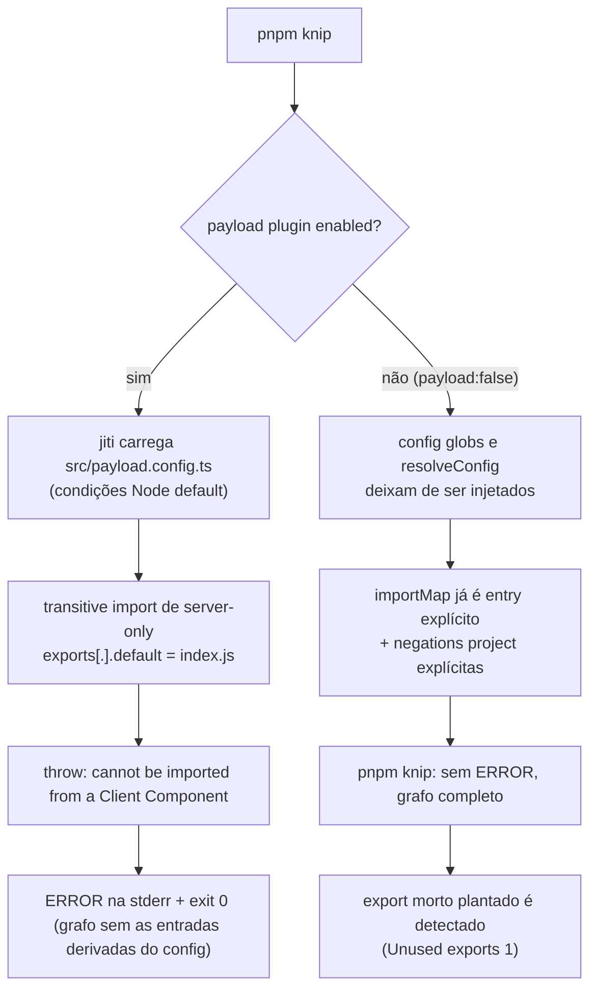

# Impl: OPS: knip carrega o payload.config.ts com erro (importMap commitado) e roda com análise degradada

Status: aprovado
Atualizado em: 2026-09-16
Issue: #1094
Intenção: docs/plans/ops-knip-importmap-artifact.md
Appetite restante: herdado — ~30 min eng; sem schema, sem deploy, sem UI (Impeccable A)

## Leitura da intenção

- **Outcome:** `pnpm knip` deixa de imprimir `ERROR: Error loading src/payload.config.ts (This module cannot be imported from a Client Component module...)` na stderr e a análise continua completa — um export morto plantado segue sendo detectado. Hoje o erro aparece e o comando sai 0, gate verde com grafo degradado.
- **O que NÃO negociar:** a cobertura de análise (nenhum finding novo/ausente por causa do fix), a suíte de gates inalterada em ordem e comportamento, e nenhum risco à classe OPS69 (admin em branco) — `importMap.js` permanece commitado e o `entry` explícito permanece.
- **O que reavaliar:** a hipótese da intenção de que `paths.server-only` "não está sendo aplicado" está correta, mas a correção de rumo é outra: `paths` alimenta o resolver estático do knip, não o carregamento jiti do `payload.config.ts`; e destrackear o `importMap.js` (opção b da intenção) não remove o ERROR. Ambas caem.

## Abordagem recomendada

**Opções consideradas:** A (desabilitar o plugin Payload e explicitar o que ele contribuía) | B (manter o plugin com globs neutralizados) | C (tornar o config carregável via alias/condição) | D (destrackear `importMap.js`)

**Recomendação:** A — `"payload": false` em `knip.json`, promover a contribuição útil do plugin para o próprio `knip.json` (o `entry` do importMap já existe; adicionar `"!src/migrations/**"` e `"!src/payload-types.ts"` ao `project`) e remover o bloco `paths` inerte. O plugin só contribui com (a) os globs de config, (b) um `resolveConfig` que devolve o importMap como entry diferido — redundante, pois o importMap já é `entry` explícito — e (c) as exclusões de projeto. Ou seja, desligá-lo e escrever (a)+(c) à mão preserva a análise sem manter um plugin que nunca consegue carregar o config. Prova empírica (config temporário): exit 0 sem ERROR e sem findings; sonda `export const __knipDeadProbe = 1` em `src/lib/campaignTime.ts` detectada (`Unused exports (1)`); corrida de controle neutralizando `node_modules/server-only/index.js` para permitir o carregamento pelo plugin produziu findings idênticos (`exit 0`, nenhum) — no estado atual, zero perda de findings. Das duas exclusões, **só `!src/payload-types.ts` é load-bearing**: sem ela, `payload-types.ts` gera 74 "unused exported types" espúrios; `!src/migrations/**` reproduz a exclusão de história congelada do plugin e é redundante hoje (as migrations já são `entry`), mantida por paridade de escopo.

**Rejeitadas:**

- **B** — obscuro, mantém um plugin que nunca carregará o config e ainda exige as negações escritas à mão; não há ganho sobre A.
- **C** — o alias de `server-only` **funcionaria** no carregamento: o jiti do knip (`node_modules/knip/dist/util/jiti.js`) usa `tsconfigPaths: true`, então `compilerOptions.paths` no `tsconfig.json` resolveria para o stub e o config carregaria (verificado). Rejeitada mesmo assim porque re-aponta `server-only` para um no-op em toda a toolchain (tsc/bundler), esvaziando a própria guarda de fronteira server/client e arriscando a classe OPS69 (admin em branco); `NODE_OPTIONS=--conditions=react-server` e o `paths` do `knip.json` não atingem o load (testados). O alias existe hoje só escopado ao vitest — mantê-lo escopado é a diferença.
- **D** — não remove o ERROR (causa independente: ele também ocorre sem o arquivo); sem o importMap o knip sai 1 com `Unresolved imports (2) ../importMap` + `Unused files (2)` dos componentes admin; e reabre o risco OPS69 que motivou commitá-lo (`fea6c645`/`b03cec7c`).

### Componentes / mudanças

- **`knip.json`** (bloco `paths`, removido nesta mudança): o mapeamento `server-only` não afeta o carregamento jiti — era a tentativa equivocada de correção; remover deixa o config honesto.
- **`knip.json`**: adicionar `"payload": false` (desabilita o plugin embutido, que hoje importa `src/payload.config.ts` via jiti).
- **`knip.json`** (`project`): adicionar `"!src/migrations/**"` e `"!src/payload-types.ts"` — reproduzem as exclusões que o plugin injetava. Só a segunda é load-bearing (sem ela, 74 findings espúrios em `payload-types.ts`); a primeira espelha o escopo de história congelada do plugin.
- **`knip.json`** (`entry`): inalterado — o importMap já é um `entry` explícito, o que torna o `resolveConfig` do plugin redundante.
- **`docs/TECH-DEBT.md:10`**: fechar a linha do ledger (impacto/status → `closed 2026-09-16 (OPS124)`).
- **`docs/changelog/2026-09-16-ops124.md`**: entrada nova exigida pelos docs-guards.
- **`docs/plans/ops-knip-importmap-artifact.md`**: atualizar status da intenção.
- Demais docs com a P3 obsoleta (`AGENTS-infra.md:24`, `.agents/rules/engineering-standards.mdc:15`, `.agents/skills/engineering-audit/SKILL.md:97`): corrigir a referência para não manter a dívida "open".

### Dados → forma (se aplicável)

Não se aplica — nenhuma mudança de schema, coleção, global ou migração. A mudança é apenas de configuração de tooling (`knip.json`) e de documentação do ledger.

## Fases verificáveis

1. **knip.json + prova local** — aplicar A (`payload: false`, negações no `project`, remover `paths`); rodar `pnpm knip` e confirmar exit 0 sem `Error loading src/payload.config.ts`; plantar `export const __knipDeadProbe = 1` em `src/lib/campaignTime.ts` e confirmar que ele é reportado; remover a sonda.
2. **Fechamento de ledger + changelog + gate** — fechar `docs/TECH-DEBT.md:10`, ajustar as referências P3 obsoletas, criar `docs/changelog/2026-09-16-ops124.md`; rodar `pnpm gate:fast` e depois `pnpm push`.

## Rabbit holes / Não escopo (engenharia)

- **Ordem do CI** — knip antes do build já é o caso; não alterar pipelines.
- **`knip:production`** (`package.json`) — não referenciado no CI; já sai 1 com 32 unused-dependencies pré-existentes sob a config atual E a corrigida. Fora de escopo; apenas registrar o estado.
- **Outros pontos do `knip.json`** (`ignore`, `ignoreBinaries`, `ignoreDependencies`, `rules`) — não mexer.
- **Status de commit do `importMap.js`** — permanece commitado (decisão OPS69/OPS99 em sentido inverso); não destrackear.
- **`server-only` / vitest alias** — o alias de teste (`vitest.config.mts`, `vitest.unit.config.mts`) fica como está; não é o caminho do fix.

## Riscos e mitigação

- **Desligar o plugin esconde futuras entries derivadas do config** — mitigado mantendo o importMap como `entry` explícito e documentando a decisão; o plugin hoje não adiciona collections/globals/components, então não há perda atual.
- **As exclusões do `project` passam a ser nossas** — atualizações futuras do plugin Payload que mexam no `project` default (`node_modules/knip/dist/plugins/payload/index.js`) deixam de se aplicar em silêncio. Não há como manter `plugin.project` com o plugin configurado por objeto (`normalizePluginConfig`/`getPluginProjectFilePatterns` descartam o default quando um config é dado), então a paridade é manual por natureza; o gatilho de revisão é o upgrade do knip.
- **Classificação do CI** — `scripts/lib/test-affected-core.mjs` lista `knip.json` em `CODE_CONFIG_EXACT`, então o diff força `code_mode=code` e o knip É exercitado no `ci-pr.yml` e no `deploy.yml`; nada a mudar.
- **Impacto em runtime/produção** — nenhum: knip é dev-only; o build e o admin não são tocados.
- **Regressão de cobertura de análise** — validada pela sonda de export morto + corrida de controle com o plugin forçado a carregar (findings idênticos).

## Aceite de engenharia

- [x] `pnpm knip` sai 0 sem imprimir `Error loading src/payload.config.ts`.
- [x] Um export morto plantado em `src/lib/campaignTime.ts` é detectado (`Unused exports`), provando análise completa.
- [x] `payload-types.ts` não gera findings espúrios (`!src/payload-types.ts` presente, a exclusão load-bearing).
- [x] Bloco `paths.server-only` removido; `importMap.js` segue como `entry` explícito e commitado.
- [x] `docs/TECH-DEBT.md:10` fechado, referências P3 obsoletas corrigidas, changelog `docs/changelog/2026-09-16-ops124.md` criado.
- [ ] `pnpm gate:fast` e `pnpm push` verdes (gate:fast verde; push no fechamento).

## Self-score (decisão)

5/5 — (1) decisões caras com rejeição explícita (B/C/D com motivo e prova); (2) cabe no appetite de ~30 min sem tocar schema/deploy/CI; (3) rabbit holes nomeados (CI order, `knip:production`, demais pontos do `knip.json`, status do importMap); (4) profundidade reusa o existente — corrige o `knip.json` dono da decisão e reaproveita as contribuições do plugin em vez de criar caminho paralelo; (5) o outcome da intenção é satisfeito com prova objetiva (ERROR some + export morto detectado + controle de zero perda).
