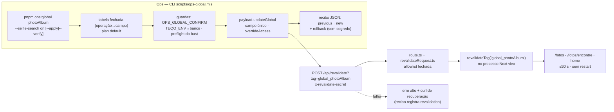

# Impl: C247 — Ligar/desligar globais públicos fora do admin (revalidação + ops)

Status: aprovado (--auto)
Atualizado em: 2026-10-01
Issue: #1419
Intenção: docs/plans/ops-toggle-globais-publicos.md
Appetite restante: herdado

## Leitura da intenção

- **Outcome (não negociar):** a ops liga/desliga uma flag pública operacional por CLI — `pnpm ops:global photoAlbum --selfie-search on` — com guardas, recibo e rollback, e o site reflete em ≤60 s sem admin e sem restart. Impeccable A: sem UI.
- **O que NÃO negociar:** allowlist fechada (nenhuma tag arbitrária); escrita pela Local API (nunca SQL cru); nenhum segundo caminho de permissão; segredo nunca no log, nem em erro; hook fail-closed do `PhotoAlbum` (publicar sem canal de remoção válido continua recusado); Consent/LGPD intocados.
- **O que reavaliar:**
  - A recomendação de allowlist da intenção (4 globais operacionais, marcada "assumido — validar") — ver D1.
  - "O `revalidateTag` do processo do CLI basta": não basta — o CLI roda com `seed-loader.mjs:20-29` (stuba `next/cache`) e a instância Next é outro processo; o efeito só existe via `POST /api/revalidate` no alvo.
  - Update parcial de global: o hook `beforeValidate` global recebe o `data` já mesclado com o documento original no Payload 3.82.0, o que torna o write de um campo único seguro — pinado por int test (ver Componentes).

## Abordagem recomendada

**Opções consideradas (macro):** A) ampliar a allowlist do `POST /api/revalidate` (derivando de `getGlobalCacheTag`) e o CLI faz o bust remoto no alvo; B) rota de ops dedicada com o mesmo segredo; C) `revalidateTag` dentro do processo do CLI.
**Recomendação:** A — o endpoint já é o dono do bust remoto (auth `timingSafeEqual`, tag por query/body, allowlist testada em `tests/unit/revalidateRequest.unit.spec.ts`); o CLI reusa o padrão de `scripts/lib/instagramContentCli.mjs:129-154`.
**Rejeitadas:** B porque cria uma segunda superfície de permissão/rota para o mesmo efeito (anti-goal explícito da intenção: "criar segundo caminho de permissão") e duplica a auth; C porque não existe — `unstable_cache` é por processo, o `seed-loader.mjs:20-29` stuba `next/cache` no CLI (o `revalidateTag` local é no-op) e produção é o container Next vivo.

### Decisões de engenharia (caro de reverter)

**D1 — Escopo da allowlist:** A) só `global_photoAlbum` agora, com gatilho de revisitação; B) os 4 operacionais públicos do plano de intenção (`photoAlbum`, `site-settings`, `home`, `metadata`); C) derivar a allowlist de todos os globais do config.
**Recomendação:** A — a allowlist é superfície de segurança (`src/utilities/revalidateRequest.ts:32-44`) e só cresce junto com um escritor real: hoje o único caminho de escrita por CLI é o `photoAlbum` (a tabela de operações desta entrega não tem operação para os outros três; entradas extras seriam tags mortas). Mantém o pin que rejeita `global_metadata` (`tests/unit/revalidateRequest.unit.spec.ts:49-57`) como guarda viva de "global fora do escopo é recusado".
**Rejeitadas:** B — divergência registrada da recomendação "assumido — validar" da intenção: satisfaz o mesmo aceite com menos superfície e sem tag sem escritor; **gatilho para revisitar** — no mesmo change em que uma operação nova entrar na tabela, a tag do global dela entra na allowlist e no unit. C porque tag arbitrária/derivada do config é exatamente o que o aceite proíbe.

**D2 — Superfície de escrita do CLI:** A) tabela fechada de operações booleanas (`selfie-search → photoAlbum.selfieSearchEnabled`, `published → photoAlbum.published`), valores `on|off` exatos; B) `--set <field>=<value>` genérico; C) comando one-off `ops:selfie-search`; D) UPDATE via SQL.
**Recomendação:** A — o comando não pode setar campo arbitrário; flag nova só entra por edição da tabela (revisável e testável pura em `scripts/lib/`).
**Rejeitadas:** B porque coage tipos, aceita campos não operados e não permite guarda por campo (ex.: canal de remoção para publicar); C porque repete guardas/recibo por flag e não estabelece o caminho de primeira classe que é o item; D porque ignora hooks/validações (anti-goal da intenção).

**D3 — Falha do bust depois da escrita:** A) erro alto (exit 1) + curl de recuperação no stderr e no recibo, com preflight de `NEXT_PUBLIC_SITE_URL`/`REVALIDATE_SECRET` antes de escrever; B) best-effort como o `instagramContentCli` (registra a falha, run segue verde); C) "testar" o endpoint antes da escrita.
**Recomendação:** A — o bust é o ponto do comando: falha silenciosa recria exatamente o atrito do C242. O preflight evita a escrita que já nasce sem contrato; se o POST falhar depois, a escrita existe e o recibo carrega o valor anterior e a receita de recuperação.
**Rejeitadas:** B porque no import do Instagram a revalidação é acessória — aqui ela é o outcome; C porque o endpoint não tem dry-run: um POST de teste já busta, então o preflight só pode validar presença de envs.

**D4 — Granularidade do comando:** A) exatamente uma operação por invocação; B) várias flags no mesmo run.
**Recomendação:** A — rollback = mesmo comando com o valor anterior (requisito do aceite), recibo 1:1 e parser simples.
**Rejeitada:** B por não ter necessidade real hoje e por compor recibo/rollback sem ganho.

### Componentes / mudanças

- **`REVALIDATE_PHOTO_ALBUM_CACHE_TAG`** (`src/utilities/revalidateRequest.ts`): novo `= getGlobalCacheTag('photoAlbum')`, incluído em `ALLOWED_REVALIDATE_TAGS` e exportado para o pin unit. A rota (`src/app/(frontend)/api/revalidate/route.ts`) não muda: o dono da allowlist é este módulo.
- **`OPS_GLOBAL_TARGETS`** (`scripts/lib/opsGlobal.mjs`, novo — puro, sem I/O): tabela fechada `photoAlbum → { 'selfie-search': { field: 'selfieSearchEnabled', label }, published: { field: 'published', label } }`; nada fora dela é escrito.
- **`parseOpsGlobalCliArgs`** (`scripts/lib/opsGlobal.mjs`): positional `photoAlbum`, exatamente 1 operação, valor `on|off` exato, modos `plan` (default) | `--apply` | `--verify` (`--apply` e `--verify` mutuamente exclusivos), `--help`; erro em desconhecido/valor inválido/múltiplas operações.
- **`buildOpsGlobalWrite`** (`scripts/lib/opsGlobal.mjs`): operação+valor+doc atual → `{ data: { [field]: boolean }, previousValue, newValue, changed, rollbackCommand }`; `data` parcial de um único campo.
- **`formatOpsGlobalReport` / `opsGlobalReportStamp` / `formatOpsGlobalRecoveryCommand`** (`scripts/lib/opsGlobal.mjs`): linhas humanas, nome do recibo e receitas de rollback/recuperação sem segredo.
- **`main()`** (`scripts/ops-global.mjs`, novo): `loadCliEnv`; lê o global (`payload.findGlobal`, `overrideAccess: true` com comentário `bypass`); `plan` imprime previous→new e grava recibo; `--apply` roda `assertWriteConfirm({ flag: 'OPS_GLOBAL_CONFIRM' })` + `assertEnvironmentDatabaseTarget()` (`scripts/lib/cli.mjs:191-320`) + preflight (`NEXT_PUBLIC_SITE_URL`/`REVALIDATE_SECRET` presentes; para `published on`, `isArchivePhotoRemovalChannelUrl` do doc atual, espelho de `scripts/publish-archive-photos.mjs:120-127`), escreve com `payload.updateGlobal`, resolve a tag via `getGlobalCacheTag(slug)` importado de `../src/utilities/globals.ts` e faz `POST {NEXT_PUBLIC_SITE_URL}/api/revalidate?tag=<tag>` com `x-revalidate-secret` e timeout 15 s; falha do POST → erro alto (exit 1) com curl de recuperação; `--verify` relê e compara (exit 1 se divergente); recibo em `data/ops-global/reports/ops-global-<stamp>.json` via `writeRepoFile` (`scripts/lib/cli.mjs`).
- **`package.json`**: script `"ops:global"` no padrão dos CLIs (`--import=tsx/esm --import=./scripts/seed-loader.mjs`).
- **`.gitignore`**: `/data/ops-global/`.
- **Garantia do update parcial (confirmada no código):** `node_modules/payload/dist/globals/operations/update.js` roda o `beforeValidate` de campos antes dos hooks globais, e `getFallbackValue.js` copia o valor do `originalDoc` para campos ausentes — logo `validateRemovalChannel` (`src/globals/PhotoAlbum.ts:22-37`) vê `published`/`removalChannelUrl` mesclados. Pin int novo em `tests/int/archivePhotoPublicRead.int.spec.ts`: parcial `{ selfieSearchEnabled: true }` passa sem apagar os irmãos; parcial `{ published: true }` com canal armazenado inválido continua recusando (fail-closed preservado).
- **Migration:** sem migration (nenhum campo/schema novo).
- **Access / Consent:** nenhum caminho novo de access; `overrideAccess: true` no script com comentário "bypass" (convenção P3-E; o pin do `codebaseConventions` só varre `src/`); Consent intocado; o guard do `PhotoAlbum` permanece fail-closed.
- **UI:** não (Impeccable A) — nenhuma rota ou componente muda; o efeito é cache bust + flag já renderizada por `/fotos`, `/fotos/encontre` e home.
- **Runbook** (`docs/ops/teqo-1313-deploy.md`): 2–3 linhas — no passo 5 da Abertura o CLI passa a ser o caminho principal (`--selfie-search on --apply`, admin como alternativa) e a receita de rollback (`--selfie-search off --apply`); nada além.
- **Changelog:** `docs/changelog/2026-10-01-c247.md` é do fechamento, não deste plano.

### Dados → forma

Não aplicável — a intenção declara "não vou apresentar dados"; o único artefato é o recibo JSON operacional (não é superfície de apresentação).

## Fases verificáveis

1. **Tracer / schema+server** (~0,5 dia — todo o appetite): allowlist + tag export (`revalidateRequest.ts`) → módulo puro + `tests/unit/opsGlobal.unit.spec.ts` (defaults, modos, valor `on|off`, rollback, recibo) → CLI + `package.json` + `.gitignore` → pin int do update parcial → `pnpm test:unit` + rodada targeted do int tocado. Sem migration, sem UI.
2. **UI** — n/a (Impeccable A).
3. **Gates** — `pnpm gate:fast` (lint + typecheck + unit) e push via `pnpm push`; o CI `checks` roda int/e2e completos.
4. **Verificação de efeito (aceite operacional)** — smoke no worktree dev (servidor local + `REVALIDATE_SECRET` local) e/ou staging pós-merge, com a mesma receita do runbook: `--selfie-search on --apply` → espera limitada (≤60 s, sem restart) conferindo `/fotos`, `/fotos/encontre` e a seção da home → `--selfie-search off --apply` (rollback) conferindo o fechamento.

## Rabbit holes / Não escopo (engenharia)

- **`revalidateGlobal` → wrapper seguro:** não trocar o owner (`src/utilities/globals.ts:16-17`) nesta entrega; o CLI usa `seed-loader` e o caso genérico de Local API fora do Next já tem `revalidateTagSafely` (`src/utilities/documents.ts:27-34`). **Gatilho:** um consumidor fora do Next que não possa usar o seed-loader.
- **Extrair helper compartilhado do POST remoto** (Instagram + este): não agora — são 2 call sites; a regra do repo é encapsular a partir do 3º (**gatilho:** 3º call site ou o próximo toque no CLI do Instagram).
- Multi-op por invocação, `--set` genérico, campo não booleano, allowlist dinâmica/ampla, rota de ops dedicada, UI/admin, SQL cru.
- E2E: sem benefício — o efeito é cache bust + flag já coberta por `tests/e2e/frontendFotos.e2e.spec.ts` / `frontendFotosSelfie.e2e.spec.ts`; o CLI não roda no `webServer` do Playwright.
- Migrations existentes: nenhuma é tocada (não há schema novo).

## Riscos e mitigação

- **Bust pós-escrita falha (rede/segredo ausente):** preflight de envs antes de escrever + erro alto + curl de recuperação no stderr e no recibo + rollback documentado; nunca silencioso (difere do best-effort do Instagram por desenho).
- **Allowlist cresce por engano:** entrada derivada de `getGlobalCacheTag`; unit aceita `global_photoAlbum` e segue rejeitando `global_metadata`/`global_home`/`global_site-settings`.
- **Update parcial apaga irmãos:** `data` de um único campo + int pin do merge do Payload.
- **`published on` sem canal:** preflight espelha `publish-archive-photos` e o hook segue fail-closed; o CLI falha antes de escrever com mensagem honesta.
- **Drift de tag (typo):** CLI deriva do owner `getGlobalCacheTag`, endpoint usa a constante derivada do mesmo owner, e o unit casa as duas.
- **Default `posts` do endpoint (`resolveRevalidateTag`):** o CLI nunca omite a tag — a operação sempre produz `?tag=`; o parser/plano é unit-testado para não gerar receita sem tag.
- **Alvo errado (staging × produção):** `assertEnvironmentDatabaseTarget` casa `TEQO_ENV` ao banco e o recibo grava o `target`; o runbook mostra o env file do alvo. O segredo nunca entra no recibo nem no log (nem em erro).

## Aceite de engenharia

- [ ] Aceite de produto da intenção ainda coberto — comando com guardas + bust via allowlist + efeito nas três superfícies + recibo/rollback; D1 comprovado por unit (tag única) e sem UI.
- [ ] Invariantes AGENTS/engineering-standards — Local API (sem SQL), sem novo caminho de access, sem consent novo, `overrideAccess` com comentário "bypass", sem módulo novo top-level em `src/utilities`, sem migration.
- [ ] Testes de domínio previstos (unit/int) onde access/write paths mudam — unit da tabela/modos/recibo, unit da allowlist ampliada, int do update parcial fail-closed; e2e justificado como desnecessário.

## Self-score (decision-quality)

**5/5**

1. Decisões caras com rejeitadas: sim — D1 (allowlist), D2 (superfície de escrita), D3 (falha do bust), D4 (granularidade), cada uma com o porquê e a alternativa recusada.
2. Cabe no appetite: sim — 1 constante + 1 módulo puro + 1 CLI + 1 script `package.json` + 1 linha de `.gitignore` + 3 testes editados/novos + 2–3 linhas de runbook; ~0,5 dia.
3. Rabbit holes nomeados: sim — `revalidateGlobal`, helper DRY <3 call sites, e2e, SQL cru, allowlist dinâmica.
4. Depth check: reusa `scripts/lib/cli.mjs` (guardas/`writeRepoFile`), o padrão de recibo de `archivePublishPlan.mjs`, o endpoint e o owner `getGlobalCacheTag`; não cria arquivo/utility nova em `src/`.
5. Intenção preservada: sim — o outcome e todos os itens do aceite continuam cobertos; a única divergência (D1: só `photoAlbum` agora) foi registrada com justificativa e gatilho, sem reescrever o outcome.
