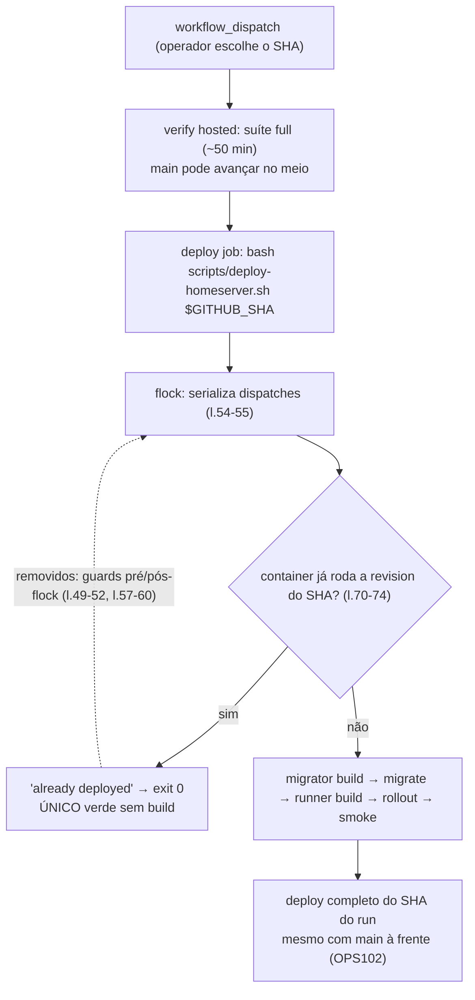

# Impl: OPS102 — Deploy manual roda até o fim mesmo com main à frente (sem guard de stale run)

Status: em execução
Atualizado em: 2026-09-12
Issue: #962
Intenção: docs/plans/ops102-deploy-manual-sem-stale-guard.md
Appetite restante: herdado (~0,5 dia eng; sem migration, sem UI, sem schema — remoção de ~8 linhas no script, reescrita de 2 specs unit, 4 docs vivas + changelog)

## Leitura da intenção

- **Outcome:** um `workflow_dispatch` do `deploy.yml` completa o deploy do SHA do run mesmo que `main` avance durante os ~50 min do `verify` — sem "stale run" abortando. Sem falso verde: job verde = SHA publicado (build + rollout + smoke) ou container já o rodava ("already deployed") — nunca skip silencioso.
- **O que NÃO negociar:** o guard "already deployed" (`scripts/deploy-homeserver.sh:70-74`) permanece intacto; nenhum caminho verde sem deploy; nenhum mecanismo novo anti-out-of-order; `verify`/build/ordem migrator→migrate→runner/rollback/smoke intocados; `workflow_dispatch`-only intacto; histórico (postmortem #953, changelogs, `CHANGELOG-AGENTS-HISTORY.md`, planos ops53/65/66/71/103) não é editado.
- **O que reavaliar:** nada de produto — a questão em aberto da intenção já está decidida (Recomendação A: documentar o risco, não engenhar). Em engenharia, duas escolhas baratas: a forma exata dos pins unitários (Decisão 2) e o texto da linha de risco out-of-order na tabela "Falhas conhecidas" (Decisão 3).

## Abordagem recomendada

**Opções consideradas:** A | B | C por decisão, abaixo.
**Recomendação:** **A + A/B + A** — remover os dois guards de stale run (Decisão 1); pins unitários negativos + positivo do "already deployed" + pin do único `exit 0` (Decisão 2); atualizar runbook/AGENT-OPS e registrar o risco out-of-order na tabela "Falhas conhecidas" (Decisão 3). Cada mudança fica no dono do contrato (script, spec, docs vivas) sem criar superfície nova.
**Rejeitadas:** manter os guards como warn ou condicionados (Decisão 1: B/C); remover os testes e confiar no e2e (Decisão 2: C); só apagar as menções das docs (Decisão 3: B).

### Decisão 1 — destino dos guards de stale run

- **Opções:** A) remover os dois blocos (`l.49-52` pré-flock e `l.57-60` pós-flock); B) torná-los não-fatais (warn); C) mantê-los condicionados ao gatilho (`workflow_dispatch`).
- **Recomendação:** **A — remover.** A premissa do guard era o deploy automático (OPS53): `main` andava sozinho e publicar SHA velho era errado. Desde a OPS71 o dispatch é ato humano deliberado e o `ciSkipInvariants.unit.spec.ts:111-115` pina que o workflow é `workflow_dispatch`-only — a comparação com o HEAD do `main` deixou de significar algo.
- **Rejeitadas:** B porque um warning em job verde é ruído sem ação (e mantém um `git ls-remote` por deploy + a leitura errada de que `main` importa); C porque o workflow **já é só** `workflow_dispatch`, então a condição seria sempre verdadeira — é A com código morto e um round-trip a mais ao remoto.

### Decisão 2 — como pinar o contrato novo nos unit tests

- **Opções:** A) pins negativos (`not.toContain('stale run' / 'git ls-remote' / 'refs/heads/main')`) + manter o pin positivo do "already deployed"; B) pin positivo do fluxo novo (`toContain('already deployed')` + `not.toContain('stale run')`); C) remover os testes e confiar no e2e.
- **Recomendação:** **A+B combinados** — reescrever as specs `l.19-23` e `l.25-30` como contrato negativo com comentário de intenção (o guard OPS53 só faz sentido em deploy automático; reintroduzi-lo deve falhar), **manter intacta** a spec `l.32-38` ("already deployed") e adicionar dois pins que dão dentes à remoção: (i) o **único `exit 0`** do script é o do "already deployed" (não existe mais nenhum caminho de skip verde — regressão do #953); (ii) o `flock` permanece (anti over-deletion).
- **Rejeitadas:** C porque o e2e **não roda o script de deploy** (nenhum spec de e2e o exercita; o `deploy.yml` não é disparado no CI de PR) — seria trocar a única rede por nenhuma; B sozinho porque `not.toContain('stale run')` prova ausência de string, não ausência de outro caminho de falso verde — o pin do `exit 0` único cobre a classe.

### Decisão 3 — documentação viva

- **Opções:** A) atualizar runbook + AGENT-OPS e adicionar a linha de risco out-of-order na tabela "Falhas conhecidas"; B) só remover as menções ao guard; C) deixar como está (registro histórico).
- **Recomendação:** **A** — o runbook e o AGENT-OPS são docs **vivas** (fonte de operação); a remoção do guard muda o fluxo, então o texto muda junto, e o risco de dispatch fora de ordem (SHA antigo re-dispatchado depois de um deploy mais novo) fica explícito com gatilho de revisita (Recomendação A da questão em aberto da intenção).
- **Rejeitadas:** B porque apaga o fluxo sem dar a leitura nova ao operador (e perde o contexto do #953); C porque o histórico é `docs/changelog/` + `docs/postmortems/` + `HISTORY` (intocados) — runbook/AGENT-OPS não são registro congelado.

### Componentes / mudanças

- **`scripts/deploy-homeserver.sh`** (dono do fluxo):
  - Remover o bloco pré-flock `l.49-52` e o bloco pós-flock `l.57-60` (a comparação `git ls-remote … refs/heads/main` + os dois `fatal "stale run…"`). O `awk` some junto, sem órfãos.
  - Renomear o cabeçalho `# --- guards ---` (`l.47`) para algo como `# --- serialization (flock) ---`, já que o único bloco restante ali é o `flock` (`l.54-55`).
  - Header de fluxo `l.11-12`: remover "HEAD guard (only the current main HEAD deploys; a stale run FAILS the job — never a false green…)" e começar em "flock serialization -> workspace fetch at <sha> -> …".
  - Comentário do `set-url` `l.96-98`: "so the HEAD guard and the fetch compare against the repo…" → "so the fetch targets the repo that actually received the merge" (o `TEQO_REPO_URL` continua usado por clone/set-url/fetch — não remover).
  - **Preservar sem tocar:** `flock` `l.54-55`; bloco de idempotência "already deployed" `l.62-74` (inclui o `exit 0`); `say`/`fatal` (usados no resto do script).
- **`.github/workflows/deploy.yml`:** atualizar o comentário `l.23-25` ("the script's HEAD guard only deploys when the dispatched SHA is main's HEAD (a stale dispatch skips)") para "the script deploys the dispatched SHA to the end even if main advances during verify (OPS102 — deliberate dispatch; idempotency is the 'already deployed' guard)". Nada mais muda: `on: workflow_dispatch` (l.29-30), `needs/if/runs-on` e a invocação `l.159` (`bash scripts/deploy-homeserver.sh "$GITHUB_SHA"`) ficam intactos.
- **`tests/unit/deployScript.unit.spec.ts`:** reescrever as specs `l.19-23` e `l.25-30` conforme Decisão 2; manter a spec `l.32-38` ("already deployed", `docker inspect` + `$running_rev` + `"$running_rev" = "$SHA"`); o restante do arquivo (BuildKit, proxy, ordem OPS66, smoke, secrets, Dockerfile) não muda. `ciSkipInvariants.unit.spec.ts` **não muda** (já pina só `workflow_dispatch:` + ausência de `push`/`schedule`).
- **`docs/ops/teqo-1313-deploy.md`:**
  - Fluxo passo 4 (`l.20-22`): "guarda de HEAD (`git ls-remote` de `TEQO_REPO_URL` … senão 'stale run' skip) → `flock`" → "`flock` (serializa dispatches) → guard 'already deployed'"; manter a menção a `TEQO_REPO_URL` como origem do clone/atualização do workspace (a info não se perde).
  - Tabela "Falhas conhecidas" (`l.132`): trocar a linha "Job verde sem deploy ('stale run')" por **"Dispatch fora de ordem (SHA antigo re-dispatchado depois de um deploy mais novo)"** | causa: o `flock` serializa mas não ordena; o "already deployed" não pega revision diferente | tratamento: não re-dispatchar SHA antigo; se acontecer, re-dispatchar o `main` atual (rollback manual disponível na seção Rollback). Gatilho para revisitar: deploy mais frequente/automatizado ou regressão real. A linha `l.133` ("already deployed") permanece.
- **`docs/AGENT-OPS.md`:** `l.81` — remover `HEAD guard;` da descrição do `deploy.yml`; `l.110` — trocar "O script: HEAD guard (`TEQO_REPO_URL` — default …, público) → flock → guard 'already deployed' …" por "O script: flock → guard 'already deployed' …", acrescentando que o deploy roda até o fim com o SHA do dispatch mesmo se `main` andar durante o verify (OPS102).
- **`docs/changelog/2026-09-12-ops102.md`** (novo): UMA entrada curta no padrão AGENTS; nunca editar o agregado nem o HISTORY.
- **Migration:** nenhuma. **Access/Consent:** N/A (não toca Payload). **UI:** Impeccable A — N/A (sem UI).

### Dados → forma

N/A (sem UI).

## Fases verificáveis

1. **Script + workflow (remoção + comentários).** Remover os dois blocos de stale run, ajustar header de fluxo, comentário do `set-url` e comentário do `deploy.yml`. Verificações: `bash -n scripts/deploy-homeserver.sh`; `git diff` revisado mostrando `flock` e "already deployed" intactos e só comentários além dos guards removidos; `grep -n 'stale run\|git ls-remote\|refs/heads/main' scripts/deploy-homeserver.sh` vazio.
2. **Unit tests.** Reescrever as duas specs + adicionar os pins do `exit 0` único e do `flock`; manter a spec do "already deployed". Verificações: `pnpm test:unit -- tests/unit/deployScript.unit.spec.ts` verde. Prova de valor (RED barata): rodar a spec reescrita contra o script pré-remoção (ex.: `git stash` do diff da Fase 1) e ver `not.toContain('stale run')` falhar — o pin tem dentes.
3. **Docs vivas + changelog.** Runbook (fluxo + linha out-of-order), AGENT-OPS (`l.81`, `l.110`), entrada `docs/changelog/2026-09-12-ops102.md`. Verificação: `grep -rn 'stale run\|HEAD guard' scripts/ .github/ docs/ops/ docs/AGENT-OPS.md` vazio (fora de `docs/plans/`, `docs/changelog/`, `docs/postmortems/`, `docs/CHANGELOG-AGENTS-HISTORY.md` — histórico intocável).
4. **Gates + entrega.** `pnpm gate:fast` verde (lint/format/typecheck/unit); `pnpm push` (gate:push = gate:ci — o PR toca `tests/unit`, então a seleção roda a spec alterada); PR com `Closes #962`, base `main`, auto-merge armado. **Aceite final (humano, pós-merge):** dispatch manual do `deploy.yml` → `verify` verde → job `deploy` concluído publicando a revision do SHA do run; idealmente com `main` andando durante o verify (natural se houver merge concorrente) para exercitar o cenário ao vivo — a prova determinística do contrato fica nos pins.

## Rabbit holes / Não escopo (engenharia)

- **Não adicionar mecanismo de ordenação/anti-out-of-order** (recusar SHA não-descendente, fila ordenada, timestamp): decisão explícita da intenção — o `flock` serializa e a fila natural do verify ordena; o risco vai documentado com gatilho.
- **Não refatorar o miolo do script** (`flock`, migrator→migrate→runner, rollback, smoke, cleanup): o pipeline acabou de ser recuperado (#952/#953) e o appetite não cobre; tocar só os guards e os comentários.
- **Não reintroduzir verifier automático de `main`** nem deploy automático; não mexer no `verify`.
- **Não editar histórico:** `docs/postmortems/2026-09-12-deploy-build-importmap.md`, `docs/changelog/2026-09-12-*`, `docs/CHANGELOG-AGENTS-HISTORY.md`, planos `ops53`/`ops65`/`ops66`/`ops71`/`ops103` (menções ao guard ali são registro).
- **Não mexer no guard "already deployed"** nem no `ciSkipInvariants` (não muda).
- **Não transformar o pin negativo em dogma:** `not.toContain('git ls-remote')` pina o contrato **atual** (dispatch deliberado); o comentário no spec diz que, se um dia um verifier automático voltar, é ali que o contrato se reavalia — sem abrir porta para skip verde.

## Riscos e mitigação

- **Regressão do falso verde #953** (verde sem deploy): mitigação = pin negativo explícito + pin do **único `exit 0`** (só o "already deployed", que prova que o container roda o SHA) + manutenção do pin positivo do bloco `l.32-38`; não existe mais nenhum caminho de skip silencioso.
- **Over-deletion na remoção** (levar `flock`/already-deployed junto): mitigação = diff focado na Fase 1 + pins positivos de `flock` e "already deployed" no mesmo spec + `bash -n`.
- **Dispatch fora de ordem pode regredir prod** (SHA antigo re-dispatchado após deploy mais novo): aceito e documentado na tabela "Falhas conhecidas" com gatilho de revisita; fora de escopo por decisão (não engenhar agora).
- **Drift de docs** (menção órfã a "HEAD guard"/"stale run"): mitigação = grep da Fase 3 e revisão do PR.
- **O verify do `deploy.yml` não é exercitado no CI de PR:** mitigação = `bash -n` + pins unitários; a prova ao vivo é o dispatch manual pós-merge (aceite final humano).

## Aceite de engenharia

- [ ] `scripts/deploy-homeserver.sh` sem os dois blocos de stale run (pré e pós-flock) e sem menção a HEAD guard nos comentários (header de fluxo e `set-url`); `flock` e "already deployed" intactos
- [ ] `.github/workflows/deploy.yml` com comentário atualizado; `workflow_dispatch`-only intacto (`ciSkipInvariants` verde sem mudanças); invocação `l.159` intocada
- [ ] `tests/unit/deployScript.unit.spec.ts`: pins negativos + `exit 0` único + `flock` verdes, comprovadamente RED contra o script pré-remoção; spec "already deployed" (`l.32-38`) preservada
- [ ] Runbook (fluxo `l.20-22` + linha out-of-order em "Falhas conhecidas") e `docs/AGENT-OPS.md` (`l.81`, `l.110`) alinhados; grep de drift vazio fora do histórico
- [ ] `docs/changelog/2026-09-12-ops102.md` criado; agregado/HISTORY/históricos intocados
- [ ] `pnpm gate:fast` verde; `pnpm push` verde; PR `Closes #962` base `main`
- [ ] (humano, pós-merge) dispatch manual do `deploy.yml`: `verify` verde + job `deploy` concluído com a revision do SHA do run — critério final da Issue

---

### Self-score de decision-quality: 4/5

- **Decisões caras têm rejeitadas?** ✓ — as 3 decisões têm opções nomeadas e rejeitadas com razão de morte (warn/condicional, confiar no e2e, só apagar docs).
- **Cabe no appetite?** ✓ — ~0,5 dia: remover ~8 linhas, reescrever 2 specs, ajustar 4 docs vivas + changelog; sem migration/UI/schema.
- **Rabbit holes nomeados?** ✓ — out-of-order, refactor do script, verifier automático, histórico, dogma do pin.
- **Depth check?** ✓ — nenhum módulo/utilitário novo; edita o dono de cada contrato (script, spec, runbook, AGENT-OPS), sem pass-through.
- **Intenção satisfeita?** ✓ — dispatch roda até o fim com o SHA do run; único verde sem build é o "already deployed"; registro vivo alinhado.
- **Não dou 5 porque** — o cenário ao vivo (main andando durante o verify) não é reproduzível deterministicamente no CI: a prova fica nos pins + no próximo dispatch manual pós-merge, e o risco out-of-order é aceito sem mecanismo por decisão documentada (não por omissão).
