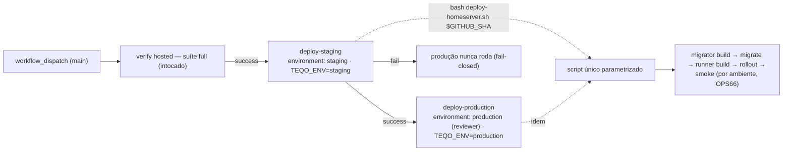

# Impl: OPS103 — Staging no homeserver com verify único e aprovações separadas

Status: aprovado
Atualizado em: 2026-09-12
Issue: #968
Intenção: docs/plans/ops103-staging-homeserver.md
Appetite restante: herdado (~2–3 dias eng no repo + bootstrap ops no homeserver; sem migration, sem schema, sem UI)

## Leitura da intenção

- **Outcome:** um dispatch único do `deploy.yml` roda o `verify` uma vez e gateia `deploy-staging` → `deploy-production`; produção só depois de staging verde e do environment `production` aprovado; o mesmo script parametrizado por ambiente executa os dois deploys sem mudar os defaults de produção.
- **O que NÃO negociar:** `verify` intocado; runner self-hosted só nos deploys (nunca no PR CI); envs de staging só no homeserver (nunca GitHub secrets); staging sem PII real, não indexável, bucket `teqo-media-staging` próprio; ordem migrator→migrate→runner (OPS66) e rollback por ambiente; `workflow_dispatch`-only; produção `teqo-1313`/`teqo_1313`/`~/stack/teqo-1313.env`/1313 intocados.
- **O que reavaliar:** a intenção fala em environments `deploy-staging`/`deploy-production` — os nomes reais no GitHub são `staging` e `production`; e "serviços no compose `~/stack`" implica um único `docker-compose.yml` compartilhado, o que muda a decisão de lock (Decisão 2) e exige sed ancorado por serviço (Decisão 4).

## Abordagem recomendada

**Opções consideradas:** decisões A/B/C abaixo.
**Recomendação:** parametrizar o script por env vars com defaults de produção (D1); locks por ambiente + `concurrency` de grupo único nos jobs de deploy (D2); dois jobs explícitos com `environment:` + `TEQO_ENV` por job (D3); sed ancorado por serviço (imagens) e por range (label de revision) (D4); noindex via `robots.ts` + metadata condicionados à URL de staging (D5); pins estendendo os specs donos (D6).
**Rejeitadas:** por decisão.

### Decisão 1 — como parametrizar o script

- **Opções:** A) env vars com defaults de produção, derivadas num mapa `case "${TEQO_ENV:-production}"` no topo; B) flags CLI `--env staging` (default produção); C) dois scripts (proibido pela intenção); D) env vars sem defaults.
- **Recomendação:** **A** — `bash scripts/deploy-homeserver.sh "$SHA"` continua idêntico em produção (defaults atuais preservados) e o workflow passa `TEQO_ENV` por job. Mapa: `TEQO_CONTAINER`, `TEQO_MIGRATE_SERVICE`, `TEQO_ENV_FILE`, `TEQO_IMAGE_REPO` (+ `TEQO_REGISTRY=localhost:5000`), `TEQO_BUILD_PROXY`, `TEQO_BUILD_PROXY_PORT`, `TEQO_SMOKE_BASE`, `TEQO_LOCK`; `STACK_DIR`/`WORKSPACE_DIR`/`TEQO_REPO_URL` seguem compartilhados. `TEQO_ENV` inválido → `fatal` (fail-closed). O nome do DB não entra no script (vive no env file).
- **Rejeitadas:** B porque muda a invocação canônica (pins e runbook) por uma ergonomia que o `env:` do job já resolve; C porque a intenção proíbe gêmeo; D porque quebra produção (nenhum default).

### Decisão 2 — serialização entre ambientes

- **Opções:** A) um `flock` compartilhado (`/tmp/teqo-deploy.lock`) + `concurrency: {group: deploy-homeserver, cancel-in-progress: false, queue: max}` nos dois jobs de deploy; B) um lock por ambiente; C) só `concurrency`.
- **Recomendação:** **A** — o `docker-compose.yml` de `~/stack`, o workspace `~/teqo-deploy` e o registry `localhost:5000` são compartilhados: o swap/rollback de um ambiente reescreve o arquivo que o outro usa, e dois builds concorrentes estouram o homeserver 8c/16GB (OOM já documentado no runbook). O lock único serializa os deploys inclusive na invocação manual no host (que não passa pelo `concurrency`); a `concurrency` com `queue: max` enfileira runs em vez de cancelar o pending (o default `single` cancela um pending a cada dispatch novo, mesmo com `cancel-in-progress: false` — descoberto na revisão do /simplify) e não bloqueia o `verify` hosted de um run novo.
- **Rejeitadas:** B porque locks por ambiente não protegem os recursos compartilhados (a razão de existirem) e a independência não é um requisito — os deploys já se encadeiam por `needs`; C porque deixaria a invocação manual sem serialização.
- **Revisão /simplify (2026-09-12):** a versão inicial do plano previa lock por ambiente; os revisores apontaram a corrida no compose/workspace compartilhado e o cancelamento de pending do `queue: single` — corrigido para lock único + `queue: max`.

### Decisão 3 — como o workflow passa o ambiente

- **Opções:** A) dois jobs explícitos — `deploy-staging` (`environment: staging`, `TEQO_ENV: staging`) e `deploy-production` (`environment: production`, `needs: [deploy-staging]`, `TEQO_ENV: production`), ambos com guard `github.ref == 'refs/heads/main'` e `verify` intocado; B) manter o job `deploy` de produção e adicionar só o `deploy-staging`; C) input `environment` no dispatch ou workflow por ambiente.
- **Recomendação:** **A** — simetria entre alvos irmãos; o gate de aprovação fica no environment (ortogonal ao `TEQO_ENV` que o script lê) e o `needs` encadeia fail-closed. Reviewer obrigatório só em `production` (config do repo, não do YAML; bootstrap cria os dois environments).
- **Rejeitadas:** B porque um job chamado `deploy` que na verdade é produção e outro qualificado confunde runbook/pins; C porque um input permitiria pular staging ou escolher alvo (viola o aceite) e workflow por ambiente duplicaria o `verify` — o ponto da intenção.

### Decisão 4 — sed do compose compartilhado

- **Opções:** A) padrões derivados por ambiente (`TEQO_REGISTRY`/`TEQO_IMAGE_REPO`, migrator antes do runner) e o label `org.opencontainers.image.revision` trocado por range ancorado ao bloco do serviço (`/^  $TEQO_CONTAINER:/,/^  [A-Za-z0-9_-]+:/`); B) manter o sed global atual; C) editar YAML com `yq`/python.
- **Recomendação:** **A** — sem o range, um deploy de staging carimbaria o label de revision do serviço de produção (o guard "already deployed" leria um SHA mentiroso). Os `grep -q` pós-swap passam a checar `image: $TEQO_REGISTRY/$TEQO_IMAGE_REPO(-migrator):$SHA`; o bootstrap exige labels por serviço, sem âncora YAML.
- **Rejeitadas:** B porque corrompe o label do outro ambiente; C porque adiciona dependência ao host por um ganho que sed ancorado entrega.

### Decisão 5 — onde vive o noindex de staging

- **Opções:** A) `src/app/robots.ts` (mapeia `/robots.txt`; Next 15 só reconhece metadata route files na raiz do app dir — route group não entra no match) + `robots` do metadata do layout condicionados por `src/lib/siteEnvironment.ts` (hostname começa com `staging.`); B) só header `X-Robots-Tag` no tunnel Cloudflare; C) nada (sem links públicos).
- **Recomendação:** **A** — versionado, testável em unit e efetivo para crawlers que respeitam robots/metadata; o header no tunnel fica como defesa em profundidade opcional no bootstrap (documentado no runbook). A URL de staging é a identidade que o build já carrega (`NEXT_PUBLIC_SITE_URL`), então não há env nova para esquecer (fail-closed: qualquer host `staging.*` desindexa).
- **Rejeitadas:** B porque vive fora do repo (não testável/versionado) e não cobre acesso direto à origem; C porque o aceite exige "não indexável".

### Decisão 6 — pins

- **Opções:** A) estender `tests/unit/deployScript.unit.spec.ts` (defaults de produção idênticos, mapa de staging, sed ancorado, env inválido fail-closed) e `tests/unit/ciSkipInvariants.unit.spec.ts` (dois jobs, environments, `needs`, `TEQO_ENV`, guard de main); B) novo spec só do workflow; C) sem pins.
- **Recomendação:** **A** — cada spec fica no dono do contrato que já pina (script/workflow), em unit puro (leitura do arquivo). O pin de ordem OPS66 passa a ancorar em marcadores estáveis (`--profile maintenance run --rm`, `lastIndexOf('docker compose up -d')`), porque `indexOf('teqo-1313-migrate')` passaria a achar o mapa no topo.
- **Rejeitadas:** B porque espalha o contrato do mesmo workflow em dois donos; C porque a única rede do script é unit (nenhum e2e o exercita).

### Componentes / mudanças

- **`scripts/deploy-homeserver.sh`** (dono do fluxo): mapa `TEQO_ENV` no topo; toda ocorrência de `teqo-1313`/porta/lock/proxy/smoke/cleanup vira variável; sed de imagens ancorado; revision por range; produção default idêntica.
- **`.github/workflows/deploy.yml`**: header comentado; `verify` intocado; `deploy` renomeado para `deploy-production` + novo `deploy-staging`, com `environment`, `TEQO_ENV`, `needs`, guard de `main` e `concurrency`.
- **`src/lib/siteEnvironment.ts`** (novo): `isStagingSiteUrl(url)` puro + `isStagingSite()` (lê `NEXT_PUBLIC_SITE_URL`).
- **`src/app/robots.ts`** (novo — raiz do app dir, exigência do Next 15 para metadata routes) + **`src/app/(frontend)/layout.tsx`**: `disallow: /` e `index:false` quando staging.
- **Testes**: os dois specs acima + `tests/unit/siteEnvironment.unit.spec.ts` (predicado + pin de que robots/layout consomem o helper).
- **Docs**: `docs/ops/teqo-1313-deploy.md` (seção Staging + bootstrap + limites), `docs/AGENT-OPS.md` (ladder e linha do `deploy.yml`), `AGENTS.md`/`AGENTS-infra.md`, `.env.example` (bucket `teqo-media-staging`), `docs/changelog/<data>-ops103.md`.
- **Migration:** nenhuma. **Access/Consent:** N/A (não toca Payload). **UI:** Impeccable A — robots/metadata não é UI visual.

### Dados → forma

N/A (sem UI).

## Fases verificáveis

1. **Script + spec (RED primeiro):** mapa por ambiente, sed ancorado, proxy/lock/smoke/cleanup parametrizados; atualizar `deployScript.unit.spec.ts` (mapa de staging e ordem OPS66 falham antes do refactor). Verificação: `bash -n scripts/deploy-homeserver.sh`; `pnpm test:unit -- tests/unit/deployScript.unit.spec.ts` verde.
2. **Workflow + pin:** `deploy-staging`/`deploy-production` com environments/`needs`/guard/`concurrency`; estender `ciSkipInvariants.unit.spec.ts`. Verificação: unit verde + `pnpm lint`.
3. **noindex:** helper + `robots.ts` + metadata do layout + spec. Verificação: `pnpm test:unit -- tests/unit/siteEnvironment.unit.spec.ts`.
4. **Docs + changelog:** runbook (fluxo, identidades, bootstrap, limites), AGENT-OPS, AGENTS, `.env.example`, entrada de changelog.
5. **Gates** — `pnpm gate:fast`; push via `pnpm push`; PR `Closes #968` base `main`.
6. **Aceite humano pós-merge (bootstrap ops, fora do repo):** criar DB `teqo_staging`, serviços no compose `~/stack`, `~/stack/teqo-staging.env`, bucket Garage `teqo-media-staging`, ingress/DNS `staging.jorgesolla1313.com.br`, environments `staging`/`production` (reviewer `fsolla`); migrate+seed iniciais (proxy 5434 + `pnpm db:seed:minimal` — passa no guard local via `127.0.0.1`, sem `ALLOW_REMOTE_DB`) antes do 1º dispatch; dispatch → staging em `:1314` → inspeção → aprovação → prod no mesmo SHA; `curl https://staging.jorgesolla1313.com.br/robots.txt` = `Disallow: /`.

## Rabbit holes / Não escopo (engenharia)

- e2e contra staging, branch `stage`/PR-to-stage, preview por PR, cópia de dados de prod (fora de escopo da intenção).
- Segundo workflow/script, proxy/compose gêmeo por ambiente, lock único global, `NEXT_PUBLIC_SITE_ENV` nova.
- GitHub secrets para staging; envs fora do homeserver; runner self-hosted fora do deploy; tocar o `verify`.
- Refatorar o miolo do script além da parametrização (ordem OPS66, rollback, guard "already deployed", BuildKit) — o único default que muda é o derivado.
- `yq`/python para editar YAML; validar WebAuthn/OAuth/Resend no staging (limites documentados no runbook).

## Explicitamente fora (triage pós-simplify, 2026-09-12)

Achados dos revisores estruturais/qualidade que **não** viraram Issue nova — decisão autônoma do ator `work-issue` pela triage do `capture-review-debts`, sem editar a Issue #968 (in-progress):

| ID  | Achado                                                                                 | Destino   | Racional / gatilho                                                                                                                                                                |
| --- | -------------------------------------------------------------------------------------- | --------- | --------------------------------------------------------------------------------------------------------------------------------------------------------------------------------- |
| A   | noindex fail-open: `staging.*` é heurística de hostname; URL ausente/malformada indexa | defer     | D5 escolheu a URL como identidade do build (sem env nova); o bootstrap exige a env. Gatilho: staging mudar para domínio sem prefixo `staging.` ou crawler indexar                 |
| B   | pins do compose swap são textuais (sem harness de fixture)                             | defer     | Prova manual com fixture na sessão + pins de contrato. Gatilho: próxima mudança na lógica de sed/swap                                                                             |
| C   | `.` do registry não escapado em ERE (`localhost:5000`)                                 | descartar | Comportamento idêntico ao pré-OPS103; registry controlado por ops — cosmético                                                                                                     |
| D   | sem e2e de `/robots.txt`                                                               | defer     | Unit chama `robots()` comportamentalmente; e2e provaria wiring do Next. Gatilho: e2e passar a tocar metadata route                                                                |
| E   | gate de aprovação de produção vive só no environment (config do repo, fora do YAML)    | defer     | D3 decidiu reviewer no repo, não no YAML; runbook documenta que environment sem reviewer é fail-open. Gatilho: environment `production` perder o reviewer ou deploy sem aprovação |
| F   | staging pode subir vazio se o seed do bootstrap (passo 7) for pulado                   | defer     | Runbook exige migrate+seed antes do 1º dispatch. Gatilho: 1º dispatch real de staging — se subir vazio, seed vira passo do deploy                                                 |

## Riscos e mitigação

- **Regressão silenciosa no deploy de produção** (script parametrizado): defaults prod pinados no unit + `bash -n` + prova RED + o staging do mesmo dispatch exercita o mesmo caminho antes de produção.
- **Sed tocando a linha/label do outro ambiente:** padrões ancorados por `TEQO_IMAGE_REPO` + range do label + `grep -q` pós-swap + backup/rollback; bootstrap exige labels por serviço sem âncora YAML.
- **Runs concorrentes** (compose/workspace/build compartilhados): `concurrency: deploy-homeserver` sem cancel + locks por ambiente; risco residual aceito — aprovação de produção segura o slot e o operador dispara um run por vez.
- **Staging indexável ou com PII:** robots + metadata condicionados à URL; bucket/DB/env próprios; seed sintético; checklist de bootstrap marca reviewer do `production` antes do 1º dispatch (environment sem reviewer é fail-open e vira critério de aceite).
- **Custo/OOM no homeserver** (2 builds por ambiente, 4 por dispatch): serialização, idempotência e cleanup pós-deploy por ambiente; re-dispatch se OOM.
- **Drift de docs/runbook:** grep de menções a `deploy`/`teqo-1313` nas docs vivas na Fase 4 + revisão do PR.

## Aceite de engenharia

- [ ] Aceite de produto da intenção ainda coberto
- [ ] Invariantes AGENTS/engineering-standards
- [ ] Testes de domínio previstos (unit/int) onde access/write paths mudam — aqui: unit do script, do wiring do workflow e do noindex; sem access/Consent
- [ ] `bash scripts/deploy-homeserver.sh "$SHA"` idêntico em produção (defaults e único `exit 0` preservados); staging mapeado e `TEQO_ENV` inválido fail-closed
- [ ] `deploy.yml`: `verify` intocado; dois deploys com `environment: staging`/`production`, `needs`, `TEQO_ENV` e guard `main`; pin novo no `ciSkipInvariants`
- [ ] Staging noindex (robots + metadata) testado; produção com `index:true` inalterado
- [ ] Runbook/AGENT-OPS/AGENTS/`.env.example` alinhados; changelog criado; PR `Closes #968`
- [ ] (humano) bootstrap ops + dispatch real: staging verde → aprovação → produção no mesmo SHA; staging não indexável
