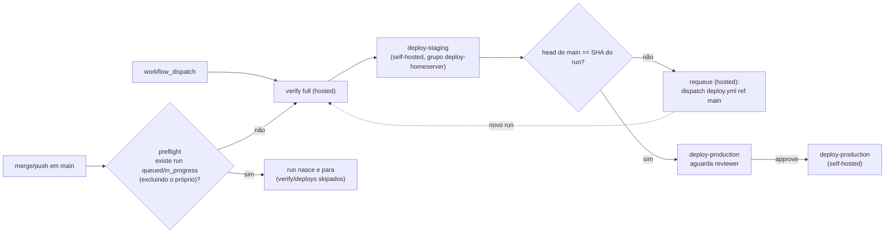

# Impl: OPS104 — Disparo automático do deploy pós-merge (staging automático, produção com review)

Status: aprovado (gate humano 2026-09-14)
Atualizado em: 2026-09-14
Issue: #980
Intenção: docs/plans/ops104-disparo-automatico-do-deploy.md
Appetite restante: ~1 dia eng (herdado; cortes explícitos em "Rabbit holes / Não escopo")

## Leitura da intenção

- **Outcome:** todo merge em `main` sem deploy ativo inicia sozinho o `deploy.yml` no head; `verify` full → `deploy-staging` automático; ao terminar o staging, se `main` andou, um run novo nasce no head novo; produção continua **somente** com aprovação humana do environment `production`. Dispatch manual segue como escape.
- **O que NÃO negociar:** nunca auto-aprovar/publicar produção; nunca atalhar o `verify` full; nunca um workflow/script gêmeo (o dono é o `deploy.yml`); nunca tocar `ci-pr.yml`, o job `verify`, os guards de banco local, secrets ou o `scripts/deploy-homeserver.sh` (pinado por `deployScript.unit.spec.ts`); nunca reintroduzir o stale-run guard (OPS102); `concurrency: deploy-homeserver` intocado (`cancel-in-progress: false`, `queue: max`) e só nos jobs de deploy; `waiting` (aprovação pendente) **não** conta como run ativo no guard; sem retry/auto-heal de vermelho; sem cancelar runs antigos.
- **O que reavaliar (hipóteses da intenção):**
  - `tests/unit/ciSkipInvariants.unit.spec.ts` l.113-114 (lê YAML cru): confirmado — `toContain('workflow_dispatch:')` e `not.toMatch(/^\s*push:/m)` quebram ao adicionar `push`; o teste l.124-150 é additive-safe (jobs/chaves novas passam; o literal `needs: [deploy-staging]` não pode mudar). O pin do manual-only será reescrito nesta entrega.
  - `deployScript.unit.spec.ts` não muda (o script é congelado; `git ls-remote` segue banido **dentro dele**).
  - **Achado novo de engenharia (não antecipado na intenção):** no GitHub, um job aguardando aprovação de environment **segura** o grupo `concurrency` (comportamento documentado na community discussion #67607 — a avaliação de concurrency acontece antes do approval). Consequência: enquanto uma aprovação de produção espera, o `deploy-staging` de um run novo fica `pending` atrás dela. O aceite de produto continua satisfeito (o run novo **nasce**; `waiting` não bloqueia o trigger 1; nada publica sem reviewer), mas "staging atualiza sozinho" pausa durante uma aprovação pendente. Isso vira risco documentado (R2), não redesign — o grupo compartilhado é decisão da OPS103/intenção.
  - Duplicata do trigger 2: o run de `push` que o preflight skipou termina `completed` (jobs skipados) — indistinguível de "já deployado". Dedupe por "existe run no head" mascararia um SHA não publicado; então **não** há dedupe (D4).

## Abordagem recomendada

**Opções consideradas:** A) trigger 1 = `push` no próprio `deploy.yml` + job de preflight que pula o run quando já há deploy ativo, e trigger 2 = job hosted de requeue após `deploy-staging` (recomendada) | B) workflow gêmeo "dispatcher" separado do `deploy.yml` | C) só `concurrency` no `deploy.yml` (sem guard nem requeue) | D) trigger por `pull_request: closed` em vez de `push`.
**Recomendação:** **A** — um dono só (sem drift), o pin unitário do manual-only passa a testar o guard, o dispatch manual continua no mesmo arquivo, e o requeue hosted não entra no grupo de deploy (não pode ser bloqueado pela aprovação pendente). É exatamente o decidido no gate de produto.
**Rejeitadas:** B porque twin cria drift e um segundo lugar onde o "run ativo" escapa do guard (anti-goal explícito); C porque `concurrency` enfileira, não pula — todo push rodaria `verify` full de novo e SHAs intermediários deployariam em ordem (contra "nada nasce"); D porque o merge via `GITHUB_TOKEN` (anti-recursão) não cria run de `pull_request` `closed` (mesma classe do OPS71-FLIP) e o contrato `push` é o decidido.

### Decisões de engenharia (caras de reverter)

#### D1 — Como detectar run ativo (guard do trigger 1)

- **Opções:** A) REST `GET /repos/{owner}/{repo}/actions/workflows/deploy.yml/runs` via helper node em `scripts/lib/github-api.mjs`; B) `gh run list` inline no YAML; C) `concurrency` puro (`queue: max`) sem guard; D) checar check-runs/status do commit.
- **Recomendação:** **A** — dois `GET` com `status=queued` e `status=in_progress`, `branch=main`, `per_page=100`; filtra `run.id != github.run_id` e decide. Usa o client existente (retry OPS67 para GET/5xx), testável com `fetchImpl`, sem dependência de CLI.
- **Rejeitadas:** B porque parseia texto de `gh` (o repo tirou `gh` dos scripts na OPS50), é frágil e não tem seam de teste; C porque não pula o run — só enfileira (o aceite é "nada nasce", e verify full a cada push é o que se quer evitar); D porque run `queued` não tem check-run no commit e um job `waiting` de aprovação (que **não** conta) é indistinguível de `in_progress` por check-run.

#### D2 — Como detectar o head novo de `main` (trigger 2)

- **Opções:** A) REST `GET /repos/{owner}/{repo}/git/ref/heads/main` via `getBranchHead`; B) `git ls-remote https://github.com/fsolla/teqo.git refs/heads/main`; C) `git fetch` + `git rev-parse origin/main`.
- **Recomendação:** **A** — uma chamada REST no mesmo client, testável, sem checkout extra; o job hosted (ubuntu-latest) nem depende de `git`.
- **Rejeitadas:** B porque, embora banido apenas **dentro** do `deploy-homeserver.sh` (pin do OPS102), repetir o padrão do stale-run guard no YAML confunde leitura/runbook e não tem teste unitário sem subprocess; C porque exige checkout+fetch pesado e adiciona estado local para uma comparação de SHA.

#### D3 — Onde mora a lógica reutilizável

- **Opções:** A) API em `scripts/lib/github-api.mjs` (`listWorkflowRuns`, `getBranchHead`) + decisões puras em `scripts/lib/deploy-trigger.mjs` (`decidePreflight`, `decideRequeue`) + dois CLIs finos (`scripts/deploy-preflight.mjs`, `scripts/deploy-requeue.mjs`); B) tudo inline no YAML com `curl`+`jq`; C) um script monolítico novo dono dos dois lados.
- **Recomendação:** **A** — segue o padrão já estabelecido (`scripts/lib/github-pr-flow.mjs` exporta `decideAutomergeAction` e o CLI `scripts/github-pr-automerge.mjs` só faz o wiring; o client `github-api.mjs` é o módulo profundo de HTTP). Decisões puras testáveis sem fetch; CLIs sem lógica.
- **Rejeitadas:** B porque YAML não é testável, duplicaria a lógica entre os dois jobs e `jq` vira contrato de string; C porque mistura HTTP + decisão num arquivo sem seam (testar exigiria mock global) e o entry do knip executaria side effects.

#### D4 — Dedupe do trigger 2 (run novo vs run de push skipado)

- **Opções:** A) aceitar a duplicata; B) antes de dispatchar, checar se já existe run no head novo e pular; C) cancelar runs antigos/duplicados.
- **Recomendação:** **A** — a duplicata é inerte (o run de push skipado não executou verify/deploy) e a janela de corrida é de segundos; o dispatch é idempotente (`already deployed` verde no script para o mesmo SHA) e converge (o run novo compara head==SHA no fim e para).
- **Rejeitadas:** B porque um run de push skipado fica `completed` (jobs skipados) — "existe run no head" não distingue "run inerte" de "SHA já deployado", e o dedupe mascararia um SHA não publicado (violaria "staging não fica velho"); C porque é automação destrutiva sem decisão de produto (cancelar run de aprovação é ato humano).

#### D5 — Job de preflight sempre roda (com guard push-only dentro)

- **Opções:** A) job `preflight` roda nos dois eventos; o step do guard tem `if: github.event_name == 'push'` e o output do job cai em `'true'` por default (`${{ steps.guard.outputs.should_deploy || 'true' }}`); `verify` usa `needs: [preflight]` + `if: needs.preflight.outputs.should_deploy == 'true'`. B) job `preflight` com `if: github.event_name == 'push'` e consumidores com `always()`.
- **Recomendação:** **A** — o `success()` implícito que o GitHub injeta em jobs com `needs` faria o dispatch pular o `verify` se o preflight fosse skipado (footgun conhecido); com A, dispatch e push compartilham um fluxo único e legível.
- **Rejeitadas:** B por depender de `always()` em cada consumidor para não quebrar o dispatch — frágil e fácil de regredir sem teste.

#### D6 — Semântica de falha da API

- **Opções:** A) preflight **fail-open** (não conseguiu listar → prossegue, com warning e output `true`) e requeue **fail-red** (não conseguiu comparar/dispatchar → exit 1); B) ambos fail-closed/skip; C) ambos fail-open.
- **Recomendação:** **A** — o preflight é dedupe, não gate de segurança: um blip de API não pode desligar o deploy automático em silêncio (é a dor que o OPS104 resolve), e o pior caso é um `verify` redundante. O requeue é a rede anti-estagnação: falhou, o job fica vermelho (política "nunca mentir", OPS61) e o operador re-dispatcha.
- **Rejeitadas:** B porque reintroduz staleness silenciosa; C porque requeue silencioso deixa `main` velho sem sinal.

#### D7 — Requeue roda em qualquer evento (push e dispatch)

- **Recomendação:** o job de requeue roda sempre que `deploy-staging` termina verde (push do trigger 1 **ou** dispatch manual, ref `main`). O pedido é "sempre que o staging terminar e houver head novo".
- **Rejeitadas:** restringir a `github.event_name == 'push'` porque um dispatch de SHA antigo (rollback/incidente) ficaria sem convergência; a consequência (um dispatch de rollback gera também um run novo no head) é inofensiva — produção continua atrás de reviewer e o run novo só propõe o head.

### Componentes / mudanças

- **`.github/workflows/deploy.yml`**
  - `name: Deploy` (realinha com o novo gatilho; hoje `Deploy (manual)`) e header reescrito (o comentário atual diz "workflow_dispatch only").
  - `on: push: branches: [main]` **somado** a `workflow_dispatch:` (mantido).
  - Novo job `preflight` (hosted, `timeout-minutes: 5`, `permissions: { contents: read, actions: read }`, `GITHUB_TOKEN: ${{ github.token }}`, checkout), com `outputs.should_deploy: ${{ steps.guard.outputs.should_deploy || 'true' }}` e o step do guard: `if: github.event_name == 'push'` → `node scripts/deploy-preflight.mjs`.
  - `verify`: ganha `needs: [preflight]` + `if: needs.preflight.outputs.should_deploy == 'true'` (resto intocado).
  - Novo job `requeue` (hosted, `timeout-minutes: 5`, `needs: [deploy-staging]`, `if: needs.deploy-staging.result == 'success'`, `permissions: { contents: read, actions: write }`, `GITHUB_TOKEN: ${{ github.token }}`, checkout) → `node scripts/deploy-requeue.mjs`; **fora** do grupo `deploy-homeserver` e **não** precisa de `deploy-production` (um job aguardando approval não pode bloquear o requeue — decidido no gate).
  - Nada muda em `verify` (passos), `deploy-staging`/`deploy-production` (needs `[verify]`/`[deploy-staging]`, environments, concurrency) nem no `scripts/deploy-homeserver.sh`.
- **`scripts/lib/github-api.mjs`** (estender o módulo dono): `listWorkflowRuns(workflowFile, { status, branch, limit = 100 })` (normaliza `{ id, status, headSha, headBranch, event, createdAt, htmlUrl }`) e `getBranchHead(branch = 'main')` → `{ ref, sha }` (REST `git/ref/heads/{branch}`). Reusa `request` (retry OPS67). Sem helper de cancelamento/listagem paginada — escopo estrito.
- **`scripts/lib/deploy-trigger.mjs`** (novo, puro, espelhando `github-pr-flow.mjs`): `ACTIVE_RUN_STATUSES = {queued, in_progress}`; `decidePreflight({ eventName, currentRunId, runs })` → `{ shouldDeploy, reason, activeRunIds }` (dispatch → true; exclui `currentRunId`; só queued/in_progress de outros contam; `waiting`/`requested`/`completed` não); `decideRequeue({ runSha, headSha })` → `{ dispatch, reason }` (SHA ausente → erro no CLI; igual → não; diferente → sim).
- **`scripts/deploy-preflight.mjs`** (novo CLI): lê `GITHUB_EVENT_NAME`, `GITHUB_RUN_ID`, `GITHUB_REPOSITORY`, `GITHUB_TOKEN`; dois `listWorkflowRuns('deploy.yml', { status, branch: 'main' })`; chama `decidePreflight`; escreve `should_deploy=<bool>` em `$GITHUB_OUTPUT`; em erro de API → warning + `true` (D6).
- **`scripts/deploy-requeue.mjs`** (novo CLI): lê `GITHUB_SHA` e `GITHUB_TOKEN`; `getBranchHead('main')`; `decideRequeue`; se `dispatch` → `api.workflowDispatch('deploy.yml', { ref: 'main' })`; erro → exit 1 (D6).
- **`tests/unit/deployTrigger.unit.spec.ts`** (novo): cobre D1/D4/D7 — dispatch nunca bloqueia; queued/in_progress de outro run pulam; `waiting` e `completed` não; o run atual é excluído; `decideRequeue` compara SHAs.
- **`tests/unit/githubApi.unit.spec.ts`**: casos para `listWorkflowRuns` (URL/params/normalização) e `getBranchHead` (URL/normalização/404→null).
- **`tests/unit/ciSkipInvariants.unit.spec.ts`**: reescrever o pin l.111-122 ("manual-only") para "push em `main` + guard de run ativo + `workflow_dispatch` mantido"; manter l.124-150 (chain OPS103) e o pin do `ci-classify-production`.
- **`tests/unit/deployScript.unit.spec.ts`**: **não** muda (invariante de congelamento do script).
- **Migration:** não (sem schema).
- **Access / Consent:** N/A (sem PII, sem collection).
- **UI:** Impeccable A / N/A — sem superfície de UI; nenhum shell a reusar.

### Dados → forma (se aplicável)

N/A — sem superfície de dados para usuário. A "evidência" é operacional: lista de runs, logs dos jobs `preflight`/`requeue` (`should_deploy=…`, `main avançou → dispatch`) e o approval pendente do environment `production`.

## Fases verificáveis

1. **Tracer lógico (unit-first, sem YAML)** — `scripts/lib/deploy-trigger.mjs` + `listWorkflowRuns`/`getBranchHead` em `github-api.mjs` + `tests/unit/deployTrigger.unit.spec.ts` + casos novos em `githubApi.unit.spec.ts`. Gate: `pnpm test:unit` verde. _~2–3h._
2. **Trigger 1 (push + preflight)** — `scripts/deploy-preflight.mjs`; YAML: `on.push.branches[main]`, job `preflight` (com `|| 'true'` no output e guard push-only), `verify` com `needs`/`if`; reescrever o pin do `ciSkipInvariants` (com a mesma filtragem de comentários do teste do chain, para prosa do header nunca satisfazer o pin). Gate: `pnpm test:unit` verde. _~2h._
3. **Trigger 2 (requeue)** — `scripts/deploy-requeue.mjs` + job `requeue` (needs staging, `actions: write`, fora do grupo). Gate: `pnpm test:unit` verde. _~1–2h._
4. **Docs + changelog** — checklist da seção "Docs a realinhar" + `docs/changelog/2026-09-14-ops104.md` (uma entrada, additions-only). _~1,5h._
5. **Gates e entrega** — `pnpm gate:fast` (lint+typecheck+unit), `pnpm test:unit`; `pnpm push`; PR ready (auto-merge); **validação pós-merge** (só existe no caminho `push`, pós-merge): (a) o merge deste PR dogfooda o trigger 1 — conferir run `Deploy` nasceu sozinho, `preflight` logou `should_deploy=true`, `verify` verde, staging publicado, produção aguardando; (b) mergear um follow-up trivial durante o `verify`/staging → conferir que o segundo run ou skipa no preflight ou o `requeue` do run ativo dispara o run novo no head; (c) confirmar que produção só sai com approve e que `deploy-homeserver.sh`/`deployScript` seguem intocados. _~1h + observação._

## Rabbit holes / Não escopo (engenharia)

- Auto-approve de `production`, auto-retry de `verify` vermelho, cancelamento automático de runs antigos (anti-goals do produto).
- Workflow gêmeo/dispatcher separado; mover `verify` para self-hosted; mexer em `ci-pr.yml`, nos guards de banco, em secrets ou na proteção de branch.
- Lock por ambiente no `deploy-homeserver.sh` ou grupos de concurrency separados staging/produção — o lock/grupo compartilhado é decisão da OPS103 (workspace/compose/registry são um só); tratado como risco R2 com gatilho de revisitação.
- Refinar "ativo" por fase do run (listar jobs do run para saber se está em verify/staging/produção) — complexidade sem aceite; o guard por status do run é o decidido.
- Dedupe/cancelamento do trigger 2 (D4); paginação genérica/helpers de runs extras no `github-api.mjs` (status e branch bastam); `actionlint`/validação de YAML nova no CI.
- Qualquer migration/UI/access/Consent (não há).

## Riscos e mitigação

- **R1 — Merge via `GITHUB_TOKEN` não cria run de `push` (anti-recursão).** O auto-merge já arma com `AUTOMERGE_PAT` (fail-closed; OPS71-FLIP) → push cria run. _Mitigação:_ invariante existente no `github-pr-automerge.mjs` + `agent-pr-ready-automerge.yml`; se um merge bot aparecer sem run, o dispatch manual é o escape e o gatilho de revisitação é adicionar um fallback por `pull_request: closed` (só com evidência).
- **R2 — Job `waiting` de approval segura o grupo `deploy-homeserver`** (comportamento do GitHub, discussion #67607): o `deploy-staging` de runs novos fica `pending` enquanto a aprovação de produção do run anterior espera; staging pausa (produção não é tocada; nada publica sem reviewer). _Mitigação:_ documentar no runbook (Gatilho e fluxo + Falhas conhecidas); aprovar/rejeitar rápido. _Gatilho de revisitação:_ se aprovações passarem a demorar sistematicamente e o staging velho doer, avaliar grupos/locks por ambiente — exige rever o lock compartilhado do script (hoje deliberado).
- **R3 — Corrida residual: merge durante `deploy-production` `in_progress`.** O push cria run, o preflight vê o deploy ativo e skipa; o requeue daquele run já rodou (após o staging). Nada nasce até o próximo merge ou dispatch manual. _Mitigação:_ runbook "Falhas conhecidas"; escape manual. _Gatilho de revisitação:_ primeira ocorrência real → adicionar um segundo requeue após `deploy-production` verde ou refinar o guard.
- **R4 — Duplicata trigger 1 × trigger 2** (janela de segundos): run redundante/verify duplicado raro. _Mitigação:_ aceito por D4; script idempotente (`already deployed` verde) e deploy serializado pelo grupo.
- **R5 — YAML do `deploy.yml` inválido derruba os dois caminhos** (auto e dispatch usam o arquivo da default branch). _Mitigação:_ mudança pequena e revisada; o merge deste PR é o dogfood (se nenhum run nascer, o próximo merge corrige); manter o dispatch manual documentado.
- **R6 — Custo hosted extra** (~50 min de `verify` por merge/janela). _Mitigação:_ preflight pula quando há deploy ativo; requeue só dispara se o head mudou; cortes de escopo mantêm o `verify` intocado.
- **R7 — `actions: write` do token nativo** no dispatch: o repo já tem jobs com `issues: write`/`contents: write` funcionando (elevação permitida). _Mitigação:_ conferir no primeiro run; se 403, ajustar Workflow permissions do repo (passo humano, sem secret).
- **R8 — Backlog de `queue: max` (até 100):** improvável; o preflight + convergência limitam runs simultâneos. Sem ação; observar.
- **R9 — Docs vivos espalhados** (13+ arquivos, ver seção abaixo): drift vira mentira operacional. _Mitigação:_ checklist obrigatória na fase 4; changelog registra a supersessão do anti-goal da OPS102.
- **R10 — Segurança:** `push` em `main` não vem de fork; jobs novos são hosted e não tocam o homeserver; nenhum secret novo; permissões novas mínimas (`actions: read|write`, `contents: read`); fork-PRs continuam sem CI no repo.

### Docs a realinhar (linhas de 2026-09-14; realinhar pela frase, não pelo número)

- `docs/ops/teqo-1313-deploy.md` — l.1 (título "dispatch manual"), l.3-8 (intro "action manual / mergir em main não publica nada"), l.12 (Gatilho), l.54-58 (primeiro deploy/verificação ao vivo), l.75-80 (Staging "mesmo dispatch"), l.225-226 (falhas conhecidas: stale-run/re-dispatch fora de ordem + "already deployed"), l.264 (segurança "apenas dispatch manual"), l.289 (C149 "deploy normal"); **adicionar** linhas de falha para R2/R3.
- `docs/AGENT-OPS.md` — l.3 ("deploy de produção é manual"), l.13, l.19 (diagrama do fluxo), l.25 ("Só humano"), l.82 (tabela de workflows: trigger do `deploy.yml`), l.88, l.105, l.111 (parágrafo do deploy).
- `AGENTS.md` — l.15 ("publishing is a manual `workflow_dispatch`").
- `AGENTS-infra.md` — l.5 ("publishing is a manual `workflow_dispatch`").
- `README.md` — l.12, l.17, l.100 (deploy manual).
- `.agents/rules/agent-pr-workflow.mdc` — l.41, l.64 ("There is no deploy from PR CI" continua verdade, mas "manual" muda), l.72.
- `scripts/issue-transition-on-merge.mjs` — l.74 (comentário da mensagem "Deploy de produção é manual").
- Extras: `.agents/rules/engineering-standards.mdc` l.14; `.agents/skills/bug-fix/SKILL.md` l.54, l.109; `docs/TESTING.md` l.13; `.agents/skills/work-issue/execution-pipeline.md` l.43.
- `deploy.yml` — header e `name`.
- Novo: `docs/changelog/2026-09-14-ops104.md`.

## Aceite de engenharia

- [ ] Aceite de produto da intenção coberto: (1) merge sem deploy ativo → run nasce no head (trigger 1 + preflight); (2) merge durante verify/staging → run novo no head novo após o staging (trigger 2); (3) merge com produção aguardando review → run nasce (`waiting` não conta no guard), ambos pendentes, approve humano decide; (4) nada publica sem `verify` full verde; vermelho = humano resolve (sem retry).
- [ ] Invariantes AGENTS/engineering-standards: sem migration/UI/access/Consent; sem secret novo; `deploy-homeserver.sh` intocado (`deployScript.unit.spec.ts` verde sem edição); `verify`/`ci-pr.yml`/guards intocados; produção fail-closed no reviewer; `concurrency: deploy-homeserver` intocado e só nos deploys; anti-goal OPS102 (stale-run guard) não reintroduzido.
- [ ] Testes: `tests/unit/deployTrigger.unit.spec.ts` (novo) e casos de `listWorkflowRuns`/`getBranchHead` no `githubApi.unit.spec.ts` verdes; pin do `ciSkipInvariants.unit.spec.ts` reescrito para "push em main + guard + dispatch" (com comments stripped) e chain OPS103 preservado; `deployScript.unit.spec.ts` sem diff.
- [ ] `pnpm gate:fast` e `pnpm test:unit` verdes; PR ready; validação pós-merge (fase 5) executada e registrada no changelog/runbook.

### Self-score decision-quality

| Critério                         | Nota      | Justificativa                                                                                                                                                            |
| -------------------------------- | --------- | ------------------------------------------------------------------------------------------------------------------------------------------------------------------------ |
| 1. Decisões caras com rejeitadas | 1,0       | D1–D7 com opções e rejeitadas explícitas (api vs gh vs concurrency; REST vs ls-remote/fetch; owners da lógica; dedupe; job always-run; fail-open/red; escopo do requeue) |
| 2. Cabe no appetite              | 1,0       | ~1 dia: 4 fases de ~2h + gates/entrega; nenhuma refatoração do fluxo existente                                                                                           |
| 3. Rabbit holes nomeados         | 1,0       | auto-approve/auto-retry, twin, locks por ambiente, refinar "ativo" por fase, dedupe, actionlint fora                                                                     |
| 4. Depth check (reuso)           | 1,0       | estende o client `github-api.mjs` e o padrão `github-pr-flow.mjs` de decisão pura; zero twin de módulo; sem dependência nova                                             |
| 5. Outcome preservado            | 1,0       | engenharia não altera o aceite: início automático, staging automático, produção humano-aprovada; R2/R3 documentados sem reescrever o outcome                             |
| **Total**                        | **5,0/5** | ≥4 exigido                                                                                                                                                               |
