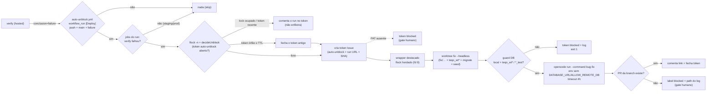

# Impl: OPS106 — Falha do verify dispara agente autônomo de desbloqueio (single-flight)

Status: aprovado (gate humano 2026-09-14)
Atualizado em: 2026-09-14
Issue: #995
Intenção: docs/plans/ops106-auto-unblock-verify-falha-agente.md
Appetite restante: ~1–2 dias eng (herdado; cortes explícitos em "Rabbit holes / Não escopo")

## Leitura da intenção

- **Outcome:** um `verify` vermelho do `deploy.yml` (e só ele) dispara, sem intervenção humana, UM agente de desbloqueio no homeserver que diagnostica, corrige e abre PR Ready com auto-merge nativo — o mesmo contexto de `pnpm worktree fix` — com registro visível linkando o run vermelho, single-flight estrito (nunca dois agentes; falha com agente ativo não enfileira) e guardrails fail-closed de banco/ambiente. Deploy continua sem auto-retry e produção continua só com aprovação humana.
- **O que NÃO negociar:**
  - Nunca tocar banco/env de produção ou staging; alvo de banco tem de ser local `teqo_wt*`/`*_test`, senão fail-closed (nunca `teqo_1313`/`teqo_staging`; nunca sourcear `~/stack/*.env`).
  - Nunca auto-aprovar `production`; nenhum auto-retry/auto-dispatch do deploy (anti-goal do OPS104 permanece); nenhum `--rerun-failed-jobs`.
  - Nunca dois agentes de desbloqueio ativos; falha repetida com agente ativo **não** enfileira — no máximo comenta no token.
  - Contexto do agente = `worktree fix`: opencode + skill `/bug-fix` + worktree `fix/*` + bancos de teste do worktree + MCPs/AGENTS; modelo default `deepseek/deepseek-flash` (override por `OPENCODE_WORKTREE_MODEL`).
  - Uma tentativa por run/commit vermelho; sem loop infinito (timeout de agente e TTL de token).
  - `deploy.yml` e `scripts/deploy-homeserver.sh` **intocados** (o reactor é um workflow separado); `verify` intocado; armar auto-merge continua exclusivamente no `agent-pr-ready-automerge.yml`.
  - Registro visível (Issue token linkando o run vermelho) é o estado do single-flight; sem dashboard, sem ressurreição do pool (OPS65).
- **O que reavaliar (achados que mudam a hipótese da intenção):**
  - **Detach é obrigatório, não estilo:** o runner self-hosted roda UM job por vez; um agente síncrono seguraria o slot (e o run `in_progress`) por horas — e, se o reactor fosse um job do próprio `deploy.yml`, o `preflight` de um push novo poderia skipar enquanto o run vermelho não conclui (finding 11). Workflow separado + processo destacado resolvem os dois.
  - **`cmdNamespaceBranch` não tem saída machine-readable** (só `path:` humano): a composição exige uma diretiva headless no dono (`worktree.mjs`/`lib/worktree.mjs`), não parsing de saída humana.
  - **`github.token` morre com o job:** quem faz push/PR e o outcome pós-agente é um processo destacado — o `AUTOMERGE_PAT` precisa ser o token dessa fase (o built-in fica no trecho síncrono).
  - **`actions/checkout` persiste credencial e limpa untracked:** `persist-credentials: false` é obrigatório (o worktree compartilha o `.git` do checkout e herdaria o `extraheader` do bot) e o placeholder `.opencode/secrets/penpot-token` tem de ser (re)criado a cada run (o `clean` do checkout apaga arquivo manual).
  - **Host check sozinho não basta no homeserver** (socat reescreve para 127.0.0.1): o guard de banco precisa do regex de nome (`teqo_wt*`) — finding 7.
  - **`workflow_run.conclusion == 'failure'` cobre qualquer job do Deploy** (staging/produção também): o gate "só `verify`" é uma checagem de dados (`GET /actions/runs/{id}/jobs`), não do `if` do YAML.
  - Porta 5432 livre no homeserver e o container dev (`docker compose -p teqo`, projeto `teqo`) é isolado do stack (`stack_default`) — o agente provisiona os próprios bancos sem tocar o Postgres do stack (finding 11).

## Abordagem recomendada

**Opções consideradas:** (1) gatilho: job `unblock` dentro do `deploy.yml` | workflow separado via `workflow_run` push-only | `workflow_run` reagindo a qualquer evento; (2) launcher: subprocesso de `worktree fix --stay` parseando a saída humana | provisionamento gêmeo dentro do reactor | modo `--headless` no dono; (3) execução: síncrona no job | destacada com `setsid` + flock herdado | `systemd-run --user`; (4) token do single-flight: Issue + flock + decisão pura | só flock local | só labels/estado do run.
**Recomendação:** **workflow separado `workflow_run` push-only (B) + `--headless` no dono (C) + execução destacada com flock herdado (B) + token Issue/`decideUnblock` (A)** — detalhado em D1–D10. É exatamente o decidido no gate (2026-09-14), sem nova capacidade na máquina de produção que a intenção não peça.
**Rejeitadas:** job no `deploy.yml` (muda o invariante documentado "só verify verde alcança job self-hosted" no arquivo que dona os deploys, acopla a vida do run vermelho ao slot do runner e obriga a pinar exceções nos testes de invariante); `workflow_run` sem filtro de `push` (um dispatch manual é ato humano deliberado; reagir a ele duplica agentes); provisionamento gêmeo (twin do `provision`/`cmdNamespaceBranch`); agente síncrono (prende o único slot do runner); `systemd-run` (unit transiente não sobrevive à limpeza do job, exige bus de usuário e joga o log no journal); só flock/só GitHub como token (sem registro visível ou com corrida entre jobs).

### Decisões de engenharia

#### D1 — Trigger placement

- **Opções:** A) job `unblock` dentro do `deploy.yml` (`needs: [verify]`, `if: needs.verify.result == 'failure' && github.ref == 'refs/heads/main'`, `runs-on: [self-hosted, homeserver]`); B) `.github/workflows/auto-unblock.yml` com `workflow_run` em `Deploy` completed e `if: conclusion == 'failure' && event == 'push' && head_branch == 'main'`; C) igual a B reagindo também a `workflow_dispatch`.
- **Recomendação:** **B** — mantém literal o invariante do `deploy.yml` ("um job self-hosted é execução de código na máquina de produção e só um run com verify full verde o alcança", header l.34-39); a definição do reactor vem sempre da default branch protegida (não do commit vermelho); o payload `github.event.workflow_run` traz `id`/`html_url`/`head_sha`/`event` sem consultar `needs`; um run do reactor **não** aparece em `listWorkflowRuns('deploy.yml')` (o `preflight` do OPS104 ignora) e não entra no grupo `concurrency: deploy-homeserver`; permissões declaradas no próprio arquivo (o topo do `deploy.yml` é `contents: read`). O gate "só verify" é de dados: `GET /actions/runs/{id}/jobs` e só segue se o job `verify` estiver `failure` (D7).
- **Rejeitadas:** A pelo invariante/exception creep no arquivo dono dos deploys, pela interação runner-slot/preflight e por espalhar o pin do trigger em `ciSkipInvariants.unit.spec.ts`; C porque o dispatch manual é ato humano (quem dispatcha está presente) e o gatilho decidido é o push automático — uma red manual não gera agente.

#### D2 — Launcher architecture

- **Opções:** A) orquestrador chamando `pnpm worktree fix <bug> --stay` e parseando `path:`; B) provisionamento próprio dentro do reactor (twin); C) estender o dono com `worktree.mjs fix --headless` + helpers puros.
- **Recomendação:** **C** — composição exata:
  - O wrapper destacado executa `node scripts/worktree.mjs fix <report> --headless` (cwd = checkout, `WORKTREES_ROOT=$HOME/teqo-unblock/worktrees`). O caminho é o mesmo de hoje (`cmdNamespaceBranch`: `git fetch origin` → branch `fix/<slug>` fresco de `origin/main` → `worktree add` → `provision` com `teqo_wt<slot>`/`teqo_wt<slot>_test` + migrate + `db:seed:minimal` + cópia de `.opencode/secrets`).
  - Em `--headless`, o dono suprime a diretiva TUI e o `cd`; **todo o log vai para stderr** e o **stdout carrega exatamente UMA linha JSON**: `{"dir":"…","branch":"fix/…","model":"…","argv":["opencode","run","--model","…","--auto","--command","bug-fix","<report>"]}`, montada por `headlessDirective`/`opencodeHeadlessArgs` (puros em `scripts/lib/worktree.mjs`, testados).
  - O wrapper faz `JSON.parse` do stdout inteiro (sem parsing de `path:`, sem colunas) e spawna `argv` com cwd `dir`.
- **Rejeitadas:** A porque parsing de saída humana é frágil e a flag teria de existir de qualquer forma; B porque duplica o provisionamento (twin) e o caminho do agente deixa de ser o mesmo que o humano usa; a diretiva `launch` existente é terminal-only de propósito (nunca TUI nested).

#### D3 — Síncrono vs destacado

- **Opções:** A) agente síncrono dentro do job; B) destacado com `detached`/`setsid` + flock herdado (fd 9) + `timeout`; C) `systemd-run --user`.
- **Recomendação:** **B**. `scripts/auto-unblock.sh` faz `exec 9>/tmp/teqo-unblock.lock` e `flock -n 9`; passa `--lock-busy=0|1` ao orquestrador (não sai cedo, para poder comentar no token quando ocupado). Com lock livre, o orquestrador cria o token e spawna `node scripts/auto-unblock-agent.mjs` com `detached: true`, `stdio: ['ignore', logFd, logFd, 9]` (o fd herdado mantém o flock pelo tempo de vida do wrapper) e `RUNNER_TRACKING_ID` removido do env (o runner não mata o processo destacado); o job conclui em <2 min e o slot do runner é liberado. O log é `$HOME/teqo-unblock/logs/unblock-<runid>.log` (fd aberto em append). Cap: `timeout --signal=TERM --kill-after=120 4h` no `opencode` e `timeout 30m` no provisionamento; quando o wrapper morre, o fd 9 fecha e o lock libera.
- **Rejeitadas:** A porque prende o único slot do runner (e um run `in_progress` por horas) — o oposto do achado 11; C porque transiente não sobrevive à limpeza do job, depende de bus de usuário e perde log em arquivo.

#### D4 — Single-flight token

- **Opções:** A) Issue token (`auto-unblock`) + flock local + `decideUnblock` puro; B) só flock local (sem registro); C) só labels/estado do run no GitHub (sem lock).
- **Recomendação:** **A**. Contrato:
  - `decideUnblock({ lockBusy, openToken, tokenAgeMs, ttlMs = TOKEN_TTL_MS, lockStale })` → `{ action: 'start' | 'skip_comment' | 'reclaim', reason }`:

    | lockBusy | openToken | tokenAge | lockStale | ação                                                                    |
    | -------- | --------- | -------- | --------- | ----------------------------------------------------------------------- |
    | false    | false     | —        | —         | `start`                                                                 |
    | false    | true      | < TTL    | —         | `skip_comment` (`token-orfao-imaturo`)                                  |
    | false    | true      | ≥ TTL    | —         | `reclaim` (comenta + fecha + `start`)                                   |
    | true     | false     | —        | —         | `skip_comment` (`corrida-lock`; sem token, só log)                      |
    | true     | true      | < TTL    | false     | `skip_comment` (`agente-ativo`) — comenta o run novo, **não enfileira** |
    | true     | true      | ≥ TTL    | true      | `skip_comment` (`lock-preso`) — pede humano; **nunca** mata agente      |

  - TTL = 3h (`TOKEN_TTL_MS`); agente cap 4h (D3). Token via `createIssue` + `addLabels('auto-unblock')` + `addComment` (run URL, run id, SHA, job/step falhos); o label é garantido idempotentemente pelo orquestrador (`getLabel` → `createLabel`); o token **nunca** recebe `ready`/`in-progress` (não entra na fila do claim/pool).
  - `reclaim` de órfão: comenta + `closeIssue` no antigo e emite um novo token.
  - Outcome é do **wrapper** (não depende do agente): PR da branch existe (`listPullRequests({ head: 'fsolla:<branch>', state: 'all' })`) → comenta o link e fecha o token; sem PR → label `blocked`, mantém aberto e comenta o path do log (gate humano).
  - Fecha no **agent exit**, não no merge: com o token aberto, um novo run vermelho cairia em `skip_comment` sem agente ativo (quebra de liveness); o PR é o registro da entrega, o token é o do single-flight.

- **Rejeitadas:** B (falha de processo vira lock mudo, sem rastro humano) e C (corrida entre jobs; "run vermelho" não é estado de agente).

#### D5 — Credenciais e PAT

- **Opções:** A) `AUTOMERGE_PAT` entregue ao processo destacado (`GITHUB_TOKEN` + credential helper por env), `github.token` só no trecho síncrono; B) `github.token` para tudo; C) deploy key SSH + bot token novo.
- **Recomendação:** **A**:
  - Workflow: `GITHUB_TOKEN: ${{ github.token }}` (orquestrador síncrono: Issues/leitura do run) e `AUTOMERGE_PAT: ${{ secrets.AUTOMERGE_PAT }}`; fail-closed sem PAT (token `blocked` criado com o built-in + exit 1).
  - Checkout com `persist-credentials: false` (o worktree compartilha o `.git` do checkout — sem isso o `extraheader` do bot vaza e o push sairia como `github-actions[bot]`, assassinando `opened`/`synchronize` e a classe do PR #746). O agente recebe `GITHUB_TOKEN=<PAT>` e o helper não-persistente: `GIT_CONFIG_COUNT=1`, `GIT_CONFIG_KEY_0=credential.helper`, `GIT_CONFIG_VALUE_0='!f() { echo username=x-access-token; echo password=$GITHUB_TOKEN; }; f'` (nada em `.git/config`/`~/.git-credentials`); o `AUTOMERGE_PAT` é removido do env do filho (fica só `GITHUB_TOKEN`).
  - `--check` valida PAT presente e `GET /repos/fsolla/teqo` → `permissions.push === true`; scopes exigidos documentados: contents:write, pull-requests:write, issues:write (o wrapper pós-job usa o PAT para comentar/fechar — o built-in não sobrevive ao job). O armar do auto-merge **continua** 100% no `agent-pr-ready-automerge.yml`.
- **Rejeitadas:** B (expiração + anti-recursão: push/PR como bot não cria runs de `opened`/`synchronize`; o safety net não armaria e o flip pós-merge ficaria mudo — classe PR #746); C (segredo novo e dois mecanismos de auth sem necessidade).

#### D6 — Guard de banco fail-closed

- **Opções:** A) helper puro `evaluateDatabaseTargets` rodando no wrapper entre provisionar e lançar + strip de env; B) confiar no provisionamento; C) importar `assertTestDatabase`.
- **Recomendação:** **A**. Regras: para cada `DATABASE_URL` de `.env.local` e `.env.test.local` (lidos com `dotenv`), exigir host local (`isLocalDatabaseUrl`/`databaseHostname` de `scripts/lib/cli.mjs`) **e** nome `isGeneratedDatabaseName` (`^teqo_wt[0-9]+(_test)?$`, `worktree-env.mjs`), rejeitando as portas dos proxies do stack (5433/5434); o arquivo de teste também satisfaz `TEST_DATABASE_NAME_RE` (`cli.mjs`). Host check sozinho não basta no homeserver (socat → 127.0.0.1). Env do agente sem `DATABASE_URL`, `ALLOW_REMOTE_DB` e `TEQO_ENV` (spawn com env montado, nunca `source ~/stack/*.env`). Falha → token `blocked` + exit 1, sem lançar o agente.
- **Rejeitadas:** B porque Docker indisponível cai no fallback compartilhado (`teqo`/`teqo_test`) e `.env` manual nunca é sobrescrito; C porque é guard de suíte de teste (host/DB `*_test`) e não cobre o banco dev nem o formato `teqo_wt*`.

#### D7 — Bug report handoff e contrato headless

- **Opções:** A) `opencode run --model <m> --auto --command bug-fix <report>` (cwd = worktree), com `report` montado por helper puro; B) mensagem literal `"/bug-fix <report>"`; C) `--agent` + prompt próprio.
- **Recomendação:** **A**. `--command bug-fix` é o contrato documentado do `opencode run` ("use message for args") e não depende do parse de slash do TUI; o report vai como UM argv (sem shell). O report (puro, `buildBugReport`) contém: run URL/id, SHA, nomes dos jobs/steps falhos (de `getWorkflowRunJobs`, do orquestrador síncrono), o caminho do log do job falho baixado pelo launcher (`$HOME/teqo-unblock/logs/`) e as instruções: não há humano disponível; siga a skill `/bug-fix` de ponta a ponta; pare após abrir o PR Ready (a aprovação de produção é fora deste fluxo); nunca toque prod/staging (`~/stack`, `teqo_1313`, `teqo_staging`, `ALLOW_REMOTE_DB`); o fix é na branch `fix/*` criada, PR base `main`. O gate "só `verify`" roda antes: `classifyDeployFailure(jobs)` só segue quando o job `verify` está `failure`; falha de API de jobs = exit 1 sem agente (fail-closed, visível).
- **Rejeitadas:** B porque o valor com `/` + espaços depende do parser de comandos da TUI (o headless tem `--command` de primeira classe); C porque `--agent` troca o agente primário, não a skill.

#### D8 — Homeserver bootstrap e smoke `--check`

- **Opções:** A) `--check` fail-closed documentado + passos humanos no runbook; B) descobrir no primeiro run vermelho; C) check automático em todo run.
- **Recomendação:** **A**. `node scripts/auto-unblock.mjs --check` (atalho `pnpm unblock:check`): node/pnpm/git/flock; `opencode --version` + `opencode auth list` (provider do preset presente); `docker info` + porta 5432 livre; `$HOME/teqo-unblock/{logs,worktrees}` gravável; `AUTOMERGE_PAT` presente + `permissions.push`; label `auto-unblock` acessível (`getLabel`); placeholder `.opencode/secrets/penpot-token` (o launcher grava dummy idempotente pós-checkout — o `actions/checkout` limpa untracked e apagaria um placeholder manual/commitado). Saída PASS/FAIL por item, exit 1 com mensagem acionável. Bootstrap humano (uma vez): opencode autenticado pelo usuário do runner, Node 24 + pnpm no PATH, runner com docker, PAT com os scopes, `WORKTREES_ROOT` dedicado. Documentado em `docs/ops/teqo-1313-deploy.md` + ponteiro em `AGENTS-infra.md`.
- **Rejeitadas:** B porque falha no pior momento (run vermelho, madrugada); C porque gastaria minutos/API por run.

#### D9 — Testes e pins

- **Opções:** A) unit puro + pins de YAML/script; B) só unit puro; C) e2e/int do fluxo real.
- **Recomendação:** **A**. Arquivos exatos:
  - `tests/unit/autoUnblock.unit.spec.ts` (novo): tabela do `decideUnblock` (6 linhas), `classifyDeployFailure` (verify `failure` → true; staging `failure` com verify `success` → false; verify ausente → false), `evaluateDatabaseTargets` (happy `teqo_wt42`/`teqo_wt42_test`; fallback `teqo`/`teqo_test`; host não-local; portas 5433/5434; nome avulso), `buildBugReport` (URL/SHA/step/path do log presentes; instruções de não-humano e não-prod), `classifyOutcome` (PR aberto/merged → close; sem PR → blocked), `tokenTitle`/`tokenBody`/labels (nunca `ready`/`in-progress`), round-trip da diretiva headless.
  - `tests/unit/worktree.unit.spec.ts` (editar): casos de `opencodeHeadlessArgs`/`headlessDirective` (preset default `deepseek/deepseek-flash`, `--auto`, `--command bug-fix`, report exato, sem `--variant`; stdout JSON puro e logs em stderr; modelo do mapa quando a flag está presente).
  - `tests/unit/autoUnblockWorkflow.unit.spec.ts` (novo, padrão de `ciSkipInvariants.unit.spec.ts`/`deployScript.unit.spec.ts`, com comentários YAML removidos): `workflow_run` em `Deploy`, `conclusion == 'failure'`, `event == 'push'`, `head_branch == 'main'`, `runs-on: [self-hosted, homeserver]`, `persist-credentials: false`, `issues: write`/`actions: read`, `bash scripts/auto-unblock.sh`; e que o `deploy.yml` **não** referencia o reactor (`not.toContain('unblock')`), mantendo `ciSkipInvariants.unit.spec.ts` verde sem edição.
  - `tests/unit/githubApi.unit.spec.ts` (editar): `getWorkflowRunJobs` (normalização/URL), `getLabel` (404→null), `createLabel` (POST), `listPullRequests({ head })` (query `head=owner:branch`).
  - `scriptCliConventions.unit.spec.ts` fica verde (novos CLIs importam `dieWithLabel`).
- **Rejeitadas:** B porque o wiring (o que realmente quebra) não fica pinado; C por custo e por não haver superfície e2e.

#### D10 — Docs/ops contract

- **Opções:** A) changelog + `AGENT-OPS` + `AGENTS-infra` + runbook; B) só changelog.
- **Recomendação:** **A**: `docs/changelog/2026-09-14-ops106.md` (ajustar para a data do merge); `docs/AGENT-OPS.md` (linha do `auto-unblock.yml` na tabela de workflows, label `auto-unblock`, secrets — o `AUTOMERGE_PAT` agora é entregue ao agente autônomo, com riscos/guardrails); `AGENTS-infra.md` (ponteiro curto); `docs/ops/teqo-1313-deploy.md` (seção "Auto-unblock (OPS106)" com bootstrap, `--check` e falhas conhecidas + linha na tabela de falhas: "verify vermelho → agente de desbloqueio dispara sozinho; ver Issue `auto-unblock`"). O header do `deploy.yml` **não muda** (arquivo intocado).
- **Rejeitadas:** B porque o runbook é onde o humano procura quando o lock/token travar ou o PAT expirar.

### Componentes / mudanças

- **`.github/workflows/auto-unblock.yml`** (novo): `name: Auto-unblock`; `on.workflow_run: { workflows: ["Deploy"], types: [completed] }`; job `unblock` com `if: github.event.workflow_run.conclusion == 'failure' && github.event.workflow_run.event == 'push' && github.event.workflow_run.head_branch == 'main'`; `runs-on: [self-hosted, homeserver]`; `timeout-minutes: 10`; `permissions: { contents: read, actions: read, issues: write }`; `concurrency: { group: auto-unblock, cancel-in-progress: false }` (fora do grupo `deploy-homeserver`); steps: `actions/checkout@v5` com `fetch-depth: 0` e `persist-credentials: false` (fetch-depth 0 dá `origin/main` completo ao `worktree add`), `pnpm/action-setup@v6`, `actions/setup-node@v5` (`node-version: 24`, `package-manager-cache: false`), step com env `GITHUB_TOKEN`/`AUTOMERGE_PAT`/`RUN_ID`/`RUN_URL`/`RUN_SHA` chamando `bash scripts/auto-unblock.sh`.
- **`scripts/auto-unblock.sh`** (novo, fino): `mkdir -p $HOME/teqo-unblock/{logs,worktrees}`; `exec 9>"${TEQO_UNBLOCK_LOCK:-/tmp/teqo-unblock.lock}"`; `LOCK_BUSY=0|1` via `flock -n 9`; `node scripts/auto-unblock.mjs --lock-busy=$LOCK_BUSY`.
- **`scripts/auto-unblock.mjs`** (novo CLI, síncrono, ~1 min): parse de flags (`--lock-busy`, `--check`, `--dry-run`); `--check` (D8); com lock livre: valida PAT, `classifyDeployFailure(getWorkflowRunJobs(RUN_ID))`, `ensureLabel`, `decideUnblock` (`listIssues({ state: 'open', labels: 'auto-unblock' })`), cria/comenta/fecha o token conforme a ação; no `start`/`reclaim` abre o log e spawna `scripts/auto-unblock-agent.mjs` destacado com fd 9 no `stdio`, `RUNNER_TRACKING_ID` removido e exit 0.
- **`scripts/auto-unblock-agent.mjs`** (novo CLI destacado): monta o report (`buildBugReport` + log do job falho baixado); roda `timeout 30m node scripts/worktree.mjs fix <report> --headless` capturando stdout (stderr → log) e faz `JSON.parse` da diretiva; `evaluateDatabaseTargets` (fail-closed); lança `timeout 4h <argv>` com env filtrado (sem `DATABASE_URL`/`ALLOW_REMOTE_DB`/`TEQO_ENV`) + PAT + `GIT_CONFIG_*` + cwd do worktree; classifica o outcome e comenta/fecha/labela o token; escreve o rodapé no log.
- **`scripts/lib/auto-unblock.mjs`** (novo, puro, sem I/O): `UNBLOCK_LABEL`, `TOKEN_TTL_MS`, `decideUnblock`, `classifyDeployFailure`, `evaluateDatabaseTargets`, `buildBugReport`, `classifyOutcome`, `tokenTitle`/`tokenBody`, `parseHeadlessDirective`.
- **`scripts/lib/worktree.mjs`** (editar o dono): `opencodeHeadlessArgs({ model, report })` e `headlessDirective({ dir, branch, model, report })` — reusa `OPENCODE_PRESET_MODEL`/`resolveWorktreeModel`; puros e testados.
- **`scripts/worktree.mjs`** (editar o dono): flag `--headless` no subcomando `fix` (e no `parseArgs`/usage); em headless, após o `provision` (mesmo `cmdNamespaceBranch`), imprime a linha JSON no stdout e logs no stderr; nunca imprime `cd`/diretiva TUI.
- **`scripts/lib/github-api.mjs`** (estender o dono): `getWorkflowRunJobs(runId)` (normaliza `{ id, name, conclusion, steps }`), `getLabel(name)` (404→null), `createLabel(name, { color, description })`, `listPullRequests({ state, head })` (query `head=owner:branch`), `downloadJobLog(jobId)` (texto puro, usa o `fetchImpl`/headers existentes).
- **`package.json`**: script `unblock:check` → `node scripts/auto-unblock.mjs --check`.
- **Migration:** sem migration (nenhuma collection/global/field).
- **Access / Consent:** N/A — nenhum dado de cidadão; o token é Issue do tracker GitHub.
- **UI:** Impeccable A / N/A — sem superfície de UI; nenhum shell a reusar.

### Dados → forma (se aplicável)

N/A — sem superfície de dados para usuário. A evidência é operacional: a Issue token (`auto-unblock`) linkando o run vermelho, o log do wrapper em `$HOME/teqo-unblock/logs/unblock-<runid>.log` e o PR `fix/*` com o resultado. Nada é apresentado em UI de produto.

## Fases verificáveis

1. **Fundação pura + API (unit-first)** — `scripts/lib/auto-unblock.mjs` (novos helpers), `listPullRequests({ head })`/`getWorkflowRunJobs`/`getLabel`/`createLabel`/`downloadJobLog` em `github-api.mjs`, `opencodeHeadlessArgs`/`headlessDirective` em `lib/worktree.mjs`; `tests/unit/autoUnblock.unit.spec.ts`, casos em `worktree.unit.spec.ts` e `githubApi.unit.spec.ts`. Gate: `pnpm test:unit` verde. _~2–3h._
2. **Modo headless no dono** — `--headless` em `scripts/worktree.mjs` (fix), stdout JSON/estderr logs, spec dedicado. Gate: `pnpm test:unit` verde. _~2h._
3. **CLIs e shell** — `scripts/auto-unblock.mjs`, `scripts/auto-unblock-agent.mjs`, `scripts/auto-unblock.sh`, `--check`/`--dry-run`, `unblock:check` no `package.json`. Gate: `pnpm gate:fast` verde. _~3–4h._
4. **Workflow + pins** — `.github/workflows/auto-unblock.yml`, `tests/unit/autoUnblockWorkflow.unit.spec.ts` (padrão text/YAML com comentários removidos) e confirmação de que `ciSkipInvariants.unit.spec.ts`/`deployScript.unit.spec.ts` seguem verdes sem edição. Gate: `pnpm test:unit` verde. _~1–2h._
5. **Docs + changelog** — `docs/changelog/2026-09-14-ops106.md` (additions-only), `docs/AGENT-OPS.md`, `AGENTS-infra.md`, `docs/ops/teqo-1313-deploy.md` (seção OPS106 + linha em falhas conhecidas). _~1,5h._
6. **Gates, entrega e dogfood** — `pnpm gate:fast`; `pnpm push`; PR Ready (`Closes #995`) com auto-merge nativo. Pós-merge: `node scripts/auto-unblock.mjs --check` no homeserver (bootstrap humano uma vez, documentado); o primeiro `verify` vermelho real é o dogfood (conferir token `auto-unblock`, log do wrapper, agente em execução e o resultado no token/PR). Sem forçar red em `main`. _~1–2h + observação._

Gates — `pnpm gate:fast`; push via `pnpm push`.

## Rabbit holes / Não escopo (engenharia)

- **Agente dentro do job de deploy / slot do runner / preflight:** o reactor é workflow separado e o agente é destacado; um job self-hosted síncrono fica de fora (finding 11).
- **Reusar `/tmp/teqo-deploy.lock`:** o lock do unblock é próprio (`/tmp/teqo-unblock.lock`); compartilhar com o deploy faria o agente bloquear produção e vice-versa.
- **Sourcear `~/stack/*.env` / rodar seeder ou agente contra o Postgres do stack:** proibido; o agente só usa o container dev do repo (`docker compose -p teqo`, 5432) com `teqo_wt*`/`*_test`.
- **Usar `GITHUB_TOKEN` built-in para push/PR/outcome:** expira com o job e é a classe do PR #746; o PAT é do processo destacado (D5).
- **Auto-retry/auto-dispatch do deploy; `--rerun-failed-jobs`; resolver flake re-rodando job vermelho:** fora de escopo (anti-goals; flakes seguem em #882/#906/#849/#923).
- **Dashboard/painel de agentes, telemetria de causa, múltiplos agentes paralelos:** o registro visível (Issue token) basta; single-flight = um agente.
- **Auto-fechar o token no merge do PR:** fecha na saída do agente (D4); no merge quebraria a liveness do single-flight.
- **Ressurreição do pool (OPS65), tick agendado, Cursor Cloud:** nada disso; só o gatilho do `workflow_run`.
- **Isolamento forte do agente (usuário sem docker, socket proxy, sandbox de rede):** risco aceito/documentado nesta fatia (ver R1); revisitar só com evidência de abuso.
- **`systemd-run --user`/journald, limpeza automática de worktrees/DBs do unblock, `workflow_dispatch` manual do reactor:** sem necessidade agora; limpeza é manual (`pnpm worktree kill` de dentro do worktree), documentada no runbook.
- **Reescrever o `verify` para self-hosted ou mover jobs do `deploy.yml`:** intocado por decisão (D1).

## Riscos e mitigação

- **R1 — Agente autônomo com PAT na máquina de produção.** O runner user tem docker e acesso a `~/stack`; um agente descontrolado poderia ler/atacar prod. Detecção/defesa por token visível, log auditável, `--auto` restrito aos tools permitidos, prompt com proibições e DB guard. _Mitigação:_ runbook "Segurança" + revisitar com evidência (usuário dedicado/sandbox fora desta fatia).
- **R2 — Concorrência de recursos no homeserver (8c/16GB).** Build/e2e do agente pode competir com o stack (OOM do build é falha conhecida). _Mitigação:_ um agente por vez (single-flight), `nice`/prioridade baixa, cap de 4h, `NODE_OPTIONS` contido; se recorrente, rodar e2e pesado na workstation (item futuro).
- **R3 — Detach falhar e o job segurar o único slot do runner.** `timeout-minutes: 10` no job + `setsid`/`RUNNER_TRACKING_ID` removido limitam; se o runner ainda matar o processo, o lock libera e o token fica órfão → TTL reclaim (D4).
- **R4 — Falso positivo por flake de e2e (#882/#906).** O agente pode gastar horas atrás de flake. _Mitigação:_ uma tentativa por run, sem retry de deploy; sem PR → token `blocked` (gate humano); dependências suaves registradas na intenção.
- **R5 — PAT ausente/expirado/sem scope.** `--check` valida presença e push; issues:write é residual (o wrapper falha ao comentar e o token fica aberto para o humano — visível, não silencioso).
- **R6 — Trigger silencioso se `Deploy` for renomeado ou o arquivo não estiver na default branch.** Pin no `autoUnblockWorkflow.unit.spec.ts` (`workflows: ["Deploy"]`) + nota no runbook; o arquivo só vale após o merge (o primeiro red pós-merge dispara).
- **R7 — Worktree/DBs do unblock acumulando.** Uma falha rara por vez; limpeza manual documentada; gatilho mensurável de revisitação: ≥3 worktrees/DBs `teqo-unblock` acumulados (aí avaliar retention automática).
- **R8 — Token Issue virar ruído/fila errada.** O label `auto-unblock` não entra no claim (sem `ready`/`in-progress`); o `preflight` e o pool não enxergam Issues fora da fila.
- **R9 — `workflow_run` roda com a definição da default branch.** Propriedade desejada (não executa o commit vermelho como reactor), mas exige que o PR de OPS106 esteja mergeado para o mecanismo existir — o dogfood é o primeiro red real pós-merge.
- **R10 — Credencial vazando no worktree.** `persist-credentials: false` + helper por env + sem `.git-credentials`; o token só vive no env do processo do agente (auditável via log/JSON do token).

## Aceite de engenharia

- [ ] Aceite de produto da intenção ainda coberto: (1) `verify` vermelho de push em `main` → agente em execução sem humano, com Issue token linkando o run; (2) single-flight: lock + token, falha repetida com agente ativo não enfileira (comenta); (3) contexto de `worktree fix` (opencode + `/bug-fix` + worktree `fix/*` + DB `teqo_wt*`/`*_test` + MCPs/AGENTS; preset `deepseek/deepseek-flash` sobrescrevível); (4) guardrails fail-closed de banco/ambiente, sem touch em prod/staging, sem auto-approve de production; (5) nenhum auto-retry do deploy.
- [ ] Invariantes AGENTS/engineering-standards: sem migration/UI/access/Consent; `deploy.yml`, `verify`, `deploy-homeserver.sh` e `ciSkipInvariants` intocados; sem secret novo (reusa `AUTOMERGE_PAT`); token fora da fila de claim.
- [ ] Testes de domínio previstos: `tests/unit/autoUnblock.unit.spec.ts` (novo), `tests/unit/autoUnblockWorkflow.unit.spec.ts` (novo), `tests/unit/worktree.unit.spec.ts` e `tests/unit/githubApi.unit.spec.ts` (edições); `scriptCliConventions.unit.spec.ts` verde.
- [ ] `pnpm gate:fast` e `pnpm test:unit` verdes; PR Ready; `node scripts/auto-unblock.mjs --check` documentado e executado no bootstrap do homeserver; primeiro red real observado (dogfood) e registrado no changelog/runbook.

### Self-score decision-quality

| Critério                         | Nota      | Justificativa                                                                                                                                                                                                                       |
| -------------------------------- | --------- | ----------------------------------------------------------------------------------------------------------------------------------------------------------------------------------------------------------------------------------- |
| 1. Decisões caras com rejeitadas | 1,0       | D1–D10 com opções e rejeitadas explícitas (trigger, launcher, sync/detach, token, credencial, guard, handoff, bootstrap, testes, docs)                                                                                              |
| 2. Cabe no appetite              | 1,0       | ~1–2 dias: 6 fases pequenas; nenhuma refatoração do fluxo existente (a edição no dono é additive: `--headless` + helpers puros)                                                                                                     |
| 3. Rabbit holes nomeados         | 1,0       | runner slot, lock compartilhado, stack env, token built-in, auto-retry/flake, dashboard, paralelismo, fechamento do token, sandbox, systemd-run, limpeza                                                                            |
| 4. Depth check (reuso)           | 0,9       | Reusa `worktree.mjs`/`lib/worktree.mjs`, `github-api.mjs`, guards de `cli.mjs`/`worktree-env.mjs`, flock do deploy e o auto-merge do `agent-pr-ready-automerge.yml`; novos módulos só onde não há dono (orquestrador/wrapper/puros) |
| 5. Outcome preservado            | 0,9       | Engenharia não altera o aceite; residual = PAT scopes (issues:write só se prova no primeiro run) e auth do opencode headless (`--check` cobre o resto)                                                                              |
| **Total**                        | **4,8/5** | ≥4 exigido; o desconto de 0,2 é a verificação de scopes do PAT e do opencode headless, que só o primeiro run real prova (mitigado por `--check`)                                                                                    |

### Ajustes de execução (revisão de 2026-09-14)

- O job instala deps (`pnpm install --frozen-lockfile`) antes do launcher: o
  wrapper destacado carrega `scripts/worktree.mjs` (importa `dotenv`/`pg` no
  load) e o `actions/checkout` limpa `node_modules` no runner self-hosted;
  `--check` valida `node_modules`.
- `--dry-run` decide e imprime sem criar/comentar/fechar nada (guard antes dos
  ramos de comentário/reclaim).
- Sem `downloadJobLog` no launcher (o endpoint de logs devolve zip): o report
  entrega run/SHA/job/step + comandos `gh`/`curl` para o próprio agente buscar
  o log.
- `--check` valida provider via `~/.local/share/opencode/auth.json` (não
  `opencode auth list`) e o daemon com `docker info`, reusando
  `parsePostgresContainerHealth`/`SHARED_POSTGRES_CONTAINER` do dono
  `db-start.mjs`.
- `parseHeadlessDirective` exige `branch`; o outcome exige PR na branch exata
  (sem fallback no `[0]`).
- `parseEqualsFlags` em `scripts/lib/cli.mjs` (forma `--flag=valor`) usado
  pelos dois CLIs novos.

### Débitos diferidos (triagem 2026-09-14)

- **`--check` valida presença de provider, não o provider do preset**
  (`deepseek/deepseek-flash`/`OPENCODE_WORKTREE_MODEL`). Gatilho: o primeiro
  red real falhar por auth ausente **ou** a próxima edição do `--check`.
- **Retention automática do `~/teqo-unblock`** — ver R7 (gatilho ≥3
  worktrees/DBs acumulados).
- **Sandbox/usuário dedicado para o agente** — risco aceito (R1); reabre só
  com evidência de abuso, aí escala para Issue com `depends: #995`.
