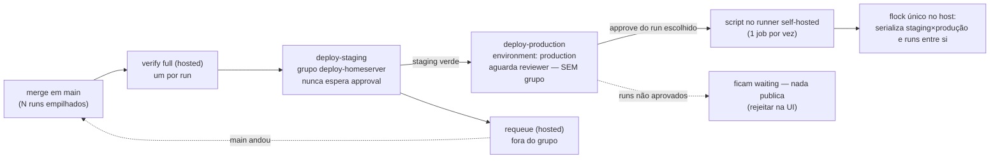

# Impl: OPS107 — Aprovar e deployar em produção a versão escolhida, sem fila de pendentes

Status: aprovado (gate humano 2026-09-14)
Atualizado em: 2026-09-14
Issue: #1002
Intenção: docs/plans/ops107-aprovacao-producao-escolhida.md
Appetite restante: herdado (~0,5–1 dia eng); sem ajuste — remoção de 4 linhas do YAML, 1 pin endurecido, docs e changelog

## Leitura da intenção

- **Outcome (nas palavras do aceite):** com N runs empilhados, o operador aprova e publica **qualquer** um — tipicamente o último com staging verde — sem tocar nos anteriores; um run aguardando aprovação **não** bloqueia o staging nem a aprovação de runs novos; aprovar o run escolhido publica o SHA dele e os antigos não aprovados não deployam nada; a publicação continua exclusivamente humana, com `verify` full verde e nada auto-aprovado/cancelado/atalhado.
- **O que NÃO negociar:** nunca auto-aprovar/publicar produção; nunca atalhar o `verify` full; nunca workflow gêmeo; nunca auto-cancelar/supersedir runs antigos; `environment: production` com required reviewer é o único gate de publicação; `scripts/deploy-homeserver.sh` sem mudança executável (`flock` único + guard "already deployed" não podem afrouxar — pin `deployScript.unit.spec.ts`); `verify`, `ci-pr.yml`, guards de banco e proteção de branch fora de escopo; rollback por SHA arbitrário segue manual no homeserver.
- **O que reavaliar (hipóteses da intenção/explorador):**
  - A OPS104 registrou o grupo compartilhado como decisão OPS103/intenção e o capturou como risco R2 ("revisitar se aprovações demorarem sistematicamente"). **O gatilho disparou:** a premissa "grupo intocado" está superseded — o posicionamento do grupo é exatamente o que muda. A reavaliação confirma que a serialização real não depende dele em produção (cadeia `needs` + runner único + `flock`).
  - Hipótese "o pin do `ciSkipInvariants` continua verde com a remoção" — **confirmada** (pina por `toContain` global). É justamente por isso que o pin precisa ser endurecido; sem isso a entrega não tem prova.
  - Hipótese "precisa mexer nos scripts de trigger (`deploy-preflight.mjs`/`deploy-trigger.mjs`)" — **falsa**: `waiting` já não conta como ativo (pin `deployTrigger.unit.spec.ts` l.57–64) e, sem o grupo em produção, um `waiting` não segura nada. Nenhum script de trigger muda.
  - Hipótese "o `deploy-homeserver.sh` precisa de lock por ambiente" — **falsa/rejeitada**: o lock único continua sendo a serialização real (compose/workspace/registry são compartilhados).

## Abordagem recomendada

**Opções consideradas:** A) remover o `concurrency` de `deploy-production` e manter `group: deploy-homeserver` só em `deploy-staging`; A2) remover o `concurrency` dos dois jobs (fiar na cadeia `needs` + runner único + `flock`); B) manter em produção um grupo único por run (`${{ github.run_id }}`); C) manter o grupo em produção e removê-lo do staging; D) produção por `workflow_dispatch` manual com SHA; E) auto-cancelar/supersedir runs antigos.
**Recomendação:** **A** — o job `waiting` só existe onde há approval (produção); desacoplar o approval da lane compartilhada elimina o bloqueio na origem. O staging (única lane que nunca espera humano, sempre drena) mantém o grupo com `queue: max`/`cancel-in-progress: false`, preservando o contrato OPS102/OPS103 de "deploy nunca cancela, espera a vez" para o caminho sem humano. A serialização real fica em três camadas: cadeia `needs` intra-run, UMA instância de runner self-hosted (um job por vez) e o `flock` único do script (também cobre invocação manual e um futuro scale de runner). Produção segue 100% humana (`environment: production` + required reviewer) e o `verify` full segue gate.
**Rejeitadas:** A2 porque remove sem necessidade a serialização declarativa da lane de staging (um segundo runner passaria a buildar staging concorrentemente, dependendo só do `flock`) e amplia o delta sem ganho de aceite; B porque `${{ github.run_id }}` cria um grupo que ninguém mais compartilha — no-op cerimonial que não serializa nada entre runs e só adiciona pin; C porque mantém o approval segurando a lane e a produção aprovada do run novo entra na fila atrás do `waiting` antigo (piora o problema central); D porque foi rejeitada no gate de produto (mecanismo novo de promoção por SHA e perda da cadeia `needs`/verify do run); E porque auto-cancelamento/supersessão é anti-goal explícito (automação destrutiva sem decisão de produto).

### Decisões de engenharia (caras de reverter)

#### D1 — Onde mora o `concurrency` depois da OPS107

- **Opções:** A) produção fora do grupo, grupo só no staging (recomendada); A2) sem grupo em nenhum job; B) grupo único por run em produção (`${{ github.run_id }}`); C) grupo só em produção.
- **Recomendação:** **A** — a lane que pode ficar `waiting` (produção) não ocupa nada; a lane que sempre drena (staging) mantém o grupo e o `queue: max`, que é o contrato OPS102/103 ("deploys esperam a vez, nunca são cancelados") para o caminho que não depende de humano.
- **Rejeitadas:** A2 por D1/opções (perde a serialização declarativa do staging num eventual segundo runner); B por ser grupo sem consumidor; C por reproduzir o bug central (produção nova atrás do `waiting` antigo).

#### D2 — O que é a serialização real (e o que o plano NÃO cria)

- **Opções:** A) grupos/locks por ambiente (staging e produção separados); B) mecanismo novo de coordenação (token/lock no GitHub, revogar approval etc.); C) confiar na cadeia `needs` + runner único + `flock` único existente, documentando (recomendada).
- **Recomendação:** **C** — `needs` serializa intra-run (produção nunca começa antes do staging verde); UMA instância de runner self-hosted (`~/actions-runner`, labels `self-hosted,homeserver`) roda um job por vez; o `flock -w 3600` em `/tmp/teqo-deploy.lock` (compartilhado pelos dois ambientes; pinado em `deployScript.unit.spec.ts`) serializa staging×produção entre runs e a invocação manual. Zero abstração nova.
- **Rejeitadas:** A porque compose/workspace/registry são um só — locks por ambiente deixariam staging e produção buildar/swapar concorrentemente (decisão OPS103, reafirmada); B porque o gate de produto decidiu não introduzir mecanismo novo de trava e o problema é de posicionamento do job, não de coordenação.

#### D3 — Multi-aprovação (dois runs aprovados por engano ou de propósito)

- **Opções:** A) manter a ordem de aprovação/execução (o último deploy executado vence) + runbook "aprove só o escolhido; rejeite os demais" (recomendada, decidida no gate); B) mecanismo novo para "desarmar" approvals antigos; C) auto-cancelar runs superseded.
- **Recomendação:** **A** — a semântica é a mesma de hoje (o `flock` serializa mas não ordena; o "already deployed" não pega revision diferente); os runs não aprovados ficam `waiting` e podem ser rejeitados na UI sem publicar.
- **Rejeitadas:** B porque não há API limpa de revogação de approval e o gate rejeitou mecanismo novo de trava; C porque cancelamento automático é anti-goal.

#### D4 — Pin do contrato (o teste que prova o aceite)

- **Opções:** A) fatiar o YAML por bloco de job e pinar presença do grupo no staging + ausência de `concurrency:` em produção (recomendada); B) manter os `toContain` globais atuais; C) pinar ausência global de `concurrency:` no arquivo.
- **Recomendação:** **A** — o pin atual continuaria verde após a remoção (não prova nada); o fatiamento já é o padrão do próprio spec (bloco do `requeue`, l.142–147) e `readWorkflow` remove comentários, então a prosa do header nunca satisfaz o pin. RED comprovado antes da edição do YAML (o `not.toContain` falha contra o YAML antigo) e verde depois.
- **Rejeitadas:** B por ser falso-verde para a mudança central; C porque quebraria o grupo legítimo do staging.

**Nota (barata, sem decisão):** realinhar os comentários que descrevem a serialização — header do `deploy.yml` (l.41–49), comentário do job `deploy-production` e o comentário de lock do `scripts/deploy-homeserver.sh` (l.50–54, **somente comentário**; nenhuma linha executável muda e o pin do script continua verde sem edição). Sem isso, o comentário dentro do script passaria a mentir sobre onde a serialização mora.

### Componentes / mudanças

Linhas do estado atual (2026-09-14); realinhar pela âncora, não pelo número.

- **`deploy-production`** (`.github/workflows/deploy.yml` l.251–276): **remover o bloco `concurrency:` (l.267–270)**. Permanecem `needs: [deploy-staging]`, o `if` de ref guard, `environment: production`, `runs-on: [self-hosted, homeserver]`, `timeout-minutes: 60`, `TEQO_ENV: production` e o step `bash scripts/deploy-homeserver.sh "$GITHUB_SHA"`. Comentário do job ganha a razão (OPS107: o approval é avaliado antes do environment gate; um `waiting` nunca pode ocupar a lane compartilhada).
- **`deploy-staging`** (idem l.202–227): **intocado** — `needs: [verify]`, `environment: staging`, `runs-on: [self-hosted, homeserver]`, `concurrency: {group: deploy-homeserver, cancel-in-progress: false, queue: max}`. É a única lane que segura o grupo e sempre drena.
- **Header do workflow** (idem l.41–49) e sumário de jobs (l.17–32): reescrever o parágrafo de serialização — o grupo vive **só** no staging; produção serializa por `needs` + runner único + `flock`; um approval pendente não ocupa lane. O bloco OPS104 (l.55–58, "no auto-approve, no auto-retry, no cancel-old-runs") permanece verdadeiro.
- **`scripts/deploy-homeserver.sh`** (l.50–54): **somente comentário** — o lock compartilhado segue a serialização real; nada de comportamento muda; `deployScript.unit.spec.ts` sem edição e verde.
- **`ciSkipInvariants`** (`tests/unit/ciSkipInvariants.unit.spec.ts` l.156–178): endurecer o pin. Manter os asserts globais atuais (`environment: staging|production`, `needs: [deploy-staging]`, `TEQO_ENV`, ref guard, `needs.deploy-staging.result`) e **escopar o `concurrency` por fatia de bloco**: `stagingBlock = deploy.slice(indexOf('  deploy-staging:'), indexOf('  requeue:'))` contém `concurrency:`, `group: deploy-homeserver`, `cancel-in-progress: false`, `queue: max`; `productionBlock = deploy.slice(indexOf('  deploy-production:'))` (último job, até o EOF) **não** contém `concurrency:`. O pin do `requeue` fora do grupo (l.140–147) fica como está.
- **`deployTrigger.unit.spec.ts`**: sem mudança — o pin de `waiting` não-ativo (l.57–64) continua o contrato do `preflight`.
- **`deployScript.unit.spec.ts`**: sem mudança — sem mudança executável no script.
- **Runbook** (`docs/ops/teqo-1313-deploy.md`): título (l.1) + intro (l.3–10) ganham OPS107; item 1 (l.16–18) registra que o staging do run novo segue mesmo com approval pendente; item 5 (l.33–38) troca "serializada pela `concurrency: deploy-homeserver`" por "serialização real = cadeia `needs` + runner único + `flock` único; o approval pendente não ocupa lane" e adiciona a instrução **"aprove só o run escolhido; rejeite os demais"**; item 7 (l.45–48) troca "o `concurrency` do workflow serializa os runs" por "o grupo fica só no staging; o lock único serializa os runs entre si e cobre invocação manual"; "Primeiro deploy" (l.80–87) descreve o fluxo novo; "Falhas conhecidas" l.256 é reescrita: o sintoma antigo deixa de existir e a linha passa a registrar a multi-aprovação (último deploy executado vence; rejeitar os demais; rollback manual se um SHA indesejado publicar).
- **`AGENTS.md`** (l.15), **`AGENTS-infra.md`** (l.5), **`docs/AGENT-OPS.md`** (l.19, l.25, l.84, l.113), **`README.md`** (l.12 e l.100): realinhar as frases de deploy — `concurrency: deploy-homeserver` só no `deploy-staging`; approval pendente não bloqueia staging nem aprovação de runs novos (OPS107); produção serializa por runner único + `flock`; "só humano: aprovar o run escolhido no environment `production` (rejeitar os demais)".
- **Changelog**: `docs/changelog/2026-09-14-ops107.md` (uma entrada, one-liner bold, additions-only) registrando: grupo só no staging; approval de produção não ocupa mais a lane; serialização real = `needs` + runner único + `flock`; resolução do R2/OPS104 e supersessão do "grupo intocado"; instrução multi-approve. **Não** editar `docs/CHANGELOG-AGENTS.md` (gitignored) nem `docs/CHANGELOG-AGENTS-HISTORY.md` (congelado).
- **Migration:** sem migration (YAML/testes/docs).
- **Access / Consent:** n/a (sem PII, sem collection).
- **UI:** Impeccable A — n/a (sem superfície de UI).

### Dados → forma (se aplicável) — n/a

A "forma" aqui é operacional (jobs/runs no Actions): a evidência é o estado dos runs (`pending`/`waiting`, ordem de liberação da lane) e a revision do container publicado. Nada a apresentar.

## Fases verificáveis

1. **Tracer — workflow + pin (RED → verde).** Primeiro endurecer `ciSkipInvariants` (fase D4) e rodar o spec focado: a asserção `productionBlock.not.toContain('concurrency:')` falha contra o YAML atual (**RED comprovado**). Depois remover o bloco `concurrency:` de `deploy-production` e realinhar comentários do YAML. Gate: spec focado verde + `pnpm gate:fast`. _~2–3h._
2. **Docs vivas + runbook + changelog.** Checklist da seção Componentes (runbook, AGENTS/AGENTS-infra/AGENT-OPS/README, entrada de changelog; `pnpm format` se o Prettier reclamar). _~2–3h._
3. **Gates e entrega.** `pnpm gate:fast`, `pnpm test:unit` (full), `pnpm push` (o `gate:ci` cobre format/lint/typecheck/unit/int/knip/cycles); e2e: **sem superfície de runtime — declarar "sem e2e afetado"** (diff é YAML + spec unitário + docs; politica OPS72 discricionária). O CI do PR roda o curado automaticamente porque `tests/unit/ciSkipInvariants.unit.spec.ts` é `HIGH_RISK_EXACT` (nunca zero e2e), além de unit/int full. Incluir o `*-impl.md` no commit; PR Ready. _~1h + observação pós-merge:_ (a) o merge dogfooda o YAML novo — deixar o `deploy-production` do próprio run **waiting**; (b) mergear/dispatchar um segundo run e confirmar que o `deploy-staging` dele **roda** (grupo livre) — aceite central; (c) aprovar **só** o run escolhido e conferir a revision do container `teqo-1313` no SHA dele; (d) rejeitar (ou deixar waiting) o run antigo e confirmar que ele não publicou nada.

## Rabbit holes / Não escopo (engenharia)

- Auto-approve/auto-publicação, auto-retry de `verify` vermelho, auto-cancelamento/supersessão de runs antigos (anti-goals).
- Produção por `workflow_dispatch` manual com SHA, novo "promoter"/coordinator, qualquer script ou lock novos — o dono continua sendo o `deploy.yml` (editar o dono, não criar twin).
- Locks/grupos por ambiente no `deploy-homeserver.sh` — decisão OPS103 reafirmada (compose/workspace/registry compartilhados).
- Mexer no `verify`, no `ci-pr.yml`, nos guards de banco, na proteção de branch ou no `environment` de produção.
- Refinar o `preflight` para contar `waiting` — contra o aceite (um waiting não pode bloquear runs novos) e já pinado.
- Reintroduzir o stale-run guard (`git ls-remote`/`refs/heads/main`) — superseded pela OPS102.
- actionlint/validação de YAML nova no CI; e2e novo (não há superfície de runtime); rollback por SHA arbitrário (manual no homeserver).

**Diferido com gatilho (triage do simplify):** o slice do `productionBlock` no pin vai até o EOF do YAML (direção fail-closed — um job novo depois de `deploy-production` com `concurrency:` geraria falso-RED, nunca falso-verde). Gatilho: ao adicionar qualquer job após `deploy-production` no `deploy.yml`, delimitar o bloco no início do próximo job. Descartado da triage: ajuste editorial do self-score (sem impacto funcional/rastreabilidade).

## Riscos e mitigação

- **R1 — Multi-aprovação acidental com execução fora de ordem** (o `flock` serializa mas não ordena). Risco aceito no gate. _Mitigação:_ runbook "aprove só o escolhido; rejeite os demais"; rollback manual documentado; o "already deployed" evita rebuild do mesmo SHA.
- **R2 — Confiar no runner único + `flock` como serialização real.** Documentar no runbook/comentários que escalar o runner exige revisitar (o grupo GitHub deixa de ordenar produção; o `flock` continua cobrindo a concorrência no host). _Gatilho:_ segundo runner instalado.
- **R3 — Produção aprovada rodando no runner enquanto o staging de um run novo espera o runner.** Aceitável (ambientes separados; um job por vez + `flock`) — documentar na intro/header.
- **R4 — Pin frágil.** _Mitigação:_ fatia por bloco (não `contains` global), RED comprovado antes; `requeue`/`deployTrigger`/`deployScript` pins preservados.
- **R5 — Drift das docs vivas** (runbook + 4 arquivos + changelog). _Mitigação:_ checklist da fase 2; changelog registra a supersessão.
- **R6 — YAML inválido derruba os dois caminhos** (auto e dispatch usam a default branch). _Mitigação:_ diff pequeno (4 linhas), revisão; o merge é o dogfood e `workflow_dispatch` segue como escape.
- **R7 — Runs antigos ficam `waiting` para sempre na UI** (sem automação). Aceito; o runbook orienta rejeitar. Nenhuma publicação ocorre sem approve.
- **R8 — Backlog serial de staging** (N merges = N stagings, cada um ~15–20 min). Aceito: staging drena sem humano no caminho (era o bloqueio que doía). _Gatilho:_ se a fila virar sistemática, reavaliar cancelamento automático — exige decisão de produto.

## Aceite de engenharia

- [ ] Aceite de produto da intenção coberto: (1) com N runs empilhados, aprovar/publicar qualquer um sem tocar nos anteriores; (2) run `waiting` não bloqueia o staging nem a aprovação de runs novos (grupo fora de produção); (3) aprovar o run escolhido publica o SHA dele; antigos não aprovados não publicam; (4) publicação exclusivamente humana, `verify` full verde, nada auto-aprovado/auto-cancelado/atalhado.
- [ ] Invariantes AGENTS/engineering-standards: sem migration/UI/access/Consent; `verify`/`ci-pr.yml`/guards/proteção de branch intocados; `environment: production` com required reviewer é o único gate de publicação; `scripts/deploy-homeserver.sh` sem mudança executável (flock + guard intactos; `deployScript.unit.spec.ts` verde sem edição); sem workflow gêmeo, sem auto-cancel/auto-approve.
- [ ] Testes de domínio previstos: `ciSkipInvariants.unit.spec.ts` endurecido (grupo presente no bloco do staging; `concurrency:` ausente no bloco de produção) com RED comprovado contra o YAML antigo; `deployTrigger.unit.spec.ts` e `deployScript.unit.spec.ts` verdes sem edição.
- [ ] Gates: `pnpm gate:fast` e `pnpm test:unit` verdes; `pnpm push` (gate:ci); e2e declarado "sem superfície" (OPS72) — o CI do PR aplica o curado por high-risk; validação ao vivo pós-merge (fase 3) executada e registrada no changelog/runbook.

**Self-score decision-quality (gate ≥4):**

| Critério                         | Nota      | Justificativa                                                                                                                       |
| -------------------------------- | --------- | ----------------------------------------------------------------------------------------------------------------------------------- |
| 1. Decisões caras com rejeitadas | 1,0       | D1 (A/A2/B/C), D2 (locks por ambiente vs mecanismo novo vs reuso), D3 (multi-approve) e D4 (pin) com opções e rejeitadas explícitas |
| 2. Cabe no appetite              | 1,0       | <1 dia: 4 linhas removidas do YAML + comentários, 1 pin endurecido, docs/changelog; nenhuma refatoração do fluxo                    |
| 3. Rabbit holes nomeados         | 1,0       | auto-approve/auto-cancel, dispatch manual por SHA, locks por ambiente, refinamento do preflight, coordinator novo, actionlint       |
| 4. Depth check (reuso)           | 1,0       | edita o dono (`deploy.yml`), reusa o precedente do `requeue` e o padrão de slice do próprio spec; zero abstração/dependência nova   |
| 5. Intenção preservada           | 1,0       | os 4 aceites cobertos; publicação 100% humana; `verify` e o script do homeserver sem mudança de comportamento                       |
| **Total**                        | **5,0/5** | ≥4 exigido                                                                                                                          |
