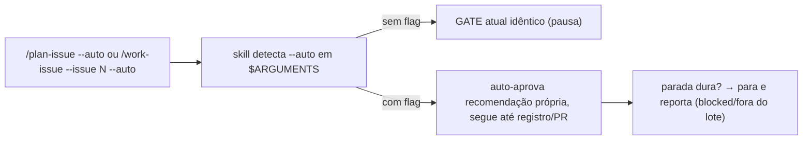

# Impl: OPS108 — Modo autônomo por flag nas skills plan-issue e work-issue

Status: aprovado
Atualizado em: 2026-09-15
Issue: #1018
Intenção: docs/plans/ops108-modo-autonomo-por-flag.md
Appetite restante: herdado (~0,5–1 dia eng; só texto de skills/comandos + teste unit)

## Leitura da intenção

- **Outcome:** com `--auto`, `plan-issue` vai do overview ao registro e `work-issue` vai do impl plan ao PR **sem** pausa de confirmação; sem a flag, os GATEs atuais permanecem idênticos.
- **O que NÃO negociar:** a pausa continua default (opt-in por invocação); a flag nunca atravessa os invariantes duros (Consent/LGPD fail-closed, migração de schema, contrato de URL público, shapes públicos, aprovação humana de produção); divergência material de produto continua parando (work-issue → `blocked`; plan-issue → item fora do lote); claim continua contrato do ambiente (`work-issue --auto` nunca claima); sem CI green não mergea; comandos continuam wrappers finos (guard OPS25).
- **O que reavaliar:** a hipótese de direção ("a flag viaja no texto já repassado hoje") está correta — `$ARGUMENTS` já carrega `--issue <N>` por convenção de prompt, sem parser; `--auto` segue o mesmo caminho. Confirmado: `scripts/lib/worktree.mjs:207-232` monta `--prompt "/work-issue --issue N"` (a flag da skill vive **dentro** da string do prompt, não no argv do CLI).

## Abordagem recomendada

**Opções consideradas:** A | B | C (por decisão abaixo)
**Recomendação:** semântica espelhada mínima em cada `SKILL.md` + uma linha de descobribilidade em cada comando + spec unit que pina o novo texto.
**Rejeitadas:** ver cada decisão.

### Decisões de engenharia

**D1 — Onde vive a semântica da flag.**
Opções: A) bloco compartilhado novo referenciado pelas duas skills · B) seção dedicada espelhada em cada `SKILL.md` · C) só nos comandos.
Recomendação: B — cada skill é dona do próprio GATE (`plan-issue` Passo 4, `work-issue` Passo 3c), e skills são fonte canônica autocontida (sub-agentes recebem contexto mínimo); ~15 linhas espelhadas, cada uma redigida na voz do próprio GATE.
Alternativas rejeitadas: A porque um include cross-skill cria indireção e acoplamento para um texto curto que precisa ser lido inline no momento do gate; C porque comandos são proibidos de transcrever fluxo (guard OPS25 — `opencodeCommands.unit.spec.ts`).

**D2 — Como os comandos expõem `--auto` sem ganhar lógica.**
Opções: A) só no `description` do frontmatter · B) uma linha de uso no corpo, mantendo `$ARGUMENTS` + ponteiro canônico · C) nada nos comandos.
Recomendação: B — ex. `Uso: /work-issue --issue <N> [--auto]` + frase de uma linha ("`--auto` dispensa a pausa do GATE; sem ela, o fluxo supervisionado atual vale"). O corpo continua sem transcrever o fluxo.
Alternativas rejeitadas: A porque `description` é curta (TUI) e não comporta semântica nem desambiguação; C porque a flag ficaria indescobrível no prompt `/`.

**D3 — Desambiguação `--auto` da skill vs `--auto` do CLI opencode.**
Opções: A) nota explícita de uma frase em cada skill (e eco curto nos comandos) · B) renomear a flag (ex. `--autonomous`) · C) ignorar a colisão.
Recomendação: A — a intenção já decidiu `--auto` (gate 2026-09-15); o texto diz: "`--auto` aqui é flag da skill dentro do prompt (ex. `/work-issue --issue 1018 --auto`); não confundir com `--auto` do CLI opencode (auto-aprovar permissões de ferramenta, ex. `launch opencode … --auto --prompt …` em `scripts/lib/worktree.mjs:218`)".
Alternativas rejeitadas: B porque reabre decisão de produto fechada e quebra a simetria `--issue`/`--auto` no mesmo canal (`$ARGUMENTS`); C porque a colisão é real e já pinada em teste (`worktree.unit.spec.ts:164-277`) — silêncio geraria invocações erradas.

**D4 — Questões em aberto da intenção (assumidos).**
Opções (divergência no `plan-issue` autônomo): A) não registra, reporta no resumo · B) registra `blocked`.
Recomendação: A — preserva "nada no tracker antes do gate"; o item volta barato quando o humano decidir.
Opções (`work-issue --auto` vs `agent-work-issue`): A) separados neste item · B) consolidar.
Recomendação: A — contratos diferentes (sessão humana opt-in vs pool dormente); convivência documentada numa frase em cada skill; consolidação é item futuro.

### Componentes / mudanças

- **`plan-issue/SKILL.md`** (`.agents/skills/plan-issue/SKILL.md`): nova seção "Modo autônomo (`--auto`)": detecção em `$ARGUMENTS`; Passo 4 GATE vira apresentação-sem-pausa (overview continua obrigatório no resumo); registro segue Passo 5 sem confirmação; lista fechada do que pode auto-aprovar vs parada dura (cópia das listas da intenção); divergência material → item fora do lote + resumo final; fail-safe ("flag ausente/desconhecida → GATE idêntico"); nota de desambiguação CLI; frase de convivência com `agent-work-issue`.
- **`work-issue/SKILL.md`** (`.agents/skills/work-issue/SKILL.md`): nova seção "Modo autônomo (`--auto`)": parsing em Passo 1 (`--auto` em `$ARGUMENTS`, ex. `/work-issue --issue 1018 --auto`); Passo 3b marca impl plan `aprovado` sem pausa; Passo 3c vira apresentação-no-chat-sem-espera; "Proibido" ganha exceção explícita ("pular a pausa do impl plan" continua proibido, exceto com `--auto` — todo o resto do Proibido intocado, inclusive nunca claimar); mesmas listas fechadas; divergência → `blocked` (precedente `agent-work-issue`); fail-safe; desambiguação CLI.
- **Comandos** (`.opencode/commands/plan-issue.md`, `work-issue.md`): +1 linha de uso com `[--auto]` + 1 frase (dispensa a pausa; aponta a skill como canônica). `$ARGUMENTS`, `` `nome` ``, ponteiro canônico e frontmatter `description` sem `model:` preservados — guard existente continua verde.
- **Migration:** sem migration (só markdown).
- **Access / Consent:** N/A (sem superfície de dados); as listas de parada dura citam Consent fail-closed sem tocá-lo.
- **UI:** Impeccable A — sem UI, sem rascunho.
- **Testes:** novo `tests/unit/skillsAutoFlag.unit.spec.ts` pinando o contrato textual: cada `SKILL.md` contém `--auto` + menção de parada dura (Consent/LGPD, migração, URL público, produção) + frase fail-safe ("sem a flag"); cada comando contém `--auto` + `$ARGUMENTS` + ponteiro canônico. Guard `opencodeCommands.unit.spec.ts` existente deve continuar verde sem edição (se exigir ajuste, o ajuste é no comando, não no guard).

### Dados → forma (se aplicável)

N/A — sem superfície de dados (intenção: "Dados: N/A").

## Fases verificáveis

1. **Tracer / texto+teste** (quota: quase todo o appetite) — editar 2 `SKILL.md` + 2 comandos + criar `skillsAutoFlag.unit.spec.ts`; rodar `pnpm vitest run tests/unit/skillsAutoFlag.unit.spec.ts tests/unit/opencodeCommands.unit.spec.ts`; depois `pnpm gate:fast`.
2. **UI** — N/A (Impeccable A).
3. **Gates** — `pnpm gate:fast` na iteração; entrega com `pnpm push` (não `git push` nu). E2E: nenhum (sem superfície de produto; skill-docs não entram no `E2E_AFFECTED_MANIFEST`). Int: nenhum (sem DB).

## Rabbit holes / Não escopo (engenharia)

- Renomear a flag ou ler `--auto` do argv do CLI (a flag mora no prompt `$ARGUMENTS`, não no argv — `worktree.mjs:218` é outro `--auto`).
- Lógica nos comandos (quebra OPS25) ou skill gêmea "autônoma" (twin = drift; intenção corta).
- Puxar claim/pool/launch de worktree para a skill (contrato do ambiente; `worktree.mjs:207-232` intocado).
- Tocar `agent-work-issue`, `AGENT-OPS.md`, `engineering-audit` ou `E2E_AFFECTED_MANIFEST` (fora do escopo fechado: 2 skills + 2 comandos + 1 spec).
- Quoting: exemplos com aspas no prompt passam por xargs no launch — manter exemplos simples, sem aspas aninhadas.

## Riscos e mitigação

- **Colisão mental `--auto` skill vs CLI** → mitigado pela nota de desambiguação (D3) + exemplo canônico `/work-issue --issue 1018 --auto` nos dois lugares.
- **Bypass acidental de invariante** → mitigado pelas listas fechadas duplicadas (auto-aprovável vs parada dura) + fail-safe + spec que pina a menção de parada dura.
- **Drift com `agent-work-issue`** → mitigado pela frase de convivência (D4-A); sem edição no contrato do pool.
- **Sub-agente escritor indisponível** (falhou 2x nesta sessão com erro transitório do provider) → mitigado: plano escrito inline pelo agente principal a partir dos findings do explorador + leitura direta dos arquivos; registrar no resumo.

## Aceite de engenharia

- [ ] Aceite de produto da intenção ainda coberto (flag opt-out só da pausa; listas fechadas; fail-safe; claim/CI/produção intocados)
- [ ] Invariantes AGENTS/engineering-standards (edit the owner, don't twin; comandos finos; copy pt-BR / identificadores em inglês)
- [ ] Testes de domínio previstos (unit textual do contrato; sem access/write paths — sem unit/int de domínio)
- [ ] Self-score decision-quality: 5/5 (caras com rejeitadas: D1–D4; cabe no appetite; rabbit holes nomeados; depth check: zero módulo novo, reuso dos donos; outcome da intenção intacto)
