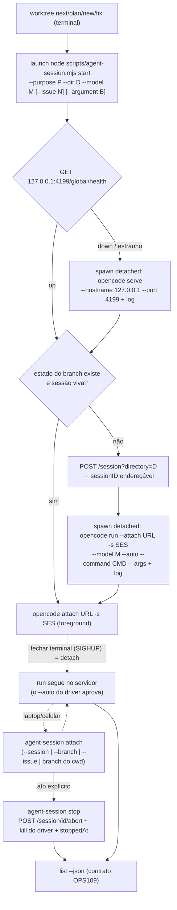

# Impl: OPS110 — Acompanhar runs longos de agente por attach/detach, sem manter terminal aberto

Status: rascunho
Atualizado em: 2026-09-15
Issue: #1019
Intenção: docs/plans/ops110-attach-detach-runs-agent.md
Appetite restante: ~1–2 dias eng (herdado) — cabe: 1 CLI + 1 lib pura + 2 specs unitários + docs/changelog; sem migration/UI/access/Consent.

## Leitura da intenção

- **Outcome (nas palavras do aceite):** o run continua trabalhando sem nenhum cliente olhando (nenhum terminal/SSH aberto no workstation); (re)entrar de outro dispositivo retoma exatamente a **mesma sessão, mesmo worktree, mesmo histórico**; sair do cliente nunca é encerrar (encerrar é ato explícito); nada novo escutando além do loopback sem credencial (qualquer superfície além de `127.0.0.1` exige auth, fail-closed sem `OPENCODE_SERVER_PASSWORD`); worktree/branch segue o contrato de ambiente (sem nova forma de claim, sem sessão órfã); a sessão é **endereçável** a partir da Issue/worktree — contrato que o OPS109 (painel) consumirá.
- **O que NÃO negociar:** não vira pool/supervisor (OPS65 removido — não ressuscitar); não cria caminho que burle gates humanos (PR/CI/approval); não cria segunda porta de entrada que ignore claim/worktree; não exige terminal aberto nem processo pendurado em SSH; não abre porta pública/internet; não é web UI como produto; sem notificações/frota/métricas; sem mudar claim/gates. Impeccable A — N/A (ferramenta/ops, sem UI).
- **O que reavaliar (hipóteses da intenção/explorador):**
  - "Servidor nativo (a) vs multiplexador tmux (b)" → **decidido neste plano:** servidor + attach (D1/D2). O tmux cai porque não tem auto-approve fora do TUI, não dá session ID/URL endereçável para o OPS109 e adiciona dependência externa/preso a um pty.
  - "o `opencode serve` sozinho sustenta o run" → **falso**: sessão só-servidor sem cliente fica **pendurada na permissão de bash** (fato verificado ao vivo; request fica em `/permission`). O design passa a exigir um **driver destacado vivo pelo run inteiro** — é o `--auto` dele que aprova, como o `--auto` do launch de hoje.
  - "HTTP puro (`prompt_async`/REST) resolve sem cliente" → **falso** pelo mesmo fato; rejeitado em D2.
  - "reusar o 4096 (Zed `opencode acp`) ou o 4097 (`opencode web` do usuário)" → **rejeitado**: processos de terceiros na máquina; servidor próprio em **4199** (`TEQO_AGENT_SERVER_PORT` overridável), fora da faixa de dev dos worktrees (`3100+slot`, slot ≤ 999 → até 4099).
  - "a sessão só existe quando o TUI abre" → **falso**: `POST /session?directory=D` cria a sessão antes do run; o ID já nasce endereçável e vai para o estado no `start`.
  - "`opencode attach`/TUI fecha o run" → **falso** (probes): SIGKILL no cliente `run`, fechar o TUI e `tmux kill-session` **não** abortaram o run server-side; `POST /session/{id}/abort` interrompe e o driver sai. Ctrl+C no TUI pode limpar input em vez de sair (não aborta o run).

## Abordagem recomendada

**Opções consideradas:** A) `opencode serve` compartilhado em loopback (127.0.0.1:4199) + driver destacado por run + `opencode attach` como cliente TUI; B) multiplexador de terminal (tmux) mantendo o TUI vivo entre anexações; C) servidor + HTTP puro (`prompt_async`/REST) sem cliente/driver vivo; D) um `opencode serve` por worktree.
**Recomendação:** **A** — é a única direção que preserva os três aceites ao mesmo tempo: o run sobrevive sem cliente (servidor dono da sessão + driver `--auto` destacado), o reattach é exato (`-s <sessionID>` no mesmo `--dir`) e a sessão é endereçável (`sessionID` + `url` no estado, base do contrato OPS109). Os probes ao vivo na 1.18.31 validaram cada peça: fechar/SIGKILL no cliente não aborta; o exit do driver é 0 ao concluir; `abort` interrompe e o driver sai; `--command` com separador `--` entrega `$ARGUMENTS` corretamente (`work-issue -- --issue 1019` passou `"--issue 1019"`).
**Alternativas rejeitadas:** B — sem auto-approve fora do TUI (o run ficaria pendurado na permissão assim que o humano saísse), sem session ID/URL estável para o OPS109 e dependência externa (tmux) no caminho crítico; C — a permissão de bash pendura sem cliente vivo (fato verificado) e não há como "responder depois" sem superfície de permissão; D — N portas/processos para gerenciar, URLs múltiplas para o OPS109 e o mesmo custo de driver por run (nenhum ganho de isolamento, já que as sessões são escopadas por `directory`).

### Decisões de engenharia (caras de reverter)

#### D1 — Topologia do servidor

- **Opções:** A) um `opencode serve` compartilhado em `127.0.0.1:4199` (`TEQO_AGENT_SERVER_PORT`), sessões escopadas por `directory` (recomendada); B) um servidor por worktree; C) reusar 4096/4097 de terceiros; D) porta efêmera com registro em arquivo.
- **Recomendação:** **A** — um único processo loopback, uma URL estável por workstation, endereçamento simples para o OPS109; `serve` é idempotente (health check antes de subir).
- **Alternativas rejeitadas:** B — N processos/portas e N URLs, sem ganho (sessões já isolam por diretório); C — são donos de terceiros (Zed ACP, `opencode web` do usuário), não nossos para gerenciar/derrubar; D — endereço instável entre reboots quebra o contrato de endereçamento do OPS109.

#### D2 — Quem sustenta o run (driver destacado)

- **Opções:** A) driver destacado por run (`opencode run --attach URL -s SES --dir DIR --model M --auto --command CMD -- <args>`, spawn `detached: true` + `unref()` + log em fd, precedente `scripts/auto-unblock.mjs:344–374`) (recomendada); B) `prompt_async`/HTTP puro sem cliente; C) tmux com o TUI vivo; D) confiar no servidor sozinho.
- **Recomendação:** **A** — o driver é quem carrega o `--auto` do run inteiro e auto-aprova permissões; verificado que ele sai com exit 0 ao concluir, que SIGKILL no cliente não aborta e que `POST /session/{id}/abort` interrompe o run e faz o driver sair.
- **Alternativas rejeitadas:** B — permissão pendura sem cliente (verificado); C — sem `--auto` fora do TUI e sem session ID/URL estável; D — o servidor não aprova permissões por conta própria.

#### D3 — UX do `start` (TUI anexado em foreground)

- **Opções:** A) `start` termina com `opencode attach <url> -s <id> --dir <dir>` no foreground, stdio herdado (recomendada); B) `start` retorna sem abrir nada (só imprime URL/ID); C) abrir um TUI local antigo.
- **Recomendação:** **A** — mantém a UX atual do launch (o chat abre no worktree, agora como cliente do servidor) e o detach explícito é fechar o terminal; sair do TUI não encerra o run.
- **Alternativas rejeitadas:** B — muda a UX do `worktree next/plan/...` e adiciona um passo manual; C — TUI local não fala com o servidor e conflita com o endereçamento.

#### D4 — Estado por run e contrato de endereçamento (OPS109)

- **Opções:** A) JSON por run em `~/.local/state/teqo/agent-sessions/<slug-do-branch>.json` (`TEQO_AGENT_SESSION_DIR` overridável; `XDG_STATE_HOME` respeitado), campos estáveis `version, code, issue, purpose, branch, dir, sessionID, url, model, driverPid, logPath, startedAt, stoppedAt` (recomendada); B) sem arquivo, redescobrir tudo pela API do servidor; C) banco/daemon próprio de sessões.
- **Recomendação:** **A** — o opencode persiste a sessão; o arquivo é só o **índice de endereçamento** (branch/dir/sessionID/url/driverPid/log). Sem segredo persistido: credencial só por env (`OPENCODE_SERVER_PASSWORD`/`OPENCODE_SERVER_USERNAME`), nunca no estado/log. `code` derivado do prefixo do branch (`C15-…`), `null` nos namespaces `plans/`, `work/`, `fix/`.
- **Alternativas rejeitadas:** B — a API do servidor não guarda issue/branch/purpose/driverPid; redescobrir exigiria heurística e quebraria o OPS109; C — rabbit hole de produto ("segundo dono da sessão").

#### D5 — Reuso de sessão, encerramento e `worktree kill`

- **Opções:** A) `start` com estado existente e sessão viva → apenas attach (não duplica driver/sessão); `--new` força sessão nova; servidor/sessão inexistente (reboot) → nova sessão; `stop` = abort via API + kill do driver + `stoppedAt`; `worktree kill` chama stop antes de remover e apaga o estado ao fim (recomendada); B) sempre criar sessão nova; C) nunca reusar/nunca parar.
- **Recomendação:** **A** — cobre `worktree next --issue N` idempotente (worktree reaberto não pode ganhar dois runs no mesmo branch) e cumpre "sem sessão órfã". Estado vivo mas com script `start` concorrente é protegido por lock simples (ver R4).
- **Alternativas rejeitadas:** B — dois runs no mesmo worktree/branch = corrupção de branch/PR; C — órfãos.

#### D6 — Dono do mapa purpose→comando/args e nova diretiva de launch

- **Opções:** A) mover `OPENCODE_SKILL_COMMAND_BY_PURPOSE` (hoje em `scripts/lib/worktree.mjs:91–96`) e a montagem command/args para `scripts/lib/agent-session.mjs`; `opencodeLaunchDirective` (`scripts/lib/worktree.mjs:207–233`) passa a emitir `launch node scripts/agent-session.mjs start --purpose 
 --dir <D> --model <M> [--issue N] [--argument "<B>"]` (recomendada); B) manter o mapa em `worktree.mjs` e o CLI de sessão chamá-lo de volta; C) duplicar o mapa no script novo.
- **Recomendação:** **A** — o launch segue sendo a **única porta de entrada**; `.agents/shell/worktree.sh` não muda de mecânica (continua 1 linha `launch` tokenizada por xargs); a sanitização do bag (remover `"`/`\`) e a regra "issue só no `next`" são preservadas no novo dono.
- **Alternativas rejeitadas:** B — inverte dependência e acopla o ciclo de vida ao provisionador; C — drift garantido entre dois mapas.

#### D7 — Superfície de comando

- **Opções:** A) um script com verbos `serve|start|attach|stop|list [--json]`, exposto como `"agent:session": "node scripts/agent-session.mjs"` no `package.json` (recomendada; precedente `pnpm issue`/`pnpm worktree`); B) um script por verbo; C) pendurar os verbos no `scripts/worktree.mjs`.
- **Recomendação:** **A** — cluster coeso do ciclo de vida; `scripts/*.mjs` já é entrada do knip (`knip.json` `entry`), então o script novo entra no grafo sem config nova. `attach`/`stop` resolvem por `--session` > `--branch` > `--issue` > branch do cwd (`git rev-parse --abbrev-ref HEAD`); `list --json` é o contrato de endereçamento do OPS109.
- **Alternativas rejeitadas:** B — 5 entrypoints, help/parse duplicados; C — mistura claim/provisionamento (worktree) com ciclo de vida de run (sessão).

#### D8 — Verificação sem servidor real no CI

- **Opções:** A) lib pura com `fetch`/`spawn`/`fs` injetáveis + unit tests; smoke ao vivo discricionário (recomendada); B) integração/e2e subindo `opencode serve` no CI; C) só smoke manual.
- **Recomendação:** **A** — o repo roda unit sem banco/rede de propósito; o que regride é o **contrato** (argv, paths de estado, validação fail-closed, mapa purpose→comando, shape do `list --json`). Atualizar `tests/unit/worktree.unit.spec.ts` (diretiva nova; o spec atual importa `OPENCODE_SKILL_COMMAND_BY_PURPOSE` da lib antiga — o import passa a vir do novo dono) e criar `tests/unit/agentSession.unit.spec.ts` sob `tests/{unit,int,e2e}` (guard `check-test-locations`).
- **Alternativas rejeitadas:** B — daemon externo/binary local no runner, flake e fora do padrão (o opencode já é smoke, não teste); C — o contrato crítico (endereçamento OPS109, fail-closed de bind) ficaria sem pin.

#### D9 — Segurança do bind e da credencial

- **Opções:** A) default loopback sem auth (aceito pelo produto); qualquer `--hostname` não-loopback **exige** `OPENCODE_SERVER_PASSWORD` ou falha fechado antes do spawn; **nunca** `--mdns`; credencial só por env (recomendada); B) espelhar o opencode (apenas avisa sem senha); C) bind na tailnet sem auth "porque a rede é confiável".
- **Recomendação:** **A** — `validateServerBind({ hostname, password })` na lib pura, testado para loopback (`127.0.0.1`, `::1`, `localhost`) e para o caminho que lança sem senha; a credencial nunca vai para o estado/log. Repasse ao filho por env (hipótese: o cliente lê `OPENCODE_SERVER_PASSWORD`; se não ler, fallback `-p` documentado — a validar no tracer).
- **Alternativas rejeitadas:** B — viola o aceite "fail-closed sem credencial"; C — anti-goal explícito da intenção.

#### D10 — Daemon do servidor na v1

- **Opções:** A) sem parada automática: `serve` idempotente + PID gravado no estado global (`server.json`) + parada manual documentada (recomendada); B) `serve --stop` completo com restart supervisionado; C) matar por `pkill opencode`.
- **Recomendação:** **A** — loopback e idle custam pouco; manter o daemon evita matar o servidor no meio de um run. Registrar em `AGENT-OPS.md`; `serve --stop` fica como gatilho barato se o smoke mostrar necessidade.
- **Alternativas rejeitadas:** B — supervisão de daemon é outro item (fora do appetite); C — padrão perigoso: mataria os servidores de terceiros (4096/4097).

### Componentes / mudanças

- **`scripts/lib/agent-session.mjs` (novo, lib pura, testável):** dono dos símbolos — `AGENT_SERVER_PORT` (4199, `TEQO_AGENT_SERVER_PORT`), `AGENT_SERVER_HOST` (127.0.0.1), `AGENT_SESSION_DIR` (`TEQO_AGENT_SESSION_DIR` ?? `$XDG_STATE_HOME/teqo/agent-sessions` ?? `~/.local/state/teqo/agent-sessions`), `STATE_VERSION`, `isLoopbackHost`, `validateServerBind`, `sessionSlug` (reusa `slugify` de `src/lib/slug.ts`, já importado pela lib de worktree), `sessionStatePath`, `serializeSessionState`/`parseSessionState`, `purposeInvocation({ purpose, issueNumber, argument })` (mapa movido: `next → { command: 'work-issue', arguments: '--issue N' }`, `plan → { command: 'plan-issue', arguments: '' }`, `fix → { command: 'bug-fix', arguments: bag }`, `new → null`; sanitização do bag idempotente também aqui), `driverArgs`/`attachArgs`/`serverArgs` (SEM o binário — o caller usa `spawn('opencode', …)`; nenhum carrega `-p`, a credencial só vive no env), `resolveSessionRef({ states, session, branch, issue, cwdBranch })`, `formatSessionList(states, probes)`/`sessionListPayload`.
- **`scripts/agent-session.mjs` (novo, CLI fina):** verbos `serve` (health check → spawn `opencode serve --hostname <H> --port 
` detached + log; PID em `server.json`), `start` (reuso D5 → cria sessão `POST /session?directory=D` → spawn do driver detached com log → attach foreground), `attach` (`opencode attach <url> -s <id> [--dir <dir>]`), `stop` (resolve ref → `POST /session/{id}/abort` → SIGTERM/SIGKILL no `driverPid` → grava `stoppedAt`), `list [--json]` (varre o state dir; probe `GET /global/health` + `GET /session/status?directory=D`; status `working|idle|stopped|unknown`). Aviso de drift: comparar `version` do `/global/health` com `opencode --version` se não for igual. `worktree kill` delega o encerramento ao próprio CLI (`node scripts/agent-session.mjs stop --branch=<B>`, best-effort; estado só é descartado quando o stop funciona) — sem segunda implementação de abort/kill.
- **`scripts/lib/worktree.mjs`:** `opencodeLaunchDirective` emite a linha nova (uma linha `launch node scripts/agent-session.mjs start ...`, dir sem espaços); remover `OPENCODE_SKILL_COMMAND_BY_PURPOSE` (dono passa a ser a lib nova); comentário/doc da função reescrito. `resolveWorktreeModel`/`WORKTREE_MODEL_MAP`/diretiva headless OPS106 intocados.
- **`scripts/worktree.mjs`:** caminho do `kill` chama `stopSession` (lib nova, best-effort: servidor inacessível → segue o kill do PID/estado) antes do `git worktree remove`; ao fim da remoção, apaga o estado do branch. Help text e comentários realinhados. `next`/`plan`/`new`/`fix` inalterados fora da diretiva.
- **`.agents/shell/worktree.sh`:** só comentários (l.9–26 e l.97–111) — mecânica intocada (1 linha `launch`, xargs, `cd` primeiro). Hipótese a validar no smoke: `launch` preserva o cwd (o caminho `scripts/agent-session.mjs` é relativo); se não preservar, o fallback é o `worktree.mjs` emitir o caminho absoluto (`node <repoRoot>/scripts/agent-session.mjs`) — 1 linha.
- **`package.json`:** `"agent:session": "node scripts/agent-session.mjs"`.
- **`tests/unit/worktree.unit.spec.ts`:** expectativas da diretiva nova; import do mapa vem da lib nova (ou o pin do mapa muda de casa). Demais pins (modelo, branches, env) intactos.
- **`tests/unit/agentSession.unit.spec.ts` (novo):** paths/override do state dir, `sessionSlug` de branch com `/`, `validateServerBind` fail-closed (não-loopback sem senha lança; loopback nunca lança; `--mdns` nunca emitido), `driverArgv` com `--attach`/`-s`/`--auto`/`--command` + separador `--` e args (`--issue 1019` só no `next`; bag só no `fix`, sanitizado), `attachArgv`, `purposeInvocation`, `parseSessionState`/roundtrip, `formatSessionList`/payload do `list --json`.
- **Docs:** seção nova em `docs/AGENT-OPS.md` (ciclo de vida, comandos, detach, stop, estado, contrato OPS109, loopback/credencial, modos de falha: morte do driver → permissão pendura; reboot → histórico persiste, run não; Ctrl+C limpa input, sair = fechar terminal/keybind `app_exit`); bullet do worktree em `AGENTS-infra.md`; changelog `docs/changelog/2026-09-15-ops110.md` (não editar `docs/CHANGELOG-AGENTS.md` nem o `HISTORY`).
- **Sem migration, sem UI, sem access/Consent/PII, sem e2e** (diff é scripts + specs + docs; smoke ao vivo discricionário).

### Dados → forma (N/A — sem dados)

Ferramenta/ops: os "dados" são o estado operacional do run (`sessionID`, status) exposto em `list --json` para o OPS109 — texto/JSON de máquina, sem métrica, gráfico ou dado eleitoral/contato. Nada a desenhar.

## Fases verificáveis

1. **Tracer — lib pura + contrato da diretiva (RED → verde).** Escrever primeiro `tests/unit/agentSession.unit.spec.ts` (caminhos, fail-closed de bind, argv, mapa purpose→comando, estado, list) — **RED** contra o repo atual (módulo não existe; diretiva ainda não é a nova). Extrair `scripts/lib/agent-session.mjs`, mover o mapa e ajustar `opencodeLaunchDirective`; atualizar `tests/unit/worktree.unit.spec.ts`. Gate: specs focados verdes + `pnpm gate:fast`. _~3–4h._
2. **CLI `agent-session.mjs` — serve/start/attach/stop/list.** Fiar health check, spawn destacado do servidor e do driver (log em fd, `unref`), criação de sessão via API, attach foreground, stop/abort, `list --json`. Verificação: unit tests da lib via funções puras com fetch/spawn injetáveis (sem rede/no CI) + `node scripts/agent-session.mjs list --json` com state dir vazio/inexistente retornando payload válido (fail-soft, sem stacktrace). Gate: `pnpm gate:fast` + `pnpm knip`. _~5–6h._
3. **Integração no launcher + kill.** `package.json`, hook do `kill` no `scripts/worktree.mjs`, comentários da shell. Verificação: specs de diretiva verdes; `TEQO_WORKTREE_TERMINAL=1 node scripts/worktree.mjs plan --stay` não emite launch (regra atual preservada) e o spec pina a linha emitida; `worktree kill` com estado de sessão chama stop antes do remove (coberto no smoke). Gate: `pnpm gate:fast`. _~2–3h._
4. **Docs + changelog.** Checklist da seção Componentes (`AGENT-OPS.md`, `AGENTS-infra.md`, `.agents/shell/worktree.sh`, `docs/changelog/2026-09-15-ops110.md`; `pnpm format` se o Prettier reclamar). Gate: `pnpm push` (o `gate:ci` cobre docs-guards). _~1–2h._
5. **Smoke ao vivo (discricionário) + entrega.** Em dir/worktree de **scratch** (nunca um claim real): `agent-session start` com comando de scratch, fechar o cliente/SIGKILL no TUI, confirmar run vivo via `list`/`/session/status`, reattach, `stop` interrompe o run e o driver sai; `worktree kill` sem sessão órfã (PID/driver mortos, estado removido). Registrar o resultado no changelog; `pnpm push`; PR Ready. _~2h + observação pós-merge._ **Total ~13–17h (~2 dias eng).**

## Rabbit holes / Não escopo (engenharia)

- **Painel de frota / web UI / pool** — status de todos os runs, iniciar/parar por lista, notificações, métricas, supervisor (anti-goals; OPS109 consome só o `list --json`).
- **Expor bind na tailnet sem auth** ou "porque a rede é confiável" — qualquer superfície além do loopback exige credencial, fail-closed; `--mdns` nunca.
- **Persistência própria de sessão** (banco/daemon guardando estado do run) — o opencode já persiste; aqui só o índice de endereçamento.
- **Lock manager/scheduler completo** — a corrida de `start` resolve com lockfile simples por slug (R4), não vira fila de runs.
- **Gerenciar/derrubar os servidores de terceiros (4096/4097)** ou "reusar um deles".
- **Rotação de log, restart supervisionado do daemon, telemetria** — v1 aceita o log append + daemon idle (R2/R10).
- **Integração/e2e com servidor real no CI** e **migration/UI/access/Consent** — sem superfície; smoke discricionário.
- **Mudar claim/worktree/gates**, criar segunda porta de entrada ou sessão sem branch/claim.

## Riscos e mitigação

- **R1 — Morte do driver → permissão pendurada** (o run fica esperando um cliente que não existe). _Mitigação:_ o attach pode responder a permissão; `stop` aborta via API em modo tolerante (401/5xx não impedem o encerramento local do driver + `stoppedAt`); documentar em `AGENT-OPS.md` (sintoma + remédio).
- **R2 — Daemon do servidor sem parada na v1.** Aceito (loopback, idle); PID no `server.json` para parada manual; `serve --stop` deferido como gatilho barato (D10).
- **R3 — Drift de flags/API do opencode** (servidor/attach/run). _Mitigação:_ `/global/health` traz `version` e o `start` avisa se ≠ `opencode --version`; unit tests pinam o argv; smoke ao vivo; os fatos deste plano são da 1.18.31.
- **R4 — Dois `start` simultâneos no mesmo branch/servidor** (driver/sessão duplicados). _Mitigação:_ lockfile por slug (`fs.openSync(..., 'wx')` com PID e reclaim se o PID morreu; sem dependência nova) com a **decisão de reuso relida dentro do lock**; segundo `start` sai com mensagem clara; caminho coberto pela lib (a corrida real não tem harness no repo — lacuna registrada no PR).
- **R5 — Ctrl+C no TUI anexado limpa input em vez de sair** (probe; não aborta o run). _Mitigação:_ documentar as chaves de saída (`app_exit: ctrl+c, ctrl+d, <leader>q`; fechar terminal/SIGHUP = detach) e que encerrar é `agent-session stop`.
- **R6 — Bind não-loopback sem senha** (violaria o aceite). _Mitigação:_ `validateServerBind` falha antes do health/reuse (não só antes do spawn); `isLoopbackHost` estrito (não aceita `127.0.0.1.evil`); unit tests dedicados; `--mdns` nunca emitido.
- **R7 — Hypotese do repasse de credencial por env** (`opencode attach`/`run` lerem `OPENCODE_SERVER_PASSWORD` sem `-p`). _Mitigação:_ fallback `-p` documentado (trade-off: visível em `ps` local) e validado no tracer; a credencial nunca entra no estado/log.
- **R8 — Worktrees reabertos/criados antes do merge não têm `scripts/agent-session.mjs`.** _Resolvido em execução:_ a diretiva carrega o caminho **absoluto** do checkout que a emitiu (`opencodeLaunchDirective` ganhou `sessionScript`; o default relativo fica para os specs) — o relaunch de worktree antigo não quebra nem fica pinado no código do branch.
- **R9 — Contrato `list --json` (OPS109) evoluir quebrando o painel.** _Mitigação:_ `version` no estado e no payload; evolução additions-only; contrato documentado em `AGENT-OPS.md`.
- **R10 — Log do driver sem rotação.** Aceito na v1 (arquivo append no state dir, caminho no estado); se crescer, truncar é trivial e não muda o contrato.
- **R11 — `new` sem run dirigido** (sem driver enquanto o humano não conversar; permissões interativas dependem do cliente anexado). _Mitigação:_ `start --purpose new` cria sessão + attach sem driver (hipótese: `run` sem mensagem não é confiável — validar no tracer); documentar a limitação; o aceite de detach vale para runs dirigidos (`next`/`plan`/`fix`).

## Aceite de engenharia

- [ ] Aceite de produto da intenção coberto: (1) run continua sem nenhum cliente olhando; (2) reattach exato de outro dispositivo (mesma sessão `-s`, mesmo `--dir`, mesmo histórico); (3) sair do cliente ≠ encerrar (stop é ato explícito); (4) nada além do loopback sem credencial — `--hostname` não-loopback sem `OPENCODE_SERVER_PASSWORD` falha fechado; (5) worktree/branch segue o contrato, sem nova forma de claim nem sessão órfã (`worktree kill` para a sessão antes de remover); (6) sessão endereçável por Issue/branch/worktree via estado + `list --json` (contrato OPS109).
- [ ] Invariantes AGENTS/engineering-standards: sem migration/UI/access/Consent/PII; claim/gates intocados; a diretiva de launch continua a única porta (`opencodeLaunchDirective`); shell function sem mudança de mecânica; sem segredo persistido/commitado; `scripts/*.mjs` como entrada do knip e specs em `tests/unit/` (guard `check-test-locations`); sem dependência nova.
- [ ] Testes previstos: `tests/unit/agentSession.unit.spec.ts` novo (paths/overrides, fail-closed de bind, argv do driver/attach com separador `--`, mapa purpose→comando+args, parse/serialize, `list --json`) com RED comprovado contra o repo atual; `tests/unit/worktree.unit.spec.ts` atualizado (diretiva nova) e demais pins verdes.
- [ ] Gates: `pnpm gate:fast` na iteração e `pnpm test:unit` (full); `pnpm push` (o `gate:ci` cobre format/lint/typecheck/unit/int/knip/cycles/docs-guards); e2e: **declarar "sem superfície de runtime"** (diff é scripts + specs + docs; OPS72 discricionário — o CI do PR aplica o conjunto curado por high-risk, pois `package.json`/`scripts/worktree.mjs` estão no blast radius). Smoke ao vivo com dir/worktree de **scratch** (sem claim real): detach com run vivo, reattach, `stop`, `worktree kill` — resultado registrado no changelog; incluir o `*-impl.md` no commit; PR Ready.

**Self-score decision-quality (gate ≥4):**

| Critério                         | Nota      | Justificativa                                                                                                                                                                                                               |
| -------------------------------- | --------- | --------------------------------------------------------------------------------------------------------------------------------------------------------------------------------------------------------------------------- |
| 1. Decisões caras com rejeitadas | 1,0       | D1–D10 com opções e rejeitadas explícitas (topologia, driver vs tmux vs HTTP, estado, reuso/kill, dono do mapa, superfície, verificação, bind, daemon)                                                                      |
| 2. Cabe no appetite              | 1,0       | ~13–17h: 1 CLI + 1 lib pura + 2 specs unitários + hook de kill + docs; sem migration/UI/e2e                                                                                                                                 |
| 3. Rabbit holes nomeados         | 1,0       | frota/web UI/pool, bind sem auth/`--mdns`, persistência própria, lock manager, servidores de terceiros, rotação/supervisão, e2e com servidor real, mudar claim/gates                                                        |
| 4. Depth check (reuso)           | 1,0       | reusa `slugify`, o spawn destacado do `auto-unblock.mjs:344–374`, a mecânica da shell (1 linha `launch`/xargs), o padrão de cluster `pnpm issue`/`worktree`, estado em XDG; edita os donos (diretiva/lib/worktree) sem twin |
| 5. Intenção preservada           | 1,0       | os 6 aceites cobertos; direção (a) escolhida; anti-goals respeitados; endereçamento OPS109 explícito no `list --json`; produto decide "de onde acompanha" (SSH/TUI, já validado)                                            |
| **Total**                        | **5,0/5** | ≥4 exigido                                                                                                                                                                                                                  |
