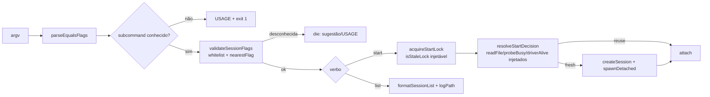

# Impl: OPS110-F1 — `agent:session`: flags desconhecidas fail-high, single-flight do `start` testado e polish de help/list

Status: aprovado
Atualizado em: 2026-09-15
Issue: #1026
Intenção: docs/plans/ops110-f1-agent-session-hardening.md
Appetite restante: herdado (~1 dia eng, 3 fases fill-in: F1 ~2–3h, F2 ~3–4h, F3 ~1h)

## Leitura da intenção

- **Outcome:** fechar os débitos do `/simplify` pós-OPS110 sem tocar o contrato de produto — (a) flag desconhecida em `agent:session` falha alto em vez de cair no default mudo de `cmdStart`; (b) o invariante "nunca dois runs no mesmo branch" ganha pin automatizado da decisão de reuso e do reclaim do lock; (c) USAGE do `start` e `logPath` no `list` humano ficam completos.
- **O que NÃO negociar:** contrato `list --json`/`sessionListPayload` (OPS109) intocado; `parseEqualsFlags` mantém a semântica silenciosa (família auto-unblock depende dela); lib `scripts/lib/agent-session.mjs` permanece PURA (I/O só por injeção); credencial só por env (D9) e fail-closed de bind inalterados; sem migration/UI/access.
- **O que reavaliar:** a hipótese de que "sugestão distância-1" basta — o aceite cita literalmente `--prupose`→`--purpose`, que é uma transposição; Levenshtein puro daria distância 2. Decisão de engenharia abaixo (Damerau × limiar).

## Abordagem recomendada

**Opções consideradas:** A) 3 fases curtas no mesmo lote sobre as superfícies já existentes (`scripts/lib/agent-session.mjs` + `scripts/agent-session.mjs` + `tests/unit/agentSession.unit.spec.ts`) | B) só F1 agora, deferir F2/F3 | C) reescrever o CLI em módulos por verbo e embutir tudo.

**Recomendação:** A — as três fases são cheap_polish na MESMA superfície já extraída na OPS110; F1 é a de maior risco (falha muda no caminho crítico), F2 pina o invariante mais caro de reverter (dois drivers no mesmo worktree) e F3 é cosmético. Toda a lógica nova nasce como função pura na lib (testável sem processo/HTTP) e a CLI fina só injeta I/O — exatamente o desenho atual.

**Rejeitadas:** B — deixaria sem pin o único invariante de segurança de processo do item e a falha muda (F1) sozinha não fecha o outcome; C — o CLI fino é intencional na OPS110 e o refactor não remove volatilidade, só adiciona cerimônia ([decision-quality.md] "Fronteira de módulo em volatilidade real" / "Pass-through raso").

### Decisões de engenharia (caras de reverter → com rejeitadas)

- **Onde validar flags (F1).**
  Opções: A) validador puro novo em `scripts/lib/agent-session.mjs` (`SESSION_FLAG_WHITELIST` + `validateSessionFlags`), chamado pela CLI logo após resolver o verbo | B) endurecer `parseEqualsFlags` para rejeitar desconhecidas | C) rejeitar dentro de cada `cmd*`.
  Recomendação: A — mantém a lib testável sem argv real e não muda o parser compartilhado; a CLI já é a dona do `die`/USAGE.
  Rejeitadas: B porque `parseEqualsFlags` é contrato silencioso de 5–7 scripts (B5/Pass3) e a intenção proíbe mudar a semântica; C porque espalha a whitelist por verbo e duplica o dispatch.
- **Forma da sugestão (F1).**
  Opções: A) distância de edição com transposição (Damerau) e limiar ≤1 (`nearestAcceptedFlag`) | B) Levenshtein puro com limiar ≤2 | C) sem sugestão.
  Recomendação: A — cobre `--prupose` (transposição = 1) mantendo limiar estrito; menos falso-positivo que ≤2.
  Rejeitadas: B porque limiar 2 sugere em substituições duplas legítimas (ruído acionável falso); C porque o aceite exige mensagem acionável.
- **Seam do single-flight (F2).**
  Opções: A) extrair `resolveStartDecision` (async, puro) + `isStaleLock` (puro) com `readFile`/`probeBusy`/`driverAlive`/`forceNew` injetados; CLI mantém `openSync`/`unlinkSync`/HTTP | B) mover fs/probe para a lib | C) testar via integração spawnando processos reais.
  Recomendação: A — pina a decisão sem violar a pureza da lib e sem flakiness de processo.
  Rejeitadas: B porque quebra o contrato "lib pura" (cabeçalho do módulo) e a fronteira CLI/servidor; C porque acopla a suíte ao SO/`/proc` e não isola a regra.
- **Sugestão no `list` humano (F3).**
  Opções: A) acrescentar `logPath` como última coluna em `formatSessionList` + header da CLI | B) coluna conforme/`logPath` só no `--json`.
  Recomendação: A — o dado já existe no estado (spread do payload) e o pedido é enxergá-lo no humano.
  Rejeitadas: B porque `--json` já o carrega; não fecha o outcome.

### Componentes / mudanças

- **`validateSessionFlags` / `SESSION_FLAG_WHITELIST` / `nearestAcceptedFlag`** (`scripts/lib/agent-session.mjs`): puros. Whitelist por verbo (nomes, valores irrelevantes): `serve`→{hostname,port}; `start`→{purpose,dir,model,issue,argument,new,hostname,port}; `attach`/`stop`→{session,branch,issue}; `list`→{json}. Retorna/`throw` mensagem acionável (`sugestão: --purpose` ou lista do USAGE). Reusa o padrão de whitelist manual fail-high já existente em `scripts/lib/imageFill.mjs:70-72`.
- **`resolveStartDecision` + `isStaleLock`** (`scripts/lib/agent-session.mjs`): `resolveStartDecision({ forceNew, statePath, readFile, serverUrl, probeBusy, driverAlive })` async puro → `{ action: 'reuse'|'fresh', state? }`; preserva a semântica atual de `readReusable` (`scripts/agent-session.mjs:480-494`): `--new`→fresh; estado ilegível→fresh (warn fica na CLI); `state.url !== serverUrl`→fresh; vivo se `driverAlive || busy`. `isStaleLock({ holderPid, isPidAlive })` puro encapsula o ramo de reclaim (`:420-435`).
- **`scripts/agent-session.mjs`**: USAGE do `start`/`serve` completado (F3); chamada de `validateSessionFlags` no dispatch (`:655-674`); `cmdStart` (`:458-549`) passa a delegar a decisão; `acquireStartLock` (`:400-442`) usa `isStaleLock`; header do `list` (`:640`) ganha `LOG` e o repasse de `logPath`.
- **`formatSessionList`** (`scripts/lib/agent-session.mjs:318-323`): acrescenta `row.logPath` como último campo; `sessionListPayload` (`:308-315`) e o contrato OPS109 NÃO são tocados. Header literal da CLI alinhado.
- **Migration:** sem migration.
- **Access / Consent:** N/A (não toca collections/PII).
- **UI:** N/A (texto de CLI; apenas strings pt-BR).

### Dados → forma (se aplicável)

- N/A — não há dados/KPI/mapa/série; a saída é texto de terminal e o contrato JSON versionado já existente não muda.

## Fases verificáveis

1. **F1 — Flags estritas (tracer, ~2–3h).** Adicionar whitelist + `nearestAcceptedFlag` + `validateSessionFlags` na lib; chamar no dispatch só para verbos conhecidos (desconhecido segue → USAGE, `:671-673`). Unit novo cobre: `--prupose=next`→sugere `--purpose`; `--foo` sem vizinho→mensagem com USAGE; booleanos `--json`/`--new` aceitos; `serve --purpose=x` rejeitado; verbo desconhecido continua USAGE+exit 1. `pnpm gate:fast`.
2. **F2 — Single-flight com seam testável (~3–4h).** Extrair `resolveStartDecision`/`isStaleLock`; `cmdStart` e `acquireStartLock` passam a injetar as dependências reais sem mudar comportamento. Unit cobre: estado vivo (driverAlive/busy)→reuse; URL divergente→fresh; estado ilegível→fresh; `--new`→fresh; lock com PID morto→reclaim; lock com PID vivo→`die`. Comentar no spec a lacuna que fica (corrida real entre processos) como não-escopo. `pnpm gate:fast`.
3. **F3 — Help/list (~1h).** USAGE do `start` com `--hostname/--port` e "`--model` obrigatório quando há skill"; `formatSessionList` + header com `logPath`. Atualizar spec de `:462-489`. `pnpm gate:fast`.
4. **Gates finais.** `pnpm gate:fast` verde (lint → typecheck → unit) e push do branch via `pnpm push`.

## Rabbit holes / Não escopo (engenharia)

- Refactor do CLI em módulos por verbo; a CLI fina é intencional (OPS110).
- Mudar `parseEqualsFlags`/aceitar `--flag valor` — contrato de outros scripts.
- Sugestão por Levenshtein sem limiar ou "fuzzy" amplo — ruído acionável.
- Mover fs/HTTP/`process.kill` para a lib (quebraria a pureza).
- Teste de integração spawnando dois `start` reais — flaky, depende de `/proc`/porta.
- Validar semanticamente valores de flag (e-mail de branch, range de issue) — fora.
- Unificar a fronteira dupla `purposeInvocation` (`scripts/lib/worktree.mjs` ∥ lib) — adiada com gatilho na intenção.
- Tocar `sessionListPayload`/contrato `list --json` ou o painel OPS109.

### Débitos do `/simplify` (triage OPS110-F1 — 0 registros)

- **Allowlist × texto do USAGE** (lib ⟥ CLI): duas fontes do mesmo conjunto; o spec pina a allowlist exata, o USAGE textual não. Não criar pin agora — **gatilho:** ao adicionar/remover flag, derivar/pinar o USAGE. (cheap_polish, defer)
- **`parseEqualsFlags` e `--`**: pré-existente no parser compartilhado de 5–7 scripts; fora de escopo (não mudar a semântica). (cheap_polish, descartado)
- **`osaDistance` O(n·m)**: tradeoff aceito — strings de flag curtas, caminho só de erro, sem dep de Levenshtein no `package.json`. (cheap_polish, descartado)
- **`isStaleLock` com 1 call site**: seam de teste deliberado (pina o reclaim sem processo real), não reuso perdido. (cheap_polish, descartado)

## Riscos e mitigação

- **Whitelist divergir do parser:** a whitelist valida NOMES, não a forma `=`; testes pinam booleanos `--json`/`--new` e o `--flag` sem valor. Nenhuma mudança em `parseEqualsFlags`.
- **Sugestão errada em `--prupose`:** Damerau com limiar ≤1 cobre a transposição exigida pelo aceite; casos sem vizinho caem no USAGE.
- **F2 alterar comportamento ao extrair:** testes espelham cada ramo atual de `readReusable` (URL, ilegível, busy, driver morto) e o reclaim do lock (PID morto/vivo/ilegível); `--new` curto-circuita.
- **Quebrar a pureza da lib:** revisor de import — proibido `node:fs`/`fetch`/`child_process` novos na lib; I/O só por parâmetro.
- **Regressão no `list`:** `formatSessionList` é consumido só pela CLI e pelo spec; payload OPS109 intocado (spread já traz `logPath`).
- **Corrida real de dois processos:** permanece fora do teste (lacuna documentada no spec) — o lock continua sendo o guard de produção.

## Aceite de engenharia

- [ ] Flag desconhecida em qualquer verbo falha com mensagem acionável (inclui `--prupose`→`--purpose`); verbo desconhecido segue USAGE+exit 1.
- [ ] `resolveStartDecision` + `isStaleLock` pinados em unit puro (reuse/fresh/`--new`/reclaim); corrida real documentada como lacuna.
- [ ] USAGE do `start` completo (`--hostname/--port`, `--model` obrigatório) e `list` humano exibindo `logPath`.
- [ ] Contrato `list --json`/`sessionListPayload` (OPS109) e `parseEqualsFlags` inalterados; lib mantida pura; identificadores em inglês, strings em pt-BR.
- [ ] `pnpm gate:fast` verde; sem migration/UI/access.
- [ ] Invariantes AGENTS/engineering-standards: nenhuma collection/PII/transação envolvida; nada reescrito como twin (edita-se o dono existente).

**Self-score decision-quality (gate ≥4):** decisões caras (onde validar, forma da sugestão, seam do lock, coluna do list) têm Opções A/B/C + Recomendação + Rejeitadas (1,0); cabe no appetite ~1 dia em 3 fases (1,0); rabbit holes nomeados (1,0); depth check reusa a lib/CLI e o padrão de whitelist existentes, sem twin (1,0); o aceite de produto da intenção permanece coberto e o contrato OPS110/OPS109 preservado (1,0) → **5,0/5**.
