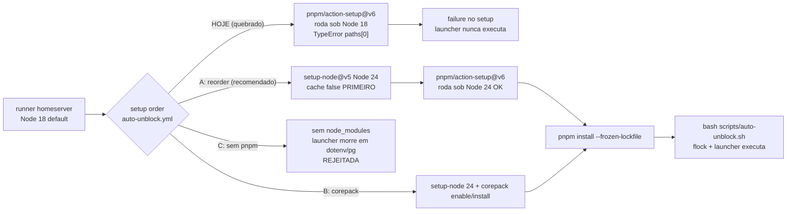

# Impl: OPS111 — Auto-unblock volta a despachar no homeserver (fix do setup pnpm/Node 18)

**Status:** Draft · **Atualizado em:** 2026-09-15 · **Issue:** #1035 · **Intenção:** `docs/plans/ops111-auto-unblock-homeserver-setup-node.md` · **Appetite restante:** ~0,5 dia eng (um outcome verificável, sem UI)

## Leitura da intenção

**Outcome (inviolável):** o launcher do auto-unblock (OPS106) volta a despachar no runner self-hosted do homeserver. Sair do `pnpm/action-setup@v6` quebrado sob Node 18 — reordenando `setup-node@v5` (Node 24) para antes, ou pinando/corepackando, o que for dono do concern. Sem auto-retry, sem aprovar produção sozinho.

**O que NÃO negociar:**

- Aceite: próximo `verify` vermelho de push em `main` gera run Auto-unblock `success` (nunca `failure` no setup) com token Issue auto-unblock ou comentário single-flight; launcher chega a executar e despacha no máximo um agente por run vermelho, mantendo single-flight OPS106.
- Nenhum auto-retry / auto-heal / auto-approve introduzido; guardrails OPS106 intactos (sem tocar prod/staging, sem segundo agente, gate só-`verify` de `deploy.yml` só push em `main`).
- `deploy.yml:101-134` intocado (D1 OPS106): job `verify` sem `name` (pinado, o reactor chaveia em `name==verify`), `pnpm/action-setup` antes de `setup-node` funciona no `ubuntu-latest` hosted — não é o bug, não mexer. `deploy.yml:207-284` (staging/production via `deploy-homeserver.sh` sem pnpm) fora de escopo.
- Literais do bug preservados como diagnóstico: step `pnpm/action-setup@v6` em `.github/workflows/auto-unblock.yml:57-64` rodando antes de `setup-node@v5` (node 24, cache false, `:65-69`); erro `Node.js v18.19.1` + `TypeError paths[0] undefined em @pnpm/exe/setup.js:64`; runs `34994058878`, `34987287001`, `34999635390` (+`34971560192`); `packageManager pnpm@10.11.0` (`package.json:199`); runner Node 18 vs alvo 24.

**O que reavaliar (barato, decide na execução):**

- P1 vs P2 — recomendação da intenção: P1 (launcher OPS106 morto = todo verify vermelho sem despacho; fix é reorder de 2 steps).
- Como provar aceite sem quebrar `main`: (A) aguardar próximo verify vermelho real como prova canônica; (B) disparo manual controlado só como smoke se seguro (sem despachar agente de verdade / sem tocar prod). Não forçar vermelho artificial em `main`.

## Abordagem recomendada

### Opções

**A — Só reordenar `setup-node` 24 para ANTES do `pnpm/action-setup`, mantendo `pnpm/action-setup`.**
Diff de ~4 linhas no `auto-unblock.yml`: `actions/setup-node@v5` (`node-version: 24`, `cache: false` / `package-manager-cache: false` — ver OPS23 abaixo) passa a ser o primeiro setup; `pnpm/action-setup@v6` (pinado ao `packageManager pnpm@10.11.0`) vem depois; `pnpm install --frozen-lockfile` permanece onde está. Nada muda no launcher.

**B — Remover `pnpm/action-setup` e usar corepack (`corepack enable` + `corepack install`/`prepare`) após `setup-node` 24, com `pnpm install` via corepack.**
Alinha com `Dockerfile:7` (`corepack enable` na base `node:24.19.0-alpine`) e `Dockerfile:28` + postmortem 2026-09-13 (`RUN corepack install` assa o pnpm no build). Remove uma Action de terceiros do path.

**C — Remover pnpm por completo no launcher (precedente dos 3 workflows sem pnpm).**
Seguir `issue-done-on-main-merge.yml:48-53`, `agent-pr-ready-automerge.yml:48-52`, `plan-issue-ready-on-main-merge.yml:56-61`: só `setup-node@v5` Node 24 cache false + `node scripts/*.mjs` stdlib, sem `pnpm install`. Avaliar contra a necessidade de `pnpm install --frozen-lockfile` antes do launcher (`auto-unblock.yml:65-69`).

### Recomendação: A, porque…

1. **É o dono do concern com o menor diff reversível.** A causa-raiz é ordem de execução, não o gerenciador: `pnpm/action-setup` morre porque herda o Node 18 default do runner do homeserver; sob Node 24 ele funciona (prova: o mesmo ordenamento "errado" funciona no `ubuntu-latest` do `verify`, cujo default já é novo). Reordenar fixa sem trocar de ferramenta.
2. **Preserva o contrato que o launcher exige.** `scripts/auto-unblock.mjs:149-162` valida `node_modules`/`dotenv,pg,.bin/payload` e falha fechado sem eles; o wrapper carrega `worktree.mjs`; checkout limpa `node_modules` — por isso `pnpm install --frozen-lockfile` é obrigatório antes do launcher. A mantém esse passo byte-idêntico; C o quebraria.
3. **Preserva os pins de teste.** `tests/unit/autoUnblockWorkflow.unit.spec.ts:51-53,55-70` exige `pnpm install --frozen-lockfile`, `deploy.yml` sem `unblock`/`workflow_run`, `verify` sem `name`. A só exige estender o pin com asserção de ordem (setup-node antes de pnpm/action-setup) em vez de reescrever o pin de forma. B exigiria trocar o pin de `pnpm/action-setup` para `corepack`, divergindo do padrão `deploy.yml` verify.
4. **Evita o histórico de flakes do corepack/setup-node-cache.** OPS23 (HISTORY:253): `setup-node` com cache default resolve `pnpm@10.11.0` via `packageManager` e falha; o fix foi `package-manager-cache: false`. Os 3 workflows-precedente carregam comentário explícito sobre isso. A reusa esse conhecimento (manter `cache: false` no `setup-node` movido); B reabre a superfície (corepack + rede para buscar `pnpm@10.11.0` no runner self-hosted, comportamento `corepack install` vs `prepare` — o próprio Dockerfile precisou de fix dedicado).
5. **Cabe no appetite com tracer imediato.** Reorder YAML → `actionlint`/parse YAML → unit pins verdes → PR. B e C pedem experimentação no runner real.

### Rejeitadas

- **B porque…** troca uma dependência que funciona sob Node 24 por outra com mais volatilidade no self-hosted (fetch de `pnpm@10.11.0` via rede a cada run, semântica `corepack enable/install` fora do Docker), diverge do padrão `deploy.yml` verify (que usa `pnpm/action-setup` e funciona), exige reescrita do pin de workflow, e não compra nada que o reorder não compre. Caro sem benefício; reavaliar só se A provar insuficiente no runner real (i.e., `pnpm/action-setup` falhar mesmo sob Node 24 — improvável pelos runs hosted).
- **C porque…** confunde precedente raso com módulo profundo. Os 3 workflows-precedente são stdlib-puros por construção (`node scripts/*.mjs` sem deps); o launcher do auto-unblock é profundo por construção (`auto-unblock.sh` + `flock -n /tmp/teqo-unblock.lock fd9` + `auto-unblock.mjs` com `--check` exigindo `node>=24` fail-closed + `worktree.mjs --headless` + `guard evaluateDatabaseTargets` + `auto-unblock-agent.mjs` detached com cap 4h). Remover o pnpm exigiria reescrever o launcher para stdlib-only — rabbit hole explícito da intenção ("editar owner, não duplicar"). Viola `auto-unblock.mjs:149-162` e o pin de `install`.

### Componentes/mudanças

Legenda: `~` editar · `=` intocado (pin/prova) · `+` adicionar asserção em teste existente (sem arquivo novo).

| Símbolo | Arquivo                                                                                                                 | Mudança                                                                                                                                                                                                                                                                                                                                                                                                     |
| ------- | ----------------------------------------------------------------------------------------------------------------------- | ----------------------------------------------------------------------------------------------------------------------------------------------------------------------------------------------------------------------------------------------------------------------------------------------------------------------------------------------------------------------------------------------------------- |
| `~`     | `.github/workflows/auto-unblock.yml:57-69`                                                                              | Mover `actions/setup-node@v5` (`node-version: 24`, `cache: false` / `package-manager-cache: false` conforme chave vigente no repo) para **antes** de `pnpm/action-setup@v6`; manter `pnpm install --frozen-lockfile` logo após. Adicionar comentário curto de 1–2 linhas (motivo: runner homeserver default Node 18 mata `pnpm/action-setup`; ver runs 34994058878/34987287001/34999635390; não reordenar). |
| `+`     | `tests/unit/autoUnblockWorkflow.unit.spec.ts`                                                                           | Estender pin existente: asserir ordem `setup-node@v5 (24)` < `pnpm/action-setup` < `pnpm install --frozen-lockfile` no job do launcher; manter asserções de `deploy.yml` sem `unblock`/`workflow_run` e `verify` sem `name`. Atualizar pin **se e só se** a forma mudar (A mantém a forma — só adiciona ordem).                                                                                             |
| `=`     | `.github/workflows/deploy.yml:101-134,207-284`                                                                          | Intocado (D1 OPS106).                                                                                                                                                                                                                                                                                                                                                                                       |
| `=`     | `scripts/auto-unblock.sh`, `scripts/auto-unblock.mjs`, `scripts/lib/auto-unblock.mjs`, `scripts/auto-unblock-agent.mjs` | Intocados — single-flight (`flock -n`), `--check` `node>=24`, validação `node_modules`, `decideUnblock`/`classifyDeployFailure`/`evaluateDatabaseTargets` (pins em `autoUnblock.unit.spec.ts`) preservados.                                                                                                                                                                                                 |
| `=`     | `package.json:199`                                                                                                      | `packageManager pnpm@10.11.0` intocado.                                                                                                                                                                                                                                                                                                                                                                     |

**Migration:** sem migration (mudança só de CI YAML + pin unit; nenhum schema/coleção/global tocado).

**Access / Consent:** N/A (sem dados novos, sem PII nova, sem fluxo de consentimento; single-flight e guard `teqo_wt*` local inalterados).

**UI:** Impeccable **A** — sem UI (workflow + launcher headless; nada visual para avaliar).

### Dados → forma

N/A — nenhum dado novo, nenhuma forma nova. O único "dado" é a ordem dos steps no YAML, coberta pelo pin de workflow.

## Fases verificáveis

### Fase 1 — Tracer: reorder + pins verdes (tracer bullet cedo, ~1h)

1. Editar `auto-unblock.yml`: `setup-node@v5` primeiro (Node 24, cache false), depois `pnpm/action-setup@v6`, depois `pnpm install --frozen-lockfile`. Comentário de guarda anti-regressão.
2. Estender `autoUnblockWorkflow.unit.spec.ts` com asserção de ordem; rodar `pnpm vitest run tests/unit/autoUnblockWorkflow.unit.spec.ts tests/unit/autoUnblock.unit.spec.ts`.
3. Validar YAML (`actionlint` se disponível, senão parse + `node --check` nos scripts tocados indiretamente — nenhum script muda, só YAML).
4. Verificação Fase 1: diff mostra só reorder + comentário; unit pins verdes; `tsc --noEmit` limpo (nenhum `.ts` muda — deve passar por vacuidade).

### Fase 2 — UI

N/A (Impeccable A — sem UI, sem screenshot, sem snapshot).

### Fase 3 — Gates + push (`pnpm gate:fast`; push via `pnpm push`)

1. Rodar `pnpm gate:fast` (guards → lint → format → typecheck → knip → cycles → unit → int conforme escopo do gate) até verde. Escopo é YAML + 1 spec — nenhuma migração, nenhum e2e novo.
2. `pnpm push` para `origin` (remote GitHub; sem SSH no homeserver, sem tocar `~/stack/teqo-1313.env`).
3. Pós-merge (fora do PR, como observação — não como passo que quebra `main`): aguardar próximo `verify` vermelho real de push em `main` e conferir (a) run Auto-unblock `success` sem `failure` no setup, (b) token Issue auto-unblock ou comentário single-flight, (c) no máximo um agente despachado, (d) nenhum auto-retry/auto-approve. Smoke manual só se houver caminho seguro sem despachar agente real (questão B da intenção — decidir no momento, default: não forçar).

## Rabbit holes / Não escopo (engenharia)

- Reescrever o launcher para stdlib-only (opção C) — viola "editar owner, não duplicar"; rejeitado acima.
- Auto-retry / heal / re-dispatch do deploy junto (anti-goal OPS104) — fora de escopo da intenção.
- Auto-approve de produção, tocar `deploy.yml`, staging/production, pool, flakes do PR-CI — fora de escopo.
- Matriz de runners / migrar launcher para hosted / trocar Node alvo — só homeserver + Node 24.
- Migrar para corepack "de passagem" (opção B) — só se A falhar no runner real; não fazer preventivamente (DRY <3 call sites: um único workflow usa esse setup no self-hosted; sem camada nova).
- Layers sem volatilidade: nenhum wrapper novo em volta de `setup-node`/`pnpm/action-setup`; nenhuma Action composta própria para "setup pnpm" (1 call site não justifica).

## Riscos e mitigação

| Risco                                                                                                                       | Mitigação                                                                                                                                                                      |
| --------------------------------------------------------------------------------------------------------------------------- | ------------------------------------------------------------------------------------------------------------------------------------------------------------------------------ |
| Reorder não basta: `pnpm/action-setup` falha mesmo sob Node 24 no homeserver (diferença hosted vs self-hosted além do Node) | Tracer prova o contrário no próximo run real; fallback já deliberado é B (corepack) em follow-up, sem reabrir este plano; não implementar B preventivamente.                   |
| Regressão de ordem futura (alguém move `pnpm/action-setup` para cima de novo)                                               | Comentário no YAML + pin unit de ordem fail-closed (Fase 1).                                                                                                                   |
| `setup-node` com cache default reintroduz bug OPS23 (resolve `pnpm@10.11.0` via `packageManager` antes do `action-setup`)   | Manter `cache: false` / `package-manager-cache: false` no step movido, igual aos 3 workflows-precedente; pin pode asserir a flag.                                              |
| Quebra acidental de `deploy.yml` ou do reactor (`verify` sem `name`)                                                        | `deploy.yml` intocado + pins existentes (`sem unblock/workflow_run`, `verify` sem `name`) rodando no gate; diff do PR deve mostrar zero linha em `deploy.yml`.                 |
| Single-flight / gate só-verify / guard `teqo_wt*` regredidos por tabela                                                     | Nenhum script tocado; `autoUnblock.unit.spec.ts` (decideUnblock/classifyDeployFailure/evaluateDatabaseTargets) verde no gate como trava.                                       |
| Prova de aceite sem vermelho real (não há como forçar sem quebrar `main`)                                                   | Aceite de engenharia marca o que é verificável no PR (setup nunca falha por Node); prova canônica (run real) fica como observação pós-merge, conforme questão A/B da intenção. |

## Aceite de engenharia

- [ ] `setup-node@v5` (Node 24, cache false) roda **antes** de `pnpm/action-setup@v6` no job launcher de `auto-unblock.yml`; `pnpm install --frozen-lockfile` permanece antes do launcher.
- [ ] Pin `autoUnblockWorkflow.unit.spec.ts` estendido com ordem e verde; pins `autoUnblock.unit.spec.ts` (single-flight, gate só-verify, guard `teqo_wt*`) verdes e inalterados em comportamento.
- [ ] `deploy.yml` com zero diff no PR (verificar via `git diff --stat`).
- [ ] Nenhum auto-retry / auto-heal / auto-approve introduzido; nenhum arquivo em `scripts/auto-unblock*` alterado.
- [ ] `pnpm gate:fast` verde; push via `pnpm push`.
- [ ] Observação pós-merge (não bloqueia o PR): próximo `verify` vermelho real gera Auto-unblock `success` sem `failure` no setup, com token Issue ou comentário single-flight e no máximo um agente.

## Decision-quality self-score (gate ≥4/5)

| #   | Pergunta                                                                                                                                                      | Score |
| --- | ------------------------------------------------------------------------------------------------------------------------------------------------------------- | ----- |
| 1   | Deliberado só o caro de reverter (ordem vs troca de ferramenta vs reescrita do launcher)? Sim — A/B/C decidem o irreversível; resto virou Não escopo.         | 1     |
| 2   | Forma Opções A\|B\|C + Recomendação B-porque… / Rejeitadas A-porque… C-porque…? Sim — A recomendada com 5 motivos; B e C rejeitadas com motivo.               | 1     |
| 3   | Appetite ~0,5 dia respeitado com tracer bullet cedo? Sim — Fase 1 é reorder + pin (~1h); resto é gate + observação.                                           | 1     |
| 4   | Depth check (reusar módulo profundo, sem pass-through raso, encapsular uma vez)? Sim — launcher profundo intocado; sem Action composta nova para 1 call site. | 1     |
| 5   | Rabbit holes Teqo nomeados e fechados (layers sem volatilidade, DRY <3, anti-goals OPS104/OPS106)? Sim — lista explícita em Não escopo + Riscos.              | 1     |

**Total: 5/5 — passa o gate (≥4/5).**
