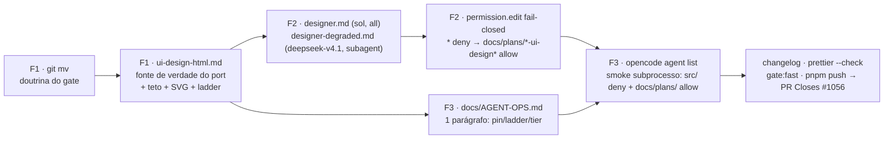

# Impl: OPS113 — Agentes `designer` e `designer-degraded`: design hi-fi como fonte de verdade

Status: aprovado (gate humano 2026-09-15, com ajuste de JS mínimo autorizado)
Atualizado em: 2026-09-15
Issue: #1056
Intenção: docs/plans/ops113-agentes-designer-e-designer-degraded.md
Appetite restante: ~0,5–1 dia (herdado; doc/config only — sem corte necessário)

## Leitura da intenção

- **Outcome:** `.opencode/agent/designer.md` (`mode: all`, `temperature: 0.7`, `model: openai/gpt-5.6-sol`) e `.opencode/agent/designer-degraded.md` (`mode: subagent`, `model: opencode-go/deepseek-v4.1-flash`) existem e são invocáveis, com os modos Criar/Criticar e sem escrita em `src/`; a doutrina viva é `.agents/skills/plan-issue/ui-design-html.md`; o artefato `docs/plans/<slug>-ui-design.html` (+ `docs/plans/<slug>-ui-design-assets/*.svg`) é a fonte de verdade do port; a ladder `openai/gpt-5.6-sol → openai/gpt-6-astra → opencode-go/deepseek-v4.1-flash (DEGRADED) → deepseek/deepseek-flash (DEGRADED, inline)` está documentada e auditável, com o tier registrado no PR — tier degradado nunca certifica.
- **O que NÃO negociar:** output só em `docs/plans/<slug>-ui-design.*` (o designer nunca escreve em `src/`); `DEGRADED` + sign-off humano no tier degradado (nunca certifica); teto protetivo da doutrina mantido, **com o ajuste autorizado no GATE em 2026-09-15** (JS mínimo de apresentação permitido — modal, tabs, toggle; sem lógica de negócio — ver decisão 6; estados como cenas estáticas seguem válidos; 390/1280; copy pt-BR real; sem imports de `src/`; sem decisão de engenharia; claims só os aprovados no plano; `NEEDS ASSET`; LGPD/TSE; um CTA primário); pins literais de modelo/modo/temperatura; pré-requisito operacional verificado antes do pin; quota/indisponibilidade desce a ladder explicitamente — nunca pula design em silêncio.
- **O que reavaliar:** (a) que o frontmatter de agente aceita `permission.edit` aninhado e que o merge com o global preserva o fail-closed — confirmado nas docs oficiais e a confirmar no `opencode agent list`/smoke; (b) que `docs/plans/*-ui-design*` casa o caminho que o edit tool envia — hipótese fundada no exemplo relativo das docs oficiais, **provada no smoke** (falso-deny é fail-closed: o smoke acusa e o padrão é corrigido antes do merge); (c) que os consumidores do nome antigo ficam intocados (OPS114) e o sufixo do painel é OPS116 — dívida declarada, não corrigida aqui.

## Estado atual verificado (explorador)

- Doutrina atual: `.agents/skills/plan-issue/ui-draft-html.md` (63 linhas), incluindo as seções "O teto", "Como fazer" e "Gate". Consumidores do nome antigo (intocados, OPS114): `.agents/skills/plan-issue/SKILL.md:42,100`, `intention-template.md:33,107`, `shaping.md:56`, `skills-map.md:42`. O sufixo irmão `-ui-draft.html` em `scripts/lib/issues-panel.mjs:91,100` é OPS116.
- `.opencode/agent/*.md` hoje usa só `description`/`mode`/`temperature` (ex.: `.opencode/agent/designer-campanha-solla.md:2-4`). Nenhum teste/guard no repo lê `.opencode/agent/*.md` — o único spec que lê `.opencode/` (`tests/unit/opencodeCommands.unit.spec.ts`) cobre `commands/*.md` e proíbe `model:` lá (OPS101); agentes fora.
- Precedente de frontmatter e visão nativa/fail-closed: `.opencode/agent/designer-campanha-solla.md:63-65` (visão nativa via Read; crítica visual estruturada com hierarquia/contraste/tipografia/espaçamento/mobile/acessibilidade + lista numerada; "a referência é o alvo — nunca a critique"; parada fail-closed se a leitura da imagem falhar).
- Formato de agente (schema oficial `https://opencode.ai/config.json` + docs `/docs/permissions`): frontmatter aceita `name, model, variant, description, mode, hidden, color, steps, options, permission, disable, temperature, top_p` (campo desconhecido cai em `options`); o corpo do arquivo **é** o prompt (sem `prompt:`); `mode`: `primary|subagent|all`. `permission.edit` é objeto `{ padrão: allow|ask|deny }` com avaliação **last-match-wins**; `edit` cobre `edit`, `write` e `patch`; padrões são wildcards simples (`*` casa qualquer caractere, inclusive `/`); o exemplo das docs usa paths relativos ao projeto. `--auto` nunca aprova `deny`.
- Precedente de `permission` por agente no repo: `opencode.json` (`agent.<nome>.permission` para MCP tools; global nega `penpot*`/`postgres*` e os subagentes específicos reabilitam). Config global: `~/.config/opencode/opencode.jsonc` (`disabled_providers` sem `openai`, só `permission.bash: ask`).
- Formatação: `.prettierignore` ignora `.agents/` (a doutrina renomeada fica fora do check) mas **não** `.opencode/` — os dois agentes novos precisam passar `pnpm exec prettier --check` (o precedente `designer-campanha-solla.md` passa com description longa numa linha; printWidth 100).
- Operação: `docs/AGENT-OPS.md` (148 linhas) — o parágrafo `**Skills:**` está em ≈L22 e a lista de bullets em L24-26; `## Comandos` em L37. Changelog: `docs/changelog/<data>-<id>.md`, linha única (ex.: `docs/changelog/2026-09-15-ops111.md`); o agregado é gitignored.
- CLI: opencode 1.18.31 tem `opencode agent list` (verificado: lista agentes e o ruleset de permissão resolvido) e `opencode run --agent <nome> --auto`. Config **não** é hot-reloaded — o smoke precisa de subprocesso novo (a sessão atual não enxerga agentes criados agora).
- `package.json` (verificado): `gate:fast` = `pnpm lint && pnpm typecheck && pnpm test:unit`; `push` = `node scripts/git-push.mjs` (ensure-deps + `gate:push` → `gate:ci`).
- **Pré-requisito operacional verificado em 2026-09-15:** `disabled_providers` global sem `openai` (religado); OAuth conectado; `opencode models | grep '^openai/'` lista 15 ids, incluindo `openai/gpt-5.6-sol` e `openai/gpt-6-astra`; `opencode-go/deepseek-v4.1-flash` e `deepseek/deepseek-flash` existem; smoke de visão (PNG sólido lido corretamente pelo Sol) OK. O preset canônico do orquestrador é `deepseek/deepseek-flash` (`scripts/lib/worktree.mjs:40`).

## Abordagem recomendada



**Opções consideradas:** A | B | C
**Recomendação:** A — rename da doutrina via `git mv` + reescrita elevando o contrato; dois arquivos de agente com pin literal e `permission.edit` fail-closed; ladder documentada na doutrina e resumida em `docs/AGENT-OPS.md`; prova por smoke em subprocesso. É doc/config puro (4 arquivos + changelog), cabe no appetite e não toca `src/`.
**Rejeitadas:** B — um único agente com troca de modelo para o tier degradado: não carrega a identidade `DEGRADED`/`mode: subagent` que a intenção fixou e confunde certificação com fallback (o `DEGRADED` precisa ser um agente distinto, invocável por `--agent`); C — regras duplicadas nos prompts sem elevar a doutrina: contraria o aceite "doutrina viva `ui-design-html.md`" e garante drift.

### Decisões de engenharia (com rejeitadas)

1. **Forma do gate de escrita dos agentes.**
   - Opções: A) `"src/**": "deny"` sozinho | B) fail-closed `{"*":"deny","docs/plans/*-ui-design*":"allow"}` (allowlist só do artefato: `<slug>-ui-design.html` + `-ui-design-assets/**`) | C) sem `permission`, só prompt.
   - Recomendação: **B** — o corte da intenção é "output só em `docs/plans/<slug>-ui-design.*`"; a allowlist codifica exatamente isso e nega todo o resto (`src/`, `scripts/`, `.github/`, `.agents/`, `.opencode/`, planos existentes inclusive o de intenção). Com last-match-wins e catch-all primeiro, o bloco exato no frontmatter dos dois agentes é:
     ```yaml
     permission:
       edit:
         '*': deny
         'docs/plans/*-ui-design*': allow
     ```
     Fatos que sustentam: `edit` cobre `edit`/`write`/`patch`; `*` casa `/`, logo `docs/plans/*-ui-design*` cobre também `docs/plans/<slug>-ui-design-assets/*.svg`; `--auto` não aprova `deny`, portanto o smoke prova stop duro. `read` permanece allow (a crítica lê app/screenshots) — o gate é de escrita. **Revisão pós-simplify:** o padrão foi estreitado de `docs/plans/*` para `docs/plans/*-ui-design*` — o catch-all largo permitiria sobrescrever o plano de intenção (imutável) e planos de outros itens.
   - Rejeitadas: A — deny-list deixa todos os outros caminhos graváveis e não implementa o corte; C — prompt não é gate: a violação vira silenciosa, contra o aceite "sem permissão de escrita em `src/`".
   - **Resíduo declarado:** `bash` não é sandbox — a `permission` cobre os file tools (`edit`/`write`/`patch`), não redirecionamento de shell. O prompt proíbe `src/` explicitamente; o fluxo é humano-supervisionado. O smoke prova o gate dos file tools, não prometemos sandbox de shell.
   - **Como o smoke prova:** subprocesso novo (`opencode run`, config não é hot-reloaded) pedindo (1) `write` em `docs/plans/ops113-ui-design-smoke.html` (deve passar) e (2) `write` em `src/ops113-smoke.txt` (deve ser negado, sem contornar por bash). O `designer` roda direto com `--agent designer`; o `designer-degraded` **não** roda como primário (`mode: subagent` — o CLI cai no default), então é lançado via task a partir de um run do `build`. Saída colada no PR; arquivos de smoke removidos antes do commit.

2. **Rename da doutrina.**
   - Opções: A) `git mv` + reescrita no mesmo lote | B) delete + create.
   - Recomendação: **A** — preserva histórico/blame (`git log --follow`), o diff aparece como rename + edição e o path novo já nasce como o que o OPS114 vai consumir. O rename vem **primeiro** (rename puro num commit, reescrita em seguida) para leitura limpa.
   - Rejeitadas: B — perde o histórico sem nenhum ganho; renomear com `git mv` é a convenção barata e auditável.

3. **Conteúdo dos agentes.**
   - Opções: A) prompt próprio enxuto que aponta para a doutrina (fonte única) | B) duplicar as regras da doutrina nos dois prompts.
   - Recomendação: **A** — a doutrina é a dona do contrato do artefato (teto, caminhos, SVG, ladder, modos); cada prompt carrega só a identidade do papel: persona em 1 parágrafo, "leia `.agents/skills/plan-issue/ui-design-html.md` antes de qualquer trabalho", modos **Criar** (produz/estende o hi-fi) e **Criticar** (relê a implementação renderizada contra o artefato aprovado), a proibição de escrever em `src/` (o gate duro é a `permission`), a visão nativa/fail-closed adaptada de `designer-campanha-solla.md:63-65` ("leia screenshots direto com a tool Read, nunca peça ao usuário para descrever o que você pode ver"; crítica estruturada com hierarquia/contraste/tipografia/espaçamento/mobile 390px/acessibilidade + lista numerada; "a referência é o alvo — nunca a critique"; "se a leitura da imagem falhar, pare e peça a troca via `/models`; nunca descreva o que não viu") e, no degradado, "todo output marcado `DEGRADED`; nunca certifica — sign-off humano".
   - Rejeitadas: B — duas cópias divergem (risco "Drift entre os dois prompts" da intenção); a doutrina é o único lugar onde o contrato muda.

4. **Ladder: registro do tier e o que é "inline".**
   - Opções: A) ladder na doutrina + tier registrado no PR (linha no body) + `DEGRADED` no artefato/output quando degradado | B) arquivos gêmeos (`designer-astra.md`, `designer-deepseek.md`) | C) registro informal (só no chat).
   - Recomendação: **A**. Ladder literal: `openai/gpt-5.6-sol → openai/gpt-6-astra → opencode-go/deepseek-v4.1-flash (DEGRADED) → deepseek/deepseek-flash (DEGRADED, inline)`.
     - Tier 1: pin do `designer`. Tier 2 (`openai/gpt-6-astra`, mesmo pool Plus): **mesmo agente**, troca via `/models` (ou `--model openai/gpt-6-astra` no headless) quando a crítica for contestada/pixel-critical; tier registrado também (pergunta B da intenção assumida — `designer-astra.md` **não** é criado).
     - Tier 3: `--agent designer-degraded` (`opencode-go/deepseek-v4.1-flash`), `DEGRADED`.
     - Tier 4 ("inline"): **sem arquivo de agente** — o orquestrador (`work-issue`/`agent-work-issue`, cujo modelo canônico de sessão é `deepseek/deepseek-flash`, `scripts/lib/worktree.mjs:40`) faz o design/crítica ele mesmo seguindo a doutrina, com **as mesmas obrigações** (`DEGRADED` + sign-off humano; nunca certifica). Um arquivo para o tier 4 seria twin do papel (drift sem ganho), já que é o próprio modelo da sessão.
     - Registro auditável: linha `Design tier: <slug>` (ou `Design tier: DEGRADED (<slug>)`) no body do PR; quando tier 3/4, `DEGRADED` visível no topo do artefato e no output do agente. Queda por quota/indisponibilidade/visão é explícita; se todos os tiers falharem, o design fica bloqueado (humano decide) — nunca "segue sem".
   - Rejeitadas: B — twin/drift e contraria a pergunta assumida; C — tier implícito é exatamente o anti-goal "pula design em silêncio".

5. **Parágrafo em `docs/AGENT-OPS.md`.**
   - Opções: A) sim, 1 parágrafo curto no fluxo (após o parágrafo `**Skills:**`, ≈L22, antes da lista de bullets em L24) | B) nova seção H2 antes de `## Comandos` | C) deixar só na doutrina.
   - Recomendação: **A** — o doc é o ponto de entrada da operação de agentes; 3–4 linhas cobrem pin, ladder, `DEGRADED`/sign-off e linkam a doutrina, sem inflar a página. Conteúdo sugerido: "**Design hi-fi (OPS113):** item que muda UI passa pelo agente `designer` (`model: openai/gpt-5.6-sol`; crítica contestada em `openai/gpt-6-astra`); a doutrina `.agents/skills/plan-issue/ui-design-html.md` é a fonte única do artefato `docs/plans/<slug>-ui-design.html` (+ `-ui-design-assets/*.svg`). Indisponibilidade desce a ladder — `opencode-go/deepseek-v4.1-flash` (`designer-degraded`) → `deepseek/deepseek-flash` (inline pelo orquestrador) — sempre gravando o tier no PR; tier degradado marca `DEGRADED`, não certifica e para em sign-off humano (triggers: OPS115)."
   - Rejeitadas: B — H2 nova para um contrato de 1 parágrafo adiciona cerimônia; C — enterra a ladder na skill, contra o risco nomeado na intenção.

6. **Teto de JS na doutrina (ajuste de produto autorizado no GATE em 2026-09-15).**
   - Opções: A) manter "zero JS de comportamento" (literal original da intenção) | B) JS mínimo de apresentação: modal abrir/fechar, tabs, dropdown/accordion, toggle, hover/scroll reveal — sem lógica de negócio | C) protótipo funcional (fetch, validação, estado de produto).
   - Recomendação: **B** — decisão do humano no GATE: as cenas podem implementar a interação de apresentação (abrir/fechar modal, trocar de tab), tornando o artefato mais fiel ao que será portado; C viola os anti-goals "não é protótipo funcional" / "não é implementação disfarçada".
   - Limites do teto com B: JS inline e autocontido (sem build, sem imports além do Tailwind CDN, nada de `src/`); **proibido** fetch/rede, persistência, validação de dados, cálculo de produto e roteamento; estados críticos continuam demonstráveis como cenas estáticas (o gate não depende de clicar); copy pt-BR real e claims aprovados inalterados.
   - Rejeitadas: A — o humano pediu interação; zero JS tornaria o artefato menos fiel ao port; C — vira implementação e mata a função do gate.
   - Registro: o plano de intenção (Issue `in-progress`) é imutável — o ajuste fica registrado aqui, autorizado pelo humano no GATE.

### Componentes / mudanças

- **`.agents/skills/plan-issue/ui-design-html.md`** (renomeada de `ui-draft-html.md` via `git mv`; owner do contrato): eleva tokens reais/brand/shadcn como **esperados** e o HTML como fonte de verdade do port (implementador porta classe-a-classe; não descartável; imutável como registro e mutável durante o work-issue pelo designer, com mudança material voltando ao humano no PR); mantém o teto (JS restrito ao mínimo de apresentação conforme decisão 6; estados críticos como cenas estáticas; 390/1280; copy pt-BR real; sem imports de `src/`; sem decisão de engenharia; claims só os aprovados no plano; `NEEDS ASSET`; LGPD/TSE; um CTA primário); define modos Criar/Criticar, caminhos do artefato, regras de SVG (lucide/shadcn primeiro; custom só sem equivalente; grid 24px; `currentColor`; stroke lucide; salvar em `-ui-design-assets/`) e a seção da ladder.
- **`.opencode/agent/designer.md`** (novo): frontmatter `mode: all`, `temperature: 0.7`, `model: openai/gpt-5.6-sol`, `permission` fail-closed da decisão 1; corpo enxuto apontando a doutrina (decisão 3).
- **`.opencode/agent/designer-degraded.md`** (novo): frontmatter `mode: subagent`, `model: opencode-go/deepseek-v4.1-flash` (sem `temperature` — não fixada na intenção), mesma `permission`; corpo idem + `DEGRADED` obrigatório e "nunca certifica".
- **`docs/AGENT-OPS.md`**: 1 parágrafo no fluxo (decisão 5).
- **`docs/changelog/2026-09-15-ops113.md`** (novo): linha única no formato vigente, sem citar o nome antigo da doutrina (o grep da verificação precisa zerar nos arquivos da entrega).
- **Migration:** sem migration — docs/config puro. **Access/Consent:** N/A. **UI:** Impeccable A — sem UI de produto; nenhum arquivo em `src/` é tocado.

### Dados → forma (se aplicável)

- N/A — sem dados. O plano de intenção já declara "sem dados de produto" e os literais desta entrega são de configuração de agente/doutrina (modelos, modos, temperatura, caminhos), não de apresentação.

## Fases verificáveis

1. **F1 — Doutrina (rename + reescrita)** — quota ~35%.
   - `git mv .agents/skills/plan-issue/ui-draft-html.md .agents/skills/plan-issue/ui-design-html.md` (rename puro), depois reescrever o conteúdo: título/papel elevados, fonte de verdade do port, teto mantido item a item **com o ajuste do GATE (JS mínimo de apresentação — decisão 6)**, artefato + assets SVG, modos Criar/Criticar, ladder com os 4 slugs + `DEGRADED` + registro do tier + "nunca pula em silêncio", gate (abrir o HTML, iterar, confirmação explícita antes do register). **Não** editar consumidores do nome antigo (OPS114) nem o sufixo do painel (OPS116).
   - Prova: `git diff --stat -M` mostra o rename; leitura final da doutrina contra a checklist de teto/elevação.
2. **F2 — Agentes** — quota ~25%.
   - Criar `designer.md` e `designer-degraded.md` com os literais (frontmatter + permission) e prompts enxutos (doutrina como fonte única; visão nativa/fail-closed; `DEGRADED` no degradado).
   - Prova: `opencode agent list` em processo novo lista `designer (all)` e `designer-degraded (subagent)` e mostra o ruleset `* deny` → `docs/plans/*-ui-design* allow` resolvido.
3. **F3 — Operacional + verificação** — quota ~40%.
   - Parágrafo em `docs/AGENT-OPS.md`; smokes em subprocesso (deny/allow) com limpeza dos arquivos de smoke; grep do nome antigo; prettier; changelog; `pnpm gate:fast`; `pnpm push` → PR `Closes #1056` (base `main`) com `Design tier:` + evidência dos smokes no body.

## Verificação

- **Pré-requisito (antes do pin):** `opencode models | grep '^openai/'` lista `openai/gpt-5.6-sol` (e `openai/gpt-6-astra`); `opencode-go/deepseek-v4.1-flash` e `deepseek/deepseek-flash` existem — **verificado em 2026-09-15**. Se o id fixado não existir: parar e escalar o humano — nunca pinar adivinhação nem trocar de modelo em silêncio.
- `opencode agent list` (processo novo — config não é hot-reloaded) mostra os dois agentes com os modos corretos e o ruleset de escrita fail-closed.
- **Smoke de permissão (subprocesso, fresh):** grava `docs/plans/ops113-ui-design-smoke.html` (permitido) e tem `write` em `src/ops113-smoke.txt` negado (deny duro, não `ask`). O `designer` roda com `--agent designer`; o `designer-degraded` (subagente não é primário — o CLI cai no default) é lançado via task a partir de um run do `build`. Saída colada no PR; `rm` dos arquivos de smoke antes do commit — nada de artefato-lixo no diff.
- **Grep do nome antigo** (zero nos arquivos da entrega): `grep -rn "ui-draft-html" .agents/skills/plan-issue/ui-design-html.md .opencode/agent/designer.md .opencode/agent/designer-degraded.md docs/AGENT-OPS.md docs/changelog/2026-09-15-ops113.md` → vazio (o próprio `-impl.md` cita o nome antigo como registro do rename e por isso fica fora do grep). Consumidores restantes = dívida do OPS114; sufixo do painel = OPS116.
- `pnpm exec prettier --check` nos tocados (`.opencode/` e `docs/` não são ignorados): os dois agentes, `docs/AGENT-OPS.md`, `docs/changelog/2026-09-15-ops113.md` e este `-impl.md`. A doutrina está em `.agents/` (ignorada) — mantê-la formatada por consistência.
- `pnpm gate:fast` (lint + typecheck + unit) verde; `pnpm push` (ensure-deps + gate:ci) e PR `Closes #1056` com CI verde. Sem migration; sem mudança em `src/`.

## Rabbit holes / Não escopo (engenharia)

- **OPS114** (consumidores do nome antigo e rename de campo `Rascunho UI:` → `Design UI:`): `.agents/skills/plan-issue/SKILL.md`, `intention-template.md`, `shaping.md`, `skills-map.md` — não tocar.
- **OPS115** (triggers do designer no `work-issue`/`agent-work-issue`, mecanismo do fail-closed/auto-merge do PR degradado) — não tocar.
- **OPS116** (retrocompat do painel ao sufixo `-ui-design.html`; `scripts/lib/issues-panel.mjs` e `scripts/issues-tui.mjs`) — não tocar.
- `designer-astra.md` não é criado (pergunta B da intenção assumida: tier 2 por troca de modelo); nenhum arquivo extra para o tier 4 inline.
- **"Já que pode JS, faz o protótipo funcional."** Se alguém "só completar": fetch, persistência, validação de formulário, cálculo de produto, roteamento. **Corte neste item:** JS só de apresentação (modal/tab/toggle/accordion, sem rede e sem estado de produto) — decisão 6.
- Nada de UI de produto/`src/`; nada no MCP `penpot`; planos/changelog históricos imutáveis; `.opencode/commands/` intocado (a proibição de `model:` do OPS101 segue valendo lá); pool dormente; sem migration; **sem guard/teste novo lendo `.opencode/agent/*.md`** (fora de escopo explícito da intenção); não ressuscitar `design-vision` (OPS105) nem renderizador de PNG.

## Riscos e mitigação

- **Pinar id não exposto pelo OAuth.** Pré-requisito verificado em 2026-09-15; mitigação: revalidar no início da execução; se sumir, fail-closed — parar e escalar, sem troca silenciosa.
- **Certificação degradada por atalho.** `DEGRADED` obrigatório no artefato + output, linha `Design tier:` no PR, sign-off humano; os prompts dizem "nunca certifica".
- **Teto protetivo relaxado demais** (brand/tokens/JS viram implementação). A doutrina mantém o teto explícito (JS só de apresentação, sem lógica de negócio/rede/persistência — decisão 6) e a proibição de `src/`; a `permission` fail-closed é o stop duro.
- **Drift entre os dois prompts.** Doutrina como fonte única; prompts enxutos que apontam para ela (decisão 3).
- **Referências quebradas ao nome antigo entre F1 e OPS114.** Dívida declarada e aceita; o grep da verificação garante que esta entrega não adiciona novas.
- **Matching de caminho na `permission`.** Se o padrão não casar o que o edit tool envia, o efeito é **falso-deny** (fail-closed) e o smoke acusa — corrigir o padrão antes do merge.
- **`bash` fora do gate.** Resíduo declarado na decisão 1; proibição no prompt + supervisão humana; o smoke só promete o gate dos file tools.
- **Lixo de smoke no PR.** Limpeza explícita antes de `git status`/commit; diff final só com os arquivos da entrega.
- **Prettier vermelho em `.opencode/`.** Rodar `prettier --write` nos tocados; frontmatter com description longa passa como o precedente.
- **Sem hot reload.** Qualquer prova de agente é subprocesso novo (`opencode run`), nunca a sessão atual.

## Débitos da triagem pós-simplify (2026-09-15)

- **Já resolvido no simplify/critique (não reabrir):** S4 (prova dos smokes vai no body do PR); S6–S12 (commit `refactor(OPS113)`: prompts enxutos anti-drift, permission estreitada ao artefato, `description` citada, roteamento de visão, posição no AGENT-OPS, duplicações da doutrina/grep).
- **Registrado:** S1 — `bash` fora do gate de escrita dos agentes → **OPS117 (#1063)**, `depends OPS113`, plano `docs/plans/ops117-guard-bash-agentes-design.md` (nasce `blocked`; promove no merge com `Related #1063`).
- **Absorvido:** S3 — guardrail do plano OPS114 (`docs/plans/ops114-plan-issue-design-hifi-no-gate.md`) alinhado ao teto de JS do GATE 2026-09-15 (JS só de apresentação; anti-goal "não é protótipo funcional" segue).
- **Descartados:** S2 — o fail-closed do tier degradado (inclusive tier 4 inline) já é aceite/fase do OPS115 (#1058), não reabrir; S5 — `.agents/` fora do prettier é convenção pré-existente (`.prettierignore`). Défer com gatilho: nenhum.

## Aceite de engenharia

- [ ] Aceite de produto da intenção coberto: os dois agentes existem e são invocáveis com os literais pinados; doutrina viva `ui-design-html.md` como fonte de verdade; ladder documentada com tier registrado e `DEGRADED` sem certificação; pré-requisito verificado.
- [ ] Invariantes AGENTS/engineering-standards: sem tocar `src/`; sem migration (`push: false` irrelevante — nada de schema); dono editado (doutrina renomeada, sem twin); precedentes reusados (`designer-campanha-solla.md`, `agent.<nome>.permission` do `opencode.json`); identificadores de código em inglês e texto de prompt/admin em pt-BR.
- [ ] Testes de domínio (unit/int): N/A justificado — nenhum access/write path de app muda; a prova é o smoke de permissão (evidência no PR), e guard/teste novo lendo `.opencode/agent/*.md` está explicitamente fora de escopo.

---

Self-score decision-quality: 5/5 — (1) as 5 decisões caras têm opções e rejeitadas registradas (gate fail-closed, `git mv`, doutrina-fonte-única, ladder/tier, AGENT-OPS); (2) cabe no appetite herdado: 4 arquivos + changelog, sem código e sem `src/`; (3) rabbit holes nomeados (twin de agente, `src/`, consumidores OPS114/OPS116, sandbox de bash); (4) depth check: edita o dono da doutrina (rename, sem par), reusa o precedente de frontmatter/visão e o precedente de `permission` por agente — nenhum módulo, helper ou arquivo extra; (5) o aceite de produto da intenção permanece intacto — a engenharia só escolheu a forma (allowlist, prompts enxutos, onde o tier é registrado).
