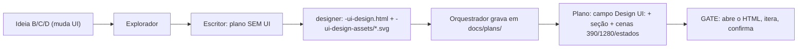

# Impl: OPS114 — plan-issue: design hi-fi obrigatório no gate (substitui o rascunho low-fi)

Status: rascunho
Atualizado em: 2026-09-16
Issue: #1057
Intenção: docs/plans/ops114-plan-issue-design-hifi-no-gate.md
Appetite restante: herdado — doc-only em `.agents/skills/plan-issue/**`, ~0,5 dia eng

## Leitura da intenção

- **Outcome:** para item que muda UI (B/C/D), o gate passa a exigir `docs/plans/<slug>-ui-design.html` + `docs/plans/<slug>-ui-design-assets/*.svg` produzidos pelo sub-agente `designer`; o escritor do plano não gera mais UI e nenhuma referência ao low-fi (`ui-draft-html.md`, `-ui-draft.html`, "Rascunho UI") sobra na superfície da skill.
- **O que NÃO negociar:**
  - Planos antigos e seus `-ui-draft.html`/PNGs ficam intactos (nenhum arquivo **existente** em `docs/plans/**` ou `docs/changelog/**` é editado, renomeado ou migrado).
  - O design hi-fi não carrega lógica de negócio e não nomeia componente final; a doutrina do gate continua fora de `docs/plans/`.
  - O painel/CLI e seus testes são OPS116 — **não** tocar aqui.
  - `.opencode/commands/plan-issue.md` só delega à skill — não muda.
- **O que reavaliar:**
  - **A varredura global "zero" da intenção é falsa como escrita.** Sobram hits de `-ui-draft` em `scripts/lib/issues-panel.mjs`, `scripts/issues-tui.mjs` e `tests/unit/issuesPanel.unit.spec.ts` — donos OPS116. A prova honesta é dupla: (a) **zero** em `.agents/**`/`.opencode/**`; (b) globalmente, o conjunto de hits é **exatamente** o set OPS116 pinado (não "vazio"). O PR registra os dois resultados em vez de fingir sweep vazio.
  - **A verificação "nada sob `docs/plans/`" conflita com o contrato do `work-issue`.** A entrega commita o novo `ops114-…-impl.md` (este arquivo) e a entrada nova de changelog. O critério correto é: **nenhum arquivo antigo** de `docs/plans/**`/`docs/changelog/**` modificado; as únicas adições são `*-impl.md` e `docs/changelog/<data>-ops114.md`. O sweep do OPS114 não renomeia nem migra `-ui-draft.html`/PNGs — a prova de "planos antigos intactos" é o diff não conter nenhum caminho `-ui-draft`.
  - A hipótese "há `git mv` a fazer" está errada: o rename já foi entregue no OPS113 (commit `488d7af7`, "rename puro") e `ui-design-html.md` é o único arquivo de doutrina na pasta. Só faltam os ponteiros.
  - `ui-design-html.md:93` tem uma nota transitória ("`Rascunho UI:` hoje; `Design UI:` a partir do OPS114") — este item **é** o OPS114, então a nota deve ser finalizada para não virar stale.

## Abordagem recomendada

**Opções consideradas:** A | B | C

- **A)** Atualizar os ponteiros da skill no lugar (`.agents/skills/plan-issue/SKILL.md`, `intention-template.md`, `shaping.md`, `skills-map.md`) e finalizar a nota transitória em `ui-design-html.md:93`; painel/CLI/testes intocados.
- **B)** Reescrever a doutrina hi-fi e/ou migrar os planos antigos para o nome novo.
- **C)** Incluir painel/CLI/testes (retrocompat `-ui-design.html`) neste mesmo item.

**Recomendação:** **A** — o rename da doutrina já está em `main` (OPS113); o trabalho restante é reescrever ponteiros de documentação, doc-only, sem código de app e sem schema.

**Rejeitadas:** **B** — reescrever a doutrina está fora do escopo (o OPS113 a elevou) e migrar `docs/plans/**` viola o acervo imutável. **C** — quebra a separação OPS114/OPS116 e os testes unitários pinados em `tests/unit/issuesPanel.unit.spec.ts`.

### Componentes / mudanças

**`.agents/skills/plan-issue/SKILL.md`** — 6 pontos + coerência de frontmatter:

| Linha                  | Antes (atual)                                                                                                | Depois                                                                                                                                                                                                               |
| ---------------------- | ------------------------------------------------------------------------------------------------------------ | -------------------------------------------------------------------------------------------------------------------------------------------------------------------------------------------------------------------- |
| 3 (`description`)      | `...intention plans and UI drafts.`                                                                          | `...intention plans and hi-fi UI designs.` (coerência; não é exigência da varredura)                                                                                                                                 |
| 26 (regra dura 4)      | `**Rascunho UI (obrigatório se muda UI):** HTML+Tailwind commitado no repo. Classe A/sem UI → sem rascunho.` | `**Design UI (obrigatório se muda UI):** o sub-agente `designer`produz`docs/plans/<slug>-ui-design.html`+`docs/plans/<slug>-ui-design-assets/\*.svg`(doutrina:`ui-design-html.md`). Classe A/sem UI → sem design.`   |
| 42 (input do escritor) | `... + intention-template.md + shaping.md (+ ui-draft-html.md se UI)`                                        | `... + intention-template.md + shaping.md` — o escritor não recebe mais doutrina de UI                                                                                                                               |
| 60 (checklist item 5)  | `GATE: overview + rascunho UI (se muda UI) + decisão de dados`                                               | `GATE: overview + design UI (se muda UI) + decisão de dados`                                                                                                                                                         |
| 100 (Passo 3c)         | `- Se UI: ui-draft-html.md`                                                                                  | remover a linha (o escritor não gera UI); manter `- Se dados: data-presentation.md`                                                                                                                                  |
| 112 (Passo 3d item 4)  | `Se UI: cria docs/plans/<slug>-ui-draft.html (sub-agente ou inline)`                                         | `Se UI: dispatcha o sub-agente designer (paralelo, 1 por ideia UI) para produzir docs/plans/<slug>-ui-design.html + docs/plans/<slug>-ui-design-assets/*.svg; o orquestrador grava os arquivos retornados no disco.` |
| 119 (Passo 4 GATE)     | `Para cada item UI: aponte o link do .html fonte`                                                            | `Para cada item UI: aponte o link de docs/plans/<slug>-ui-design.html e confirme as cenas 390/1280 + estados críticos`                                                                                               |

**`.agents/skills/plan-issue/intention-template.md`**:

| Linha                        | Depois                                                                                                                                       |
| ---------------------------- | -------------------------------------------------------------------------------------------------------------------------------------------- |
| 15 (campo)                   | `Design UI: <N/A — sem UI \| docs/plans/<slug>-ui-design.html>`                                                                              |
| 32–33 (comentário do esboço) | citar `Design UI` e linkar `ui-design-html.md` (não `ui-draft-html.md`)                                                                      |
| 39 (seção)                   | `### Design UI (B/C/D)`                                                                                                                      |
| 41–45 (comentário + bullet)  | comentário aponta `docs/plans/<slug>-ui-design.html` (+ `-ui-design-assets/`); bullet `- Design UI (gate): docs/plans/<slug>-ui-design.html` |
| 98 (Referências)             | `- Design UI (gate): <link do .html + assets em <slug>-ui-design-assets/ \| N/A>` — remove "PNGs embutidos acima" (órfão)                    |
| 106 (nota A)                 | `Classe A: Impeccable: A — N/A; Design UI: N/A; omita esboço de fluxo.`                                                                      |
| 107 (nota B/C/D)             | `Classe B/C/D: design hi-fi obrigatório no gate ([ui-design-html.md](ui-design-html.md)); commite o .html + os assets no repo.`              |

**`.agents/skills/plan-issue/shaping.md:56`** (hoje link quebrado): `Se o item muda UI: design hi-fi no gate ([ui-design-html.md](ui-design-html.md)) antes de registrar — não conta como "engenharia no plano"; é validação visual da intenção.`

**`.agents/skills/plan-issue/skills-map.md:42`** (hoje link quebrado): `**Exceção de superfície:** o **design hi-fi do gate** — HTML+Tailwind commitado no repo ([ui-design-html.md](ui-design-html.md)) — é usado no plan-issue só quando o item muda UI. Não é implementação de /campanha nem substituto de Impeccable.`

**`.agents/skills/plan-issue/ui-design-html.md:93`** (finaliza a nota transitória): `Campo do cabeçalho do plano aponta o caminho do artefato (\`Design UI:\`) — ou \`N/A — sem UI\`.`

- **Migration:** sem migration (não toca schema/Payload).
- **Access / Consent:** N/A — nenhum caminho de escrita LGPD/access.
- **UI:** Impeccable **A — N/A** (muda doutrina de ferramenta de agentes, não UI de produto).

### Dados → forma (se aplicável)

N/A — mudança de doutrina de ferramenta de agentes; nenhuma superfície de dados.

## Decisões de engenharia

1. **Quem gera o artefato (Passo 3d).** Dispatch do sub-agente `designer` em paralelo por ideia UI; o **orquestrador grava** os arquivos retornados no disco (`docs/plans/<slug>-ui-design.html` + `-ui-design-assets/`). O `designer` já tem `permission.edit` restrita a `docs/plans/*-ui-design*`, então também pode gravar direto; o orquestrador é o escritor canônico para garantir o gate. **Rejeitada:** o escritor do plano gerar o HTML — é o comportamento velho que este item aposenta, e viola a permission do `designer`.
2. **Doutrina já renomeada no OPS113.** Não fazer `git mv`; só atualizar ponteiros + finalizar a nota transitória de `ui-design-html.md:93`. **Rejeitada:** reescrever a doutrina (fora do escopo; OPS113 elevou o conteúdo).
3. **PNG embutido.** Remover a exigência (`intention-template.md:98`); o renderizador `scripts/render-ui-draft.mjs` foi removido em 2026-08-21 — o fluxo é HTML-only e o humano abre o HTML. **Rejeitada:** reintroduzir PNG/rasterizador.
4. **Escopo do sweep.** Atualizar só `.agents/skills/plan-issue/**` + a nota em `ui-design-html.md`; painel/CLI/testes ficam para o OPS116. **Rejeitada:** tocar o painel agora — quebra a separação OPS114/OPS116 e os testes pinados. Consequência registrada: a varredura global **não** fica vazia; a prova é zero em `.agents/**`/`.opencode/**` e globalmente o set exato OPS116 (ver F3).
5. **Coerência de vocabulário.** Ajustar a `description` do frontmatter de `SKILL.md` ("UI drafts" → "hi-fi UI designs") para o inventário de skills não anunciar o artefato aposentado. **Rejeitada:** deixar como está — a varredura por `ui-draft`/`Rascunho UI` não pega "UI drafts", mas o descritor fica enganoso.

## Fases verificáveis

1. **F1 — `SKILL.md` (owner).** Aplicar os 6 pontos + `description`: regra dura 4 (l.26), input do escritor (l.42), checklist (l.60), Passo 3c (l.100, remove a linha de UI), Passo 3d (l.112, dispatch do `designer` + gravação), Passo 4/GATE (l.119, link `-ui-design.html` + cenas). Quota: metade do appetite.
2. **F2 — Template e vizinhos.** `intention-template.md` (campo/seção/paths/notas), `shaping.md:56`, `skills-map.md:42` e finalizar `ui-design-html.md:93`. Quota: a outra metade.
3. **F3 — Sweep + prova.**
   - `rg -n "ui-draft|Rascunho UI|rascunho UI" .agents .opencode` → **vazio**.
   - `rg -n "ui-draft|Rascunho UI|rascunho UI"` fora de `docs/plans/**`, `docs/changelog*/**`, `docs/CHANGELOG-AGENTS-HISTORY.md`, `node_modules`, `.git` → conjunto **exatamente** `scripts/lib/issues-panel.mjs`, `scripts/issues-tui.mjs`, `tests/unit/issuesPanel.unit.spec.ts` (OPS116); qualquer hit fora disso é falha.
   - `git diff --name-only <base>...HEAD` → **nenhum arquivo antigo** de `docs/plans/`/`docs/changelog/`; as únicas adições são este `ops114-…-impl.md` e `docs/changelog/<data>-ops114.md`. Nenhum caminho `-ui-draft` no diff (planos antigos intactos).
   - `.opencode/commands/plan-issue.md` **ausente** do diff.
   - `pnpm format:check` verde (os markdown editados entram no check).
   - Leitura do `SKILL.md` final: escritor sem doutrina de UI; 3d dispatcha `designer`; gate exibe `-ui-design.html` + cenas.
   - Push via `pnpm push`.

## Rabbit holes / Não escopo (engenharia)

- **Migrar/renomear planos antigos** (`-ui-draft.html`, PNGs) — acervo imutável vira PR gigante; retrocompat fica no OPS116.
- **Tocar `scripts/lib/issues-panel.mjs`, `scripts/issues-tui.mjs`, `tests/unit/issuesPanel.unit.spec.ts`** — OPS116 (retrocompat do painel).
- **Alterar a doutrina `ui-design-html.md` além da l.93** — conteúdo elevado no OPS113.
- **Mexer em `docs/design-refs/`** — questão aberta de produto; aqui não é ação.
- **Gates de implementação** (`work-issue`/`agent-work-issue`) — continuam lendo o plano como está.
- **UI de produto / `/impeccable`** — fora de escopo.
- **Reintroduzir PNG/rasterizador** — renderizador removido em 2026-08-21.

## Riscos e mitigação

- **Doutrina ainda no nome antigo (OPS113 incompleto).** Fail-closed: verificado que `ui-design-html.md` existe (OPS113 mergeado); a F3 começa confirmando o arquivo antes de linkar. Se não existisse, o item estaria bloqueado pelo `depends`, não se adivinha path.
- **Referência oculta ao low-fi.** Mitigação: varredura dupla por nome (`ui-draft`) e por vocabulário (`Rascunho UI`/`rascunho UI`), com globs explícitos de exclusão.
- **Sweep vazar para arquivos imutáveis.** Mitigação: checar `git diff --name-only` contra `docs/plans/` e `docs/changelog/`; nenhum plano antigo modificado e nenhum novo `-ui-draft`.
- **Critério de aceite "zero fora de docs/plans" conflitar com o resíduo OPS116.** Mitigação: a prova em F3 é dupla e honesta (zero em `.agents/**`/`.opencode/**` + set exato OPS116 global), registrada no PR; nada de declarar sweep vazio.
- **Prettier vermelho nos markdown editados.** Mitigação: `pnpm format` antes do commit; `format:check` na verificação.
- **`description` do frontmatter fora do sweep.** Mitigação: mudança de coerência coberta pela leitura final do `SKILL.md`, não só pela varredura literal.

## Aceite de engenharia

- [ ] Aceite de produto da intenção ainda coberto (B/C/D exige `-ui-design.html` + `-ui-design-assets/*.svg` do `designer`; escritor não gera UI).
- [ ] Frontmatter `Design UI:` e seção `### Design UI (B/C/D)` no template; PNG embutido deixa de ser exigência.
- [ ] Zero `ui-draft`/`Rascunho UI`/`rascunho UI` em `.agents/**` e `.opencode/**`; globalmente só o set OPS116 pinado.
- [ ] `shaping.md:56` e `skills-map.md:42` com link corrigido para `ui-design-html.md`; nota transitória de `ui-design-html.md:93` finalizada.
- [ ] Invariantes AGENTS/engineering-standards: doc-only, sem migration, sem editar `docs/plans/**`/`docs/changelog/**` existentes, sem tocar painel/CLI/tests.
- [ ] `.opencode/commands/plan-issue.md` inalterado (confirmado por `git diff --name-only`).
- [ ] `pnpm format:check` verde; push via `pnpm push`.
