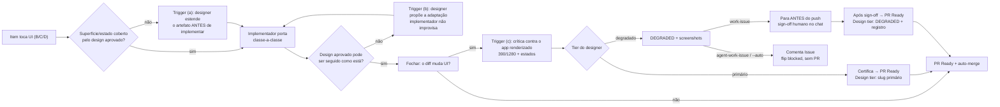

# Impl: OPS115 — work-issue/agent-work-issue: designer em qualquer toque de design + crítica visual fail-closed

Status: aprovado (gate humano 2026-09-16 — B+C doc-only confirmado)
Atualizado em: 2026-09-16
Issue: #1058
Intenção: docs/plans/ops115-work-issue-designer-em-qualquer-toque.md
Appetite restante: herdado (~0,5–1 dia eng; entrega doc-only)

## Leitura da intenção

- **Outcome:** qualquer toque de design nas duas skills de execução passa pelo agente `designer` (extensão do design hi-fi antes de implementar; adaptação quando o aprovado não pode ser seguido; ícones/ilustrações) e qualquer diff que muda UI só é certificado com crítica do `designer` contra o app renderizado (screenshots 390/1280 + estados); sem tier primário não há certificação — o item desce para `DEGRADED` e para em sign-off humano, nunca "segue sem".
- **O que NÃO negociar:** fail-closed do `DEGRADED` (não certifica sozinho); designer decide **estrutura visual**, o implementador porta markup/dados/rotas/queries/copy; non-triggers explícitos (default é não despachar); `/impeccable` e a doutrina `ui-design-html.md` referenciadas, nunca duplicadas; `model:` proibido nos commands (OPS101); pool dormente (OPS65); artefato `docs/plans/<slug>-ui-design.html` continua sendo de OPS113/OPS114.
- **O que reavaliar:** (1) a hipótese de que a mecânica de fechamento precisa de veto de plataforma (a intenção recomenda "A" no §Questões em aberto — ver decisão D1); (2) a hipótese de que os 4 triggers/ladder precisam ser literalmente copiados nas duas skills (a própria intenção nomeia o drift como risco e manda a mecânica viver no `execution-pipeline.md`); (3) `docs/AGENT-OPS.md:24` já cita a OPS115 — conferir que a referência não vira twin.

## Abordagem recomendada

**Opções consideradas:** A (PR Draft como veto estrutural) | B (parar antes do PR, doc-only, `work-issue`) | C (autônomo bloqueia sem PR)
**Recomendação:** **B + C, doc-only** — porque (1) cabe no appetite e na Verificação da intenção ("diff só de docs/skills/regras"); (2) não exige carve-out na regra always-on "nunca Draft" (`agent-pr-workflow.mdc`) nem mexe em `scripts/`/`tests/`; (3) reusa o gate que já existe em cada ator — no `work-issue` o humano **é** o gate (a skill é humano-supervisionada) e no autônomo o precedente já testado é comentar a Issue + flip `blocked` (`work-issue/SKILL.md:143`, `agent-work-issue/SKILL.md:71`); (4) `--auto` já para em "aprovação humana" — o `DEGRADED` entra na mesma lista de hard-stops, sem inventar um mecanismo novo.
**Rejeitadas:** **A** — exige `--draft` em `scripts/github-pr.mjs` + parâmetro `draft` em `createPullRequest` (`scripts/lib/github-api.mjs:457`) + specs, estourando o diff docs-only da Verificação e criando exceção permanente à regra always-on para um pool dormente; variante de A com prefixo de branch próprio (`designer/*`) exigiria branch nova (proibida) e novo veto em `github-pr-flow.mjs`; **desarmar auto-merge à la `testing-audit-disarm.mjs`** — é código/teste e o PR seguiria sem certificação de design (o humano ainda seria o gate, mesmo custo com mais superfície); **"segue e revisa depois"** — é o anti-goal que o item existe para matar.

### Componentes / mudanças

- **`execution-pipeline.md`** (`.agents/skills/work-issue/execution-pipeline.md`): dono da mecânica compartilhada. Nova seção `## Design (triggers, non-triggers, crítica final)` com os 4 triggers (a–d), os non-triggers, a regra `DEGRADED` e a **referência** à ladder de `ui-design-html.md` (sem repetir slugs por ator); item 2 de `## Executar` passa a apontar para ela; `## Fechar em main` ganha o passo de tier/certificação; `## Deltas por ator` deixa de repetir "shape → craft → critique → polish" nas duas linhas e passa a referenciar a seção de design, com o delta de cada ator.
- **`work-issue/SKILL.md`** (`.agents/skills/work-issue/SKILL.md`): sub-agente **Designer** na decomposição, por referência a `.opencode/agent/designer.md` / `.opencode/agent/designer-degraded.md` / `ui-design-html.md`; checklist com o passo de design no plan-time (3d), na execução (4) e no fechamento (7); Passo 4 aponta para a seção de design do pipeline; lista de hard-stops do `--auto` ganha a certificação visual `DEGRADED` **preservando os literais pinados** (`Consent/LGPD`, `migração de schema`, `URL público`, `produção`, `aprovado`, `nunca claima`, `blocked`); Passo 7 com o fechamento **B** (para antes do push quando `DEGRADED`).
- **`agent-work-issue/SKILL.md`** (`.agents/skills/agent-work-issue/SKILL.md`): Designer na lista de sub-agentes; checklist (plan-time e fechamento); Passo 3 aponta para o pipeline; Passo 6 com o fechamento **C** — `DEGRADED`/sem tier primário ⇒ **não** abre PR, comenta a Issue + flip `blocked` (precedente da divergência material).
- **`engineering-standards.mdc`** (`.agents/rules/engineering-standards.mdc`): linha nova vizinha de `:50` ("Edit the owner, don't twin") declarando que decisão de estrutura visual é do `designer` e o implementador só porta.
- **`engineering-brief.md`** (`.agents/skills/work-issue/engineering-brief.md`, tabela `:5-14`): linha opcional apontando o agente `designer` (acessório, não aceite).
- **`docs/AGENT-OPS.md:24`**: já declara ladder/`DEGRADED`/`Design tier:` e cita OPS115 — **não duplicar**; ajustar só se algum literal divergir.
- **Migration:** sem migration.
- **Access / Consent:** N/A (sem coleção, sem PII, sem write path).
- **UI:** Impeccable **A** — não há UI de produto; nenhum `shape → craft → critique → polish` de produto; o design aqui é o próprio fluxo de agente.

### Dados → forma (se aplicável)

N/A — processo de agente, sem superfície de dados de campanha.

## Decisões de engenharia (com rejeitadas)

**D1 — Mecanismo fail-closed do fechamento `DEGRADED` (a decisão central).**
Opções: A (PR Draft/`--draft` como veto estrutural) | B (parar antes do PR no `work-issue`, doc-only) | C (autônomo comenta Issue + `blocked`, sem PR).
Recomendação: **B + C** — porque honra a Verificação doc-only da intenção, mantém a regra always-on intacta, reusa precedente e hard-stop existentes e usa o gate que cada ator já tem (humano no `work-issue`; `blocked` no autônomo).
Rejeitadas: **A** — código em `scripts/` + carve-out da regra always-on + test novo, tudo fora do appetite/Verificação; **A-keyword variant** (declarar `DEGRADED` no body e confiar em heurística do safety net) — não existe veto por body e inferir por texto é frágil; **disarm script** — overkill; **branch prefix novo** — proibido. Gatilho de revisitação: **reabrir A** somente se o pool for reativado e a entrega autônoma de itens UI virar gargalo a ponto de "`blocked` sem PR" custar throughput — nesse caso a entrega que reabrir **é dona** do script + spec.

**D2 — Onde vivem os 4 triggers, non-triggers e a ladder.**
Opções: A (copiados nas duas skills) | B (mecânica no `execution-pipeline.md`; cada skill só o delta) | C (tudo em `ui-design-html.md`).
Recomendação: **B** — o pipeline é o dono já declarado da mecânica compartilhada e a própria intenção nomeia o drift como risco ("cada skill declara só o delta"); a ladder é **citada** de `ui-design-html.md:79-83` (fonte única do artefato/tier), sem reescrever slugs.
Rejeitadas: **A** — twin que a intenção proíbe (`:102`) e a rule `engineering-standards.mdc:50` condena; **C** — a doutrina de design não é o lugar das fases de execução do work-issue.

**D3 — Detecção do trigger (a) (superfície/estado novo).**
Opções: A (só no impl plan) | B (só na execução) | C (os dois — o plan antecipa, a execução não improvisa).
Recomendação: **C** — fecha o vão do "improviso no meio do código" sem transformar o plan num inventário exaustivo de UI.
Rejeitadas: **A** — deixa passar superfície que só aparece ao mexer no markup; **B** — o plan já conhece as superfícies (o gate aprovou o `ui-design.html`).

**D4 — Formato do sub-agente Designer nas duas skills.**
Opções: A (inline/transcrição das regras) | B (dispatch por referência).
Recomendação: **B** — cada skill declara só `Quando/Input/Task/Output` apontando `.opencode/agent/designer.md`, `.opencode/agent/designer-degraded.md` e `ui-design-html.md` (mesmo padrão já usado por `plan-issue/SKILL.md:56-58`); a mecânica de dispatch fica no pipeline (D2).
Rejeitadas: **A** — duplica doutrina/teto/ladder e drifta.

**D5 — Linha de ownership na rule.**
Opções: A (nova seção "Design") | B (bullet vizinho de "Edit the owner, don't twin").
Recomendação: **B** — a intenção pede exatamente "vizinha de `:50`"; uma seção nova para uma linha é cerimônia.
Rejeitadas: **A**.

**D6 — Pin de teste das novas literais (`DEGRADED`, triggers).**
Opções: A (spec unit novo em `tests/`) | B (nenhum; a asserção vira walkthrough/greps no PR).
Recomendação: **B** — mantém o diff em docs/skills/regras conforme a Verificação; o `skillsAutoFlag` já pina os hard-stops existentes e serve de guard contra regressão do `--auto`.
Rejeitadas: **A** — um spec para um fluxo sem código é o "teste de prosa" que o appetite não paga; revisitar se a skill drifar sem CI pegar.

## Fases verificáveis

1. **Ownership** — quota ~0,1 dia.
   - `.agents/rules/engineering-standards.mdc`: bullet após "Edit the owner, don't twin" (estrutura visual é do `designer`; o implementador porta).
   - Verificação: `grep -n "Visual structure belongs" .agents/rules/engineering-standards.mdc` retorna 1 linha na seção Module organization.
2. **Mecânica + deltas** — quota ~0,4 dia.
   - `execution-pipeline.md`: seção `## Design …` com triggers (a)–(d), non-triggers, `DEGRADED`, referência à ladder; `## Executar` item 2 e `## Deltas por ator` atualizados.
   - `work-issue/SKILL.md` e `agent-work-issue/SKILL.md`: sub-agente Designer + checklist + ponteiros.
   - `engineering-brief.md`: linha opcional na tabela.
   - Verificação: `grep -nE "\(a\) Superfície|\(b\) O design aprovado|\(c\) No fechamento|\(d\) Ícones" .agents/skills/work-issue/execution-pipeline.md` (4 hits) e `grep -nE "designer\.md|designer-degraded\.md|ui-design-html\.md" .agents/skills/work-issue/SKILL.md .agents/skills/agent-work-issue/SKILL.md` (≥1 em cada).
3. **Fail-closed** — quota ~0,2 dia.
   - `execution-pipeline.md`: passo de tier/certificação no `## Fechar em main` + delta por ator.
   - `work-issue/SKILL.md`: hard-stop `DEGRADED` no `--auto` + fechamento B no Passo 7.
   - `agent-work-issue/SKILL.md`: fechamento C no Passo 6.
   - Verificação: `grep -rn "DEGRADED" .agents/skills/work-issue/SKILL.md .agents/skills/agent-work-issue/SKILL.md .agents/skills/work-issue/execution-pipeline.md` (≥3 arquivos) e `grep -n "Design tier:" .agents/skills/work-issue/execution-pipeline.md`.
4. **Gates + walkthrough** — quota ~0,1 dia.
   - `pnpm gate:fast` verde; `pnpm exec vitest run --config vitest.unit.config.mts tests/unit/skillsAutoFlag.unit.spec.ts` verde (literais do `--auto` preservados); walkthrough estático no body do PR.

**Walkthrough estático (item UI fictício) — onde cada fluxo exige o designer.** Item hipotético "OPS999 — painel de cobertura de meta por município":

- **Plan-time (checklist 3d):** o impl plan identifica uma superfície de estado nova (empty/erro) fora do `ops999-ui-design.html` aprovado ⇒ **trigger (a)** ⇒ dispatch do `designer` **antes** de qualquer `src/`; se o frontier estiver sem quota, dispatch `designer-degraded` ⇒ artefato marcado `DEGRADED`.
- **Execução (Passo 4):** o implementador porta classe-a-classe; se o aprovado não pode ser seguido como está ⇒ **trigger (b)** ⇒ o `designer` propõe a adaptação (o implementador não improvisa estrutura visual); ícones/ilustrações ⇒ **trigger (d)**.
- **Fechamento (Passo 7):** o diff muda UI ⇒ **trigger (c)** ⇒ crítica do `designer` contra o app renderizado (screenshots 390/1280 + estados).
  - Tier primário certifica ⇒ PR Ready com `Design tier: openai/gpt-5.6-sol` e auto-merge normal.
  - `DEGRADED`/sem tier primário + `work-issue` (sem `--auto`) ⇒ **para antes do `pnpm push`**, apresenta crítica `DEGRADED` + screenshots, aguarda sign-off humano; só então abre o PR Ready com `Design tier: DEGRADED (opencode-go/deepseek-v4.1-flash)` + registro do sign-off no body.
  - `DEGRADED`/sem tier primário + `agent-work-issue` ou `work-issue --auto` ⇒ **sem PR**, comentário na Issue + flip `blocked`.
- **Non-trigger:** fiação de dados no markup aprovado, hooks/rotas/queries, copy, port mecânico, bug que restaura o aprovado, reuso de tokens ⇒ segue com o implementador, sem dispatch.

## Rabbit holes / Não escopo (engenharia)

- Mecanismo de veto de plataforma (flag `--draft`, branch prefix novo, disarm script) — D1, rejeitado por appetite/Verificação.
- Spec unit novo pinando prosa — D6, rejeitado; revisitar sob drift.
- Criar/ajustar o agente `designer` ou o formato do `.html` (OPS113/OPS114, já no repo).
- Reescrever a `/impeccable` ou criar segunda skill de crítica.
- Pinar `model:` nos commands; religar o pool supervisor (OPS65).
- Migrar/editar planos existentes; tocar `src/`, migration, schema, access ou UI de produto.
- Replicar ladder/`DEGRADED`/`Design tier:` em `AGENT-OPS.md` ou `ui-design-html.md` (já são donos).

## Riscos e mitigação

- **Quebrar os pins do `--auto`:** `tests/unit/skillsAutoFlag.unit.spec.ts` pina `Consent/LGPD`, `migração de schema`, `URL público`, `produção`, `aprovado`, `nunca claima`, `blocked`. Mitigação: adicionar o hard-stop de `DEGRADED` sem remover/reescrever esses literais; rodar o spec na fase 4.
- **Pulo silencioso do design (pior caso):** ladder explícita + `DEGRADED` + `Design tier:` no PR + default "superfície nova ⇒ despacha"; nunca inferir "não precisava".
- **`DEGRADED` fechar por auto-merge:** no `work-issue` **não há push** antes do sign-off; no autônomo **não há PR** (comentário + `blocked`) — logo o safety net nunca vê um PR `DEGRADED` sem humano.
- **Cerimônia em item não-visual:** non-triggers listados e default "não despachar"; o trigger (a) exige nomear a superfície nova.
- **Bloat/drift das skills:** mecânica no pipeline; skills só citam; ladder referenciada de `ui-design-html.md`.
- **Referência a agente inexistente:** confirmado `.opencode/agent/designer.md` (`mode: all`) e `designer-degraded.md` (`mode: subagent`) no repo; dispatch por nome, sem pin de modelo em command (OPS101).
- **Interação com `agent-work-issue` Cloud (`:81`, `:97`):** o delta C substitui "`ManagePullRequest` com `draft: false`" por "sem PR" quando não há certificação; registrar no texto para não deixar ambiguidade.

## Débitos da triagem pós-simplify (2026-09-16)

- **Já resolvido no simplify (não reabrir):** S1 (contradição `--auto`+`DEGRADED`), S2 (`AGENT-OPS.md` literal do autônomo), S3 (escopo do trigger (c) vs non-triggers), S4/Q7 (`§Ladder`), Q1/Q2 (grep da Verificação), Q3 (ponteiros de linha do plano), Q4 (checklist 3d), Q5 (`ManagePullRequest` incondicional), Q6 (parêntese do hard-stop).
- **Descartados:** S5 — a posição do bullet de ownership é a pedida pela intenção (D5) e o conteúdo é ownership; Q8 — a redundância "sem tier primário não certifica" nas 3 superfícies é o contrato do pipeline (cada skill declara só o delta).
- **Registrado/defer:** nenhum — sem `expensive_lock` score ≥4 pendente; o único de peso (S1) está no diff. Issue #1058 intocada.

## Aceite de engenharia

- [ ] Aceite de produto da intenção ainda coberto: triggers (a)–(d) e non-triggers presentes; ladder referenciada; `DEGRADED` + sign-off; `Design tier:` no PR; ownership na rule; `/impeccable` citada sem duplicação.
- [ ] Invariantes AGENTS/engineering-standards: "Edit the owner, don't twin" respeitado (mecânica no pipeline, deltas nas skills); sem `src/`, sem migration, sem access/Consent, sem UI de produto; `model:` não pinado.
- [ ] Testes de domínio previstos (unit/int): nenhum novo write path/access ⇒ sem novos specs; `tests/unit/skillsAutoFlag.unit.spec.ts` verde (pins do `--auto` preservados).
- [ ] `pnpm gate:fast` verde; diff só em `.agents/` (e docs, se o brief/AGENT-OPS exigirem).
- [ ] Walkthrough do item UI fictício no body do PR, incluindo a degradação simulada (`DEGRADED` → humano no `work-issue`; `blocked` no autônomo).

**Self-score decision-quality: 5/5** — (1) decisões caras (D1–D3) têm rejeitadas explícitas; (2) abordagem doc-only cabe no appetite e na Verificação; (3) rabbit holes nomeados; (4) depth check: reusa donos existentes (`execution-pipeline.md`, `engineering-standards.mdc`, precedente de `blocked` da divergência material no `agent-work-issue`, hard-stop do `--auto` no `work-issue`, agente `designer` e doutrina `ui-design-html.md`); (5) o outcome de produto da intenção permanece intacto — a engenharia só escolhe o mecanismo do fail-closed, sem reescrevê-lo.
