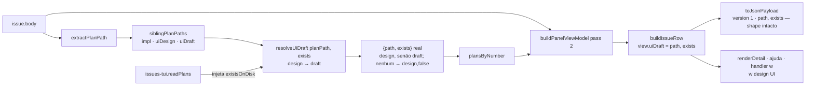

# Impl: OPS116 — Painel/TUI: aceitar `-ui-design.html` com retrocompat `-ui-draft.html`

Status: aprovado (gate humano 2026-09-16)
Atualizado em: 2026-09-16
Issue: #1059
Intenção: docs/plans/ops116-painel-ui-design-retrocompat.md
Appetite restante: herdado (~0,5 dia eng)

## Leitura da intenção

- **Outcome:** o painel (`pnpm issues:tui`, OPS109) reconhece o artefato de design dos planos nos dois nomes — prefere `<base>-ui-design.html`, cai para `<base>-ui-draft.html` (legado, imutável) — mostra/abre o **caminho real** encontrado com a tecla `w` e passa a falar "design UI"; o contrato `--json` segue `version: 1` com o shape `{ path, exists }` carregando o caminho real.
- **O que NÃO negociar:** read-only de ponta a ponta; HTML-only (sem render de PNG/imagem); o acervo legado em `docs/plans/` não é tocado (retrocompat é de leitura); a chave `uiDraft` **não** é renomeada e `version: 1` não sobe; a existência continua checada no **CLI** (a lib é pura e não toca disco); as três strings exatas do painel; sem migration.
- **O que reavaliar (hipóteses da intenção):**
  - "A lib deriva os dois candidatos e o CLI sonda" — confirmado, mas a passada base do `buildPanelViewModel` só expõe **um** caminho hoje (`row.uiDraft.path`); para o CLI sondar os dois sem quebrar a pureza, a ordem/precedência vira um **seletor puro com existência injetada** (`resolveUiDraft(planPath, exists)`), e é isso que torna "design vence" testável em unit (decisão 1).
  - "Os unit tests cobrem design-only/draft-only/ambos/nenhum" — a lib não podia testar isso enquanto o `existsSync` morasse no CLI; com o predicado injetado, os quatro casos ficam puros e determinísticos (decisão 1), mantendo a sondagem de disco no CLI.
  - "Basta estender `siblingPlanPaths`" — parcial: o nome dos dois irmãos mora nele (dono), mas a **precedência** (design > draft, e o default "nenhum → design") precisa de um dono único consumível; não é campo novo no view model (decisão 3).

## Abordagem recomendada

**Opções consideradas:** A) `siblingPlanPaths` devolve `{ impl, uiDesign, uiDraft }` + contexto `uiDraft` de `buildIssueRow` aceita `{path,exists}`, com o CLI sondando os dois candidatos derivados de `row.plan.intention.path` e codificando a ordem design→draft inline; B) helper puro dedicado de candidatos (`uiDraftCandidates(planPath)`) consumido pelo CLI, `siblingPlanPaths` intocado; C) **A acrescido de um seletor puro** `resolveUiDraft(planPath, exists)` como dono único da precedência, com a existência **injetada** pelo CLI.
**Recomendação:** **C** — a ordem preferencial (design > draft) é conhecimento de nomes e deve viver num dono só; injetar o predicado de existência preserva a pureza da lib **e** deixa a regra "design vence" testável em unit sem tocar disco; não adiciona nenhum campo ao view model/JSON nem duplica a derivação de nomes.
**Rejeitadas:**

- **A** — deixa a ordem design→draft hardcoded no CLI, então "design vence" só se verifica por smoke manual (o aceite pede unit para os 4 casos) e não há dono explícito da precedência; é o mesmo conhecimento em dois lugares na prática.
- **B** — parte o conhecimento: `uiDesign` num helper e `uiDraft` em `siblingPlanPaths`, dois donos para a mesma convenção; o helper vira pass-through raso que só agrega valor colado ao `siblingPlanPaths` (depth check: não criar).
- **D** (rejeitada na intenção) — novo campo `variant`, rename `uiDraft`→`uiDesign` ou `version: 2`: churn de contrato sem consumidor novo; o `--json` é superfície pública e o shape `{path, exists}` é o contrato.
- **E** — deixar a lib chamar `existsSync` dentro de `buildIssueRow`: quebra a pureza e a divisão lib-pura/CLI-I/O estabelecida no OPS109 (twin de I/O); a existência fica no CLI e entra na lib só como predicado.

### Decisões de engenharia

**1. Como os candidatos são expostos e como o `{path, exists}` real volta (tensão central).**
Opções: A) `siblingPlanPaths` ganha `uiDesign`; CLI deriva os dois de `row.plan.intention.path` e codifica a ordem; B) helper `uiDraftCandidates` dedicado; C) `siblingPlanPaths` ganha `uiDesign` **e** um `resolveUiDraft(planPath, exists = () => false)` puro encapsula ordem + fallback + default; CLI injeta `existsSync`.
Recomendação: **C.** O fluxo: `siblingPlanPaths` (dono dos nomes) → `resolveUiDraft` (dono da precedência) → `readPlans` no CLI chama `resolveUiDraft(row.plan.intention.path, isFileOnDisk)` e devolve `{ path, exists }` com o caminho **real** → `loadViewModel` coloca esse objeto no `plansByNumber` (`Map<number, { intention, impl, uiDraft: {path, exists} }>`) → a passada 2 do `buildPanelViewModel` passa adiante → `buildIssueRow` usa `context.uiDraft` quando presente e cai em `resolveUiDraft(planPath)` (design, `exists:false`) como default → `view.uiDraft = { path, exists }` (shape inalterado) → `toJsonPayload` mapeia só `{ path, exists }` (nenhum campo novo). `row.plan.intention.path` é equivalente ao `planPath` de `buildIssueRow` porque ambos saem do mesmo `extractPlanPath`/`siblingPlanPaths` (que já remove o sufixo `-impl`), então não há divergência mesmo quando o body linka o impl ou não linka plano.
Rejeitadas: A e B pelos motivos acima; expor a lista de candidatos no view model (novo campo interno, mesmo que removido do JSON) é rejeitado por não comprar nada além da re-derivação via o mesmo helper exportado — o seletor puro já é o dono.

**2. Caminho exibido quando nenhum arquivo existe.**
Opções: A) candidato novo (`<base>-ui-design.html`) com `exists: false`; B) manter o antigo (`<base>-ui-draft.html`).
Recomendação: **A** — ensina o nome vigente; o fallback real continua valendo quando o legado existir. É exatamente o default de `resolveUiDraft` (design + `false`). _(assumido na intenção — validar no gate; se o gate preferir B, muda só o retorno do `resolveUiDraft`, um ponto.)_

**3. Onde comentar que `uiDraft` agora significa "design UI (novo ou legado)".**
Recomendação: **comentário no owner, sem campo novo** — JSDoc em `siblingPlanPaths` (nomes), `resolveUiDraft` (chave histórica + precedência), `buildIssueRow` (contexto `uiDraft` = verdict de design) e `toJsonPayload` (contrato `{path, exists}`, `version: 1`), mais um comentário curto em `readPlans`. Rejeitado duplicar campo `variant`/subir `version` (decisão D).

**4. `readPlans` sonda design→draft e devolve o caminho real?**
Recomendação: **sim** — `resolveUiDraft` sonda na ordem design→draft via `isFileOnDisk = (p) => Boolean(p) && existsSync(resolve(process.cwd(), p))` e devolve `{ path: encontrado ?? design, exists: Boolean(encontrado) }`. O que entra no JSON é o caminho do arquivo que existe, não o template.

### Componentes / mudanças

- **`siblingPlanPaths`** (`scripts/lib/issues-panel.mjs:95`): passa a devolver `{ impl, uiDesign, uiDraft }`; mantém `impl`/`uiDraft` (retrocompat) e registra em JSDoc que `uiDraft` é a chave histórica do "design UI (novo ou legado)".
- **`resolveUiDraft`** (novo, `scripts/lib/issues-panel.mjs`): puro, `(planPath, exists = () => false) → { path, exists }`; dono da precedência design→draft e do default "nenhum → design, false". Reusa `siblingPlanPaths`; não toca disco.
- **`buildIssueRow`** (`:203`): contexto `uiDraft` aceita `{ path, exists }` (não mais boolean); default `resolveUiDraft(planPath)`; `view.uiDraft = { path, exists }` — shape idêntico ao atual.
- **`buildPanelViewModel`** (`:316`): o valor `uiDraft` de `plansByNumber` passa a ser `{ path, exists }` repassado direto (sem `Boolean(...)`); a JSDoc do input atualiza o tipo.
- **`toJsonPayload`** (`:359`): **inalterado no shape** (`uiDraft: { path: row.uiDraft.path, exists: row.uiDraft.exists }`, `version: 1`); só comentário no owner.
- **`readPlans`** (`scripts/issues-tui.mjs:104`): usa `resolveUiDraft(row.plan.intention.path, isFileOnDisk)`; devolve o `{path, exists}` real (o resto do corpo fica igual).
- **Strings** (`scripts/issues-tui.mjs:19,339,340,359,637`): `w design UI` (ajuda e rodapé) · `w abrir design UI no browser · <path>` (linha de ação) · `w design UI: não tem (classe A)` (handler e estado ausente).
- **Testes** (`tests/unit/issuesPanel.unit.spec.ts`, `tests/unit/issuesPanelRegression.unit.spec.ts`): atualizados para o novo shape e para os 4 casos de `resolveUiDraft`.
- **Changelog:** `docs/changelog/2026-09-16-ops116.md` (uma entrada curta, convenção do repo).
- **Migration:** sem migration (nenhum schema).
- **Access / Consent:** N/A — tooling de terminal, sem DB/PII/Consent.
- **UI:** N/A — classe A; tooling de terminal, sem UI de produto; não há ciclo shape→craft→critique→polish.

### Dados → forma (se aplicável)

N/A — ferramenta de operação; não apresenta dado de produto. A "forma" aqui é o view model/JSON, já coberto acima.

## Fases verificáveis

1. **Camada pura + unit tests (quota ~50% ≈ 0,25 dia)** — `siblingPlanPaths` com `uiDesign`; `resolveUiDraft` puro; `buildIssueRow`/`buildPanelViewModel` com o shape `{path, exists}`. Escrever primeiro os testes: `siblingPlanPaths`, e `resolveUiDraft` nos 4 casos (design-only → design; draft-only → draft; ambos → design vence; nenhum → design, `exists:false`) com predicado fake; ajustar `buildIssueRow`/`buildPanelViewModel`/`toJsonPayload`. Prova: `pnpm test:unit -- tests/unit/issuesPanel.unit.spec.ts tests/unit/issuesPanelRegression.unit.spec.ts`.
2. **CLI (quota ~35% ≈ 0,17 dia)** — `readPlans` via `resolveUiDraft` + `isFileOnDisk`; strings "design UI"; comentário no `readPlans`. Prova: smoke `pnpm issues:tui --json` (exige `GITHUB_TOKEN`) conferindo Issue legada → `exists:true` com caminho `<base>-ui-draft.html`, Issue com design → `<base>-ui-design.html`, e Issue sem nenhum → `<base>-ui-design.html`/`exists:false`; abrir `pnpm issues:tui` e conferir `w design UI` no detalhe.
3. **Fechamento (quota ~15% ≈ 0,08 dia)** — entrada `docs/changelog/2026-09-16-ops116.md`; `pnpm gate:fast`; `node scripts/check-test-locations.mjs`; revisão do aceite de engenharia; push via `pnpm push`.

## Rabbit holes / Não escopo (engenharia)

- **Renderizar HTML/imagem no painel** — vira viewer embutido; corta em abrir browser/imprimir caminho (como hoje).
- **Migrar/renomear os 30 `*-ui-draft.html` (e PNGs) de `docs/plans/`** — acervo legado imutável; retrocompat é de leitura.
- **Limpar o vocabulário no repo inteiro** (skill/template/docs) — dono é OPS114; o diff deste item é só o painel/testes/changelog.
- **Mexer em `E2E_AFFECTED_MANIFEST`/`HIGH_RISK_EXACT`/`ci-scope.mjs`** — o manifest mapeia só `src/` e o risco curado não inclui os scripts do painel; não há mapping a acrescentar e mexer nisso é fora do appetite.
- **`check:cycles`** — roda só em `src/`; irrelevante aqui.
- **Exportar `uiDraftCandidates`/helper sem consumidor** — `knip` trata `scripts/*.mjs` como entry com `exports:"error"`; export novo só entra se for usado (o CLI e/ou os specs usam `resolveUiDraft`; `siblingPlanPaths` já é usado).
- **Renomear a chave `uiDraft` ou subir `version`** — contrato público sem consumidor novo; rejeitado.
- **Tocar em claim/registro/sessões/schema/`push`** — fora do item.

## Riscos e mitigação

- **Regressão silenciosa do `--json`** — manter `version: 1` e o shape `{ path, exists }`; nenhum campo novo; o spec já faz `JSON.parse(JSON.stringify(payload))` e asserts de shape — estender para garantir que a linha carrega o caminho real do arquivo existente.
- **Teste que fixa o nome antigo** — os dois specs têm expectativas literais `-ui-draft.html`; atualizar junto (senão o gate fica vermelho).
- **Divergência entre o `planPath` do `buildIssueRow` e o de `readPlans`** — ambos derivam do mesmo `extractPlanPath`+`siblingPlanPaths` (que remove `-impl`); cobrir com regressão: body linkando o impl e body sem link.
- **Ambos os arquivos existem** — precedência design coberta pelo unit com predicado fake (`exists: () => true`) e confirmada no smoke.
- **Nenhum arquivo existe** — JSON expõe o candidato novo com `exists:false` (assumido — validar no gate; ponto único de mudança no `resolveUiDraft`).
- **Acervo legado** — só leitura; nenhuma escrita em `docs/plans/`.

## Débitos (triagem `/simplify`)

Dois revisores (estrutural + qualidade) rodaram no diff; nada alto/médio sobreviveu (a regressão do body linkando o `-impl.md` — risco declarado acima — foi adicionada, e o `?? null` redundante do `buildPanelViewModel` foi removido). Nenhum achado virou Issue nova. Defers com gatilho (reavaliar quando o gatilho aparecer):

- **`readPlans`/`resolveUiDraft` sem teste de I-O** — a sonda real de disco só é exercitada no smoke manual (`GITHUB_TOKEN`); o glue `readPlans`↔`resolveUiDraft` não tem unit. Gatilho: `readPlans` ganhar lógica própria ou surgir teste de int do CLI.
- **Default fail-silent `exists = () => false`** em `resolveUiDraft` — exigido pelo fallback puro do `buildIssueRow` (a lib não toca disco). Gatilho: novo caller fora da lib que possa omitir o predicado.
- **`buildIssueRow` não normaliza `uiDraft: boolean` legado** — nenhum caller passa boolean hoje. Gatilho: surgir consumidor externo com o shape antigo.

Descartados por baixo valor (documentados, sem consumidor runtime): dead code pré-existente do fallback `siblings.impl`, `uiDraft` sem consumidor de produção, `@typedef` do shape `{ path, exists }`, mudança de semântica do `uiDraft.path` sob `version: 1` (decisão travada da intenção), as normalizações de fronteira `Boolean(...)`/`?? null` (contrato `--json`), o `Boolean(path)` defensivo do CLI, o prefixo `w` da mensagem do handler (literal aprovado) e o pin de `uiDesign`/`uiDraft` a partir de `-impl.md` (coberto por `resolveUiDraft`).

## Aceite de engenharia

- [x] Aceite de produto da intenção ainda coberto: design-only aparece e abre; draft-only segue funcionando; ambos usa design; superfícies falam "design UI"; `--json` `version:1`/`{path, exists}` com o caminho real; sem PNG.
- [x] Invariantes AGENTS/engineering-standards: strings pt / identificadores em inglês; **edit the owner, don't twin** (estende `siblingPlanPaths`, adiciona `resolveUiDraft` no mesmo dono, ajusta `buildIssueRow`/`buildPanelViewModel`/`toJsonPayload`/`readPlans`; sem segundo caminho de derivação); lib pura não toca disco (existência injetada); sem dep nova; sem migration/`push`; sem PII/DB.
- [x] Testes de domínio previstos: unit (`// @vitest-environment node`, import direto do `.mjs`) para `siblingPlanPaths` (3 nomes), `resolveUiDraft` nos 4 casos, `buildIssueRow` com `{path,exists}` e default design, e regressão do shape do `toJsonPayload`; sem int test (sem access/write path).

## Autoscore de decision-quality

**Score: 4.5 / 5.**

| Critério                      | Nota | Justificativa                                                                                                                                                                     |
| ----------------------------- | ---- | --------------------------------------------------------------------------------------------------------------------------------------------------------------------------------- |
| Decisões caras com rejeitadas | 1.0  | A tensão central (como expor candidatos / fluir o `{path,exists}` / manter o JSON) tem Opções A–E, recomendação C e rejeitadas com porquê (pureza, dono único, contrato público). |
| Cabe no appetite              | 1.0  | ~0,5 dia, tooling puro + CLI fina; as fases somam ~0,5 dia sem inflar escopo.                                                                                                     |
| Rabbit holes nomeados         | 1.0  | Render de imagem, migração do acervo, rename global, ci-scope/e2e/cycles, export morto no knip.                                                                                   |
| Depth check de reuso          | 1.0  | Reusa `siblingPlanPaths`/`buildIssueRow`/`buildPanelViewModel`/`toJsonPayload`/`readPlans`; não cria módulo/collection/campo; existência injetada em vez de I/O na lib.           |
| Intenção permanece satisfeita | 0.5  | Engenharia não reescreve o outcome; perde meio ponto porque "nenhum → design" é uma assunção da intenção ainda a validar no gate (ponto único de reversão).                       |

**Total: 4.5/5** (≥4 — pronto para o gate humano do impl plan).
