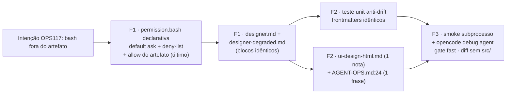

# Impl: OPS117 — Guard de escrita dos agentes de design além dos file tools (bash)

Status: entregue (2026-09-16)
Atualizado em: 2026-09-16
Issue: #1063
Intenção: docs/plans/ops117-guard-bash-agentes-design.md
Appetite restante: herdado (~0,5 dia eng; um outcome verificável)

## Leitura da intenção

- **Outcome:** a escrita em disco via bash pelos agentes `designer` e `designer-degraded` fora de `docs/plans/<slug>-ui-design*` falha fechado (negada); gravar o próprio artefato (`.html` + `-ui-design-assets/*.svg`) segue permitido; leitura (`cat`/`sed -n`) não é bloqueada; nada de sandbox de SO nem agente twin; nada em `src/`.
- **O que NÃO negociar:** output só no artefato; leitura livre; sem sandbox de SO; sem twin de agente; sem tocar `src/`/schema; o gate de file tools do OPS113 permanece.
- **O que reavaliar:** a hipótese da intenção ("`permission.bash` casa comando, não caminho — a regra por caminho pode não existir") **já foi resolvida pela evidência**: com redirecionamento o glob casa o `redirected_statement` inteiro, **incluindo o destino do redirect**, logo uma regra de artefato por caminho é viável (e `last-match-wins` permite o allow depois do deny). O risco "semântica por caminho não existir" está morto.

## Abordagem recomendada



**Opções consideradas:** A | B | C
**Recomendação:** A — `permission.bash` declarativa por agente: default `ask` + deny-list curada dos vetores de escrita + allow explícito do artefato por último. É config pura em 2 frontmatters já existentes (o `permission.edit` fail-closed do OPS113 fica intocado), cabe no appetite e tem evidência empírica de que o match por caminho no redirect funciona (`echo x > docs/plans/foo-ui-design.html` → allow; `echo x > src/a.txt` → deny, arquivo ausente).
**Rejeitadas:** B — plugin `.opencode/plugins/*.ts` (`tool.execute.before` + `throw`): o input do hook é `{tool, sessionID, callID}` e **não traz o agente** (`@opencode-ai/plugin@1.18.31`), escopar aos dois agentes exigiria cache frágil `sessionID→agent` via `chat.params`; infra nova versionada, lint/prettier em `.ts` e complexidade >> appetite; C — default-deny com allowlist no bash: bloquearia leitura (`cat`, `git diff`, `sed -n`), fora de escopo explícito da intenção.

### Decisões de engenharia (com rejeitadas)

1. **Forma do guard.**
   - Opções: A) declarativa `permission.bash` por agente | B) plugin com hook | C) default-deny + allowlist.
   - Recomendação: **A**. Bloco **idêntico** nos dois frontmatters, sob o `permission` existente:
     ```yaml
     permission:
       edit: # intocado (OPS113)
         '*': deny
         'docs/plans/*-ui-design*': allow
       bash:
         '*': ask
         '*>*': deny
         'sed *-i*': deny
         'tee *': deny
         'cp *': deny
         'mv *': deny
         'rm *': deny
         'mkdir *': deny
         'touch *': deny
         'truncate *': deny
         'dd *': deny
         'install *': deny
         'ln *': deny
         'chmod *': deny
         'chown *': deny
         'bash *': deny
         'sh *': deny
         'zsh *': deny
         'python*': deny
         'node *': deny
         'bun *': deny
         'deno *': deny
         'perl *': deny
         'ruby *': deny
         'find *-exec*': deny
         'find *-delete*': deny
         'xargs *': deny
         'git checkout*': deny
         'git restore*': deny
         'git apply*': deny
         '* > docs/plans/*-ui-design*': allow
         'prettier --write docs/plans/*-ui-design*': allow
     ```
   - **Curadoria (29 deny + 1 catch-all + 2 allow) em 5 classes**, cada linha justificada por um vetor concreto: (1) redirecionamento `*>*` cobre `>` e `>>`; (2) editores in-place `sed` (`sed *-i*` casa `-i` e `--in-place`); (3) mutadores de arquivo (`cp/mv/rm/mkdir/touch/truncate/dd/install/ln/chmod/chown/tee`); (4) interpretadores/shells que reabrem a escrita por dentro (`bash/sh/zsh/python/node/bun/deno/perl/ruby`, evidência `bash -c` e `python3 -c`); (5) destrutivos de git (`checkout/restore/apply`) e `find -exec/-delete`/`xargs`. **Fora da lista (permanecem `ask`, auto-aprovados em `--auto` e legíveis num run interativo):** leitura/inspeção (`cat`, `sed -n`, `ls`, `rg`, `git diff/status/log`), `<` (input), peers de pipeline (o parser checa cada comando). O `'*': ask` fica explícito (baseline do ruleset e merge com o global `bash: ask`; regras do agente vêm depois ⇒ agente vence).
   - Rejeitadas: B/C acima; e a tentação de deny-list exaustiva (infla manutenção para um risco de ferramenta de design — o resíduo é declarado, não esgotado).

2. **Teste unit anti-drift (barato, incluído).**
   - Opções: A) `tests/unit/opencodeAgents.unit.spec.ts` lê os dois `.md` e exige o bloco `bash` idêntico | B) sem teste (confiança no review).
   - Recomendação: **A** — o custo da divergência (um agente guardado, o outro vazando) é exatamente o anti-goal; o precedente `opencodeCommands.unit.spec.ts` já lê `.opencode/*.md` sem app/DB. Extrai o sub-bloco `bash:` do frontmatter por regex (sem dependência de YAML) e afirma: existe nos dois, é **idêntico**, contém `'*': ask`, `'*>*': deny` e o allow `* > docs/plans/*-ui-design*`; o bloco `edit` segue fail-closed (`'*': deny` + allow do artefato). Roda no `test:unit` do `gate:fast`.
   - Rejeitadas: B — drift silencioso entre dois arquivos gêmeos é o modo de falha mais provável e mais grave; o teste é a única prova contínua.

3. **Docs (toque mínimo, sem twinar).**
   - Opções: A) 1 nota em `ui-design-html.md` + 1 frase em `docs/AGENT-OPS.md:24` | B) só a doutrina | C) nova seção H2 no AGENT-OPS.
   - Recomendação: **A**. A doutrina é a dona do contrato do artefato ("o bash dos agentes é guardado; escrita fora do artefato é negada") e o parágrafo OPS113 do AGENT-OPS (entrada operacional) passa a dizer que a `permission` cobre **file tools + bash**. Uma frase em cada; nenhuma seção nova.
   - Rejeitadas: B — deixa o doc operacional mentindo (diz só file tools); C — cerimônia para uma frase.

### Componentes / mudanças

- **`.opencode/agent/designer.md`** / **`.opencode/agent/designer-degraded.md`**: adicionar o bloco `bash` da decisão 1 sob o `permission` (edit intocado); textos dos inegociáveis já citam "não tente contornar por shell" — sem reescrita.
- **`tests/unit/opencodeAgents.unit.spec.ts`** (novo): anti-drift dos dois frontmatters (decisão 2); sem app/DB (fs puro).
- **`.agents/skills/plan-issue/ui-design-html.md`** e **`docs/AGENT-OPS.md`**: 1 frase cada (decisão 3).
- **`docs/changelog/2026-09-16-ops117.md`** (novo): linha única no formato vigente.
- **Migration:** sem migration. **Access / Consent:** N/A. **UI:** Impeccable A — N/A sem UI de produto; nenhum arquivo em `src/` é tocado.

## Fases verificáveis

1. **F1 — Guard declarativo** (~40%): bloco `bash` idêntico nos dois agentes; `opencode debug agent designer` (subprocesso novo — config não é hot-reload) mostra o ruleset resolvido (`*>* deny`, artifact allow).
2. **F2 — Teste + docs** (~30%): `tests/unit/opencodeAgents.unit.spec.ts` verde; 1 frase em `ui-design-html.md` e em `AGENT-OPS.md:24`; changelog.
3. **F3 — Verificação** (~30%): smokes em subprocesso; `pnpm exec prettier --check` nos tocados; `pnpm gate:fast`; `git diff --stat` sem `src/`; `pnpm push` → PR `Closes #1063`.

## Rabbit holes / Não escopo (engenharia)

- Plugin/hook (decisão 1B), default-deny com allowlist (1C), sandbox de SO/container, bloquear leitura, agente twin, mexer no allowlist de file tools do OPS113, qualquer coisa em `src/`/schema/Consent.
- Exaustão da deny-list (vetores exóticos ficam no resíduo declarado) e ressuscitar `design-vision`/renderizador de PNG.
- Não tocar consumidores OPS114/OPS116 nem outros `.opencode/agent/*.md`.

## Riscos e mitigação

- **Resíduo honesto:** não é sandbox de SO; sob `--auto`, um vetor de escrita exótico fora da deny-list poderia passar. Mitigação: deny-list curada + proibição no prompt + supervisão humana; declarado no PR (não prometer mais que o entregue).
- **Falso-deny do artefato** (allow depois do deny, `last-match-wins`): o smoke prova `echo x > docs/plans/<slug>-ui-design.html` permitido; se falhar, corrigir o padrão antes do merge (fail-closed).
- **Drift entre os dois frontmatters:** teste anti-drift (decisão 2).
- **Merge com o global `bash: ask`:** regras do agente vêm depois ⇒ vencem; validado pelo `opencode debug agent`.
- **Prettier/eslint em `.ts` novo e em `.opencode/`:** rodar `prettier --write` nos tocados; `.opencode/` não é ignorado (`.prettierignore` ignora `.agents/`, não `.opencode/`).
- **Disponibilidade do modelo do designer no smoke** (`openai/gpt-5.6-sol`): se indisponível, rodar o smoke do tier degradado (via task) ou o harness isolado equivalente, registrando o tier no PR.
- **Lixo de smoke no diff:** limpar `docs/plans/ops117-ui-design-smoke.html` e `src/ops117-smoke.txt` antes do commit.

## Aceite de engenharia

- [x] Aceite de produto da intenção ainda coberto: escrita via bash fora de `docs/plans/*-ui-design*` negada nos dois agentes; artefato gravável; leitura não bloqueada; sem sandbox/twin/`src/`.
- [x] Invariantes AGENTS/engineering-standards: sem tocar `src/`/migrations; edita o dono (frontmatter/permission existentes, doutrina existente) sem twinar; identificadores em inglês, texto de prompt/admin em pt-BR.
- [x] Testes de domínio previstos: `tests/unit/opencodeAgents.unit.spec.ts` (anti-drift dos frontmatters) + smoke de permissão em subprocesso como evidência no PR; sem int (nenhum access/write path de app muda).

### Simplify (2026-09-16)

- `'sed -i*'` era subsumida por `'sed *-i*'` (`*` → `.*`) — removida nos dois agentes; smoke re-provou o deny de `sed -i` com a regra única.
- Teste anti-drift passou a pinar o ruleset COMPLETO (não só comparar os dois arquivos): erosão simultânea de uma regra nos dois agentes também falha o build.
- Copy de `docs/AGENT-OPS.md` e da doutrina precisada para "vetores de escrita enumerados" (o guard não é sandbox de SO; o baseline é `ask`).

### Triagem pós-simplify (2026-09-16)

- **Já resolvido no simplify (não reabrir):** linha em branco dupla no plano (prettier), teste anti-drift pinando o ruleset completo (erosão simultânea), `'sed -i*'` redundante removida, copy "vetores de escrita enumerados / não é sandbox", `bash` em backticks no AGENT-OPS.
- **Absorvido:** status do plano `em execução` → `entregue`, coerente com os aceites `[x]`.
- **Descartados:** `designer-campanha-solla.md` sem `permission` — é persona designer **e implementador** (constrói a página de campanha; precisa escrever, inclusive em `src/`), fora da família OPS113/117; um guard fail-closed o quebraria (não é débito). Resíduo do `--auto` sob vetor exótico fora da deny-list — limitação aceita e já declarada, não é sandbox de SO.
- **Défer com gatilho:** nenhum.

### Verificação executada (2026-09-16)

- `opencode debug agent designer` / `designer-degraded`: 33 regras `bash` idênticas (32 do agente + o `ask` global), `edit` fail-closed intacto.
- Smoke `opencode run --auto --agent designer`: `echo x > src/ops117-smoke.txt` → `pattern=*>* action=deny` (arquivo ausente); `echo ok > docs/plans/ops117-ui-design-smoke.html` → allow do artefato (arquivo criado); `sed -i` (`sed *-i*`)/`tee`/`printf >`/`bash -c`/`python3 -c` negados; `cat`/`ls` (leitura) não bloqueados. `designer-degraded` via task: mesmo deny. Artefatos de smoke removidos.
- `pnpm gate:fast` verde (lint + typecheck + 3383 unit).

---

Self-score decision-quality: 5/5 — (1) as decisões caras têm opções e rejeitadas (forma A/B/C, curadoria da deny-list, teste, docs); (2) cabe no appetite: 2 frontmatters + 1 spec + 2 frases de doc + changelog, sem código de app; (3) rabbit holes nomeados (plugin, allowlist default-deny, sandbox, exaustão da lista); (4) depth check: reusa o `permission`/precedente de frontmatter do OPS113 e o padrão de spec do `opencodeCommands`, sem criar módulo/helper/twin; (5) o outcome da intenção fica intacto — a engenharia só escolheu a forma declarativa e declarou o resíduo honestamente.
