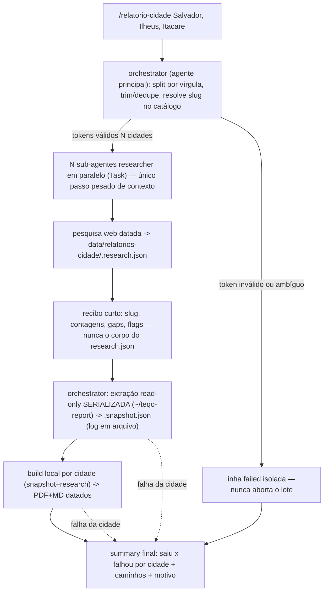

# Impl: OPS118 — relatorio-cidade: lote de municípios + sub-agentes por etapa

Status: executado
Atualizado em: 2026-09-16
Aprovado no gate em: 2026-09-16 (seguir com docs-guard; execução autorizada no gate)
Issue: #1065
Intenção: docs/plans/ops118-relatorio-cidade-lote-municipios-sub-agentes.md
Appetite restante: herdado — ~1 dia eng. Cortes explícitos se estourar: (a) o teste docs-guard (`tests/unit/cityReportBatchSkill.unit.spec.ts`) cai e a prova fica só no tracer manual; (b) a corrida live N=1 é adiada para o primeiro uso real, mantendo o tracer local semeado.

## Leitura da intenção

- **Outcome:** uma invocação `/relatorio-cidade Salvador, Ilheus, Itacare` produz, por cidade, o par `docs/research/relatorios-cidade/<slug>-<YYYY-MM-DD>.pdf|.md` com o mesmo contrato do single-city; a pesquisa web (etapa cara de contexto) roda em **um sub-agente por cidade**; o orquestrador retém só um **recibo curto** por cidade; falha de uma cidade não cancela as outras (sucesso parcial explícito).
- **O que NÃO negociar:**
  - Guardrails da skill intactos: sem fonte não publica; empenho ≠ pagamento; leitura relativa; PII mínima; indício regional ≠ emenda da cidade; artefato gitignored.
  - Contrato de artefato inalterado: `<slug>.research.json`, `<slug>.snapshot.json`, `<slug>-<YYYY-MM-DD>.pdf|.md`; mismatch snapshot × research continua fail-closed (`scripts/build-city-report.mjs:94-98`).
  - Single-city (`/relatorio-cidade Feira de Santana`) sem regressão — é o caso N=1 do mesmo caminho.
  - Sem PDF/índice agregado; sem tocar conteúdo/seções/layout do relatório; sem escrita na base de produção; sem commit de artefato.
  - Nada de novo em `src/` (schema/migration/Consent/superfície de app): `opencode.json` não muda, sem command novo (precedente C163, `relatorio-cidade-viagem-impl.md:152-155`).
- **O que reavaliar (hipóteses da intenção confrontadas na execução):**
  - **Quem executa a extração/build.** A intenção já diz "fora do researcher"; a execução precisa decidir _quem_ os dispara sem trazer o log de ssh/Chromium para dentro do modelo. Resolvido em D2: o **orchestrator** dispara os comandos com saída **redirecionada para log em arquivo**, lendo só exit status + caminhos.
  - **"Salvador" é ambíguo no lote.** Salvador = 19 zonas (`salvador-ze-N`, `src/lib/municipalityCatalog.ts:84-97`); um token `Salvador` mapeia para 19 slugs. A regra de resolução precisa tratar ambiguidade como **falha isolada**, não expandir em silêncio (D1).
  - **Onde mora a regra de parse.** O resolver de nome já existe e é testado (`resolveMunicipalityName`, `src/lib/municipalityNameAliases.ts:53`; `isMunicipalitySlug`/catálogo, `municipalityCatalog.ts:126-133`); o único delta é _compor_ lista→slugs, que o agente executa. Decide-se docs-only + docs-guard (D1/D5), não um helper novo sem consumidor de app.
  - **Prova sem homeserver.** O caminho é documental; a prova determinística pode rodar **local e semeada** (o extrator aceita qualquer `DATABASE_URL` e já foi exercitado localmente no C163), evitando depender de ssh para o aceite.

## Abordagem recomendada

**Opções consideradas:** A (recomendada) orchestrator = **agente principal** pela SKILL.md, researcher = `.opencode/agent/relatorio-cidade.md` redefinido, extract/build determinísticos disparados pelo orchestrator com log em arquivo | B um subagente-orchestrator novo (`mode: all`) chamado por command | C collector + analyst como **dois** sub-agentes por cidade.

**Recomendação:** **A** — só o agente principal dispõe de Task para fan-out; a SKILL.md já é o contrato que ele carrega; e extract/build são comandos determinísticos que não precisam de um modelo com contexto — o que infla é a _saída_ (ssh/Chromium), resolvida por redirecionamento para `data/relatorios-cidade/logs/<slug>.log`, com só exit status + caminhos voltando ao contexto. Isso preserva o C163 (skill + subagente, sem command) e não cria superfície nova.

**Rejeitadas:**

- **B** porque um command/subagente-orchestrator é atalho redundante ao agente principal (o precedente C163 rejeitou o command por falta de consumidor) e um subagente `mode: all` extra adiciona um handoff sem ganho.
- **C** porque o analyst ingere o fact-set inteiro de qualquer forma; separar collector de analyst duplica o handoff (o `research.json` completo) e o ganho de contexto é marginal — só valeria se o fact-set de **uma** cidade ficasse gigante (gatilho de revisitação, ver Não escopo).

### Componentes / mudanças

- **`.agents/skills/relatorio-cidade/SKILL.md`** (editar, dono do contrato):
  - Nova seção **"Lote (várias cidades)"**: invocação literal `/relatorio-cidade Salvador, Ilheus, Itacare`; **vírgula** como separador; cada token sofre `trim`, vazio descartado, **dedupe preservando ordem**; token aceito como **slug canônico** (`isMunicipalitySlug`) **ou** nome (fold `resolveMunicipalityName` → `municipalityCatalogEntriesForCity`); **0 entradas = inválido**, **>1 entrada = ambíguo** (ex.: `Salvador` → `salvador-ze-N`); inválido/ambíguo vira **linha failed isolada**, nunca aborta o lote.
  - **"Pipeline (3 passos)" → fluxo por etapas**: (1) orchestrator parse/resolve; (2) researcher ×N em paralelo (`.opencode/agent/relatorio-cidade.md`); (3) extração read-only **serializada** (mesma receita de hoje, `~/teqo-report`, `CITY_REPORT_CONFIRM=1`, proxy `127.0.0.1:5433`), com `> data/relatorios-cidade/logs/<slug>.log 2>&1` e só o status no contexto; (4) build local por cidade (`scripts/build-city-report.mjs`), também com log em arquivo; (5) summary final. A receita **single-city permanece literal** como caso N=1.
  - Nova seção **"Recibo do researcher"** (contrato D3) e nota de que o researcher **não** roda ssh nem build.
  - `Quando usar` e `Referências` atualizados (impl OPS118).
- **`.opencode/agent/relatorio-cidade.md`** (editar): vira o **researcher/analyst por cidade** — confirma slug, faz a pesquisa web datada, escreve `<slug>.research.json`, devolve **apenas o recibo**. Remove os passos 3–4 (ssh/build) do papel; mantém os limites (nunca escreve na produção, nunca inventa fonte, não commita artefato). Frontmatter segue `description` + `mode: subagent` (`.opencode/agent/relatorio-cidade.md:1-4`).
- **`.opencode/commands/relatorio-cidade.md`** (novo, wrapper fino): a intenção usa a invocação literal `/relatorio-cidade <lista>` e o orquestrador precisa receber a lista por `$ARGUMENTS` — sem o command o `/` seria ficção (achado alto da revisão). Segue o padrão dos outros wrappers (carrega a skill pelo nome exato, aponta para `.agents/skills/relatorio-cidade/SKILL.md`, sem lógica, sem `model:`); `tests/unit/opencodeCommands.unit.spec.ts` passa a cobri-lo (lista de commands).
- **Sem** `opencode.json` novo, **sem** permissão nova, **sem** alias `pnpm`.
- **`scripts/extract-city-report-snapshot.mjs` e `scripts/build-city-report.mjs` intocados** — já são CLIs por cidade (`--flag=value`, `scripts/lib/cli.mjs:34-48`); o lote é um loop no orquestrador, não um script novo.
- **`docs/changelog/2026-09-16-ops118.md`** (novo, uma entrada).
- **Teste docs-guard:** `tests/unit/cityReportBatchSkill.unit.spec.ts` (novo) — lê os arquivos e pina os literais (ver D5). Padrão `tests/unit/skillsAutoFlag.unit.spec.ts`/`opencodeCommands.unit.spec.ts`.
- **Runbook (`docs/ops/teqo-1313-deploy.md` §C163) intocado:** a skill é canônica e a receita de extração não muda.

### Dados → forma

- **Entrada (forma):** string de argumento com N tokens separados por vírgula → lista de slugs canônicos deduplicada + lista de tokens inválidos/ambíguos. N=1 é o caso atual (inalterado).
- **Intermediários (inalterados):** `data/relatorios-cidade/<slug>.research.json` (researcher), `<slug>.snapshot.json` (extrator), `docs/research/relatorios-cidade/<slug>-<YYYY-MM-DD>.pdf|.md` (builder). Logs novos em `data/relatorios-cidade/logs/<slug>.log` (gitignored, mesma raiz já ignorada).
- **Recibo (forma):** JSON curto por cidade — ver D3 — o único dado de pesquisa que cruza para o orquestrador.
- **Sem forma nova de produto:** nenhum índice/PDF agregado; o "sumário" é a resposta do orquestrador (tabela saiu × falhou), não um artefato.

## Fases verificáveis

1. **F1 — Contrato de lote (`SKILL.md`).** Separador vírgula, trim/vazio/dedupe, aceita slug ou nome via catálogo + `resolveMunicipalityName`, single-city = N=1 literal, inválido/ambíguo = falha isolada. Prova: leitura + asserções do docs-guard; `pnpm format:check`.
2. **F2 — Decomposição.** `.opencode/agent/relatorio-cidade.md` redefinido para researcher (só `research.json` + recibo); "Pipeline" da skill reescrito por etapas com extração serializada e logs em arquivo; contrato do recibo. Prova: docs-guard (o researcher não **executa** as etapas extract/build — sem `--municipality=`/`--snapshot=`; o recibo tem os campos; a skill mantém o exemplo single-city) + `opencodeCommands` (o command aponta para a skill e passa `$ARGUMENTS`).
3. **F3 — Prova + gates.** (a) **tracer local semeado**: `pnpm db:seed:minimal` na worktree → extração local read-only de 2–3 cidades → `research.json` mínimo por cidade → build → **um par PDF+MD por cidade**; depois injetar **1 token inválido** e **1 cidade com falha** (research ausente/`municipalitySlug` trocado) e conferir **sucesso parcial** + o summary do orquestrador; (b) **corrida live N=1** por `/relatorio-cidade Feira de Santana` para provar não-regressão e o shape do recibo; (c) `pnpm gate:fast` (lint+typecheck+unit, inclui o docs-guard), `pnpm gate:push` (knip/cycles), `pnpm push`; PR `Closes #1065`. E2E/int não são tocados (sem `src/`); o classifier do CI decide o escopo.

## Rabbit holes / Não escopo (engenharia)

- **Não** criar PDF/índice/sumário agregado do lote (produto novo: agregação/ranking/mapa).
- **Não** dividir em N sub-agentes por etapa (collector+analyst); gatilho de revisitação: fact-set de uma cidade grande o bastante para estourar um agente.
- **Não** paralelizar a extração ssh (colisão no `~/teqo-report` compartilhado: `git fetch/checkout/pull` + `pnpm install`, `SKILL.md:60-80`); serializar é obrigatório.
- **Não** paralelizar build/Chromium em massa (estampida de recurso local) — build por cidade, sequencial.
- **Não** mudar conteúdo/seções/layout do relatório nem o contrato dos JSONs.
- **Não** escrever na base de produção, nem `db:pull`/snapshot de banco; extração read-only fail-closed.
- **Não** criar script batch-runner, alias `pnpm`, helper em `src/lib` sem consumidor de app (knip), nem módulo em `src/utilities` (pin `tests/unit/codebaseConventions.unit.spec.ts:27-70`); **não** mexer em `scripts/lib/cli.mjs` (skeleton pinado, `codebaseConventions.unit.spec.ts:327-354`).
- **Não** commitar artefato (PDF/MD/snapshot/research/logs; gitignored).
- **Não** mexer em `opencode.json`, criar command ou registrar permissão.
- **Não** editar o runbook §C163 (a skill é a fonte canônica).

## Riscos e mitigação

- **Colisão do checkout compartilhado (`~/teqo-report`).** Mitigação: extração **serializada** por cidade no orquestrador (fila única, ordem da lista); nunca `ssh` em paralelo.
- **Mismatch snapshot × research.** O guard do builder (`build-city-report.mjs:94-98`) segue fail-closed; a cidade falha isolada e entra no summary — nunca casar JSON à mão.
- **Regressão do single-city.** N=1 é o mesmo caminho com um token; exemplo literal preservado e coberto pela corrida live (F3b) e pelo docs-guard.
- **Contexto vazando para o orquestrador.** Recibo curto **por contrato** (D3) + logs de extract/build em arquivo; docs-guard verifica que o recibo não pede corpo de `research.json` e que o researcher não descreve ssh/build.
- **Resolver errado / slug inventado.** Tokens passam por `isMunicipalitySlug` ou pelo fold existente; 0 entradas = inválido, >1 = ambíguo → falha isolada (não inventa, não expande).
- **Paralelismo indisponível no harness.** Se não houver Task para fan-out, o lote degrada para execução sequencial (N≥1) sem mudar o contrato; latência maior, correção igual.
- **Custo/latência de N pesquisas.** Aceito: a intenção pede fan-out; a falha isolada impede que uma cidade lenta derrube o lote.
- **Ambiguidade de Salvador.** Documentada como caso de falha explícita com o slug correto sugerido (`salvador-ze-N`), sem silêncio.

## Aceite de engenharia

- [ ] Aceite de produto da intenção coberto: lote com vírgula → um par PDF+MD por cidade `<slug>-<YYYY-MM-DD>`; single-city preservado; falha isolada e sucesso parcial explícitos.
- [ ] Decomposição: pesquisa web roda em sub-agente por cidade (Task), isolada do orquestrador; o orquestrador retém só o recibo; extract/build fora do researcher e com log em arquivo.
- [ ] Guardrails intactos: sem fonte não publica; empenho ≠ pagamento; leitura relativa; PII mínima; indício regional ≠ emenda; artefato gitignored.
- [ ] Invariantes AGENTS/engineering-standards: sem collection/migration/Consent; sem superfície `src/`; sem command/`opencode.json`/alias; `scripts/lib/cli.mjs` e os dois CLIs intocados; produção read-only.
- [ ] Prova: tracer local (2–3 cidades + inválida + falha) com saídas por cidade e summary parcial; corrida live N=1; docs-guard verde.
- [ ] Gates: `pnpm format:check`, `pnpm gate:fast`, `pnpm gate:push`, `pnpm push`; CI verde com PR `Closes #1065`.
- [ ] Docs: `SKILL.md` + `.opencode/agent/relatorio-cidade.md` atualizados; changelog `docs/changelog/2026-09-16-ops118.md`.

## Decisões de engenharia

1. **Contrato de lote e resolução de slugs.**
   **Opções:** A docs-only — regra literal na `SKILL.md` (vírgula; trim/vazio/dedupe; slug ou nome via `isMunicipalitySlug`/`resolveMunicipalityName`+catálogo; N=1 = hoje; inválido/ambíguo = falha isolada), sem código novo | B helper puro novo (`src/lib/municipalityBatchInput.ts` ou `scripts/lib/…`) + unit test | C script batch-runner `scripts/city-report-batch.mjs`.
   **Recomendação:** **A** — o único consumidor é o agente (a lista vem de linguagem natural), o resolver já existe e é testado (`municipalityNameAliases.unit.spec.ts`, `municipalityCatalog.unit.spec.ts`) e o delta é só composição; mantém o shape C163 (skill+subagente, sem `src/`) e evita knip/`server-only`. A prova documental fica no docs-guard (D5).
   **Rejeitadas:** **B** porque export sem consumidor de app falha knip/convenções e duplica um fold já testado; **C** porque enterra a orquestração e a falha isolada em código e perde o summary legível, sem necessidade — os CLIs por cidade já existem.

2. **Split de papéis.**
   **Opções:** A orchestrator = agente principal (contrato na `SKILL.md`); researcher = `.opencode/agent/relatorio-cidade.md` (`mode: subagent`); extract/build disparados pelo orchestrator com log em arquivo | B subagente-orchestrator `mode: all` + command | C um runner subagent extra para extract/build.
   **Recomendação:** **A** — só o agente principal faz fan-out de Task; o researcher carrega o contexto pesado e devolve recibo; extract/build são determinísticos e só a _saída_ infla, resolvida por redirecionamento `> logs/<slug>.log 2>&1` (só status + caminhos no contexto).
   **Rejeitadas:** **B** pela redundância ao agente principal (precedente C163 rejeitou command); **C** porque o comando em si é minúsculo — um terceiro handoff não reduz contexto e adiciona latência/falha.

3. **Recibo curto do researcher.**
   **Opções:** A JSON fixo por cidade | B bullet livre do agente | C orquestrador lê o `research.json` e resume.
   **Recomendação:** **A** — campos fixos: `{ slug, status: 'ok'|'failed', researchPath, researchedAt, itemCount, gapCount, gaps: [id…], newsCount90d, weakSourceCount, failureReason? }`, teto de ~15 linhas, **nunca** o corpo (`items[].answer/details`, `news[].summary`, `approach/leaders/…`); `weakSourceCount` sinaliza item sustentado só por fonte de região/polo (baixa confiança) e `status:'failed'` carrega o motivo sem escrever corpo parcial.
   **Rejeitadas:** **B** porque formato livre deixa o corpo vazar; **C** porque obriga o orquestrador a carregar exatamente o que a intenção quer manter fora.

4. **Falha isolada e ordem/concorrência.**
   **Opções:** A research paralelo; extração **serializada**; build por cidade sequencial; falha em qualquer etapa marca a cidade e segue | B tudo paralelo | C tudo serial.
   **Recomendação:** **A** — só a pesquisa é paralelizável com segurança; a extração colide no `~/teqo-report` e o build/Chromium é recurso local (sequencial); uma cidade que falha é pulada nas etapas seguintes e o **summary final** lista, na ordem da lista resolvida, `slug · status · PDF/MD (quando ok) · motivo (quando falha)`, explicitando saiu × falhou.
   **Rejeitadas:** **B** pela colisão e pela estampida de Chromium; **C** porque serializa justamente a etapa cara (pesquisa) sem motivo.

5. **Nível de prova/teste.**
   **Opções:** A docs-only sem teste + tracer manual | B docs-guard unit novo (`tests/unit/cityReportBatchSkill.unit.spec.ts`) + tracer manual (local semeado, 2–3 cidades + 1 inválida + 1 falha) + corrida live N=1 | C testes em `src/`/int/e2e.
   **Recomendação:** **B** — sem superfície `src/`, unit/int/e2e de app não se aplicam; o docs-guard (arquivos puros, padrão `skillsAutoFlag.unit.spec.ts`) pina o contrato no CI (vírgula, N=1 literal, campos do recibo, researcher sem ssh/build); o tracer local prova o ponta-a-ponta determinístico (o extrator aceita `DATABASE_URL` local e já rodou assim no C163 — **read-only**); a corrida live N=1 prova não-regressão e o shape do recibo. Se homeserver for usado, só a receita read-only documentada.
   **Rejeitadas:** **A** porque deixa um deliverable documental sem sinal de CI; **C** porque é armadilha de cobertura — não há `src/` a testar e a pesquisa web não é determinística.

6. **Docs / entry point.**
   **Opções:** A editar `SKILL.md` + `.opencode/agent/relatorio-cidade.md` + changelog, **sem** command | B editar os mesmos + um **command-fino** `/relatorio-cidade` que passa `$ARGUMENTS` | C manter tudo e só descrever o lote no changelog.
   **Recomendação:** **B** (revisada na execução) — a skill é o contrato canônico (lote + pipeline por etapas + recibo) e o agente vira researcher, mas a intenção fixa a invocação **literal** `/relatorio-cidade <lista>`; sem command o `/` é ficção (a skill carrega pela tool `skill`, não recebe argumento) e a lista não teria por onde entrar. O wrapper é o mesmo dos demais `/` do repo (carrega a skill pelo nome, aponta para a canônica, sem lógica/model).
   **Alternativas rejeitadas:** **A** por deixar a invocação literal da intenção sem mecanismo (achado alto da revisão de simplify); **C** porque o lote precisa estar na skill (é o que o agente lê) e o agente precisa perder o papel de ssh/build.

## Self-score

- **Decisões caras com rejeitadas: 5/5** — D1–D6 com opções, recomendação e rejeitadas explícitas, incluindo a não-obviedade de Salvador ambíguo e a fronteira docs-only × helper × script.
- **Cabe no appetite: 5/5** — entrega documental (skill + agente + changelog + 1 docs-guard) em ~1 dia; cortes prontos (docs-guard, corrida live) sem ferir a intenção.
- **Rabbit holes nomeados: 4/5** — índice agregado, collector+analyst, ssh paralelo, build/Chromium paralelo, mudar layout/conteúdo, escrita em prod, twin de script/helper/command, artefato commitado — todos fora com gatilho.
- **Reusa shells/helpers: 5/5** — `resolveMunicipalityName`/`isMunicipalitySlug`/catálogo, dedupe no shape de `parseSlugsParam` (`municipalityUpdateListUrl.ts:63-72`), os dois CLIs por cidade, `scripts/lib/cli.mjs` (intocado), padrão docs-guard e a decomposição Task de `work-issue`/`plan-issue`/`testing-audit`.
- **Aceite de produto satisfeito: 5/5** — lote com vírgula, um artefato por cidade, falha isolada visível, single-city N=1, guardrails intactos; única dependência externa (homeserver) contornada com tracer local read-only.

Média **4,8/5** — gate ≥4 atendido.

## Simplificação e débitos (triage 2026-09-16)

**Aplicado na sessão** (2 revisores + fixes): dedupe **após** a resolução de slugs
(`Ilheus, ilheus` → um artefato); o summary identifica o token cru quando ele falha
antes de resolver; logs distintos `logs/<slug>.extract.log` × `.build.log`; aritmética
do recibo coerente (`itemCount` + `gapCount`, `gapCount == gaps.length`) e
`weakSourceCount` definido; `failureReason` marcado opcional; "nunca retém"; "Quando
usar" enxugado. **Achado alto da revisão:** a invocação literal `/relatorio-cidade` não
existia como command — criado `.opencode/commands/relatorio-cidade.md` (wrapper fino com
`$ARGUMENTS`) e `opencodeCommands` estendido para cobri-lo (D6 revisada). O docs-guard
deixou de ser tautológico/frágil (pina `corpo do research.json` e a ausência de
`--municipality=`/`--snapshot=` no researcher).

**Registrado (Issue nova):** **#1069 (OPS120, defect, P2)** — página 1 estoura com
pesquisa cheia (9 itens + notícias ≤90d) e o builder aborta; o tracer F3 reproduziu
(`data/relatorios-cidade/logs/itacare.build.log`). Pré-existente do C163/#1007, bloqueia
o produto do lote; plano curto em
`docs/plans/ops120-relatorio-cidade-pagina-1-pesquisa-cheia.md`.

**Adiado com gatilho:**

- **docs-guard acoplado a literais de prosa + derivação fina de `weakSourceCount`**
  (mesma superfície de contrato). Gatilho: a primeira reescrita legítima da skill que
  derrube o guard, ou o primeiro lote real comparando recibos.
- **Corrida live N=1 completa (pesquisa web real via orquestrador):** o tracer local
  determinístico + o researcher de 1 cidade cobriram o contrato; a corrida full fica
  para o primeiro uso real do lote.

**Já resolvido / descartado:** redundância "Quando usar" (aplicado); os 6 médios acima
(aplicados); nenhum achado virou ruído puro de score ≤2 fora do defer.
