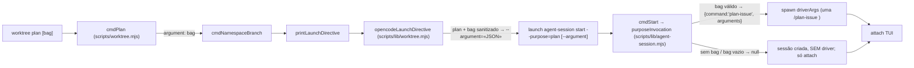

# Impl: OPS119 — worktree plan: abrir sem auto-enviar o `/plan-issue` (mensagem opcional na linha)

Status: em execução
Atualizado em: 2026-09-16
Issue: #1066
Intenção: docs/plans/ops119-worktree-plan-sem-auto-envio-plan-issue.md
Appetite restante: herdado (~0,5 dia eng — 2 libs puras + 1 script + 2 specs + textos)

## Leitura da intenção

- **Outcome:** `worktree plan` (sem argumento) abre a sessão persistente **sem driver** (nenhuma mensagem auto-submetida, mesmo contrato observável do `new`); `worktree plan "<mensagem>"` auto-submete **uma** `/plan-issue <mensagem>` e usa a mesma mensagem como bag do branch — simétrico a `fix <bag>`. `next`/`new`/`fix`, `--stay` e o comando `/worktree` intactos.
- **O que NÃO negociar:** a mensagem passa pela **mesma sanitização do `fix`** (`replace(/["\\]/g,'')` + `trim`); bag vazio **não** gera driver; `next` segue `/work-issue --issue <N>`; `new` segue driverless; `fix <bag>` segue `/bug-fix <bag>`; `--stay` e/ou `TEQO_WORKTREE_TERMINAL` ausente continuam sem diretiva. Sem migration/access/Consent/UI (Impeccable A).
- **O que reavaliar (hipóteses da "Direção no codebase" que o explorador corrigiu):**
  - O plano de intenção não previu o aviso `[agent:session] purpose=… sem comando/issue válida` (`scripts/agent-session.mjs:536-539`): `plan` sem msg cairia no `else if (purpose !== 'new')` e **logaria um falso alarme**. Entra no escopo (é a mesma aceitação observável: "abre sem driver", sem ruído).
  - O docblock de `purposeInvocation` (`scripts/lib/agent-session.mjs:164-181`) e o USAGE do `start` (`:83`, "model obrigatório next/plan/fix") ficam **imprecisos** — o `plan` deixa de exigir `--model` quando não há driver. Ajuste de texto barato, feito na passagem.
  - `planBranchName`/`namespaceBranchName` (`scripts/lib/worktree.mjs:150-170,277-278`) já resolvem o branch a partir do bag (fallback `plano`, `slugify`) — **nada a mudar** ali; o bag vazio já cai no sequencial `plans/plan-issue-<n>`.

## Abordagem recomendada

**Opções consideradas:** A | B | C
**Recomendação:** **A** — o dono da decisão "quando um purpose carrega skill" é `purposeInvocation` (`scripts/lib/agent-session.mjs`), e o ramo do `plan` é **cópia exata** do ramo `fix` (`:192-197`): sanitiza, vazio → `null`, senão `{ command, arguments }`. O `opencodeLaunchDirective` passa a emitir `--argument` para `fix || plan` e `cmdPlan` passa `argument: bag` — o restante do caminho (`cmdNamespaceBranch` runner, `printLaunchDirective`, `driverArgs`, dispatch) **não muda**.
**Rejeitadas:** **B** — manter `purposeInvocation` devolvendo comando "bare" para `plan` e decidir o não-driver dentro do `cmdStart` (CLI): quebra a pureza do dono do ciclo (a lib passaria a mentir "sempre há comando"), e a regra ficaria em dois lugares quando um 5º purpose chegar. **C** — criar uma flag nova de driver (`--driver`/`--no-driver`) na diretiva: vocabulário novo sem necessidade, e destrói a simetria com `fix`, que já expressa "tem driver" pela presença do bag.

### Componentes / mudanças

- **`purposeInvocation`** (`scripts/lib/agent-session.mjs:184-199`): ramo `plan` antes do `return { command, arguments: '' }` final, espelhando `fix` — `const sanitized = typeof argument === 'string' ? argument.replace(/["\\]/g, '').trim() : ''`; **`if (!sanitized) return null`**; `return { command, arguments: sanitized }`. Ponto de **divergência deliberada** do `fix`: no `fix` bag vazio ainda auto-submete `/bug-fix` bare; no `plan` (sem contexto) vazio → **sem driver**.
- **Docblock de `purposeInvocation`** (`:176-181`): descrever `plan` sem-arg → `null`, com-arg → `/plan-issue <msg>`; `fix` inalterado.
- **`opencodeLaunchDirective`** (`scripts/lib/worktree.mjs:202-232`): condição `if (purpose === 'fix')` → `if (purpose === 'fix' || purpose === 'plan')` (`:227`); comentário do `:224-226` passa a citar o par. O sufixo do issue segue só do `next` (`:223`).
- **`cmdPlan`** (`scripts/worktree.mjs:755-764`): acrescenta `argument: bag` ao `cmdNamespaceBranch` (como `cmdFix :810`). `cmdNamespaceBranch` (`:675-743`), `printLaunchDirective` (`:221-235`) e o dispatch (`:1037-1038`) **intocados**.
- **`cmdStart`** (`scripts/agent-session.mjs:536-539`): `else if (purpose !== 'new')` → `else if (purpose !== 'new' && purpose !== 'plan')` + comentário ("`plan` sem bag é driverless por desenho").
- **Textos do CLI:** header/USAGE de `scripts/agent-session.mjs` (`:9`, `:74-83` — `--model` obrigatório "quando há driver"); docblock/uso do `plan` em `scripts/worktree.mjs:68-83,979-992`; `.agents/shell/worktree.sh:9-31,43-49`; `.opencode/commands/worktree.md:8`; `.agents/skills/worktree-next-issue/SKILL.md:23,30,34`; `AGENTS.md:75`; `docs/AGENT-OPS.md:65,70`.
- **Changelog:** `docs/changelog/2026-09-16-ops119.md` (uma entrada). Não editar o HISTORY nem o agregado.
- **Migration:** sem migration (nenhum schema/payload é tocado).
- **Access / Consent:** N/A.
- **UI:** N/A (Impeccable A — CLI/shell).

### Dados → forma (se aplicável)

- N/A — sem superfície de dados. A "forma" é o contrato observável do launch: `plan` ≡ `new` sem bag; `plan <bag>` ≡ `fix <bag>` com a skill trocada. Rejeitada a forma "prefill-draft" (upstream inexistente no opencode 1.18.31 — proposição `~/Code/propositions/opencode/prefill-prompt-sem-submit.md` re-flagada fora do repo).

## Fases verificáveis

1. **F1 — Sessão (owner) ~40% do appetite:** ramo `plan` em `purposeInvocation` + docblock; isenção do aviso em `cmdStart`. Prova: unit do `agentSession.unit.spec.ts` (plan sem arg → `null`; com arg → `{command:'plan-issue', arguments}`; bag vazio/só aspas → `null`; `next`/`fix`/`new`/unknown inalterados).
2. **F2 — Launch ~20%:** `opencodeLaunchDirective` (`fix || plan`) + `cmdPlan(argument: bag)`. Prova: unit do `worktree.unit.spec.ts` (plan sem arg = diretiva de hoje; plan com bag carrega `--argument="…"`; plan ignora `issueNumber`; `new` segue ignorando `argument`).
3. **F3 — Testes + textos ~30%:** repin dos dois specs; varredura dos textos listados por "plan auto-submete `/plan-issue`"; entrada de changelog.
4. **F4 — Gates ~10%:** `pnpm gate:fast` (lint + typecheck + unit) verde; walkthrough manual (terminal com `opencode` instalado): `worktree plan` abre sem mensagem e `worktree plan "mensagem"` abre com `/plan-issue mensagem` + branch `plans/plan-issue-mensagem`; push via `pnpm push`. Este PR toca `scripts/worktree.mjs` (HIGH_RISK_EXACT) ⇒ CI = full de qualquer forma.

## Rabbit holes / Não escopo (engenharia)

- **Novo vocabulário de CLI** (subcomandos, `--message`, separar bag de mensagem): cortado — só o par sem-arg/arg, idêntico ao `fix`.
- **Prefill-sem-submit no opencode:** upstream; apenas re-flagar a proposição (fora do repo).
- **Gateway `--prompt`/`--variant`:** intocados (OPS95/OPS110).
- **`kill`/`attach`/`resolveStartDecision`/`deriveSessionStatus`:** agnósticos ao driver (`driverPid:null` → `idle`); não mexer.
- **`HIGH_RISK_EXACT` não cobre `scripts/lib/agent-session.mjs` nem `scripts/lib/worktree.mjs`** (`scripts/lib/test-affected-core.mjs:25-53`): gap **pré-existente e independente** desta entrega (o PR atual toca `scripts/worktree.mjs`, que já é high-risk). Não expandido aqui; registrado como Issue de follow-up **#1071** (plano `docs/plans/escala-dry-pos-ops119.md`, com o pin do wiring do `cmdPlan`).

## Riscos e mitigação

- **Regressão em `next`/`new`/`fix` ao mexer na condição da diretiva:** a mudança é aditiva (`|| purpose === 'plan'`) e os specs de `new`/`fix` ficam verdes sem edição no comportamento deles; teste explícito trava `new` ignorar `argument` e `fix` manter `--argument`.
- **Divergência entre slug do branch e mensagem sanitizada:** branch usa `slugify` (existente), mensagem reusa a sanitização do `fix`; ambos idempotentes entre a camada diretiva e o `purposeInvocation`.
- **Falso alarme "sem driver" no `plan`:** coberto pela isenção do `cmdStart` (F1) — é justamente o que a intenção exige ("mesmo contrato observável do `new`").
- **`--model` dito obrigatório mas ausente no plan driverless:** o aviso/erro real (`cmdStart:476`) só dispara quando `invocation` existe; texto do USAGE ajustado em F3.
- **Texto/doc remanescente afirmando auto-envio sem-arg:** varredura por `/plan-issue` nos arquivos listados antes do commit (histórico congelado intocado: `docs/plans/worktree-plan-abre-opencode-com-plan-issue*.md`, `docs/CHANGELOG-AGENTS-HISTORY.md:241`).

## Triage pós-simplify (capture-review-debts)

- **S4 (pin do wiring `cmdPlan` → `cmdNamespaceBranch`) + S6 (`HIGH_RISK_EXACT` das libs do launch)** — score 3, mesma superfície → **registrado** como Issue **#1071** (`docs/plans/escala-dry-pos-ops119.md`; `kind:chore`, P3, `depends: OPS119`).
- **S1** (`return { command, arguments: '' }` final de `purposeInvocation`) — descartado: fallback fail-safe para um purpose mapeado sem args.
- **S2** (sanitização `["\\]` duplicada entre as duas libs) — defer, gatilho: 3º call site ou import cruzado das libs.
- **S3** (política driverless em `!==` no CLI) — defer, gatilho: 3º purpose driverless.
- **S5** (doc drift de `opencodeLaunchDirective`/`cmdNamespaceBranch` + fixture fantasma do `driverArgs`) — já resolvido no simplify.

## Aceite de engenharia

- [x] Aceite de produto da intenção coberto: `plan` sem arg = `null`/driverless; `plan <msg>` = `{command:'plan-issue', arguments:<sanitized>}`; `next`/`new`/`fix`/`--stay`/`/worktree` intactos.
- [x] Invariantes AGENTS/engineering-standards: reusa o dono (`purposeInvocation`/caminho do `fix`), sem módulo/abstração nova; sem `push:false`/schema/migration; sem segredo.
- [x] Testes de domínio (unit) repinados onde o contrato muda: `tests/unit/agentSession.unit.spec.ts` e `tests/unit/worktree.unit.spec.ts` (plan sem bag → `null`; plan com bag → `--argument` sanitizado; `new`/`fix`/`next` inalterados).
- [x] Textos vivos atualizados; histórico congelado intocado; `docs/changelog/2026-09-16-ops119.md` criado.
- [x] `pnpm gate:fast` verde; cadeia bag→diretiva→`purposeInvocation` verificada por execução direta das libs (walkthrough do launch registrado no PR).

## Self-score decision-quality

1. Decisões caras com rejeitadas? **Sim** — D1 (dono da decisão), D2 (bag vazio → `null`, divergência deliberada do `fix`), D4 (isenção do aviso), D6 (classifier deferido).
2. Cabe no appetite (~0,5 dia)? **Sim** — 2 libs puras + 1 script + 2 specs + textos.
3. Rabbit holes nomeados? **Sim** — vocabulário novo, prefill upstream, classifier, kill/attach.
4. Depth check reusa? **Sim** — ramo `fix`, `slugify`, sanitização e `driverArgs` existentes; zero abstração nova.
5. Intenção preservada? **Sim** — engenharia não reescreve outcome; só estende o caminho já provado do `fix`.

**Self-score: 5/5** (gate ≥4 atendido). Status inicial `rascunho` — a pausa do GATE de aprovação humana vale.
