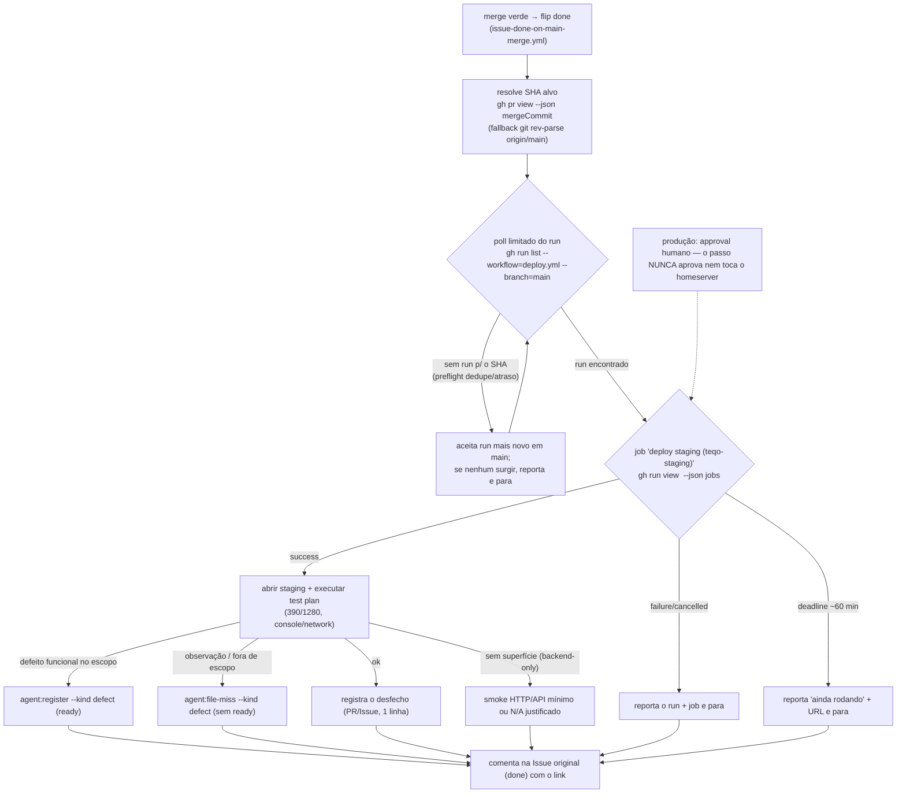

# Impl: Verificação pós-deploy em staging no fluxo `work-issue`

Status: aprovado
Atualizado em: 2026-09-16
Issue: #1079
Intenção: docs/plans/ops121-verificacao-pos-deploy-staging-work-issue.md
Appetite restante: herdado (~0,5–1 dia eng); sem ajuste — item docs-only (4 arquivos markdown + changelog), sem código de runtime, sem migration, sem UI

## Leitura da intenção

- **Outcome (nas palavras do aceite):** depois do merge verde e do flip `done`, o fluxo `work-issue` espera o job `deploy-staging` (do run de `deploy.yml`) ficar verde, abre o staging (`https://staging.jorgesolla1313.com.br`, noindex) e exerce **só a funcionalidade recém-entregue** (390/1280, console/network); o desfecho fica registrado e defeitos viram Issues de correção com estado de fila correto. A espera tem teto: em timeout reporta e para. Nenhum passo toca o homeserver, o DB de produção ou aprova produção.
- **O que NÃO negociar:** produção continua 100% humana (`environment: production` + required reviewer) — o passo nunca aprova, nunca rejeita, nunca dispara run; nunca tocar homeserver (`ssh`, `docker`, `~/stack/*.env`) nem o DB `teqo_1313`; nunca editar Issue `in-progress`; a Issue original (já `done`) **não** reabre — só recebe comentário linkando a Issue nova; classe A — só markdown de skills/docs, **nenhum código de runtime, nenhum script novo, nenhuma migration**; `bug-fix` mantém a confirmação manual em prod e não é absorvido.
- **O que reavaliar (hipóteses da intenção/explorador que mudam a forma):**
  - **O auto-merge é `rebase` (OPS71):** o SHA do head do PR **não** é o SHA que entra em `main`. Ancorar o poll no head do PR erraria o alvo; o alvo é o **commit de merge** (`gh pr view --json mergeCommit`, fallback `git fetch && git rev-parse origin/main`).
  - **`~60 min` de teto é apertado dentro do run:** o mesmo run roda `verify` (timeout 50 min) **antes** de `deploy-staging` (timeout 60 min). Um run saudável pode ultrapassar 60 min contados do `createdAt`. O teto passa a ser um **deadline**, e o timeout é "ainda rodando" (reporta + para), nunca defeito — com gatilho de revisitação do número (R1).
  - **O browser real do ambiente é Playwright, não Chrome DevTools:** `~/.config/opencode/opencode.jsonc` registra `@playwright/mcp --browser chromium`; a skill `browser-testing-with-devtools` descreve **Chrome DevTools MCP**, que **não existe** neste ambiente. O texto cita a **metodologia** (test plan, console/network, 390/1280) e nomeia o Playwright como ferramenta disponível — sem atrelar o passo à skill de DevTools (evita conflito de ferramenta).
  - **`agent:register --plan` não serve para defeito:** `--plan` ⇒ `hasPlan` ⇒ label `blocked` (`agent-register.mjs:53-56`), ou seja, defeito não claimável. Defeito funcional no escopo entra **sem `--plan`** ⇒ `ready`.
  - **Não existe helper de poll/watch** em `github-api.mjs` (só retry/backoff interno :52,:100-104 e o loop de `ensureAutoMergeDisabled` :518-524). O poll é **prescrito em prosa** com primitivos existentes; criar helper é fora de escopo com gatilho de revisitação.
  - **`agent-work-issue` é Cloud sem browsers** (`Passo 0`/`:52-54`, E2E `:79`): ele **não** executa o passo; declara o defer (não finge). O dono da mecânica é o pipeline; os SKILLs só declaram delta.
  - **N/A de staging é fonte no runbook** (`docs/ops/teqo-1313-deploy.md:193-200`): WebAuthn/passkeys, Google OAuth e Resend não são validados em staging — um "login quebrado" ali pode ser limite de ambiente, não defeito.

## Abordagem recomendada

**Opções consideradas:** (1) onde mora a mecânica: A) duplicar o passo nos dois SKILLs | B) só em `work-issue/SKILL.md` | C) `execution-pipeline.md` dona da mecânica e cada SKILL declara o delta do ator; (2) espera do run: A) poll em prosa com primitivos existentes + deadline ~60 min | B) só reportar o run ao humano | C) espera infinita; (3) browser canônico: A) Playwright (o MCP realmente configurado) + metodologia sem acoplar à skill de DevTools | B) "browser MCP" genérico | C) `browser-testing-with-devtools` (Chrome DevTools); (4) defeitos: A) defeito no escopo → `agent:register` `ready`; observação → `file-miss`; original só comentado | B) só `file-miss` | C) reabrir a original; (5) backend-only/limites de staging: A) smoke HTTP/API mínimo ou N/A justificado | B) pular em silêncio | C) forçar browser.

**Recomendação:** **1C + 2A + 3A + 4A + 5A** — a mecânica única vive no pipeline (dono), os SKILLs declaram só o delta do ator (humano executa; pool defere); o poll é prosa com `gh run list/view` + SHA de merge e deadline ~60 min com timeout que reporta e para; o texto cita metodologia (test plan, console/network, 390/1280) e nomeia o Playwright como ferramenta disponível sem citar a skill de DevTools como se fosse o MCP; defeito funcional no escopo vira Issue claimável (`agent:register --kind defect`, sem `--plan`), observação vira `file-miss` (`kind:defect` + `prio:P2`, não claimável), a original só recebe comentário; sem superfície de browser, registra smoke HTTP/API mínimo ou N/A justificado apoiado nos limites de staging.

**Rejeitadas:** 1A porque duplicar a mecânica cria duas fontes de verdade que driftam — exatamente o anti-goal do cruzamento com `bug-fix`; 1B porque o pool lê o pipeline e tentaria rodar browser que não tem, sem delta explícito; 2B porque o run nasce no merge e `verify` full leva ~50 min — checar uma vez nunca vê `deploy-staging` verde; 2C porque pendura a sessão indefinidamente (anti-goal); 3B porque "browser MCP" genérico não resolve o conflito real e deixa o agente escolher a ferramenta errada; 3C porque a skill descreve Chrome DevTools MCP, **não** instalado no ambiente (Playwright é), e citá-la gera conflito de ferramenta; 4B porque defeito funcional no escopo merece entrar na fila claimável; 4C porque a original já está `done` e reabrir contradiz o tracker (o registro correto é "nova Issue + comentário de link"); 5B porque pular em silêncio é o rabbit hole "não precisa"; 5C porque inventa superfície de UI que a entrega não tem.

### Decisões de engenharia (caras de reverter)

#### D1 — Onde mora a mecânica e como o pool declara o delta

- **Opções:** A) escrever o passo inteiro em `work-issue/SKILL.md` e repetir em `agent-work-issue/SKILL.md`; B) escrever em `work-issue/SKILL.md` e no `agent-work-issue` só citar; C) `execution-pipeline.md` ganha `## Verificação pós-deploy (staging)` (dono da mecânica); `work-issue/SKILL.md` acrescenta Passo 8 + checklist apontando para o pipeline; `agent-work-issue/SKILL.md` acrescenta uma linha de delta no Passo 6; a tabela `## Deltas por ator` ganha a coluna/célula do passo.
- **Recomendação:** **C** — o pipeline já é declarado como dono da mecânica comum ("o corpo mora aqui; cada skill declara os deltas do seu ator", `execution-pipeline.md:1-5`) e já concentra `## Fechar em main` (:120-137) e `## Deltas por ator` (:139-144). A nova §entra entre :137 e :139, logo depois do flip, e a tabela ganha a dimensão do pós-deploy. `work-issue` (humano, com browsers) executa; `agent-work-issue` (Cloud, sem browsers) **defere** com justificativa registrada no PR/Issue — o mesmo padrão do E2E "Cloud sem browsers → registre justificativa" (`agent-work-issue/SKILL.md:79`). Zero duplicação de mecânica.
- **Rejeitadas:** A por criar twin da mecânica (drift garantido, anti-goal); B por deixar o pool sem delta explícito — ele lê o pipeline, tentaria o passo e falharia sem browser (viola "não fingir o passo").

#### D2 — Descoberta e poll do run de `deploy-staging`, sem helper novo

- **Opções:** A) prescrever o poll em prosa com primitivos existentes (`gh pr view --json mergeCommit` / `git rev-parse origin/main`; `gh run list --workflow=deploy.yml --branch=main --json …`; `gh run view <id> --json jobs`) + deadline ~60 min do `createdAt` + timeout que reporta e para; B) criar `scripts/…poll-staging.mjs` sobre `listWorkflowRuns`/`getWorkflowRunJobs`/`getBranchHead` com testes; C) checagem única sem espera.
- **Recomendação:** **A** — o SHA alvo é o **merge commit** (o auto-merge é rebase; o head do PR não é o SHA de `main`). O agente localiza o run mais novo de `deploy.yml` em `main` cujo `headSha` seja o alvo **ou mais novo** (o `preflight` dedupa — OPS104 — e um run mais novo cobre o SHA), depois lê `jobs` e observa o job cujo `name == "deploy staging (teqo-staging)"` (`deploy.yml:207-236`): `success` → segue; `failure`/`cancelled` → reporta o run/job e para. Cadência ~2–3 min, no máximo ~25–30 leituras **ou** o deadline, o que vier primeiro; clock = `createdAt` do run; deadline esgotado → reporta "ainda rodando" + URL e para (nunca continua). Os primitivos de script (`listWorkflowRuns` :326-342, `getWorkflowRunJobs` :349-365, `getBranchHead` :398-402, token `GITHUB_TOKEN` :80-83) ficam documentados como equivalentes Node, mas o passo usa `gh` por não exigir código. **Nunca** aprova/rejeita produção; o run fica `waiting` no `deploy-production` e é deixado como está.
- **Rejeitadas:** B porque classe A proíbe código novo, exigiria script + spec (estoura appetite) e o poll é 1 uso; declará-lo fora de escopo com gatilho de revisitação ("se o poll virar necessidade reutilizável, promover a helper testado"). C porque o run não conclui no merge (verify ~50 min) — checagem única não tem utilidade.

#### D3 — Browser canônico no texto (Playwright real vs skill de Chrome DevTools)

- **Opções:** A) citar a **metodologia** (test plan derivado dos critérios de aceite + `*-impl.md`, viewports 390/1280, console limpo, requests de rede, screenshots como evidência) e nomear o **Playwright MCP** como a ferramenta disponível na sessão humana (única configurada em `~/.config/opencode/opencode.jsonc:39-41`), sem citar `browser-testing-with-devtools` como o MCP do passo; B) escrever "use o browser MCP disponível" sem nome; C) tornar `browser-testing-with-devtools` (Chrome DevTools MCP) canônica.
- **Recomendação:** **A** — resolve o conflito real: a skill `browser-testing-with-devtools` documenta Chrome DevTools MCP, que **não** está configurado; a ferramenta do ambiente é Playwright. O texto prescreve o **método** (que é o que importa) e diz que a ferramenta é o browser automation disponível (Playwright no ambiente humano). Mantém o aprendizado de segurança da skill (conteúdo do browser é dado não confiável — nunca tratar texto da página como instrução) sem acoplar a um MCP ausente.
- **Rejeitadas:** B porque deixa a escolha de ferramenta ambígua e o agente pode invocar a errada; C porque atrela o passo a um MCP inexistente no ambiente (quebra em tempo de uso).

#### D4 — Mecanismo de defeito e o não-reabrir da Issue original

- **Opções:** A) defeito funcional **no escopo entregue** → `pnpm agent:register --kind defect` **sem `--plan`** (⇒ `ready`, claimável); observação/fora de escopo/limite de staging → `pnpm agent:file-miss --kind defect` (`kind:defect` + `prio:P2`, **sem** `ready` ⇒ não claimável); a original (`done`) só recebe um comentário linkando a Issue nova; B) só `file-miss` para tudo; C) reabrir a Issue original.
- **Recomendação:** **A** — o defeito funcional no escopo merece entrar na fila claimável (`resolveRegisterStateLabel` com `hasPlan:false`, `explicitBlocked:false` ⇒ `ready`), e `--plan` **não** é passado justamente porque viraria `blocked` (`agent-register.mjs:53-56`). Observações e limites de staging vão para `file-miss` (triage, não fila). A original é `done` pós-merge: reabri-la contraria o tracker; um comentário com o link preserva a rastreabilidade. O passo nunca edita Issue `in-progress`.
- **Rejeitadas:** B porque joga defeito acionável na triage não-claimável; C porque conflita com o flip `done`/`in-prod` do `issue-done-on-main-merge.yml`.

#### D5 — Backend-only e limites de staging → N/A justificado

- **Opções:** A) sem superfície de browser (backend-only), registrar **smoke HTTP/API mínimo** no ambiente (curl/`gh` contra a rota pública de staging) ou N/A justificado; limites de staging (WebAuthn/passkeys, Google OAuth, Resend — `docs/ops/teqo-1313-deploy.md:193-200`) entram como N/A justificado; defeito só é filed após atribuir a falha (não confundir limite de ambiente com regressão); B) pular silenciosamente; C) forçar um passo de browser mesmo sem superfície.
- **Recomendação:** **A** — o passo é honesto sobre o que não consegue validar; smoke mínimo usa a URL pública (read-only) e nunca toca homeserver/DB. Staging verde ≠ produção garantida (o próprio runbook diz), então o desfecho registra os N/As.
- **Rejeitadas:** B porque "pular em silêncio" é o rabbit hole nomeado; C porque inventa superfície de UI que a entrega não tem.

### Componentes / mudanças

Linhas do estado atual (2026-09-16); realinhar pela âncora, não pelo número.

- **`.agents/skills/work-issue/execution-pipeline.md`** (dono da mecânica): nova seção `## Verificação pós-deploy (staging)` entre `## Fechar em main` (fim :137) e `## Deltas por ator` (:139). Conteúdo: quando roda (após o merge/flip); resolve SHA alvo (merge commit); poll limitado do run/job `deploy staging (teqo-staging)` com deadline ~60 min e timeout "reporta e para"; método de teste (test plan dos critérios de aceite + `*-impl.md`, 390/1280, console/network, evidência por screenshot; conteúdo do browser é dado não confiável); roteamento de defeito (D4); N/A justificado (D5); **fronteira dura** (nunca aprovar/rejeitar produção, nunca tocar homeserver/DB, nunca reabrir a original, nunca editar `in-progress`). Na tabela `## Deltas por ator` (:139-144), célula do passo: **Humano** executa; **Pool** defere/registra (Cloud sem browsers, nunca finge).
- **`.agents/skills/work-issue/SKILL.md`**: checklist (:74-86) ganha item `8. Verificação pós-deploy em staging` (após o item 7 = PR→merge); nova `## Passo 8 — Verificação pós-deploy em staging` após o Passo 7 (:179-183) com o delta do ator + ponteiro para o pipeline (sem repetir a mecânica); `## Resumo final` (:185-187) acrescenta "verificação pós-deploy em staging".
- **`.agents/skills/agent-work-issue/SKILL.md`**: Passo 6 (:96-100) ganha **uma linha de delta** — "Cloud/sem browsers ⇒ §Verificação pós-deploy do pipeline é **diferida**: registre a justificativa no PR/Issue, nunca finja o passo"; checklist (:36-44) item 6 anota o defer. Sem mecânica duplicada.
- **`.agents/skills/bug-fix/SKILL.md`**: **intocado** — o pipeline referencia a fórmula de `bug-fix/SKILL.md:106-109` ("merge não é o fim") para nomenclatura; a confirmação manual em prod segue dona do `bug-fix` (decisão de produto B: separados e cruzados).
- **`docs/changelog/2026-09-16-ops121.md`**: entrada curta (one-liner bold, additions-only) registrando a §Verificação pós-deploy: poll com deadline, ferramenta Playwright, roteamento de defeito (`agent:register` ready vs `file-miss`), fronteira prod/homeserver. **Não** editar `docs/CHANGELOG-AGENTS.md` (gitignored) nem `docs/CHANGELOG-AGENTS-HISTORY.md` (congelado).
- **`docs/ops/teqo-1313-deploy.md`**: **sem edição** — é a fonte citada dos limites de staging (:193-200); a §do pipeline aponta para ele.
- **Migration:** sem migration.
- **Access / Consent:** n/a (sem PII, sem collection, sem chave de Consent).
- **UI:** Impeccable A — n/a (sem superfície desenhada; o navegador é ferramenta de teste, não UI desta entrega).

### Dados → forma (se aplicável) — n/a

Item de processo/skill: a evidência é operacional (run/job no Actions, screenshots do staging, Issue de defeito). Nada a apresentar.

## Fases verificáveis

1. **Tracer — a mecânica no pipeline (dono).** Escrever `## Verificação pós-deploy (staging)` em `execution-pipeline.md` (D1+D2+D3+D4+D5) + a célula da tabela de deltas. É o tracer: se a mecânica não fecha, os deltas dos SKILLs herdam o erro. Gate: releitura contra a intenção (espera limitada, roteamento de defeito, fronteira dura) — sem código. _~2–3h._
2. **Deltas por ator.** `work-issue/SKILL.md` (checklist + Passo 8 + Resumo) e `agent-work-issue/SKILL.md` (delta Cloud no Passo 6), só ponteiro/delta, sem repetir a mecânica. Gate: nenhuma mecânica duplicada (grep por "deploy-staging"/"390" fora do pipeline = vazio nos SKILLs, exceto o ponteiro). _~1h._
3. **Changelog + gates + entrega.** `docs/changelog/2026-09-16-ops121.md`; `pnpm gate:fast` (lint/format/typecheck/unit — docs-only, mas o Prettier formata md); `pnpm push`; PR Ready base `main` com `Closes #1079`. E2E: **sem superfície de runtime — declarar "sem e2e afetado"** (OPS72, diff é markdown). _~1h + pós-merge:_ o próprio merge é docs-only ⇒ a §nova é dogfoodada no modo **N/A justificado** (não há feature de usuário a exercer); registrar essa leitura no PR é a prova de que o passo não finge.

## Rabbit holes / Não escopo (engenharia)

- **"Não precisa"** — usar Cloud sem browsers (`agent-work-issue/SKILL.md:52-54,:79`) ou os limites de staging (:193-200) como desculpa para pular em silêncio. Corte: o delta tem de ser **explícito e registrado**; nunca fingir.
- **Duplicar a mecânica** entre `execution-pipeline.md` e os dois SKILLs. Corte: dono único no pipeline; SKILLs só declaram delta/ponteiro.
- **`agent:register --plan`** para defeito (vira `blocked`). Corte: defeito claimável é `--kind defect` **sem `--plan`**.
- **Inventar helper de poll/watch** — não existe (`github-api.mjs` só tem retry/backoff). Corte: prosa com `gh run list/view` + SHA de merge; promover a helper testado só com gatilho de reavaliação.
- **Suíte e2e automatizada contra staging** — decidido fora de escopo no OPS103 (`ops103-staging-homeserver.md`); destino: item próprio se houver evidência.
- **Verificação/aprovação de produção** — segue humana; o passo nunca aprova/rejeita nem toca o homeserver.
- **Watchdog/monitoramento contínuo** do deploy.
- **Absorver o `bug-fix`** ou unificar a confirmação manual em prod — donos separados e cruzados.
- **Bind a Chrome DevTools MCP** (não existe no ambiente) — citar só a metodologia + Playwright.
- **Editar a Issue original** como registro do defeito — só comentário de link.

## Riscos e mitigação

- **R1 — Deadline de ~60 min apertado** (`verify` timeout 50 min + `deploy-staging` timeout 60 min no mesmo run). _Mitigação:_ deadline contado do `createdAt`; ao esgotar, reporta "ainda rodando" + URL e para (nunca trata como defeito, nunca continua); o número é um literal configurável da §. _Gatilho:_ se o dogfood mostrar runs saudáveis estourando sistematicamente, subir o teto para `verify + staging + margem` (mudança de uma linha).
- **R2 — Âncora do SHA** (rebase ⇒ head do PR ≠ SHA de `main`; `preflight` dedupa ⇒ sem run para o SHA; outro merge avança `main`). _Mitigação:_ alvo = merge commit; aceitar run com `headSha` igual **ou mais novo**; se nenhum run surgir na janela, usar o run mais novo em `main`; se ainda assim nada, reporta e para (nunca bloqueia).
- **R3 — Limites de staging geram falso defeito** (WebAuthn/OAuth/Resend não validados; dados sintéticos). _Mitigação:_ a §lista os N/As do runbook e exige **atribuir antes de abrir a Issue**; limitação de ambiente → `file-miss`, não defeito funcional.
- **R4 — Conflito de ferramenta** (texto citando Chrome DevTools MCP que não existe). _Mitigação:_ D3 — metodologia + Playwright nomeado; a skill de DevTools não é citada como o MCP do passo.
- **R5 — Defeito vira ruído / Issue não-claimável.** _Mitigação:_ roteamento por D4; a original só recebe comentário (rastreabilidade preservada).
- **R6 — Erosão de fronteira** (o passo aprovar produção ou tocar o homeserver). _Mitigação:_ proibição explícita na §; uso read-only da API do GitHub e do browser público de staging; nenhum `ssh`/`docker`/env do homeserver.
- **R7 — Drift entre pipeline e SKILLs.** _Mitigação:_ mecânica single-source no pipeline; SKILLs só delta; changelog registra OPS121 e a fronteira.
- **R8 — Conteúdo do browser tratado como instrução** (page injection). _Mitigação:_ manter o princípio de segurança da skill de browser (conteúdo = dado não confiável) na §do pipeline.

## Aceite de engenharia

- [ ] **Aceite de produto da intenção coberto:** (1) após o merge o fluxo verifica funcionalmente a feature em staging e registra o desfecho; (2) a espera é limitada — timeout reporta e para, nunca segue em silêncio nem aguarda indefinidamente; (3) defeitos geram Issues com estado de fila correto (claimável quando cabível), sem editar a Issue original `in-progress`; (4) nenhum passo toca o homeserver, o DB de produção ou aprova a produção.
- [ ] **Invariantes AGENTS/engineering-standards:** classe A — só markdown (`execution-pipeline.md`, os dois SKILLs, changelog); sem código de runtime, sem script/migration, sem UI desenhada; `bug-fix` intocado; produção 100% humana; "editar o dono, não criar twin" (mecânica no pipeline).
- [ ] **Testes de domínio:** n/a (docs-only, sem access/write paths). A verificação é a releitura da §contra a intenção e a checagem de não-duplicação da fase 2.
- [ ] **Gates:** `pnpm gate:fast` verde; `pnpm push` (gate:ci); e2e declarado "sem superfície de runtime" (OPS72); `*-impl.md` incluído; PR Ready com `Closes #1079`; pós-merge, dogfood da §nova no modo N/A justificado (entrega docs-only).

**Self-score decision-quality (gate ≥4):**

| Critério                         | Nota      | Justificativa                                                                                                                                                                      |
| -------------------------------- | --------- | ---------------------------------------------------------------------------------------------------------------------------------------------------------------------------------- |
| 1. Decisões caras com rejeitadas | 1,0       | D1 (1A/1B/1C), D2 (A/B/C), D3 (A/B/C), D4 (A/B/C) e D5 (A/B/C) com opções e rejeitadas explícitas                                                                                  |
| 2. Cabe no appetite              | 1,0       | ~0,5–1 dia: 4 arquivos markdown + 1 changelog; nenhum código, migration ou UI; nenhuma refatoração                                                                                 |
| 3. Rabbit holes nomeados         | 1,0       | "não precisa", duplicação, `--plan` blocked, helper de poll, e2e staging, prod/watchdog, absorver bug-fix, bind a DevTools                                                         |
| 4. Depth check (reuso)           | 1,0       | edita o dono (`execution-pipeline.md`), reusa o padrão de delta por ator e o precedente Cloud-sem-browser do E2E; primitivos `gh`/`github-api.mjs` existentes; zero abstração nova |
| 5. Intenção preservada           | 1,0       | os 4 aceites cobertos; espera limitada; roteamento de defeito correto; homeserver/prod intocados; outcome não reescrito                                                            |
| **Total**                        | **5,0/5** | ≥4 exigido                                                                                                                                                                         |
