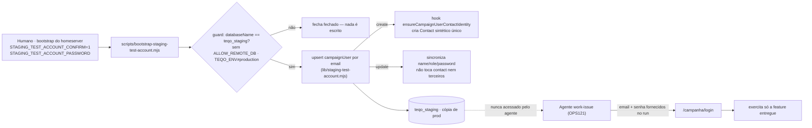

# Impl: Conta de teste dos agentes no ambiente de staging

Status: aprovado
Atualizado em: 2026-09-17
Issue: #1126
Intenção: docs/plans/ops125-conta-de-teste-agentes-staging.md
Appetite restante: herdado (herdado: ~0,5 dia)

## Leitura da intenção

- **Outcome:** depois do merge, o agente de `work-issue` consegue logar em `https://staging.jorgesolla1313.com.br` com uma conta sintética exclusiva de staging e exercer a feature recém-entregue; a credencial não é commitada, o agente não recebe `DATABASE_URL` de staging/produção e nenhum dado real é exportado.
- **O que NÃO negociar:** (1) credencial nunca versionada nem GitHub secret (staging é cópia da produção, com PII real); (2) criação idempotente e **restrita a staging** — nunca produção, nunca banco local; (3) agente nunca recebe `DATABASE_URL` de staging/prod nem `ALLOW_REMOTE_DB`, acesso só por login; (4) sem segundo mecanismo de autenticação, sem conta por papel/feature, sem e2e de login contra staging, sem UI; (5) papel `coordinator` e identidade `Agente de Teste (staging)` / `agente-teste@teqo.invalid` são **assumidos** (validar com produto); (6) não tocar dados de terceiros nem alterar a cópia real.
- **O que reavaliar:** a hipótese "reusar o seed mínimo" já foi descartada na intenção (guard local-only + pins colidem com a cópia real); a "Direção no codebase" acerta o precedente (`scripts/seed-minimal.mjs`/manifest) e a superfície de login (`auth.ts`), mas o mecanismo de guard não existe — `assertLocalDatabase` sozinho **não** distingue staging de produção (proxy socat reescreve o host para `127.0.0.1`; `NODE_ENV=production` no env file). O discriminador confiável é o **nome do banco** (`teqo_staging`).

## Abordagem recomendada

**Opções consideradas:** A — script de ops novo rodado manualmente no bootstrap do staging, com guard de banco/flag, senha vinda de env obrigatória, documentado no runbook | B — invocar a criação a partir do bloco `staging)` do `deploy-homeserver.sh` a cada deploy | C — criação manual da conta via admin.

**Recomendação:** **A** — porque o `deploy-homeserver.sh` é genérico de ambiente e não deve ganhar conhecimento de campanha (a intenção proíbe acoplar o deploy à conta); o DB de staging é (re)criado raramente (bootstrap), não a cada deploy, então rodar por deploy é cerimônia e superfície de falha; e um script idempotente com guard próprio é repetível e auditável, sobrevivendo à recriação do banco. A senha vem de `STAGING_TEST_ACCOUNT_PASSWORD` (env obrigatória, fail-closed) e a liberação ao agente no passo OPS121 é feita pelo humano (recomendação da intenção), fechando o gap de spec nos docs do pipeline.

**Rejeitadas:** B porque acopla campanha ao script de deploy genérico, exige a senha no caminho do deploy, roda a cada SHA e pode mascarar erro de bootstrap como erro de deploy; C porque não é repetível/auditável, não sobrevive à recriação do banco e dependeria de um login de admin de staging; "reusar `db:seed:minimal`" porque o guard é local-only e os pins de municípios/Consent/objetos colidiriam com a cópia real.

### Componentes / mudanças

- **`scripts/lib/staging-test-account.mjs`** (novo, `scripts/…`): dono único do conhecimento da conta — constante `STAGING_TEST_ACCOUNT = { name: 'Agente de Teste (staging)', email: 'agente-teste@teqo.invalid', role: 'coordinator' }`, `STAGING_DATABASE_NAME = 'teqo_staging'`, `STAGING_TEST_ACCOUNT_CONFIRM_FLAG = 'STAGING_TEST_ACCOUNT_CONFIRM'`; guard puro e injetável `assertStagingTestAccountTarget({ databaseUrl, nodeEnv, allowRemoteDb, teqoEnv, confirm })` (mesmo estilo de `requiresWriteConfirm`); e `upsertStagingTestAccount(payload, { password })` (busca por email → `create` ou `update` com `{ name, email, role, password }`). Importa `databaseName`/`requiresWriteConfirm`/`isTruthyEnv`/`dieWithLabel` de `scripts/lib/cli.mjs`. Sem top-level nativo de payload (o `payload` entra por parâmetro) — importável pelo unit pin e pelo int test.
- **`scripts/bootstrap-staging-test-account.mjs`** (novo, `scripts/…`): CLI fina — `loadCliEnv()`, lê `DATABASE_URL` e `STAGING_TEST_ACCOUNT_PASSWORD` (fail-closed se ausente ou curta), chama o guard, `getPayload({ config })`, chama `upsertStagingTestAccount`, loga o nome do banco-alvo e o email (nunca a senha), `process.exit(0)`. Não usa `db:seed:minimal`.
- **`scripts/lib/cli.mjs`** (`scripts/…`): adiciona o helper genérico `databaseName(url)` (decodifica o pathname com o mesmo spelling de `db-reset.mjs`/`assertTestDatabase.ts`), single-sourcing do 3º call site.
- **`scripts/db-reset.mjs`** e **`tests/helpers/assertTestDatabase.ts`**: adotam `databaseName` (sem mudança de semântica — só remove a 3ª cópia do spelling).
- **`package.json`**: script `"campaign:staging:test-account": "cross-env NODE_OPTIONS=\"--no-deprecation --import=tsx/esm --import=./scripts/seed-loader.mjs\" node scripts/bootstrap-staging-test-account.mjs"` (mesmo shape de `db:seed:minimal`/`camara:import`).
- **Docs:** `docs/ops/teqo-1313-deploy.md` (§Bootstrap do staging — nova entrada: var da senha no passo do env file + comando de criação/atualização da conta, re-rodar após recriação do DB); `.agents/skills/work-issue/execution-pipeline.md` (§Verificação pós-deploy §2 — onde a credencial vive e como o humano a obtém); `.agents/skills/work-issue/SKILL.md` (Passo 8 — uma linha do delta); `docs/changelog/2026-09-17-ops125.md` (entrada nova).
- **Migration:** sem migration (nenhuma mudança de schema/collection/field — a conta usa `campaignUser` existente).
- **Access / Consent:** sem nova regra de access e sem novo `Consent` (conta de staff, não opt-in de titular). A criação roda pela Local API sem `user`, contando com o bypass default do Payload (mesmo precedente de `seed-minimal.mjs`); o hook `ensureCampaignUserContactIdentity` (`CampaignUser.ts:214-244`) roda no `create` sem `req.user` e cria o `Contact` sintético; no `update` sem `req.user` ele retorna cedo (`:229`) e **não** reescreve a ficha — comportamento desejado.
- **UI:** N/A — Impeccable A, sem UI.

### Arquivos a tocar e pins

**Criados:** `scripts/lib/staging-test-account.mjs`, `scripts/bootstrap-staging-test-account.mjs`, `tests/unit/stagingTestAccount.unit.spec.ts`, `tests/int/campaignStagingTestAccount.int.spec.ts`, `docs/changelog/2026-09-17-ops125.md`.
**Editados:** `scripts/lib/cli.mjs`, `scripts/db-reset.mjs`, `tests/helpers/assertTestDatabase.ts`, `package.json`, `docs/ops/teqo-1313-deploy.md`, `.agents/skills/work-issue/execution-pipeline.md`, `.agents/skills/work-issue/SKILL.md`.
**Pins tocados/existentes a respeitar:** `tests/unit/scriptCliConventions.unit.spec.ts` (importar `dieWithLabel` de `scripts/lib/cli.mjs`, nunca re-escrever), `tests/unit/codebaseConventions.unit.spec.ts:343-370` (skeleton CLI single-sourced — não re-spellar `die`/dotenv/`LOCAL_HOSTS`), `tests/unit/cliEnvFlags.unit.spec.ts` (adicionar casos de `databaseName`; não alterar a semântica exata de `requiresWriteConfirm`), `tests/unit/deployScript.unit.spec.ts:176-236` (**não tocar** `deploy-homeserver.sh` — este plano não altera o script de deploy), `tests/unit/seedMinimalManifest.unit.spec.ts` (**não alterar** o manifest do seed local).
**Novos testes:** unit para o guard/flag (matriz de aceitação/recusa de `assertStagingTestAccountTarget` + pins de identidade `coordinator`/`@teqo.invalid`); int para o login da conta criada (`upsertStagingTestAccount` duas vezes → idempotente, `payload.login({ collection:'campaignUser', data:{ email, password } })` retorna token, `role==='coordinator'`, `contact` vinculado, nenhum outro doc alterado), seguindo o padrão de `tests/int/campaignAuth.int.spec.ts`.

### Dados → forma (se aplicável)

N/A — item de operação/credencial; nenhum número, agregado ou dashboard é exibido (a forma foi adiada na intenção: sem dashboard de acesso, sem auditoria de login nova).

## Decisões de engenharia

### (a) Onde vive a criação da conta

**Opções:** A) script de ops novo (`scripts/bootstrap-staging-test-account.mjs`) rodado manualmente no bootstrap do staging e documentado no runbook | B) invocado pelo bloco `staging)` do `deploy-homeserver.sh` a cada deploy | C) criação manual via admin.
**Recomendação:** A — o DB de staging é recriado no bootstrap (não por deploy), então a criação é evento de bootstrap; o script de deploy permanece genérico e sem conhecimento de campanha; o runbook ganha o comando repetível. Gatilho de revisitação: se o DB de staging passar a ser recriado com frequência automatizada, reavaliar encadear no bootstrap (não no deploy).
**Rejeitadas:** B porque acopla campanha ao deploy genérico, exige `STAGING_TEST_ACCOUNT_PASSWORD` no caminho do deploy a cada SHA e transforma falha de conta em falha de deploy (o deploy já é longo e serializado); C porque é irrepetível, sem auditoria e perde a conta na recriação do DB.

### (b) Discriminador / guard de "restrito a staging"

**Opções:** A) nome do banco `teqo_staging` (exato) | B) `TEQO_ENV=staging` | C) ambos + flag de intenção.
**Recomendação:** **C**, com o nome do banco como discriminador **duro**: `assertStagingTestAccountTarget` exige `databaseName(DATABASE_URL) === 'teqo_staging'` (fail-closed para `teqo_1313`, `teqo`, `teqo_test`, host remoto, URL inválida), exige protocolo `postgresql:`, recusa `ALLOW_REMOTE_DB` (o script nunca precisa dele — o host é `127.0.0.1`), recusa `TEQO_ENV` setado e diferente de `staging`, e exige `STAGING_TEST_ACCOUNT_CONFIRM=1` **sempre** (o bootstrap é ato deliberado; não condiciona a `requiresWriteConfirm`, que seria sempre true no homeserver e false num alvo local — a checagem incondicional fecha a ambiguidade). O nome é o sinal honesto porque o proxy socat reescreve o host; a flag é a intenção deliberada; `requiresWriteConfirm` + `assertLocalDatabase` sozinhos **não** bastam (o host local passa).
**Rejeitadas:** A sozinho deixa a intenção implícita (um `DATABASE_URL` de staging editado por engano roda sem confirmação); B sozinho porque o env file de staging hoje não define `TEQO_ENV` (o workflow o passa por job) — exigir só isso quebraria o bootstrap e é falsificável se alguém exportar `TEQO_ENV=staging` com outro banco.

### (c) De onde vem a senha

**Opções:** A) env obrigatória `STAGING_TEST_ACCOUNT_PASSWORD` no `~/stack/teqo-staging.env` (fail-closed; determinística entre re-runs) | B) senha aleatória impressa a cada execução | C) senha hardcoded no script.
**Recomendação:** A — o script não cria nem persiste segredo por conta própria; a senha é um valor de ambiente do homeserver (chmod 600, nunca commitado), e a idempotência fica verdadeira (re-run sincroniza a mesma senha). O guard falha fechado se a var faltar ou for curta (mínimo de 16 chars), antes de instanciar o Payload.
**Rejeitadas:** B porque rotaciona o segredo silenciosamente a cada re-run, exige captura humana e quebra o "determinística entre re-runs"; C porque é segredo versionado — proibido pela intenção (staging com PII real).

### (d) Como o agente recebe a credencial no passo OPS121

**Opções:** A) o humano fornece no run de verificação | B) arquivo gitignored no worktree provisionado.
**Recomendação:** A, fechando o gap de spec nos docs: `.agents/skills/work-issue/execution-pipeline.md` §Verificação pós-deploy §2 ganha que a credencial é `agente-teste@teqo.invalid` + a senha em `~/stack/teqo-staging.env` na var `STAGING_TEST_ACCOUNT_PASSWORD` (chmod 600), **fornecida pelo humano que opera o homeserver no momento do teste**; o agente **nunca** lê o env file, nunca recebe `DATABASE_URL`/`ALLOW_REMOTE_DB` e nunca cola a credencial no PR/Issue (só o desfecho). `work-issue/SKILL.md` Passo 8 ganha uma linha apontando para essa fonte. `docs/ops/teqo-1313-deploy.md` §Bootstrap do staging registra a var no passo do env file e o comando de criação.
**Rejeitadas:** B porque espalha o segredo para o env do agente/worktree por padrão, não existe no Cursor Cloud e aumenta o risco de vazamento em Issue/PR/log.

### (e) Idempotência / upsert

**Opções:** A) lookup por `email` (unique) antes de create; update sincroniza `role`/`name`/senha | B) create cego e tratar erro de unique | C) deletar+recriar.
**Recomendação:** A — find por `email: { equals: 'agente-teste@teqo.invalid' }`; se ausente, `create({ name, email, role, password })`; se presente, `update({ name, role, email, password })`. Nunca passa `contact` no update, então o hook cedo-retorna e **não** toca a ficha; no `create`, o hook cria um `Contact` sintético único (email `@teqo.invalid` **não** é filtrado por `isPlanilhaPlaceholderEmail`, que só cobre `@planilha.invalid`) — aceitável, sintético, uma vez, sem tocar terceiros. Não deleta nem altera nenhum outro `campaignUser`.
**Rejeitadas:** B porque depende de mensagem de erro do driver (frágil) e não garante o sync de `role`/`name`/senha; C porque destrói o histórico/link de ficha e pode cascatear passkeys/notificações dos hooks de delete, sem necessidade.

### (f) Reuso vs. helper novo (`databaseName`)

**Opções:** A) adicionar `databaseName(url)` a `scripts/lib/cli.mjs` e adotar nos 3 sites | B) extrair inline no script novo (padrão de `db-reset.mjs`) | C) novo `scripts/lib/staging-test-account.mjs` com o extrator próprio e nada em `cli.mjs`.
**Recomendação:** **A + C**: `databaseName` genérico e unit-testado em `cli.mjs` (é o 3º call site e o spelling `decodeURIComponent(pathname.replace(/^\//, ''))` é safety-critical — um bug de decode desviaria o guard), com adoção em `db-reset.mjs` e `tests/helpers/assertTestDatabase.ts`; o conhecimento específico de staging (constantes + guard) fica em `scripts/lib/staging-test-account.mjs`, espelhando o precedente do manifest do seed.
**Rejeitadas:** B porque criaria uma 3ª cópia do mesmo spelling — exatamente o drift que os pins de convenção combatem; C puro porque deixa o spelling duplicado em 3 lugares; overloading de `cli.mjs` com lógica de staging porque o módulo é genérico por contrato.

## Fases verificáveis

1. **Tracer / schema+server** (~0,3 dia) — criar `scripts/lib/staging-test-account.mjs` (constantes + `assertStagingTestAccountTarget` + `upsertStagingTestAccount`), `scripts/bootstrap-staging-test-account.mjs`, helper `databaseName` em `cli.mjs` com adoção nos outros 2 sites, entrada em `package.json`. Verificação: unit pin (`tests/unit/stagingTestAccount.unit.spec.ts` + casos novos em `cliEnvFlags.unit.spec.ts`) e int (`tests/int/campaignStagingTestAccount.int.spec.ts`) — o `create`/`update` idempotente e o `payload.login` verde; o caminho CLI completo só é executável no homeserver (o guard recusa o nome local por design, fail-closed).
2. **Docs / skill** (~0,15 dia) — subseção do runbook (var + comando + re-run pós-recriação), §2 do `execution-pipeline.md`, Passo 8 do `SKILL.md`, changelog. Sem tocar `docs/AGENT-OPS.md` (tabela de ambientes é do OPS103).
3. **Gates** (`pnpm gate:fast` para lint/format/typecheck/knip/cycles/unit; `pnpm test:int` para o novo spec) e push via `pnpm push` no PR `--base main` com `Closes #1126`.

## Rabbit holes / Não escopo (engenharia)

- **"Já que roda no staging, aproveita e semeia o mínimo."** Não — pins de municípios/Consent/objetos colidiriam com a cópia real; só a conta.
- **"Encadeia no `deploy-homeserver.sh` para nunca esquecer."** Não — acopla campanha ao deploy genérico e roda por SHA; a criação é de bootstrap.
- **"Corrige agora os docs que dizem que staging é sintético."** Não — `docs/AGENT-OPS.md:10`, `docs/ops/teqo-1313-deploy.md:191` e `docs/plans/ops103-staging-homeserver.md:52` são do OPS103 (dono do ambiente); registrar como débito, não editar aqui.
- **"Uma conta por papel para testar lockdowns."** Não — uma `coordinator`; papéis escopados só com evidência e item próprio.
- **"e2e automatizado de login contra staging."** Fora de escopo no OPS103; a verificação é manual/pelo browser da sessão.
- **"Auditoria de login / dashboard de acesso."** Fora — a intenção adiou a forma.
- **"Criar usuário admin (`users`)."** Não — é `campaignUser`; o fluxo de `/campanha` usa `campaign-token`.

## Riscos e mitigação

- **Guard falso-negativo (DB de staging renomeado):** o script recusa e para (fail-closed, direção segura); documentar a dependência do nome `teqo_staging` no runbook e o comando de bootstrap.
- **`NODE_ENV=production` + proxy socat mascarando o alvo:** mitigado por exigir o **nome do banco** + flag de intenção + recusa de `ALLOW_REMOTE_DB`/`TEQO_ENV≠staging` (não confiar no host).
- **Credencial vazando para Issue/PR/log:** o script nunca loga a senha; docs fixam "nunca colar no PR/Issue" e o humano é a fonte; a var vive só no homeserver (chmod 600).
- **Contact sintético criado na cópia de produção:** aceito e documentado (uma linha sintética, criada só no `create`; o `update` não toca a ficha e não altera dados de terceiros).
- **Colisão improvável com conta real de mesmo email:** o find-por-email trataria como a mesma conta; se um doc real tiver esse email e papel `leader` com atribuições, o hook `preventAssignedAdvisorDowngrade` pode falhar — o erro é fail-closed e visível no bootstrap.
- **Contradição documental com o OPS103 (staging "sintético"):** a subseção nova não repete a afirmação; o débito fica registrado como fora de escopo.
- **Confusão de dev tentando rodar o CLI local:** o guard recusa qualquer banco que não seja `teqo_staging` por design; o runbook deixa explícito que o script é do homeserver.

## Aceite de engenharia

- [ ] Aceite de produto da intenção ainda coberto: conta sintética de staging criada/atualizada de forma idempotente, login por email funciona, credencial não commitada e liberada no run pelo humano.
- [ ] Invariantes AGENTS/engineering-standards: sem collection paralela; Local API sem `user` usa bypass default documentado; nenhuma escrita multi-collection nova; identificadores em inglês, strings pt-BR; guards de banco existentes intactos.
- [ ] Testes de domínio previstos (unit/int) onde access/write paths mudam: unit do guard/flag + `databaseName`; int do upsert idempotente + login da conta; pins de convenção CLI preservados.
- [ ] `pnpm gate:fast` e `pnpm test:int` verdes; `scripts/deploy-homeserver.sh` intocado.

## Self-score (decision-quality)

1. **Decisões caras têm rejeitadas?** Sim — (a) onde vive a criação, (b) discriminador/guard, (c) origem da senha, (e) idempotência e (f) single-sourcing trazem Opções/Recomendação/Rejeitadas explícitas. ✅
2. **Abordagem cabe no appetite?** Sim — ~0,3 dia de script/lib/testes + ~0,15 de docs, dentro de ~0,5 dia; sem migration e sem UI. ✅
3. **Rabbit holes nomeados?** Sim — seed no staging, encadear no deploy, correção dos docs do OPS103, conta por papel, e2e, auditoria. ✅
4. **Depth check (reusa shells/helpers)?** Sim — reusa `campaignUser`/hooks e `auth.ts` de login, `cli.mjs` (`dieWithLabel`/`requiresWriteConfirm`/novo `databaseName`) e o precedente do manifest; não cria collection/Consent/access nem módulo pass-through. ✅
5. **Intenção permanece satisfeita (engenharia não reescreveu o outcome)?** Sim — entrega a conta e o caminho de credencial sem tocar PII, sem DB pelo agente e sem segundo auth; assume papel/identidade conforme literal da intenção. ✅

**Nota: 5/5.** Ressalva: a correção dos docs que afirmam que staging é sintético permanece como débito do OPS103 (fora deste lote); a subseção nova evita propagar a afirmação.
