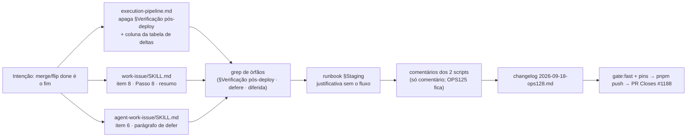

# Impl: Remover a verificação pós-deploy em staging do fechamento do `work-issue`

Status: aprovado
Atualizado em: 2026-09-18
Issue: #1188
Intenção: docs/plans/ops128-remover-verificacao-pos-deploy-staging-work-issue.md
Appetite restante: herdado (~0,5 dia eng; diff docs/comentários)

## Leitura da intenção

- **Outcome:** o fechamento do `work-issue` termina no merge/flip `done`; `work-issue`, `agent-work-issue` e `execution-pipeline.md` deixam de citar a §Verificação pós-deploy e o pool não "defere" passo que não existe; a infra de staging OPS125 (conta/scripts/senha/runbook) permanece; `bug-fix`/produção, `deploy.yml`, homeserver, DB prod e Consent/LGPD intocados; changelog OPS128; sem migration e sem UI.
- **O que NÃO negociar:** (1) nenhuma referência órfã à § nos 3 arquivos do fluxo (checklist, Passo 6/8, tabela de deltas); (2) infra OPS125 e var `STAGING_TEST_ACCOUNT_PASSWORD` ficam — só o fluxo deixa de exigi-las; (3) `bug-fix/SKILL.md:117-120` (pós-deploy manual de **produção**) e o Passo 8 do `bug-fix` (:126, prevenção — homônimo, dono outro) intocados; (4) sem renumerar passos; (5) `deploy.yml`/approval de produção fora do diff; (6) planos/changelogs OPS121/OPS125 imutáveis.
- **O que reavaliar:** os números de linha do explorador são o retrato de hoje — a remoção deve ser delimitada por **cabeçalho de seção e linhas da tabela**, nunca por offset cego; o Resumo final do `agent-work-issue` (:106-108) já está limpo (nada a fazer); o bloco §Design do pipeline (:87-93, "Fora do `designer` frontier de vez") é pin literal de `opencodeAgents.unit.spec.ts:146-148` e fica; o ponteiro cruzado `bug-fix/SKILL.md:106-109` dentro da seção removida está errado (real: `:117-120`) e morre com ela — **não** corrigir/perpetuar.

## Abordagem recomendada

**Opções consideradas:** A — apagar o passo dos dois SKILLs + a §Verificação pós-deploy do pipeline (a mecânica sai do dono; staging fica no runbook) | B — manter a mecânica no pipeline como opcional/manual e só tirar a obrigação | C — manter o poll, mas fire-and-forget.

**Recomendação:** **A** — é o pedido literal ("tirar a necessidade"): sem passo, sem dono, sem espera. O fechamento passa a declarar `Issue · impl plan · simplify + débitos · PR + merge`.

**Rejeitadas:** B porque deixa mecânica sem dono prometendo o que o item futuro vai redesenhar; C porque não remove a espera de fato nem dá dono ao resultado.

### Componentes / mudanças

- **`.agents/skills/work-issue/execution-pipeline.md`** → remover o bloco `## Verificação pós-deploy (staging)` inteiro (de :139 até a linha anterior a `## Deltas por ator`, :238 — inclui `### 1`/`### 2`/`### 3`/`### Fronteira dura`) e a **coluna** `Pós-deploy (staging)` da tabela de deltas (header :240, separador e as duas linhas de ator :242-243 inteiras, não só a célula). Preservar §Design :87-93.
- **`.agents/skills/work-issue/SKILL.md`** → remover item `8.` do checklist (:86); remover `## Passo 8 — Verificação pós-deploy em staging` (:186-197); `## Resumo final` (:201) volta a `Issue · impl plan · simplify + débitos · PR + merge`. Passos 1-7 intocados.
- **`.agents/skills/agent-work-issue/SKILL.md`** → item 6 do checklist (:43) perde `; Cloud ⇒ §Verificação pós-deploy **diferida** (registre a justificativa)`; remover o parágrafo `**Pós-deploy (staging):** ...` (:102-104). Resumo (:106-108) já correto — intocado.
- **`docs/ops/teqo-1313-deploy.md`** → ajustar só a justificativa da conta OPS125: :196 deixa de dizer que "a verificação pós-deploy do `work-issue` (OPS121)" a usa para logar e passa a "infra de teste do staging (OPS125), reutilizável; sem fluxo obrigatório desde a OPS128"; :212-215 mantém os limites de segredo (senha nunca no repo/PR/Issue/env do agente; agente nunca recebe `DATABASE_URL`) sem prometer o passo removido. **Manter** o passo 8 do bootstrap (:195-215), a var :146-151 e os limites :220-227.
- **`scripts/lib/staging-test-account.mjs`** (header :1-13) e **`scripts/bootstrap-staging-test-account.mjs`** (header :1-23) → edição **só de comentário**: trocar "the `work-issue` post-deploy verification (OPS121) logs in with" pela justificativa vigente (infra de staging reutilizável; runbook §Staging é o dono). Nenhuma constante, guard, import ou assinatura muda. Ver decisão (e).
- **`docs/changelog/2026-09-18-ops128.md`** (novo) → uma linha bold no formato de `2026-09-17-ops125.md`, additions-only; nunca tocar `docs/CHANGELOG-AGENTS.md` (gitignored) nem o HISTORY.
- **Migration:** sem migration. **Access/Consent:** nada tocado. **UI:** N/A (Impeccable A).
- **Intocados:** `.opencode/commands/work-issue.md`, `.agents/skills/bug-fix/SKILL.md:117-120` e `:126`, `.github/workflows/deploy.yml`, `AGENTS.md`/`AGENTS-infra.md`, `docs/AGENT-OPS.md`, `.agents/rules/**`, specs/pins existentes, planos/changelogs OPS121/OPS125.

### Dados → forma (se aplicável)

N/A — item de processo/skill; nenhuma superfície de dados (forma adiada na intenção).

## Fases verificáveis

1. **Mecânica — pipeline (tracer, ~2h).** Remover a § (:139→antes de `## Deltas por ator`) e a coluna da tabela. Gate: `## Fechar em main` emenda em `## Deltas por ator`; §Design :87-93 intacto; grep sem `Pós-deploy|§Verificação pós-deploy|defere`; `pnpm test:unit -- tests/unit/opencodeAgents.unit.spec.ts` verde.
2. **Deltas por ator (~1h).** `work-issue/SKILL.md` (item 8, §Passo 8, resumo) e `agent-work-issue/SKILL.md` (item 6, parágrafo) — só remoção. Gate: grep dos dois sem `§Verificação pós-deploy|Pós-deploy|diferida`; `pnpm test:unit -- tests/unit/skillsAutoFlag.unit.spec.ts tests/unit/opencodeCommands.unit.spec.ts` verdes.
3. **Runbook + comentários + changelog (~1h).** Justificativa da conta (:196, :212-215); comentários dos 2 scripts; entrada nova. Gate: `git diff` desses arquivos é só prosa; `check-changelog-append-only` verde (additions-only).
4. **Gates e entrega (~0,5h).** `pnpm gate:fast`; `pnpm push`; PR Ready `--base main` `Closes #1188` com o `*-impl.md` no commit. E2E local: **sem superfície de runtime — declarar "sem e2e afetado"** (OPS72 discricionário); o PR CI roda o **curado** (nunca zero, OPS86) porque `scripts/lib/staging-test-account.mjs` é `HIGH_RISK_EXACT` — custo aceito (o `verify` do deploy roda full).

## Rabbit holes / Não escopo (engenharia)

- **"Já que removeu, apaga a conta/scripts do OPS125."** Não — infra fica; só o fluxo deixa de exigi-la.
- **"Estende ao `bug-fix`/produção."** Não — `bug-fix/SKILL.md:117-120` é confirmação manual em **produção**; o "Passo 8" (:126) do mesmo arquivo é prevenção, homônimo sem relação.
- **"Renumerar os passos do `work-issue`."** Não — o checklist termina no 7; nenhum outro arquivo cita "Passo 8 do work-issue".
- **"Manter a coluna com `n/a`."** Não — coluna inteira sai; placeholder mantém viva a dimensão removida.
- **"Corrigir o pin errado `bug-fix/SKILL.md:106-109` → `:117-120`."** Não — o ponteiro morre com a seção; corrigir perpetuaria o cruzamento que o aceite elimina.
- **"Editar planos/changelogs OPS121/OPS125."** Não — históricos imutáveis.
- **"Criar guard que pine a ausência da seção."** Não — cerimônia sem volatilidade; os pins existentes bastam.
- **"Atualizar `AGENT-OPS.md`/`AGENTS*.md`."** Não — não descrevem o passo.

## Riscos e mitigação

- **Referência órfã:** grep final por `§Verificação pós-deploy|Pós-deploy|pós-deploy|defere|diferida` nos arquivos do fluxo; hits permitidos só no `bug-fix` (produção), históricos (changelog/planos OPS121/OPS125) e no nome do `it` de `stagingTestAccount.unit.spec.ts:26` (pin intocado).
- **Arrastar o §Design:** remover por limites explícitos e rodar o pin do literal "Fora do `designer` frontier de vez".
- **Tabela quebrada:** conferir as 4 linhas (header/separador/2 atores) com o mesmo número de `|`.
- **Tocar `bug-fix`/`deploy.yml` por engano:** `git status` deve listar só os 7 arquivos previstos.
- **Comentário em módulo high-risk vira `curated` no PR (OPS86):** declarado em (e); comment-only não muda comportamento — flake alheio no curado não é motivo para reverter o texto.
- **Changelog guard:** só o arquivo novo; agregado/HISTORY intocados.
- **Verify flaky em `main` (#1124) atrasar o deploy:** não é gate deste item (o merge já flipa `done`).

## Aceite de engenharia

- [ ] Aceite de produto coberto: fechamento termina no merge/flip; os 3 arquivos não citam a §; pool sem "defere".
- [ ] Invariantes: diff docs/comentário; sem migration/access/Consent/UI; infra OPS125 e `bug-fix`/produção intactos.
- [ ] Pins existentes verdes (`skillsAutoFlag`, `opencodeCommands`, `opencodeAgents:138-150`, `stagingTestAccount:26`); sem teste novo (não há write path).
- [ ] `pnpm gate:fast` verde; grep de órfãos limpo; `docs/changelog/2026-09-18-ops128.md` presente; PR `Closes #1188`.

## Decisões de engenharia

### (a) O que exatamente sai (D1)

**Opções:** A) apagar passo dos dois SKILLs + §Verificação pós-deploy do pipeline | B) manter a mecânica como opcional/manual | C) poll fire-and-forget.
**Recomendação:** **A** — pedido literal; remove a segunda fonte de verdade e deixa o runbook como dono do conhecimento de staging para o item futuro. Execução por cabeçalho de seção/coluna, nunca por offset cego.
**Rejeitadas:** B porque deixa mecânica sem dono; C porque não remove a espera nem dá dono ao resultado.

### (b) Destino da infra OPS125 (D2)

**Opções:** A) intocados (infra reutilizável) | B) remover conta/scripts/var.
**Recomendação:** **A** — zero custo parado e preserva a solução futura; só os comentários dos 2 scripts são reescritos (nada removido).
**Rejeitadas:** B porque destrói infra testada com guard fail-closed que o item futuro vai querer; fora do outcome.

### (c) Fronteira com o `bug-fix` (D3)

**Opções:** A) donos separados (prod no `bug-fix`; staging sai daqui) | B) unificar.
**Recomendação:** **A** — o pós-deploy do `bug-fix` é de produção, manual; nada nele muda. O cruzamento errado (`bug-fix/SKILL.md:106-109`) morre junto — não corrigir para `:117-120`, para não perpetuar o que o aceite elimina.
**Rejeitadas:** B porque misturaria confirmação humana de prod com um fluxo removido.

### (d) O que o fechamento passa a declarar (D4)

**Opções:** A) merge/flip é o fim, sem promessa nem "diferido" | B) registrar "não verificado em staging".
**Recomendação:** **A** — sem passo não há defer; humano e pool fecham em `... · PR + merge` (o resumo do pool já era esse).
**Rejeitadas:** B porque reintroduz menção ao passo removido e cria registro sem dono.

### (e) Editar os comentários dos scripts?

**Opções:** A) editar os headers dos 2 scripts (comment-only) | B) não editar e deferir a faxina ao item futuro de verificação pós-merge.
**Recomendação:** **A** — barato e coerente: nenhum teste/guard lê a prosa, o comportamento é idêntico e a referência órfã "the work-issue post-deploy verification logs in with" sai exatamente dos arquivos que o runbook passa a explicar. Efeito colateral declarado: `scripts/lib/staging-test-account.mjs` ∈ `HIGH_RISK_EXACT`/`SCRIPTS_SPEC_PINNED` (`test-affected-core.mjs:94,138-140`), então o PR CI passa de e2e `none` para `curated` (OPS86, nunca zero) — aceito porque o `verify` do deploy roda full. **Gatilho de revisitação:** quando o item futuro de teste pós-merge redefinir o uso da conta, o plano dele é dono da redação final dos comentários (e do runbook, se mudar); se o curado atrasar o PR por flake alheio, não reverter o comentário — é o preço do classifier, não do texto.
**Rejeitadas:** B porque deixa a referência órfã no módulo que "explica por que a conta existe" e transfere uma faxina de 5 minutos que cabe no appetite; editar só o header do bootstrap (não-high-risk) porque deixaria a fonte principal (a lib) desatualizada — pior que não editar.

## Débitos da sessão (simplify)

Triagem conservadora (nada a registrar no tracker): renomear o `it` órfão de `stagingTestAccount.unit.spec.ts`, limpar a anáfora em `staging-test-account.mjs` e os comentários do bootstrap = já resolvidos no diff; rótulo "agentes" no runbook = descartado (espelha a conta real `Agente de Teste (staging)` e o invariante OPS125); runbook §Staging não documenta o uso manual da conta = **defer com gatilho**: o item futuro de teste pós-merge (dono do desenho) atualiza a §Staging quando definir login/o quê testar.

## Self-score (decision-quality)

1. **Decisões caras têm rejeitadas?** Sim — (a) D1, (b) D2, (c) D3, (d) D4 e (e) comentários com Opções/Recomendação/Rejeitadas e gatilho. ✅
2. **Abordagem cabe no appetite?** Sim — ~4,5h (~0,5 dia), docs/comentários, sem migration/UI/teste novo; único desvio do "só markdown" são 2 headers de comentário, declarados em (e). ✅
3. **Rabbit holes nomeados?** Sim — apagar infra, estender ao bug-fix, renumerar, coluna com `n/a`, corrigir o pin errado, editar históricos, guard de ausência, docs de infra. ✅
4. **Depth check (edita o dono, não twina)?** Sim — a mecânica sai do dono único (`execution-pipeline.md`), os SKILLs só perdem deltas, o runbook segue dono do staging; nenhum módulo/utility/componente novo. ✅
5. **Intenção permanece satisfeita?** Sim — merge/flip é o fim, sem defer; infra e prod/`bug-fix` intactos; `deploy.yml`/DB/Consent/LGPD fora do diff. ✅

**Nota: 5/5.** Ressalva: o diff toca 2 headers de `.mjs` (comment-only) e por isso o PR roda o e2e curado — declarado em (e), sem impacto no aceite.
