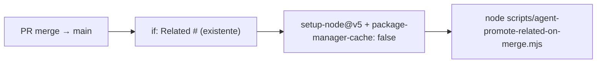

# Impl: OPS23 — Action de promote Related #N falha no merge (setup-node procura pnpm sem action-setup)

Status: aprovado
Atualizado em: 2026-08-10
Issue: #566
Intenção: body da Issue #566 (OPS23; chore sem plano de intenção próprio — o diagnóstico é a intenção)
Appetite restante: < 1h (1 linha de YAML + docs)

## Leitura da intenção

- **Outcome:** no próximo merge de PR com `Related #N`, o job `plan-issue-ready` roda de verdade e promove (ou soft-skipa) — nunca mais falha com `Unable to locate executable file: pnpm`.
- **O que NÃO negociar:** comportamento do job (promote idempotente OPS18) intacto; sem pnpm desnecessário; precedente de ci.yml respeitado.
- **O que reavaliar:** “adicionar `pnpm/action-setup@v6`” (hipótese da Issue) vs `package-manager-cache: false` — o precedente exato para job plain-Node já existe em 3 lugares.

## Abordagem recomendada

**Opções consideradas:**

- A) `with: package-manager-cache: false` no setup-node@v5 do job
- B) adicionar `pnpm/action-setup@v6` antes do setup-node
- C) trocar o runner para imagem com node pré-instalado (sem setup-node)

**Recomendação:** A — porque:

1. O job **não usa pnpm** (script plain Node: stdlib + `gh` CLI; sem `pnpm install` no workflow). Instalar pnpm é custo (~10–20s/run) sem ganho.
2. Precedente **exato** no repo para “script plain Node, sem pnpm”: `vercel-promote.yml:31-34`, `archive-cursor-agent.yml:19-22` e o job cooldown do `ci.yml:196-202` (que tem o mesmo comentário citado na Issue). O B (action-setup) é o precedente dos jobs que **rodam** pnpm.
3. setup-node@v5 com `package-manager-cache: true` (default) resolve o `packageManager` do package.json (`pnpm@10.11.0`) e procura o executável pnpm — com o cache desligado, não há busca.

**Rejeitadas:** B — adiciona pnpm a um job que nunca o chama (diverge do padrão do repo: action-setup só onde há `pnpm install`); C — quebra o padrão ubuntu-latest + setup-node de todos os workflows, sem benefício.

### Componentes / mudanças

- **`.github/workflows/plan-issue-ready-on-main-merge.yml`:** adicionar `package-manager-cache: false` ao `with:` do setup-node@v5 (mesmo shape de `vercel-promote.yml`/`archive-cursor-agent.yml`). Nada mais muda — gate `Related #`, env, script e permissões intactos.
- **`docs/CHANGELOG-AGENTS.md`:** entrada curta OPS23.
- **`docs/AGENT-OPS.md`:** sem mudança — a tabela/nota OPS18 já existe e não menciona o setup; verificar se a menção existe e fica correta.
- **Migration / Access / Consent / UI:** N/A.

## Fases verificáveis

1. **Fix YAML** — edição única no workflow + validação sintática local (parse YAML com `node -e` via pacote `yaml` se disponível, ou `python3 -c 'import yaml'`).
2. **Docs** — changelog.
3. **Gates** — `pnpm gate:fast` (sem DB necessário — chore de workflow; scripts não mudaram). Entrega com `pnpm push`.

**Validação funcional (aceite da Issue):** o trigger `pull_request closed + merged` só dispara em merges reais em `main` — não é exercitável no CI do PR aberto (e não deve ser: o próprio contrato OPS18 proíbe rodar antes do merge). A validação real é o **próximo merge de PR com `Related #N`** (ex.: este PR de fix, se documentar o relacionamento — o fix não contém `Related #`, então o primeiro disparo real provavelmente é o próximo PR de plano; runbook anotado na Issue).

## Rabbit holes / Não escopo (engenharia)

- Corrigir outros workflows: **varredura feita** — `ci.yml` (5/5 com action-setup antes; cooldown já com `package-manager-cache: false`), `ci-pr.yml` (10/10 com action-setup), `vercel-promote.yml` e `archive-cursor-agent.yml` já com `package-manager-cache: false`, `agent-pool.yml` com action-setup (usa pnpm). `plan-issue-ready` era o único com o bug latente.
- Adicionar actionlint/check de workflows ao CI — outra Issue se desejada; fora deste chore.
- Teste unitário do YAML — sem infra de teste de workflow no repo; validação = parse + revisão.

## Riscos e mitigação

- **YAML inválido → job quebra de outro jeito:** mitiga parse local antes do push + diff mínimo revisável (1 linha).
- **`package-manager-cache: false` não resolver:** contra-evidência — é o mesmo mecanismo usado no cooldown job do ci.yml que roda há dias sem falha; se aparecer novo sintoma, o fallback B (action-setup) é documentado nesta decisão.
- **Falso negativo na validação real:** o primeiro merge com `Related #` pode ser semanas depois — anotado na Issue como validação pendente (o próprio run 31381977772 provou que o job dispara; o fix é o pré-requisito que faltava).

## Aceite de engenharia

- [x] Aceite de produto da intenção ainda coberto (job roda e promove no próximo merge com `Related #N`)
- [x] Invariantes AGENTS/engineering-standards (sem schema/access/UI)
- [x] Testes de domínio: N/A — sem mudança de script; pin do parse/`canPromotePlanIssue` já existe no OPS18

Self-score decision-quality: 4/5
