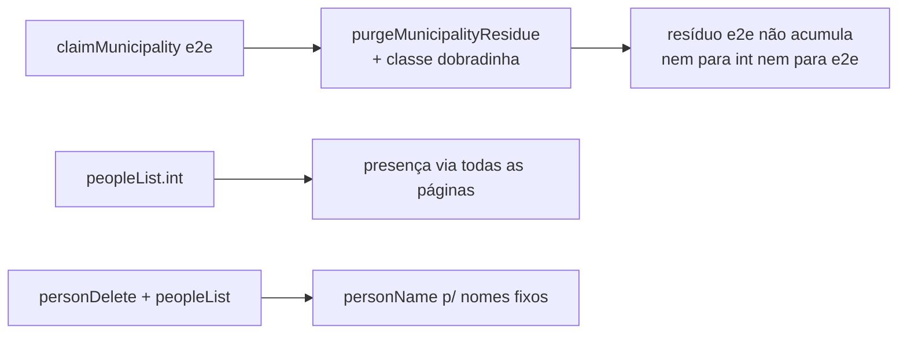

# Impl: e2e — campaignE2EFixtures deixa lixo no banco de teste (contamina int specs sob resíduo)

Status: aprovado
Atualizado em: 2026-08-13
Issue: #723
Intenção: body da Issue (sem `Plano:` linkado — o body é a spec)
Appetite restante: herdado (chore P2 — cleanup + robustez de specs)

## Leitura da intenção

- **Outcome:** runs e2e (E2E_PROD) não podem deixar lixo que quebre int specs
  pré-existentes; o cleanup do `campaignE2EFixtures` deve ser investigado e,
  se necessário, os nomes fixos dos int specs viram únicos por run.
- **O que NÃO negociar:** nenhum produto aqui — infra de teste. Invariantes a
  manter: nunca tocar prod, allocator de município (sequência Postgres) como
  contrato de exclusividade, regra de referência LGPD para deletar ficha
  órfã (mesma do `removeSupporterData` / D10 F1), nomes de spec continuam
  schema-válidos (letters+spaces/hyphens — `personName` existe para isso).
- **O que reavaliar:** a hipótese do body "owned de stateDeputy/contact via
  fixtures.payload.create?" — investigada e **falsa**: contact/stateDeputy
  criados pelo proxy SÃO auto-owned e descobertos pelo runID no cleanup
  normal. O vazamento real é de runs **crashados** (cleanup nunca roda), a
  mesma classe que os fixtures int já defendem com `purgeMunicipalityResidue`
  no claim — que o `claimMunicipality` e2e não faz.

## Diagnóstico (investigação da Issue)

1. **Cleanup e2e em run normal está completo** — proxy auto-own de
   `stateDeputy`/`contact` (`isOwnedCollection` + `discoverOwnedRows` por
   runID em name/email + derivação de stateDeputy via `contact in`). Resíduo
   observado ('Ciclo Liderança-<uuid>', 'Coordenadora C128-<uuid>',
   'deputado-<uuid>') só nasce quando o run morre antes do `finally` do
   fixture (timeout/worker morto).
2. **Classes de resíduo e2e** (verificado nas specs): dobradinhas + fichas
   vinculadas a município claimado (`campaignPeople` 183–237, 457–559 —
   `municipality.stateDeputies`), contas staff + fichas ('Coordenadora C128'),
   e lideranças/supporters/etc. (já purgáveis por município).
3. **Mecanismo do `peopleList.int.spec.ts`:** a lista de pessoas é GLOBAL e
   paginada (25/página, ordenada por nome); o advisor nasce como
   'Usuário advisor-<runID>' (ordena tarde). Com ≥25 linhas residuais, a
   ficha do advisor cai da página 1 → "advisorRow não achado" (maria/ana,
   que ordenam cedo, seguem visíveis — exatamente o sintoma descrito).
4. **Mecanismo do `personDelete.int.spec.ts`:** nome fixo 'Maria de Jesus' +
   invariante global de nome de dobradinha (`assertStateDeputyNameAvailable`,
   `src/utilities/stateDeputy/nameInvariant.ts`) — dobradinha residual com o
   mesmo nome bloqueia o create do spec.

## Abordagem recomendada

**Opções consideradas:**

- **A — purge no claim (espelhar int) + estender `purgeMunicipalityResidue`
  para a classe dobradinha + robustez dos 2 int specs.** O resíduo e2e
  desaparece no próximo claim (contrato do allocator garante dono único), os
  int specs deixam de depender de estado global.
- **B — só nomes únicos nos int specs.** Não resolve o peopleList (a poluição
  de página não é por nome, é por volume) nem a acumulação do resíduo e2e.
- **C — sweep global por padrão de nome no setup e2e.** Fragil e perigoso:
  contas staff usam emails `@example.com` como os runs vivos — mataria runs
  paralelos.

**Recomendação:** **A** — porque ataca a fonte (resíduo some no claim,
mesmo precedente do `getMunicipality` int), e a robustez dos specs fecha o
resto (resíduo não-purgeável: contas staff de run crashado — ~1–2 linhas por
crash, sem âncora de município e sem padrão seguro). A classe dobradinha é
purgeável porque SEMPRE está vinculada ao município claimado pelo próprio run.

**Rejeitadas:** B sozinha (não cobre peopleList nem a acumulação); C (perigosa
— padrões coincidem com runs vivos).

### Componentes / mudanças

- **`purgeMunicipalityResidue`** (`tests/helpers/campaignFixtures.ts`):
  estende a purga para a classe dobradinha — lê `municipality.stateDeputies`
  do município claimado, deleta os `stateDeputy` residuais, deleta as fichas
  órfãs (mesma checagem de referências do D10 F1: leadership/signature/
  subscription/supporter + `campaignUser.contact` — resíduo C99) e limpa o
  campo `stateDeputies: []`. Seguro pelo contrato do allocator: nenhum run
  vivo opera o município claimado (guard `testMunicipalityAllocatorConventions`).
- **`CampaignE2EOwnership.claimMunicipality`** (`tests/e2e/fixtures/campaignE2EFixtures.ts`):
  chama `purgeMunicipalityResidue(this.rootPayload, municipality.id)` após o
  find — espelha `getMunicipality` int (mesma sequência, mesmo contrato).
- **`peopleList.int.spec.ts`**: helper local `loadAllPeopleRows` (páginas
  1..totalPages) para as asserções de presença; facets seguem globais na
  página 1 (já são calculadas sobre o conjunto scoped, pré-paginação).
- **`personDelete.int.spec.ts` / `peopleList.int.spec.ts`**: nomes fixos →
  `fixtures.personName(prefix)` (schema-válido, único por run), vinculando o
  nome nas asserções que o usam (`manifest?.contact.name`, `toMatchObject`).
- **Migration:** sem migration (teste/helpers apenas).
- **Access / Consent:** nenhum — fixture/helpers de teste; a checagem de
  órfã usa o mesmo critério do fluxo de produção (fail-closed).
- **UI:** não há.

### Dados → forma

N/A (sem UI).

## Fases verificáveis

1. **Purga + claim e2e** — estender `purgeMunicipalityResidue`; ligar no
   `claimMunicipality` e2e; `pnpm test:int -- campaignFixtures` (a spec de
   invariante de contagem usa DB próprio) + gate unit (`testMunicipalityAllocatorConventions`).
2. **Int specs robustos** — `loadAllPeopleRows` em peopleList; `personName`
   em personDelete + peopleList; `pnpm test:int` (arquivos-alvo).
3. **Gates** — `pnpm gate:fast`; e2e do `campaignPeople` em dev para provar o
   purge no claim; `pnpm push` (débitos via capture-review-debts autônomo).

## Rabbit holes / Não escopo (engenharia)

- **Sweep de contas staff residuais** (sem âncora; padrão coincide com runs
  vivos) — registrado como débito, não corrigido aqui.
- Migrar os outros specs com nomes fixos de liderança ('Maria da Silva' etc.
  em campaignInvite/campaignLeadership) — liderança não tem invariante de
  nome; o resíduo não as quebra (fora de escopo).
- `campaignFixturesRowCounts` usa DB dedicado — não afetado.
- **Ambiente da máquina (registrado como débito):** a coleção e2e local
  quebra no load de `src/utilities/documents.ts` (`Cannot find module
'next/cache'` — ESM nativo não resolve subpath sem exports; `next/cache.js`
  existe, `next/cache` não). Reproduz no main repo e sob Node 20/24.14/24.18
  — pré-existente ao OPS45, fora de escopo; a verificação e2e fica para o CI
  do PR.

## Riscos e mitigação

- **Purga deletar linha de run vivo:** mitigado pelo contrato do allocator
  (nenhum claim por slug fixo — guard unit existente) + checagem de
  referências antes de deletar ficha órfã.
- **peopleList mais lento (paginação):** 25 linhas/página, poucos reads —
  custo desprezível; semanticamente idêntico (presença global).
- **`purgeMunicipalityResidue` compartilhada int+e2e:** o e2e passa a pagar a
  mesma purga que o int já paga; sem mudança de comportamento para o int
  além da nova classe dobradinha (resíduo, por definição não referenciado).

## Aceite de engenharia

- [x] Aceite de produto da intenção coberto (cleanup investigado + nomes fixos únicos + resíduo não acumula)
- [x] Invariantes AGENTS/engineering-standards (allocator, D10 F1, personName)
- [x] Testes previstos: unit do allocator (já existente), int dos dois specs, e2e campaignPeople
