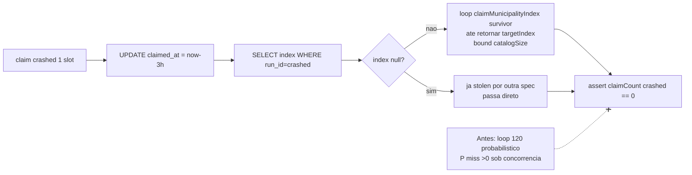

# Impl: Débito — teste de steal do allocator dependente do cursor

Status: aprovado
Atualizado em: 2026-08-24
Issue: #790
Intenção: docs/plans/ops46-debt-steal-test-deterministico.md
Appetite restante: P3 chore — mínimo (herdado)

## Leitura da intenção

- **Outcome:** `tests/int/campaignMunicipalityAllocator.int.spec.ts:106-136` estável sob suíte int completa em re-runs — sem flake por cursor não visitar slot stale.
- **O que NÃO negociar:** invariante `claimCount(crashed)==0` após steal; TTL `STALE_CLAIM_WINDOW = '2 hours'` (`tests/helpers/campaignMunicipalityAllocator.ts:33`); owner único `tests/helpers/campaignMunicipalityAllocator.ts` (vitest-free, sequence `campaign_fixture_municipality_alloc` + claims table) — não twinar; `push:false` / sem migration de produto (test-infra).
- **O que reavaliar:** "precisa mexer no owner para expor `tryStealStaleClaim`" — refutado; SELECT do `index` já é possível com padrão `claimCount` existente, sem expor interna.

## Abordagem recomendada

**Opções consideradas:** A | B | C
**Recomendação:** **A — SELECT do índice alvo + cursor dirigido via API pública** — porque torna o teste determinístico com bound `catalogSize` sem expor internas, reusando só `claimMunicipalityIndex` (contrato público já consumido por `campaignFixtures.ts` e `campaignE2EFixtures.ts`) e padrão SQL já estabelecido no próprio spec.
**Rejeitadas:** B porque exporia `tryStealStaleClaim`/`nextAllocationValue` do owner para teste — cria acoplamento e viola "Edit the owner, don't twin" / guard `testMunicipalityAllocatorConventions` que proíbe `nextval` fora do owner; C porque manter loop probabilístico com bound maior (120→N) ou sleep só reduz `P(miss)`, não zera — continua flaky sob carga paralela.

### Componentes / mudanças

- **`tests/int/campaignMunicipalityAllocator.int.spec.ts:106-136`** (único arquivo tocado): reescrever `it('steals claims of a crashed run...')` — após `UPDATE claimed_at` fazer `SELECT "index" FROM "campaign_fixture_municipality_claims" WHERE "run_id"=${crashed}` (mesmo padrão de `claimCount:36-43` com `sql`+`sql.raw` para identificadores); se `null` → já stolen (outra spec roubou antes da query — tratar como sucesso, não falhar); senão loop `for attempt < catalogSize` chamando `claimMunicipalityIndex(payload, catalogSize, survivor)` até `returned === targetIndex`, então `expect(claimCount(crashed)).toBe(0)`. Manter `releaseMunicipalityClaims` no final.
- **`tests/helpers/campaignMunicipalityAllocator.ts`** — **não alterar** (owner vitest-free intacto; depth check: reusar).
- **Migration:** sem migration (só teste).
- **Access / Consent:** não se aplica (test-infra, sem `src/`).
- **UI:** não se aplica.

### Dados → forma (se aplicável)

Não se aplica — test-infra puro (read SQL + API pública). Forma rejeitada: helper novo no owner para "steal dirigido".

## Fases verificáveis

1. **Tracer — steal determinístico** (quota: minutos): editar só o `it` stale; `pnpm test:int -- campaignMunicipalityAllocator` verde isolado; checar `SELECT index` retorna 1 row e loop consome ≤`catalogSize` claims.
2. **Estabilidade sob concorrência** — suíte int completa `pnpm test:int` (92 arquivos / ~819 testes) ×3 re-runs verdes; suíte int sem filtro (todos workers paralelos) — alvo nunca falha por miss de cursor.
3. **Gates** — `pnpm gate:fast` (lint + typecheck + unit); `pnpm check:cycles`; `pnpm exec knip` sem novo erro; `pnpm push` (gate:push replica `ci-pr.yml` checks).

## Rabbit holes / Não escopo (engenharia)

- **Outro spec rouba stale antes do SELECT → `index=null`:** tratar como já stolen (assert `claimCount==0` passa) — não falhar nem re-criar claim. Não adicionar retry de SELECT.
- **Expor `tryStealStaleClaim`/`nextval` para teste:** não escopo — manter encapsulamento do owner.
- **Loop sem bound ou bound > catalogSize:** não escopo — `claimMunicipalityIndex` já itera `catalogSize` internamente (`campaignMunicipalityAllocator.ts:104`); bound externo = `catalogSize` é suficiente para visitar todo espaço uma vez.
- **Mudar TTL `STALE_CLAIM_WINDOW` (2h) ou `claimed_at` aging para outro valor:** não escopo — TTL é contrato de produção do registry.
- **Invariantes do `engineering-brief` (Consent/LGPD, URL pública):** não aplicáveis — test-infra; mas "não twinar owner" permanece.

## Riscos e mitigação

- **Race `SELECT` vs steal concorrente (janela entre UPDATE e SELECT):** mitigado pelo branch `index==null` → considera já stolen; invariante final ainda é `claimCount==0`.
- **Loop dirigido nunca retorna `targetIndex` (catálogo cheio de claims vivos):** com `catalogSize=40` sintético e só 2 runs no teste, 38 slots livres — exaustão impossível; bound garante saída determinística sem hang.
- **Regressão do guard `testMunicipalityAllocatorConventions`:** mitigado por usar só `claimMunicipalityIndex` pública + `sql`/`sql.raw` (padrões já permitidos).
- **Flake mascarado virar falso-positivo:** mitigado por assert duplo — `stolen` via chegada no índice OU `null` inicial + `claimCount(crashed)==0` final.

## Aceite de engenharia

- [ ] Aceite de produto da intenção ainda coberto (spec estável sob suíte int completa, invariante `claimCount(crashed)==0` preservado)
- [ ] Invariantes AGENTS/engineering-standards (só teste; sem migration; sem twinar owner; `push:false` respeitado)
- [ ] Testes de domínio previstos (int spec existente reescrito determinístico; sem novo teste necessário; suíte int completa como prova)

Self-score decision-quality: **5/5** — 1) decisões caras com rejeitadas (A|B|C + porquês); 2) cabe no appetite P3 mínimo (1 arquivo, só teste); 3) rabbit holes nomeados (5); 4) depth check reusa owner/helpers existentes; 5) outcome da intenção intacto (engenharia não reescreveu produto).
