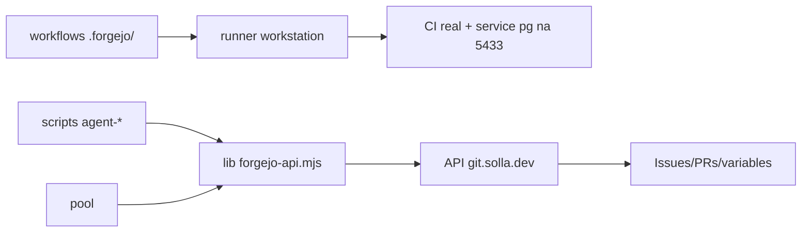

# Impl: Migrar o CI e o paradigma de agentes do GitHub para o Forgejo

Status: aprovado
Atualizado em: 2026-08-16
Issue: #1
Intenção: docs/plans/ops50-ci-github-para-forgejo.md
Appetite restante: ~2–3 dias eng

## Leitura da intenção

- **Outcome:** zero dependência do GitHub — CI, Issues, PRs, pool e docs rodando nativamente no Forgejo, sem fallback.
- **O que NÃO negociar:** deploy de produção continua gated pelo CI; runner não é re-registrado sem necessidade; nenhum push re-dispara builds Git da Vercel; uma fonte única de tracker (Forgejo).
- **O que reavaliar:** a hipótese de direção está correta, mas a exploração revelou **3 fatos novos** que mudam a abordagem:
  1. **CI do Forgejo está verde de mentira hoje.** O service `postgres:17-alpine` dos jobs falha no runner (`Bind for 0.0.0.0:5432 failed: port is already allocated` — a workstation tem o Postgres canônico na 5432) e o act_runner v0.2.11 **marca o job como success mesmo assim** (prova: run 119 — static/int/build/e2e×2 "passaram" em ~4s cada). O outcome "CI verde no Forgejo" exige corrigir isso e **provar com evidência** (duração/log), não com badge.
  2. **`gh` não existe em nenhuma máquina de trabalho** e os workflows chamam `gh` direto (requeue, automerge, labels). A API REST do Forgejo é GitHub-compatível e os scripts já são Node — a porta é direta, sem binário.
  3. **A API externa do Forgejo passa pela Cloudflare** (erro 1010 para clientes sem UA de navegador) — o pool (workers Cursor Cloud) precisa de caminho testado, não assumido.

## Abordagem recomendada

**Opções consideradas:**

- **A)** `gh` CLI com `GH_HOST=git.solla.dev` — exige instalar o binário em 3 lugares (workstation, workers Cursor Cloud, imagem do runner) e `gh pr merge --auto` não é suportado na API do Forgejo. **Rejeitada.**
- **B)** API REST direta via `fetch` do Node 24, numa lib nova `scripts/lib/forgejo-api.mjs`, mantendo a superfície de comandos (`pnpm agent:*`, `pnpm issue`). Sem dependência de binário, funciona em todo lugar com um token (`FORGEJO_API_TOKEN` ou o `GITHUB_TOKEN` nativo do Forgejo Actions). **Recomendada** — é a recomendação B já validada no gate da intenção.
- **C)** `tea` (CLI do Gitea) — outro binário externo, menos maduro que a API. **Rejeitada.**

### Componentes / mudanças

- **`scripts/lib/forgejo-api.mjs`** (novo): cliente REST mínimo (fetch + headers `Authorization: token` + `User-Agent` explícito para passar o WAF), funções `issueList/get/create/updateLabels/comment`, `prCreate/mergeWhenChecksSucceed`, `workflowDispatch`, `actionsVariables`. Node puro (fetch nativo), sem deps — usável dentro de jobs de workflow sem `pnpm install`.
- **`scripts/lib/agent-github.mjs`** (substituído): as funções `gh`/`ghJson` morrem; os callers passam a usar `forgejo-api.mjs`. Os helpers de frontmatter/labels/prioridade permanecem (são agnósticos de host). URLs de output viram `git.solla.dev/fsolla/teqo`.
- **`scripts/agent-*.mjs` + `scripts/issue.mjs`**: mesma superfície (`register|claim|ready|prioritize|status|file-miss|pool`), backend retargetado. O guard de "só Issues `blocked`+plano" etc. não muda.
- **`scripts/agent-pool-*.mjs`**: pool passa a listar/claimar no Forgejo; estado do pool em **Actions variables do Forgejo** (endpoint existe em Forgejo 9 — confirmar no spike); `POOL_GITHUB_TOKEN` → `POOL_FORGEJO_TOKEN` (PAT criado por humano).
- **`.github/workflows/*.yml` → `.forgejo/workflows/*`** (8 arquivos + `.github/actions/cancel-workflow-on-failure` → `.forgejo/actions/`):
  - service postgres **por job em porta própria** (host do runner tem a 5432 canônica ocupada; services publicam na porta do host): int=5433, build=5434, e2e×2=5435/5436 + `DATABASE_URL` dos jobs correspondente — elimina colisão e permite concorrência;
  - **capacidade do runner sobe de 1 para 4** (`capacity: 4` no `~/.act_runner/config.yaml` da workstation + `systemctl --user restart act-runner` — configuração, não re-registro; workstation tem 16 cores/61GB, folga medida);
  - cache de browsers do Playwright via `actions/cache` (cache server do runner já habilitado);
  - chamadas `gh …` dentro dos jobs substituídas por scripts Node da lib (requeue via `workflowDispatch`, automerge via poll+merge, labels/comments via API);
  - `ci.yml` mantém o deploy Vercel gated (até o cutover de hospedagem, fora deste item);
  - verificação de honestidade: o job `checks` passa a exigir evidência de execução real (os jobs escrevem duração num output lido pelo checks; spike define o mecanismo mais simples).
- **Tracker:** migrar as **11 Issues abertas do GitHub** para o Forgejo (mesmo frontmatter + labels), via script one-shot (lê API pública do GitHub, cria no Forgejo). Histórico GitHub congela (arquivar o repo é passo humano final).
- **Docs/skills/rules (59 arquivos em `.agents/` + `AGENTS.md` + `docs/AGENT-OPS.md` + `docs/roadmap.md`):** reescrever referências — `gh pr …` → scripts equivalentes, github.com/fsolla/teqo → git.solla.dev/fsolla/teqo, "GitHub Issues" → "Issues do Forgejo". Nomes de comandos `agent:*` preservados para minimizar diff.
- **`scripts/configure-branch-protection.mjs`**: portado para o Forgejo (POST `/branch_protections`, required status checks com os contextos reais observados após P1). Execução é passo humano (`pnpm configure:branch-protection`).
- **Secrets (humano):** criar no Forgejo: `VERCEL_TOKEN`, `VERCEL_ORG_ID`, `VERCEL_PROJECT_ID`, `CURSOR_API_KEY`, `POOL_FORGEJO_TOKEN` (PAT com escrita no repo). O `GITHUB_TOKEN` nativo do Forgejo cobre o resto.
- **Migration:** sem migration (não toca schema).
- **Access / Consent:** N/A.
- **UI:** A — sem UI.

## Fases verificáveis

1. **Spike (probe, sem merge):** service postgres na 5433 alcançável do job? POST externo em git.solla.dev passa com UA (WAF)? Endpoints Forgejo 9: actions variables, merge com `merge_when_checks_succeed` (ou poll+merge), workflow dispatches, status checks observados.
2. **Workflows nativos** — `.forgejo/workflows` completos; PR do próprio OPS50 roda e **prova** CI verde com evidência (duração real dos jobs, e2e de verdade).
3. **Lib + scripts do agente** — `forgejo-api.mjs` + retarget de `agent-*`/`issue` + unit tests (request-building/labels/state com fetch injetado).
4. **Pool** — `agent-pool-*` no Forgejo (state em variables), prompt/env dos workers atualizado.
5. **Tracker + docs** — migração das 11 Issues abertas, reescrita dos 59 arquivos + docs canônicos; `infra-solla/STATE.md` anotado (repo separado).
6. **Cutover + hardening** — branch protection aplicado (humano), secrets (humano), pool stop→start, arquivar GitHub (humano), checklist final (ciclo completo de Issue no Forgejo: register→claim→PR→merge→done).

## Rabbit holes / Não escopo (engenharia)

- Migrar histórico completo de Issues/PRs do GitHub — fora (congela).
- Trocar o runner act_runner → forgejo-runner nativo — fora (o bug de false-green é contornado com porta + evidência; upgrade vira item futuro se aparecer outro).
- Escalar além de capacity 4 / registrar runners extras — fora (capacidade 4 cobre o DAG atual; se o e2e crescer, item futuro).
- Cutover de hospedagem Vercel→homeserver — OPS51/OPS52/infra §7.
- Cloudflare WAF: se o spike provar bloqueio a clientes externos legítimos, o fix é regra WAF na Cloudflare (passo humano, creds em infra-solla) — registrado como débito se necessário.

## Riscos e mitigação

- **WAF bloqueia workers Cursor Cloud** (datacenter IPs). Mitigação: UA explícito no cliente; spike testa de fora; fallback = regra WAF `/api/v1/*` (humano) antes de P4.
- **Service port mapeia para o host do runner** (semântica act_runner): portas por job (5433–5436) eliminam colisão, mas a verificação do spike é pré-condição de P2; fallback = subir o postgres como container via step (`docker.sock` já é bindado no job).
- **Pool em transição:** entre o merge e o archive do GitHub, o tracker muda de lugar — durante a transição **não registrar Issues novas** (humano avisado no fechamento); o supervisor agenda continua no Forgejo a cada 10 min com o workflow novo após o merge.
- **Deploy de prod vermelho até secrets no Forgejo** — o job já fail-closed em credencial ausente (requeue retorna quando os secrets entrarem).
- **Capacity 4 com pico de memória:** 4 jobs pesados simultâneos ≈ 24–28GB — cabe (35Gi livres medidos); o spike mede um run real antes do cutover.
- **59 arquivos de docs reescritos** — grep de saída (`gh pr`, `github.com/fsolla`, `GitHub Issues`) no gate para provar zero resíduo; knip/cycles cobrem imports.

## Aceite de engenharia

- [ ] Aceite de produto da intenção ainda coberto (workflows nativos, scripts operacionais, docs Forgejo, secrets + branch protection, issues no Forgejo, deploy gated, runner intacto)
- [ ] Invariantes AGENTS/engineering-standards (sem segredos no repo; commits sem secrets; sem push direto fora do `pnpm push`)
- [ ] Testes unit do lib `forgejo-api` (request/labels/state) onde os scripts mudam
- [ ] Evidência de CI honesto: duração real dos jobs no run do próprio PR
