# Impl: Migrar a media de produção do Vercel Blob para o Garage S3

Status: aprovado (revisado 2026-08-18 — A→B: ver "Revisão em execução")
Atualizado em: 2026-08-18
Issue: #3 (OPS52)
Intenção: docs/plans/ops52-blob-vercel-para-garage.md
Appetite restante: herdado (~1 dia)

## Revisão em execução (2026-08-18, gate com o humano)

**A premissa da opção A caiu:** o Garage v2.1.0 **não suporta acesso anônimo na API
S3** — não há `--public-read` no CLI (`bucket allow` exige key real; testei
`anonymous`/`anon` → `NoSuchAccessKey`) e o source confirma ("when we support
anonymous access in the future"). O único serving público é o website mode
(`s3_web` 3902 + root_domain + DNS/cert) — infra fora do apetite.

**Revisão para B (aprovada pelo humano, "desde que funcione"):** bucket **privado**;
sem `disablePayloadAccessControl`, o plugin injeta o `staticHandler` do S3 nos
handlers da collection — o Payload serve `/media/file/<filename>` streamando o
objeto do Garage (headObject + getObject via SDK, range/etag-304 nativos).
`media.url` continua **relativa** (`/media/file/<filename>`) — o MESMO contrato que
as 40 rows já têm → a OPS52-media (#10) restaura os objetos e o site renderiza
sem reescrever banco. `S3_PUBLIC_URL` foi **removida** das envs (não gera mais URL
absoluta). Tráfego de mídia passa pelo container (irrisório: ~40 capas).

**O corpo abaixo já reflete a opção B.**

## Leitura da intenção

- **Outcome:** media inteiramente no Garage S3 (uploads novos + seed), sem dependência do Vercel Blob; guardrail de que cada ambiente aponta para o bucket certo; upload sem credencial falha com erro claro, nunca grava em lugar errado.
- **O que NÃO negociar:** fail-closed sem credencial de storage; seed idempotente; URLs públicas estáveis (posts/emails antigos não podem quebrar por causa da troca).
- **O que reavaliar:**
  - _"Objetos existentes migrados do Blob"_ — **falso por evidência**: o achado da OPS51 (documentado na Issue #10) é que as 40 rows de `media` têm URLs **relativas** (`/api/media/file/…`) e os arquivos não existem em lugar nenhum (404 até no Vercel atual). **Não há URLs do domínio do Blob embutidas no conteúdo publicado** → o anti-goal "manter dois storages vivos" e a questão "redirect do domínio antigo" **desaparecem**: não há nada a redirecionar. A recuperação dos arquivos é a Issue #10 (dependente desta); esta entrega deixa o storage pronto.
  - _"Contrato de URL pública"_ — com a opção B, o contrato é o **mesmo de hoje**: `media.url` relativa (`/api/media/file/<filename>`), servida pelo proxy do Payload; o frontend (que usa `media.url` direto como `src` e `toAbsoluteUrl` para OG) continua funcionando sem reescrita.
  - _"Store compartilhada entre ambientes"_ — hoje `BLOB_READ_WRITE_TOKEN` é compartilhado; o próprio prod (`~/stack/teqo-1313.env`) **não tem token nenhum** hoje. A troca resolve por construção: dev sem `S3_*` → storage local; com `S3_*` → bucket explícito por ambiente.

## Abordagem recomendada

```mermaid
flowchart LR
  A[admin upload] --> P[payload.create media]
  P -->|sem S3_* envs| L[storage LOCAL<br/>media/ dir, dev/test]
  P -->|S3_* envs completas| S3[s3Storage plugin<br/>@payloadcms/storage-s3]
  S3 --> G[Garage homeserver<br/>bucket teqo-media PRIVADO]
  B[navegador] -->|GET /api/media/file/&#60;file&#62;| X[Payload staticHandler]
  X -->|GetObject SDK| G
  D[seed-posts] -->|payload.create| S3
  D -->|overwrite nativo do S3| I[idempotente por filename]
```



**Opções consideradas:** A (URL direta no bucket — inviável: Garage v2 sem acesso anônimo) | B (proxy do Payload via staticHandler do plugin — **adotada**) | C (adapter custom via `@payloadcms/plugin-cloud-storage`)
**Recomendação:** **B** — `s3Storage` do `@payloadcms/storage-s3` sem `disablePayloadAccessControl`: o plugin injeta o `staticHandler` que streama o objeto do Garage em `/media/file/<filename>` (range/etag-304 nativos), mantendo o contrato de URL relativa e o bucket privado. Zero infra nova (sem DNS/túnel/public-read).
**Rejeitadas:** A (impossível no Garage v2.1.0: sem acesso anônimo na API S3; website mode exigiria expor 3902 + root_domain + DNS/cert — infra fora do apetite); C (adapter custom reimplementa handleUpload/handleDelete/generateURL do zero — o plugin oficial já faz; custo sem ganho).

### Componentes / mudanças

- **`src/payload.config.ts`**: trocar `vercelBlobStorage` → `s3Storage` (plugin só incluído quando habilitado):
  ```ts
  ...(mediaStorage.enabled
    ? [
        s3Storage({
          collections: { media: true }, // sem disablePayloadAccessControl → proxy
          bucket: mediaStorage.bucket,
          config: {
            credentials: { accessKeyId, secretAccessKey },
            region: mediaStorage.region, // 'garage' (s3_region do garage.toml)
            endpoint: mediaStorage.endpoint,
            forcePathStyle: true, // path-style: endpoint/<bucket>/<key>
          },
        }),
      ]
    : []),
  ```
  Sem `acl` (Garage não suporta ACL), sem `clientUploads`/`signedDownloads` (server uploads; bucket privado).
- **`src/utilities/mediaStorage.ts`** (novo — módulo puro, unit-testado): `resolveS3StorageEnv(env)` → `{ enabled, bucket, endpoint, region, accessKeyId, secretAccessKey }` ou **throw no boot** com a lista exata das envs faltantes quando a configuração é **parcial** (alguma `S3_*` presente, nem todas). Todas ausentes → `enabled: false` (dev/test usam storage local). Fail-closed: config parcial nunca sobe (nem endpoint default da AWS, nem bucket errado).
- **Env (`S3_*`)** — `.env.example`, `.env.test`, `scripts/worktree.mjs` (`s3EnvCopiedLines` all-or-nothing em `scripts/lib/worktree-env.mjs`, unit-testada) no lugar de `copy('BLOB_READ_WRITE_TOKEN')`:
  - `S3_ENDPOINT` — prod `http://100.119.220.31:3900` (tailnet do homeserver); dev pode usar a mesma ou bucket próprio
  - `S3_REGION` — `garage` (default; opcional)
  - `S3_BUCKET` — prod `teqo-media`; dev/test: bucket próprio se quiser S3, senão vazio (storage local)
  - `S3_ACCESS_KEY_ID` / `S3_SECRET_ACCESS_KEY` — key `teqo-key` já existente (read/write no bucket)
- **`scripts/seed-posts.mjs`**: remover `blobDel` (`@vercel/blob`) e o pre-delete — o `PutObject` do S3 **sobrescreve** o key determinístico `<slug>.<ext>` nativamente (o problema do `put` sem `allowOverwrite` era específico do Blob); idempotência = lookup por filename no DB (já existe) + overwrite do storage.
- **`package.json`**: `remove @payloadcms/storage-vercel-blob` + `@vercel/blob`; `add @payloadcms/storage-s3@3.82.0`. Rodar `pnpm generate:importmap` (desaparece `VercelBlobClientUploadHandler` do importMap).
- **`.cursor/cloud-setup.sh`**: remover o sed morto de `YOUR_BLOB_TOKEN_HERE` (o placeholder saiu do `.env.example`).
- **Migration:** nenhuma (config-only; `url` é virtual field do upload).
- **Access / Consent:** nada muda (`media.read` é público; `canManagePublishedContent` intocado).
- **UI:** N/A (Impeccable A).
- **AGENTS.md + docs**: atualizar as menções a Blob/media (contexto → resolvido; "Seeding news content" → upload via storage configurado, sem pre-delete; worktree copy `S3_*`). Entrada nova em `docs/changelog/2026-08-18-ops52.md` + `pnpm changelog:build`.

### Estado real do Garage (verificado 18/08, read-only via API admin)

- Bucket **`teqo-media` existe** (0 objects, criado 14/08) + key **`teqo-key`** com read/write nele. **Fica privado** (nada de public-read — nem existe no v2). A secret key não está em nenhum `.env` do homeserver — recuperável via `GET /v0/key?id=` e vai para `~/stack/teqo-1313.env` no cutover.
- Túnel `garage.solla.dev` → localhost:3900 ativo, mas o **endpoint de uso é o tailnet** `http://100.119.220.31:3900` (tráfego de mídia não passa pelo túnel público).

## Fases verificáveis

1. **Core** — módulo `mediaStorage.ts` + unit tests; swap do plugin na config; `pnpm generate:importmap`; `pnpm exec tsc --noEmit` + `pnpm lint` + `pnpm format` + `pnpm exec knip` + `pnpm check:cycles`; `pnpm test` (unit + int). Verificar que dev sem envs sobe e que config parcial lança no boot.
2. **Seed + envs** — remover blobDel; `.env.example`/`.env.test`/`s3EnvCopiedLines` (lib + worktree.mjs) + testes; conferir idempotência.
3. **Prova de contrato (executada 18/08)** — upload/GET/DELETE de objeto probe via SDK S3 (SigV4) contra o tailnet; depois media criada pelo Payload local com S3 ativo → `media.url` relativa + `GET /api/media/file/<file>` → 200 image/png (streaming do Garage); bucket devolvido a 0 objects e `.env.local` do worktree limpo das credenciais.
4. **Gates** — `pnpm gate:fast`; `pnpm build` local.

## Rabbit holes / Não escopo (engenharia)

- **Recuperar os 40 arquivos de media** — Issue #10 (OPS52-media), dependente; a forma final dela usa o storage desta entrega.
- **Excluir a store do Vercel Blob** — só após cutover estável (documentado, fora do merge).
- **Presigned URLs / ACL por objeto / CORS de clientUploads** — bucket privado + server uploads + proxy; nada disso aplica.
- **`teqo-media-dev`** — não criar por padrão: dev sem envs usa storage local (isolado por construção). Se um dev quiser S3 local, o `.env.example` documenta bucket próprio.
- **Migração de URLs no banco** — as 40 rows relativas são da Issue #10; nenhuma reescrita em massa aqui (e não há URLs Blob publicadas para redirecionar).

## Riscos e mitigação

- **Serving do proxy não funcionar com o Garage** → mitigação: fase 3 provou o contrato ponta a ponta (payload.create com S3 ativo → `GET /api/media/file/...` → 200) antes do merge; o `staticHandler` do plugin é o caminho padrão do Payload.
- **Garage rejeitar algo do SDK** (ex.: ACL, encoding de key) → sem `acl`; chaves são `<slug>.<ext>` simples; probe real executado na fase 3.
- **Boot de produção sem envs completas** → guard no `buildConfig` lança com a lista exata de faltantes; o runbook do deploy (OPS53 + `~/stack/teqo-1313.env`) seta as 5 `S3_*` (4 requeridas + região opcional) antes do rebuild.
- **Dev perdendo a habilidade de subir media** → melhoria, não regressão: hoje sem token o upload quebra; com `enabled: false` o dev grava no storage local e o admin local funciona.
- **Credenciais de prod em worktree** → `s3EnvCopiedLines` só copia all-or-nothing do main; dev deve manter bucket próprio (contrato do `.env.example`).

## Aceite de engenharia

- [ ] Aceite de produto da intenção ainda coberto (storage Garage + seed + fail-closed + ambientes separados)
- [ ] Invariantes AGENTS/engineering-standards (nada de access/Consent/transação tocado; naming em inglês; pt-BR só em strings de usuário)
- [ ] Testes de domínio: unit do `resolveS3StorageEnv` (ausente/parcial/completa) + unit do `s3EnvCopiedLines` (all-or-nothing) + unit do worktree (envs copiadas)
- [ ] Knip limpo (deps mortas removidas), importMap regenerado, docs atualizadas
