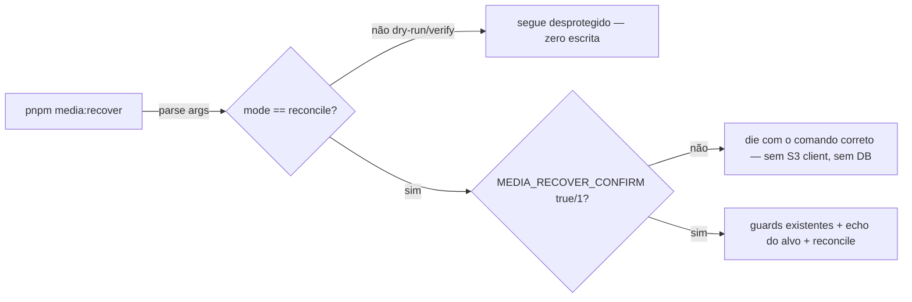

# Impl: OPS52-media-guard — Guard de intenção explícita para escrita em bucket de produção

Status: aprovado (gate humano 2026-08-18)
Atualizado em: 2026-08-18
Issue: #37 (OPS52-media-guard)
Intenção: body da Issue #37 (spec — sem plano de intenção separado; achado do /simplify da #10)
Appetite restante: pequeno (chore P3 — guard fail-closed de ~10 linhas + docs)

## Leitura da intenção

- **Outcome:** o modo reconcile (padrão) do `pnpm media:recover` só escreve no
  bucket com **intenção explícita** — `MEDIA_RECOVER_CONFIRM=1` — e recusa com
  mensagem clara sem ela; `--dry-run` e `--verify` seguem desprotegidos (não
  escrevem). O risco fechado: um worktree que receba credenciais S3\_\* de prod
  (cópia all-or-nothing do main) rodando reconcile contra rows locais
  (`db:pull` inclui media) escreveria covers no bucket de prod — hoje só o
  echo do alvo torna visível, não impede.
- **O que NÃO negociar:** fail-closed (sem flag → sem escrita, em qualquer
  cenário de DB/alvo); dry-run/verify sem fricção nova; o runbook do
  homeserver continua sendo o contrato de execução; zero mudança de
  comportamento do reconcile além do novo gate.
- **O que reavaliar:** a forma da confirmação — a Issue propõe
  "ex.: `MEDIA_RECOVER_CONFIRM=1` **ou** prompt interativo". Prompt interativo
  é pior para este repo: o runbook roda via SSH no homeserver (potencialmente
  sem TTY), e o padrão de guard do repo é env flag (`ALLOW_REMOTE_DB`,
  `isRemoteDbOverrideSet`). Env flag vence (ver Opções).

## Abordagem recomendada

**Opções consideradas:**

- **A — Env flag `MEDIA_RECOVER_CONFIRM` (truthy `true|1`) obrigatória no
  reconcile**, com helper genérico `isTruthyEnv` em `scripts/lib/cli.mjs` e
  `isRemoteDbOverrideSet` delegando para ele (sem twin). **Recomendada.**
- B — Prompt interativo (`readline`) antes do reconcile.
- C — Flag CLI `--confirm` no parsing de args.

**Recomendação: A** — paridade total com o guard de DB existente
(`ALLOW_REMOTE_DB=true|1`): funcionamento em runbook não-interativo (SSH,
`set -a; source teqo-1313.env`), sem fricção para dry-run/verify, e o parse de
args do script continua restrito aos modos mutuamente exclusivos
(`--dry-run`/`--verify`).

**Rejeitadas:** B (trava/falha sem TTY — o runbook roda por SSH no homeserver;
mais código; fora do padrão de guards do repo); C (mistura conceito de modo
com flag de confirmação; env var é o padrão e já é usada no runbook — o
comando `set -a; source` injeta as duas flags juntas).

### Componentes / mudanças

- **`isTruthyEnv`** (`scripts/lib/cli.mjs`, novo export puro): `value === 'true' || value === '1'`
  — **exatamente** a semântica atual de `isRemoteDbOverrideSet` (sem trim, sem
  lowercase: `TRUE`/`yes` continuam recusados — não relaxar guard existente na
  refatoração). `isRemoteDbOverrideSet` passa a delegar
  (`isTruthyEnv(process.env[ALLOW_REMOTE_DB_FLAG])`) — comportamento idêntico.
- **`scripts/recover-media.mjs`**: constante `MEDIA_RECOVER_CONFIRM`;
  imediatamente após o parsing de modo (antes de `assertLocalDatabase`,
  `resolveS3StorageEnv` e de qualquer rede):
  `if (mode === 'reconcile' && !isTruthyEnv(process.env[MEDIA_RECOVER_CONFIRM])) die(...)`
  — mensagem pt-BR com o comando correto (`MEDIA_RECOVER_CONFIRM=1 pnpm media:recover`)
  e a alternativa `--dry-run`. Bloco de comentário do header (safety model +
  modes) atualizado para documentar o guard. O gate vale para reconcile com
  QUALQUER alvo de DB (local ou remoto) — o risco é a escrita no bucket, não a
  origem dos dados.
- **`tests/unit/cliEnvFlags.unit.spec.ts`** (novo): `isTruthyEnv`
  (`true`/`1` passam; `TRUE`, `yes`, `0`, vazio, ausente recusam) e delegação
  de `isRemoteDbOverrideSet` preservando o comportamento (mesmo caso
  `ALLOW_REMOTE_DB=TRUE` recusado).
- **Docs:** runbook do `docs/plans/ops52-media-recuperar-arquivos-impl.md`
  (passo 3 do runbook ganha `MEDIA_RECOVER_CONFIRM=1` + nota do guard no
  cabeçalho do passo 2/3); nota curta no AGENTS.md (parágrafo da media —
  `reconcile exige MEDIA_RECOVER_CONFIRM=1`); entrada
  `docs/changelog/2026-08-18-ops52-media-guard.md` + `pnpm changelog:build`.
- **Migration:** nenhuma. **Access/Consent:** intocados. **UI:** N/A.
- **`package.json`:** sem mudança (a flag é env, não arg do script).

## Fases verificáveis

1. **Helper + testes** — `isTruthyEnv` em `cli.mjs` + refactor de
   `isRemoteDbOverrideSet` + `tests/unit/cliEnvFlags.unit.spec.ts`; rodar
   `pnpm test:unit`.
2. **Guard no script** — `recover-media.mjs` (gate + header doc); conferir
   comportamento: `pnpm media:recover` sem flag → exit 1 com a mensagem
   (com S3\_\* ausente local o guard do confirm dispara antes do die de S3 —
   ordem verificada); `--dry-run`/`--verify` seguem sem exigência.
3. **Docs + changelog** — runbook (passo 3 + nota), AGENTS.md,
   `docs/changelog/2026-08-18-ops52-media-guard.md`, `pnpm changelog:build` +
   `pnpm changelog:check`.
4. **Gates finais** — `pnpm gate:fast`, `pnpm format:check`, `pnpm exec knip`,
   `pnpm check:cycles`, `pnpm test` (unit+int), `pnpm build` local.

## Rabbit holes / Não escopo (engenharia)

- **Testar o reconcile ponta a ponta** — impossível por contrato (sem S3\_\* e
  sem DB prod nesta máquina); a prova é o runbook do homeserver (padrão da
  OPS52 fase 3). O que é testável (semântica do flag, preservação do
  `ALLOW_REMOTE_DB`) é unit-testado.
- **Prompt interativo / TTY detection** — rejeitado (Opção B).
- **Guard para `--dry-run`** — não: não escreve; o Issue pede explicitamente
  mantê-los desprotegidos.
- **Renomear `ALLOW_REMOTE_DB`** ou mexer em outros scripts — fora de escopo;
  o refactor de `isRemoteDbOverrideSet` é só delegação (uma ortografia do
  truthy-env, sem mudança de aceite).
- **Adiado com gatilho:** banir re-escritas `=== '1'`/`=== 'true'` de env-read
  no `codebaseConventions` — quando um 4º site aparecer ou no próximo refactor
  dos 3 existentes (ver `docs/plans/ops60-seed-posts-guard-escrita-s3.md`,
  seção Explicitamente fora).
- **Registrado no simplify (OPS60, #49):** `db:seed:posts` escreve no bucket
  via adapter S3 sem flag de intenção — mesma classe de risco; Issue nova com
  `depends: [37]`.

## Riscos e mitigação

- **R1 — Refatorar `isRemoteDbOverrideSet` relaxa o guard de DB.**
  Mitigação: `isTruthyEnv` com a semântica EXATA atual (sem trim/lowercase) e
  teste de comportamento que pin o caso `TRUE` recusado.
- **R2 — Runbook desatualizado manda rodar reconcile sem a flag e o guard
  recusa (fricção na próxima execução de prod).** Mitigação: runbook editado
  no mesmo PR; mensagem do die exibe o comando correto.
- **R3 — Automação futura (CI/homeserver) esquece a flag.** Mitigação:
  mensagem de erro autoexplicativa + dry-run disponível como pre-flight;
  o contrato é do runbook.

## Aceite de engenharia

- [ ] Aceite de produto da intenção coberto: reconcile recusa sem
      `MEDIA_RECOVER_CONFIRM=1` (fail-closed); dry-run/verify desprotegidos
- [ ] Invariantes AGENTS/engineering-standards: identificadores em inglês;
      guard reusado do dono (`cli.mjs`) sem twin; zero migration/access/Consent
- [ ] Testes de domínio: `isTruthyEnv` + preservação de `isRemoteDbOverrideSet`
      (unit); gates da checklist do AGENTS rodados
- [ ] Docs: runbook atualizado (comando real com a flag) + nota AGENTS.md +
      changelog
