# Impl: Etapa de deploy no CI para o homeserver (container `teqo-1313`)

Status: aprovado
Atualizado em: 2026-08-17
Issue: #8
Intenção: docs/plans/ops53-ci-deploy-homeserver.md
Appetite restante: herdado (~1–2 dias eng)

## Leitura da intenção

- **Outcome:** `git push` em `main` com CI verde ⇒ site 1313 atualizado (container novo com o SHA do commit), sem passo manual; migrations aplicadas contra o `teqo_1313` **antes** do rollout (ordem migrate → rollout); rollback documentado; falha de deploy deixa o commit vermelho e nada meio-publicado.
- **O que NÃO negociar:** build nunca no laptop do dev; ordem migrate → rollout; nada de schema migration contra produção fora do passo de migrate; imagem só publicada com full suite verde; rollback executável.
- **O que reavaliar (fato novo crítico):** a intenção assume "o runner Forgejo roda no próprio homeserver (tem Docker + registry + compose)". **Não é verdade** (verificado em `infra-solla/STATE.md` e ao vivo): o runner é `workstation-runner` (act_runner v0.2.11) na **workstation** (16c/61GB, Pop!\_OS); o homeserver (8c/16GB, laptop) é que roda o stack inteiro (`~/stack/docker-compose.yml`: postgres com `teqo_1313`, forgejo, registry :5000 com htpasswd, cloudflared, `teqo-1313`). `ssh homeserver` (tailnet) funciona da workstation (chave existente, verificada). A arquitetura do `plano-infra-final.md` §"Arquitetura de deploy" (runner → build → registry :5000 → migrate + pull + up no homeserver) permanece o norte — só que o "runner" fica na workstation e a orquestração do deploy cruza tailnet por SSH.

## Abordagem recomendada

```mermaid
flowchart LR
  P[push main / dispatch] --> W[ci.yml full suite]
  W --> C[checks]
  C --> D[deploy job: runs-on host na workstation]
  D --> S[ssh homeserver bash -s < scripts/deploy-homeserver.sh SHA]
  S --> G[HEAD guard: main remoto == SHA?]
  G --> B[build no homeserver: runner + migrator stages<br/>secrets do teqo-1313.env, --network stack_default]
  B --> R[push localhost:5000 + tag teqo-1313:SHA]
  R --> M[migrate: compose --profile maintenance run --rm teqo-1313-migrate]
  M --> U[compose up -d teqo-1313 + healthcheck]
  U --> K[smoke: / , /campanha/login, /admin, 307, webauthn, revalidate]
```

**Opções consideradas:**

- **A) Deploy job `runs-on: host` na workstation; TODO o deploy executa no homeserver via SSH (`bash -s` com o script do repo), build lá mesmo com secrets lidos do `~/stack/teqo-1313.env` local.** Recomendada — porque: o build precisa (1) do DB de produção para a geração estática — `postgres:5432` só existe dentro da rede do compose (`stack_default`; o postgres não publica porta); (2) dos secrets (`DATABASE_URL`, `PAYLOAD_SECRET`, `NEXT_PUBLIC_SITE_URL`) que já vivem chmod-600 no homeserver; (3) do registry em `localhost:5000` (loopback HTTP funciona — verificado: 401 de auth, não erro de transporte). Com tudo no homeserver, **zero secrets novos no Forgejo** e zero mudança de infra no compose. `runs-on: host` usa a chave SSH existente da workstation (verificada) e mantém o job sem segredos.
- **B) Build na workstation com DB via túnel SSH + secrets no Forgejo.** Exige publicar o postgres do homeserver (mudança de infra no compose), colocar `DATABASE_URL`/`PAYLOAD_SECRET` de produção como secrets do Forgejo (pior superfície de vazamento), túnel SSH no job e BuildKit com `--network host` para alcançar o túnel. **Rejeitada** — pior em todos os eixos exceto CPU (e a build no laptop cabe: 8c, ~12GB livres medidos; o stack ocioso usa ~3GB; o manual de 21b3c00d já provou o Dockerfile lá).
- **C) Job no container (ubuntu-latest) com chave SSH nova em secret do Forgejo.** Mais isolamento formal, mas: gestão de chave/known_hosts, alcance tailnet do container do runner a verificar, e o mesmo SSH remote de qualquer forma. **Rejeitada** — o ator é o dono único da instância (só repos fsolla/amana), o runner já roda como `fsolla` no host, e a mitigação real é não expor o job a eventos não confiáveis (abaixo).

**Decisões de engenharia (com rejeitadas):**

1. **Job `deploy` apenas em `ci.yml`** (push em `main` + `workflow_dispatch`), `needs: [checks]`, `timeout-minutes: 60`, `runs-on: host`. Nunca em `ci-pr.yml`. Guard de segurança: verificar na implementação que o Forgejo não executa workflows de PRs de fork (default off; se estiver ligado, desligar é passo humano no runbook). Sem isso, um PR de fork malicioso poderia rodar código no host da workstation.
2. **Guard de HEAD remoto (análogo ao cooldown do Vercel):** o script aborta (exit 0 "stale") se `git ls-remote <repo> refs/heads/main` ≠ SHA do job — um push mais novo vence; o deploy antigo não sobrepõe. Serialização: `flock` em `/tmp/teqo-1313-deploy.lock` no homeserver (capacity 1 + sem concurrency no Forgejo já serializam; o flock cobre dispatch+push simultâneos e re-deploys manuais).
3. **Script único POSIX-ish `scripts/deploy-homeserver.sh`** versionado neste repo, executado remotamente (`ssh homeserver "bash -s -- <sha>" < scripts/deploy-homeserver.sh`). O homeserver não ganha dependência nenhuma (só bash + git + docker, tudo presente). Lógica: HEAD guard → flock → source dos envs (`~/stack/teqo-1313.env` + `~/stack/.env`, sem eco) → workspace `~/teqo-deploy` (clone/fetch do Forgejo local `http://localhost:3000/fsolla/teqo.git`, público) → `docker login localhost:5000` (REGISTRY_USER/PASSWORD do `.env`) → build dos dois stages (`--network stack_default`, `--secret id=database_url,env=DATABASE_URL` + `payload_secret`, `--build-arg NEXT_PUBLIC_SITE_URL`) → push → backup do compose (`docker-compose.yml.pre-$SHA`) + swap dos tags de imagem via `sed` → **migrate** (`docker compose --profile maintenance run --rm teqo-1313-migrate` — o mesmo caminho do OPS51) → `docker compose up -d teqo-1313` → aguarda healthcheck healthy → smoke.
4. **Migrate:** serviço de maintenance do compose (`teqo-1313-migrate`, imagem `teqo-1313-migrator:<sha>` após o swap) — é o caminho que o compose já prevê e que o OPS51 usou. O `payload migrate` embutido no `pnpm build` não roda no Dockerfile (ele chama `next build` direto — verificado), então a ordem migrate→rollout é garantida pelo script.
5. **Smoke pós-deploy** (no homeserver, contra `localhost:1313`): `GET /` 200; `GET /campanha/login` 200; `GET /admin` 200; `GET /campanha` → 307 (barreira sem sessão); `POST /campanha/webauthn/login-options` 200 (anônimo por design); `POST /api/revalidate` com `x-revalidate-secret` do env → `{revalidated:true}`. Login com credenciais reais fica como validação manual (precedente OPS51).
6. **Falha → rollback automático best-effort:** restore do backup do compose + `docker compose up -d teqo-1313` (imagem anterior continua local e no registry; registry nunca deleta) + exit 1 (job vermelho). Caveat documentado: migration de schema aplicada no passo de migrate **não** é desfeita pelo rollback (Payload é append-only) — o código velho sobre schema novo é risco residual aceito; o caminho primário protege (migrate só roda após build+push ok; rollout só após migrate ok).
7. **Testes:** spec unit nova (`tests/unit/deployScript.unit.spec.ts`) com `bash -n` no script + greps estruturais que pinam as propriedades de segurança (HEAD guard, `--network stack_default`, `--secret id=database_url`, serviço de maintenance, endpoints do smoke) — mesmo padrão do `ciSkipInvariants` que pina os workflows. Os invariantes existentes de `ci.yml` (`.next-e2e` etc.) permanecem.

### Componentes / mudanças

- **`.forgejo/workflows/ci.yml`**: job `deploy` novo (runs-on `host`, `needs: [checks]`, checkout@v5 + `ssh homeserver "bash -s -- $GITHUB_SHA" < scripts/deploy-homeserver.sh`); comentário de cabeçalho atualizado ("No deploy step" → o passo existe agora).
- **`scripts/deploy-homeserver.sh`** (novo): o script remoto descrito acima; args = SHA do commit; env de configuração com default (`TEQO_REPO_URL`, `STACK_DIR`, `WORKSPACE`, `LOCK`); nunca ecoa valores de env; `set -euo pipefail`.
- **`tests/unit/deployScript.unit.spec.ts`** (novo): `bash -n` + invariantes estruturais.
- **`docs/ops/teqo-1313-deploy.md`** (novo, dir novo): runbook — gatilho, fluxo, onde roda cada passo, rollback (restore do backup do compose + `up -d`, imagens anteriores no registry), re-deploy manual (dispatch), falhas conhecidas, quem é o humano (secrets ficam no homeserver; nada novo no Forgejo).
- **`AGENTS.md`** (parágrafo de produção/CI) e **`docs/AGENT-OPS.md`** (linha do fluxo + tabela de ambientes): deploy deixou de ser "runbook fora do repo".
- **`docs/changelog/2026-08-17-ops53.md`** + `pnpm changelog:build` (OPS44).
- **infra-solla** (fora do repo, anotação no fechamento): `STATE.md` e runbook com a correção da topologia (runner na workstation, não no homeserver) e o passo único de setup humano — nada de daemon.json (loopback HTTP OK), nada de secrets novos.
- **Migration:** sem migration (não toca schema).
- **Access / Consent:** N/A.
- **UI:** Impeccable A — sem UI.

### Dados → forma

N/A (sem dados novos na UI).

## Fases verificáveis

1. **Tracer — script + workflow + tests + docs** — escrever `deploy-homeserver.sh`, job no `ci.yml`, spec unit, runbook, atualizações de AGENTS/AGENT-OPS, changelog. Gates: `pnpm gate:fast`, `pnpm format:check`, `pnpm knip`, `pnpm check:cycles`.
2. **Rehearsal read-only** — rodar os comandos do smoke contra o site **atual** (a partir do homeserver) para validar a lógica do smoke sem deploy; `bash -n`; verificar o setting de fork-PRs no Forgejo (mitigação do `runs-on: host`).
3. **First real deploy = o merge do próprio OPS53** — o pipeline publica o SHA do merge; acompanhar o job; se falhar, rollback pelo runbook (restore do backup + `up -d`). Este é o tracer bullet do aceite ("merge == publicar").

## Rabbit holes / Não escopo (engenharia)

- Blue-green / zero-downtime obrigatório — aceite é a janela do recreate; evolução futura.
- Deploy button / UI de rollback — runbook basta.
- Build na workstation com túnel para ganhar CPU — vira item futuro **se** a build no laptop incomodar (gatilho: OOM ou >30 min).
- Registry com `latest`/tags rolantes — tags por SHA + retenção bastam.
- Backup de DB no deploy — o plano infra já aponta pg_dump diário como pendência (débito registrado no fechamento, não neste item).
- Otimizar o job para "só deploy se o diff tocar código" — idempotente, custo aceito.

## Riscos e mitigação

- **OOM na build do laptop (8c/16GB, ~12GB livres).** O manual de 21b3c00d já buildou lá; teqo-1313 tem mem_limit 3g; mitigação: monitorar o primeiro deploy; gatilho de revisitação = build na workstation via túnel (registrado acima).
- **`runs-on: host` = código executando como fsolla na workstation.** Mitigação: job só em ci.yml (push main/dispatch — main é protegida, só entra via PR com checks verdes); verificar fork-PRs desligado no Forgejo (passo 2); instance é do dono único (repos fsolla/amana).
- **`actions/checkout@v5` em job `host`** — se o checkout falhar no host label, fallback documentado: baixar o script via raw do Forgejo (`git.solla.dev/fsolla/teqo/raw/branch/main/scripts/deploy-homeserver.sh`).
- **Rollback pós-migrate** — código velho + schema novo pode não ser 100% funcional; best-effort + vermelho no job + runbook; caminho primário minimiza a janela.
- **Vazamento de secrets nos logs** — script sem `set -x`, valores só via env do `~/stack/*.env`, build com BuildKit `--secret` (sem camadas); smoke do revalidate sem ecoar o secret.
- **Deploy antigo sobrescrevendo push novo** — HEAD guard remoto (stale → skip verde).

## Aceite de engenharia

- [x] Aceite de produto da intenção ainda coberto (merge == publicar; migrate → rollout; rollback documentado; falha = vermelho; sem build no laptop do dev)
- [x] Invariantes AGENTS/engineering-standards (sem segredos no repo; guards de dev/test intocados; nada de Neon)
- [x] Testes previstos: spec unit de `bash -n` + invariantes estruturais do script; invariantes existentes dos workflows intactos
- [x] Docs: runbook de deploy/rollback + AGENTS/AGENT-OPS + changelog

Self-score decision-quality: 1) decisões caras com rejeitadas ✓ 2) cabe no appetite ✓ 3) rabbit holes nomeados ✓ 4) reusa padrões existentes (Dockerfile/migrator, serviço de maintenance, smoke do OPS51) ✓ 5) aceite da intenção preservado ✓ — 5/5.
