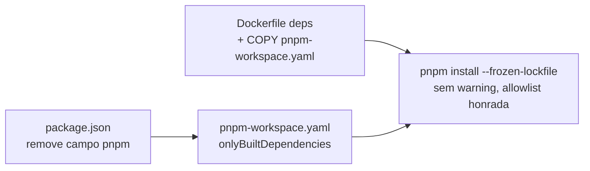

# Impl: Acabar com o warning do pnpm sobre `pnpm.onlyBuiltDependencies` ignorado

Status: aprovado
Atualizado em: 2026-08-18
Issue: #12
Intenção: docs/plans/ops54-pnpm-warning-onlybuiltdependencies.md
Appetite restante: herdado (~2–4 h; executável em bem menos — mudança de 3 arquivos)

## Leitura da intenção

- **Outcome:** nenhum comando pnpm (terminal, CI, Dockerfile) imprime o `[WARN]` do campo `pnpm`; a allowlist `onlyBuiltDependencies` (`sharp`, `esbuild`, `unrs-resolver`) volta a ser honrada no lugar canônico que o pnpm 10 aponta.
- **O que NÃO negociar:** `.npmrc` intocado (`legacy-peer-deps`, `include`); `packageManager` intocado; grafo de dependências inalterado (`pnpm install --frozen-lockfile` continua passando); nada além do que o warning cita é migrado.
- **O que reavaliar:** a hipótese da intenção já é a abordagem correta (pnpm-workspace.yaml). Ponto novo verificado empiricamente com a versão pinada (10.11.0): `pnpm-workspace.yaml` **sem** o campo `packages` funciona (single-package repo vira workspace de raiz, default `['.']`); o lockfile existente só tem um importer raiz — consistente.

## Abordagem recomendada

**Opções consideradas:** A (pnpm-workspace.yaml — recomendado) | B (.npmrc) | C (manter campo + ignorar)
**Recomendação:** A — é o novo home canônico de settings do pnpm 10 e o destino que o próprio warning aponta; validado empiricamente com a versão pinada (10.11.0): sem warning, `pnpm config get onlyBuiltDependencies` → `sharp,esbuild,unrs-resolver`, `--frozen-lockfile` limpo.
**Rejeitadas:**

- **B (.npmrc):** ainda suportado, mas caminho legado para este tipo de setting; o guardrail da intenção proíbe tocar `.npmrc` (e não há warning pedindo isso).
- **C (ignorar):** falha o aceite (warning persiste + allowlist continua ignorada).
- **(implicita) manter o campo `pnpm`:** o warning só some com a remoção do campo — a config no novo lugar não silencia o aviso.

### Componentes / mudanças

- **`pnpm-workspace.yaml`** (novo, raiz): `onlyBuiltDependencies: [sharp, esbuild, unrs-resolver]`. Sem campo `packages` (default `['.']` em pnpm 10.7+; repo single-package — validado). Sem comentários.
- **`package.json`**: remover o bloco `"pnpm": { "onlyBuiltDependencies": [...] }` (linhas 186–192). Nada mais no arquivo muda.
- **`Dockerfile`** (estágio `deps`, linha atual `COPY package.json pnpm-lock.yaml ./`): passar a copiar também `pnpm-workspace.yaml` — o `pnpm install --frozen-lockfile` da imagem precisa da config para honrar a allowlist (sem ela, local e Docker divergiriam: local rodaria os builds de `sharp`/`esbuild`/`unrs-resolver`, Docker não). Estágios `builder`/`migrator` usam `COPY . .` — o `.dockerignore` não exclui o YAML, já cobertos.
- **Changelog:** `docs/changelog/2026-08-18-ops54.md` + `pnpm changelog:build` (OPS44).
- **Migration:** sem migration (config de ferramenta).
- **Access / Consent / UI:** N/A.

### Dados → forma (se aplicável)

N/A — sem métricas/UI.

## Fases verificáveis

1. **Config + Dockerfile** — criar `pnpm-workspace.yaml`, remover campo `pnpm`, ajustar COPY do `deps`.
2. **Verificação local** — `pnpm install --frozen-lockfile` (sem warning, sem diff no lockfile — `git status` limpo depois); `pnpm config get onlyBuiltDependencies` → 3 pacotes; rodada de gates: `typecheck`, `lint`, `format:check`, `knip`, `check:cycles`, `test:unit`.
3. **Docker** — `docker build --target deps .` (não precisa de secrets) provando o estágio deps com a config nova.
4. **Gates** — `pnpm gate:fast`; push via `pnpm push`; CI Forgejo verde (o CI roda `pnpm install --frozen-lockfile` em todos os jobs — é a prova final do warning sumindo).

## Rabbit holes / Não escopo (engenharia)

- Mover `legacy-peer-deps` / `include` do `.npmrc` para o YAML — fora de escopo (nenhum warning pede).
- `dangerouslyAllowAllBuilds` ou re-approve de outros pacotes — fora de escopo.
- Atualizar pnpm / `packageManager` — fora de escopo.
- Comentários no YAML — não adicionar (convenção do repo); o plano + changelog documentam o porquê.

## Riscos e mitigação

- **`pnpm-workspace.yaml` sem `packages` muda semântica de workspace?** Baixo: pnpm 10.7+ defaulta `packages: ['.']`; lockfile atual tem um único importer raiz; validado no sandbox com a versão pinada (install + frozen-lockfile limpos). Se `pnpm install` local apontar drift, o passo 2 pega na hora.
- **Docker build sem a config no `deps`** silenciosamente bloquearia os builds dos 3 pacotes na imagem (regressão de comportamento local×Docker): mitigado pelo COPY explícito + verificação com `docker build --target deps`.
- **OPS53 compartilha o Dockerfile:** já resolvido — OPS53 está merged em `main` (6a3f61f9); sem concorrência em andamento.
- **CI com cache pnpm (pnpm/action-setup):** o cache é por lockfile — inalterado — então `cache: pnpm` segue batendo. Sem risco.

## Aceite de engenharia

- [x] Aceite de produto da intenção ainda coberto (warning some; allowlist honrada; `.npmrc`/`packageManager`/grafo intactos)
- [x] Invariantes AGENTS/engineering-standards (sem código runtime tocado; sem migration; sem DB)
- [x] Testes de domínio previstos: N/A (sem access/write paths); verificação empírica local + estágio Docker deps + CI como prova
