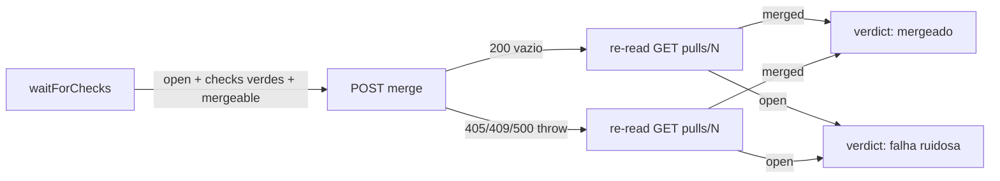

# Impl: OPS56 — forgejo-pr-automerge: falso positivo 'já mergeado' com PR aberto

Status: aprovado
Atualizado em: 2026-08-18
Issue: #28
Intenção: sem plano linkado — body é spec (frontmatter + título)
Appetite restante: pequeno (bug de ops, 1 script + 1 lib + testes)

## Leitura da intenção

- **Outcome:** o `forgejo-pr-automerge` nunca mais reporta "já mergeado" com o
  PR ainda aberto; falha de merge vira falha **ruidosa** (exit ≠ 0), nunca
  silenciosa.
- **O que NÃO negociar:** script continua zero-dependência (plain Node, roda
  dentro de Forgejo Actions sem `pnpm install`); idempotência (rodar de novo
  sobre PR já mergeado = no-op sucesso); merge continua por rebase.
- **O que reavaliar:** a "Direção no codebase" não existe (sem plano de
  intenção) — o diagnóstico abaixo foi feito em campo.

## Diagnóstico (raiz confirmada na versão do servidor)

Servidor: **Forgejo 9.0.3** (`gitea-1.22.0` base). Fonte do router
`routers/api/v1/repo/pull.go` no tag `v9.0.3`:

- `POST /pulls/{index}/merge` **sucesso → `ctx.Status(http.StatusOK)` — 200 com
  corpo VAZIO** (swagger `"200": responses/empty`). Falhas são sempre
  não-2xx (405 já-mergeado/WIP/não-mergeável/proteção, 409 conflito/out-of-date,
  404/500).

Bug no cliente (`scripts/lib/forgejo-api.mjs`):

1. `request()` devolve `text ? JSON.parse(text) : null` — o corpo vazio do 200
   vira **`null`**.
2. `mergePullRequest()` retorna esse `null` cru; `autoMerge()` trata `null`
   como "PR já mergeado" (`return null`); o CLI imprime **"já mergeado"** e
   sai 0.

Ou seja: o veredito é **dirigido pela forma da resposta**, não pela verdade do
PR. Qualquer 200-vazio (o próprio endpoint de merge, ou um hop intermediário —
o host está atrás do Cloudflare — engolindo a resposta) vira "já mergeado",
com o PR **aberto**. Incidente real: PR #27 (OPS52) aberto 01:59→02:45 de
2026-08-18; Issue #28 registrada às 02:17 com o PR ainda aberto.

Bug secundário: `autoMerge` retorna `null` também quando o PR foi **fechado
sem merge** entre a entrada e a tentativa — o CLI imprime "já mergeado" para
um PR que não mergeou.

## Abordagem recomendada

**Opções consideradas:**

- A. Veredito por **re-read do PR** após a tentativa (`GET /pulls/{n}`) —
  `merged`/`state` são a fonte única da verdade; o corpo do POST vira
  irrelevante.
- B. Veredito pela forma da resposta (status code / truthiness) — o status quo
  que quebrou.
- C. Endpoint próprio de verificação + retry com backoff.

**Recomendação: A** — o POST 200-vazio do Forgejo é contrato da versão (não
vai mudar); re-read é idempotente, barato (1 GET) e cobre todas as raças
(merge concorrente, PR fechado à mão, hop que engoliu a resposta). Sem retry:
falha vira ruidosa e o próximo evento/run humano retenta — honesto e simples.

**Rejeitadas:** B porque é exatamente o bug; C porque retry mascara conflito
real e a próxima tentativa no mesmo run de workflow não existe — quem retenta
é o próximo evento/ator, e o ruído do exit 1 é o aceite.

### Componentes / mudanças

- **`autoMerge`** (`scripts/lib/forgejo-api.mjs`): passa a retornar
  `{ attempted, merged, pr }`:
  - `waitForChecks` retornou já-mergeado/fechado → `{ attempted: false,
merged, pr }` (sem POST).
  - POST ok → re-read → `{ attempted: true, merged: pr.merged, pr }`.
  - POST lançou (405/409/…) → re-read: se `merged` → `{ attempted: true,
merged: true, pr }` (raça perdida — outro ator mergeou); se ainda
    `OPEN` → **re-throw** (falha ruidosa com a mensagem da API); se fechado
    sem merge → `{ attempted: true, merged: false, pr }`.
  - JSDoc atualizado: "o veredito é re-read do PR, não o corpo do POST (200
    vazio no Forgejo 9)".
- **`waitForChecks`** (`scripts/lib/forgejo-api.mjs`): além de statuses
  verdes, espera o `mergeable` amadurecer — `mergeable === false` → throw
  imediato ("não mergeável — conflito?"); `null` (ainda computando) → segue
  no poll. Mesmo timeout existente (30 min) vale para ambos.
- **`forgejo-pr-automerge.mjs`** (CLI): mensagens derivadas do novo shape —
  `merged && attempted` → "mergeado (rebase)"; `merged && !attempted` →
  "já mergeado" (verdadeiro); `!merged && state CLOSED` → "fechado sem merge
  — skip" (exit 0); `!merged && OPEN` não é alcançável no CLI (autoMerge
  re-throw) — o catch top-level já imprime "falhou" + exit 1.
- **Migration:** sem migration. **Access/Consent/UI:** n/a (scripts de ops).

### Depth check

`mergePullRequest` continua cru (verbo HTTP); a semântica mora em `autoMerge`
(único call site) — sem módulo novo, sem função nova no CLI (mapping é 3
linhas derivadas do shape).

## Fases verificáveis

1. **Lib + testes** — `autoMerge`/`waitForChecks` reescritos + specs
   `tests/unit/forgejoApi.unit.spec.ts` (fetch mockado):
   - POST 200-vazio → re-read merged → `{ attempted: true, merged: true }`;
   - POST 405 + re-read ainda open → reject (mensagem da API);
   - POST 405 + re-read merged (raça) → `{ attempted: true, merged: true }`;
   - primeiro poll já merged → `{ attempted: false, merged: true }` sem POST;
   - `mergeable` null → segue polando; `false` → reject; statuses verdes +
     `mergeable: true` → retorna.
2. **CLI** — mensagens pelo novo shape.
3. **Gates** — `pnpm gate:fast`; `pnpm push`; changelog
   `docs/changelog/2026-08-18-ops56.md` + `pnpm changelog:build`.

## Rabbit holes / Não escopo

- Retry com backoff dentro do script (rejeitado — ver Opções).
- Expandir `agent-pr-ready-automerge.yml` para branches não-`cursor/*`: o
  incidente foi num PR de worktree humano, mas o fluxo humano já fecha PR com
  o próprio script/skill; alargar o gatilho é decisão de ops (cobertura),
  separada do veredito — registrar como débito.
- Integrar o veredito no pool (o pool já deriva do estado real do PR via
  `classifyPoolClaim` — nada a fazer lá).
- Mudar o endpoint/versão do Forgejo.

## Riscos e mitigação

- Re-read após POST falhar (rede) → o GET propaga erro (ruidoso); próximo run
  é idempotente.
- `mergeable` ficar `false` por motivo transitório → throw imediato com
  mensagem; run humano retenta após re-test (o PR re-test no UI/API).
- Teste unitário com `mergeable` ausente (undefined) → tratado como "ainda
  computando" (só `=== false` é terminal).

## Aceite de engenharia

- [ ] Aceite de produto da intenção ainda coberto (nunca "já mergeado" com PR aberto)
- [ ] Invariantes: plain-Node zero-dep preservado; idempotência preservada; rebase preservado
- [ ] Testes de domínio previstos (unit) cobrem os 5 cenários de `autoMerge` + `mergeable`
