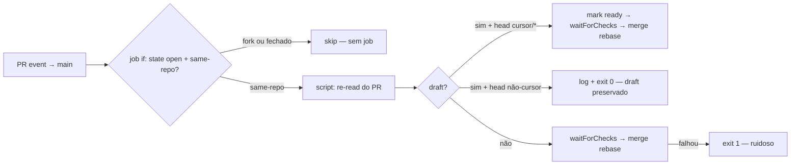

# Impl: OPS57-guard — forgejo-pr-automerge: alargar gatilho do workflow para branches não-cursor/\*

Status: aprovado
Atualizado em: 2026-08-18
Issue: #44
Intenção: sem plano linkado — body é spec (frontmatter + título + decisão de ops aberta)
Appetite restante: pequeno (1 workflow + 1 script + docs)

## Leitura da intenção

- **Outcome:** o safety net do `forgejo-pr-automerge` cobre **todas** as PRs
  para `main` (não só `cursor/*`) — uma falha de merge de PR humano (classe do
  incidente OPS52, PR #27) vira **ruidosa sem run manual**, em vez de depender
  do script/skill que o fluxo humano já roda.
- **O que NÃO negociar:** PRs **draft de atores não-pool nunca são forçadas a
  ready** (o draft é o controle humano de veto); script continua plain-Node
  zero-dep (roda dentro do Actions sem `pnpm install`); idempotência; merge por
  rebase.
- **O que reavaliar:** a decisão de ops em aberto — "todas as PRs para main"
  vs "padrões explícitos". Evidência do histórico real do repo (25 PRs
  mergeadas, via API): **zero** PRs `cursor/*`; 9 de `plans/*`; 11 de worktrees
  humanos (`OPS*`/`S1`/`PUB5`); 5 de `refs/pull/N/head` (artefatos da era da
  migração). Ou seja: o filtro `cursor/*` atual **nunca cobriu nenhum PR real**
  do repo — o safety net nunca disparou. O incidente que motivou a OPS56 (PR
  #27, humano) é exatamente a classe que o filtro exclui.

## Abordagem recomendada

**Opções consideradas:**

- A. Alargar o `if:` do job para `state == 'open' && head.repo.full_name ==
github.repository` e mover a política de draft para o **script** (draft→ready
  só para head `cursor/*`; draft não-cursor → skip exit 0), com o head ref lido
  do **re-read da API** (fonte única da verdade já usada pelo CLI).
- B. Alargar o `if:` com `(startsWith(head.ref, 'cursor/') ||
!github.event.pull_request.is_draft)` — política toda no YAML, script intacto.
- C. Allowlist de prefixos de branch no YAML (ex.: `OPS*`, `S*`, `plans/*`).

**Recomendação: A** — o script já re-read o PR no primeiro passo
(`getPullRequest` devolve `head.ref`/`isDraft`), então a decisão de draft usa
campos **verificados da API**, não campos do payload do webhook. O campo de
draft do payload do webhook do Forgejo (`is_draft` vs `draft`, GitHub usa
`draft`) não está documentado no reference do Forgejo — depender dele (opção B)
é um risco de **fail-open**: campo undefined → `!undefined` → job roda em PRs
draft → script marca ready → merge forçado de PR humano. A opção A degrada
sempre para o comportamento seguro. O `if:` mínimo (state + same-repo) só
precisa de campos já usados no workflow atual (`state` já está lá) e do
`head.repo.full_name`, que é o modelo API do payload (o MCP/API devolve
`head.repo.full_name` no próprio PR).

**Rejeitadas:** B porque depende de nome de campo não verificado com modo de
falha fail-open (o pior: forçar ready+merge de draft humano); C porque os códigos
humanos não têm prefixo comum (`OPS57-…`, `S1-…`, `PUB5-…`) e `plans/*` mudaria
a cada novo padrão — allowlist é manutenção, o denylist natural (draft) é
estável.

### Componentes / mudanças

- **`agent-pr-ready-automerge.yml`** (`.forgejo/workflows/`): `if:` do job →
  `github.event.pull_request.state == 'open' && github.event.pull_request.head.repo.full_name == github.repository` (guarda de fork — o repo é **público**, e fork PR mergeada dispararia o deploy de prod em main); header comment reescrito (safety net cobre todas as PRs same-repo para main; draft é o veto).
- **`scripts/forgejo-pr-automerge.mjs`**: no passo draft, decide pelo `pr.head.ref` do re-read: `cursor/*` → marca Ready (pool, inalterado); não-`cursor/*` → log `draft fora de cursor/* — skip (não força PR humano)` + exit 0 (PR fica draft até o ator marcar ready; o evento `ready_for_review` re-dispara o job que então mergea).
- **`docs/AGENT-OPS.md`** (tabela "CI por alvo", linha do workflow) e
  **`.agents/rules/agent-pr-workflow.mdc`** (seção "Safety net"): descrição do
  trigger e da semântica de draft.
- **Migration:** sem. **Access/Consent/UI:** n/a (workflow/scripts de ops).

### Efeito no auto-merge de PRs humanos (a decisão da Issue)

Toda PR humana já nasce **Ready** e o fluxo humano arma `gh pr merge --auto
--rebase` imediatamente (execution-pipeline passo 5) — o safety net alargado é
**redundante no caminho feliz** e é exatamente o que pega a classe do incidente
OPS52 (merge falhou com PR aberto). O humano que quiser vetar o auto-merge
mantém a PR em **draft** — o workflow não toca draft não-`cursor/*`. Semântica
nova: uma PR humana **ready** que nunca foi armada manualmente passa a ser
mergeada quando o CI verde — que é o contrato implícito de toda PR para `main`
neste repo (todo ator já auto-mergea).

## Fases verificáveis

1. **Workflow + script + docs** — mudanças acima (4 arquivos).
2. **Gates** — `pnpm gate:fast`; changelog `docs/changelog/2026-08-18-ops57.md`
   - `pnpm changelog:build`; `pnpm push`; PR Ready + merge.
3. **Validação no mundo real (pós-merge)** — o workflow que roda é o de `main`:
   esta PR ainda usa o filtro antigo (manual, sem auto-merge do safety net); a
   **próxima** PR (pool ou humana) exercita o gatilho alargado pela primeira
   vez — observar a run no Actions é a verificação.

## Rabbit holes / Não escopo

- Retry/backoff dentro do `waitForChecks` (rejeitado na OPS56 — falha ruidosa
  é o aceite).
- Bump do timeout de 30 min do `waitForChecks` para suíte cheia: estourar é
  ruidoso (exit 1) e o próximo evento/run retenta — não mexe.
- Branch protection de `main`: a API do Forgejo retorna **0 regras** (o gate de
  `checks` hoje vive no script, não no servidor) — verificação à parte, não é
  esta entrega.
- Pool: nada a fazer (quando o pool criar PRs `cursor/*`, o fluxo é idêntico
  ao atual).
- Usar `pull_request_target` ou outras mudanças de segurança do workflow.

## Riscos e mitigação

- `head.repo.full_name` ausente no payload → `undefined == github.repository`
  → skip (fail-closed, direção segura).
- Corrida humano×workflow no merge → `autoMerge` re-read + idempotente
  ("já mergeado" honesto, OPS56).
- Conversão para draft no meio do wait → merge 405 → re-read → re-throw
  (ruidoso; fechar a PR é o aborto limpo).
- PR humana pronta "antes da hora" (humano ainda mexendo) → mesma semântica do
  `--auto` que o próprio fluxo arma; escape: draft.
- PR de fork com CI verde → excluída no `if:`; e o token automático de fork é
  read-only de qualquer forma (defesa em profundidade).

## Aceite de engenharia

- [ ] Aceite de produto da intenção ainda coberto (safety net para branches não-`cursor/*`)
- [ ] Invariantes: zero-dep do script; idempotência; rebase; draft não-pool intocado
- [ ] Docs sincronizadas (AGENT-OPS, agent-pr-workflow.mdc) — sem drift do filtro
