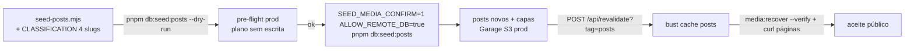

# Impl: OPS58 — Atualizar artigos de produção com os novos posts do jorgesolla.com.br

Status: aprovado (gate humano 2026-08-18)
Atualizado em: 2026-08-18
Issue: #43
Intenção: docs/plans/ops58-sincronizar-posts-prod.md
Appetite restante: herdado (~0,5 dia — execução no homeserver + runbook)

## Leitura da intenção

- **Outcome:** todos os artigos do jorgesolla.com.br ainda ausentes em produção
  criados como notícia publicada; os existentes intocados (create-only, sem
  duplicata); capas dos novos servindo 200 em `/api/media/file/...`; cache
  `posts` bustado; procedimento documentado como runbook (padrão OPS52-media).
- **O que NÃO negociar:** create-only (nunca edita/sobrescreve conteúdo
  existente); PII intocada; contrato público de URL intocado; guard
  `ALLOW_REMOTE_DB=true` explícito (fail-closed mantido); capas dos novos no
  bucket de prod (env `S3_*` do stack obrigatório — nunca disco local).
- **O que reavaliar:** a hipótese "ferramenta existe, só executar" precisa de
  dois ajustes — (1) o seed não tem modo **plan-only** (pre-flight de prod
  inexistente; o precedente OPS52-media provou o valor de `--dry-run` no
  homeserver); (2) a taxonomy hardcoded está **defasada**: o WP tem 43 posts e
  o `CLASSIFICATION` cobre 39 — os 4 slugs novos incluem 3 de
  pré-campanha/campanha que, sem a entrada, caem em `politica` **sem o tag
  `eleitoral`**, furando o controle de visibilidade eleitoral do repo.

## Evidência coletada (2026-08-18, probes read-only)

- **E1 — Contagem do WP:** `x-wp-total: 43` (REST `_embed`, paginado —
  `fetchArticlesFromWordPress` traz todos). `CLASSIFICATION` cobre 39 slugs →
  **4 slugs novos não mapeados** (caem no default `politica` hoje):
  - `bruno-reis-foi-covarde-detonou-solla-ao-rebater-o-prefeito-sobre-saude-de-salvador` (2026-08-17 — resposta política a ataque)
  - `chapada-diamantina-recebe-caravana-liderada-pelo-deputado-jorge-solla` (2026-07-31 — caravana, pré-campanha)
  - `lula-reforca-o-time-de-jeronimo-wagner-rui-e-jorge-solla-na-convencao-estadual-do-pt` (2026-08-02 — convenção estadual do PT, campanha)
  - `o-pt-tem-que-disputar-o-programa-de-governo-conclamou-jorge-solla-em-plenaria` (2026-08-11 — plenária, campanha)
- **E2 — Risco do lock `eleitoral`:** os 3 de campanha acima sem tag
  `eleitoral` ficam visíveis no site público mesmo se a equipe puxar o
  controle `hidden` na janela eleitoral (lock do repo:
  `isPostVisible` fail-closed esconde só posts com tag/categoria `eleitoral`).
- **E3 — Seed sem pre-flight:** `seed-posts.mjs` não ecoa o alvo (host do DB)
  e não tem modo que planeje sem escrever; `recover-media.mjs` (OPS52) tem
  ambos — padrão a espelhar (echo do alvo antes de qualquer escrita; modos
  mutuamente exclusivos; argumento desconhecido morre).
- **E4 — Homeserver:** clone do repo em `~/teqo-deploy` (OPS53 — deploy doc;
  o deploy deixa o clone em **detached HEAD** no SHA do job). Env do stack em
  `~/stack/teqo-1313.env` com `DATABASE_URL=…@postgres:5432` — o `postgres`
  só resolve **dentro** da rede `stack_default`; do host, o caminho comprovado
  é o **proxy socat `teqo-1313-build-proxy`** que o deploy script cria
  idempotentemente (publicado em `127.0.0.1:5433` no host — é exatamente como
  o build o usa, `deploy-homeserver.sh:91-108`). O `S3_ENDPOINT=host.docker.internal:3900`
  do stack só resolve dentro do compose; o Garage roda **no host** (o container
  alcança via `host-gateway`) → do host, `S3_ENDPOINT=http://127.0.0.1:3900`
  (a workstation/tailnet usa `http://100.119.220.31:3900`). A forma exata de
  execução do OPS52-media não está registrada de forma consistente entre os
  docs (o runbook dela menciona `cd ~/stack`; o deploy doc diz workspace
  `~/teqo-deploy`) — o pre-flight do runbook abaixo valida a forma escolhida,
  e a primeira execução registra o que funcionou na Issue.

## Abordagem recomendada



**Opções consideradas (forma de execução):**

- **A — Estender o dono:** `--dry-run` (plan-only) no `scripts/seed-posts.mjs`
  - classificar os 4 slugs novos no `CLASSIFICATION` + runbook no homeserver.
    **Recomendada.**
- B — Executar o seed como está ("às cegas") e confiar no relatório final —
  o relatório só diz created/skipped **depois** de já ter escrito em prod;
  sem echo de alvo, sem chance de revisar "o que será criado" antes.
- C — Script novo de pre-flight separado — twin do fetch/lookup do seed;
  conhecimento vazaria em 2 módulos.

**Opções consideradas (taxonomy dos 4 slugs):**

- **A2 — Expandir o `CLASSIFICATION` com os 4 slugs** (3 com
  `tags: ['eleitoral']`, o bruno-reis em `politica`). **Recomendada.**
- B2 — Seed intocado: os 4 caem em `politica` sem tag `eleitoral` + triagem
  manual pós-sync no admin.
- C2 — Bloquear o sync até classificar (abort no unmapped).

**Recomendação: A + A2** — o dry-run é o pre-flight que o OPS52 provou no
homeserver (custo baixo: o seed já tem todo o fetch/lookup; dry-run troca
`payload.create` por contagem), e a classificação dos 4 slugs é **aditiva e
create-only** (não toca posts existentes — só decide a categoria/tag dos que
serão criados). Os 3 slugs de campanha **precisam** do tag `eleitoral` para o
lock de visibilidade do repo continuar valendo — registrá-los como `politica`
pura seria criar conteúdo de campanha fora do controle eleitoral em plena
janela. A manutenção contínua (próximos slugs) segue fora de escopo, como a
intenção manda.

**Rejeitadas:** B (sem pre-flight — escreve antes de informar); C (twin do
seed); B2 (fura o lock `eleitoral`; triagem manual pós-sync é pior que a
classificação no commit, com os 4 slugs já em mãos); C2 (transforma 4 slugs
em gate de conteúdo — a intenção quer o sync desbloqueado).

### Componentes / mudanças

- **`scripts/seed-posts.mjs`** (extensão do dono — comportamento default
  inalterado):
  - Parse de args no topo (padrão `recover-media.mjs`): só `--dry-run`
    aceito; argumento desconhecido → die; echo do alvo (`DB host:
<host>` — sem senha) antes de qualquer trabalho.
  - Modo dry-run: executa o fetch + lookups de tags/posts existentes +
    resolução de covers (`resolveCoverSource`, **sem download** de imagem),
    e no lugar de cada `payload.create` conta/lista "would create" /
    "would skip" / unmapped / sem-cover. Zero escrita. Relatório final
    espelhando o SUMMARY atual.
  - `CLASSIFICATION`: +4 entradas (E1) — 3 com `tags: ['eleitoral']`.
- **`package.json`:** nada novo — `--dry-run` é argumento do script existente.
- **Migration:** nenhuma. **Access / Consent:** nenhum. **UI:** N/A
  (Impeccable A — sem mudança de UI; conteúdo/operação).
- **Docs:** runbook de execução em prod neste impl plan (ordem do homeserver);
  entrada `docs/changelog/2026-08-18-ops58.md` + `pnpm changelog:build`;
  nota curta no AGENTS.md (§ seeding de conteúdo) apontando o runbook.

## Fases verificáveis

1. **Seed (dry-run + taxonomy)** — parse de args, echo do alvo, early-returns;
   `CLASSIFICATION` +4. Gates locais: `pnpm gate:fast`, `pnpm format:check`,
   `pnpm exec knip`, `pnpm check:cycles`. Validação de comportamento:
   `pnpm db:seed:posts --dry-run` contra o DB local do worktree — relatório
   com "to create"/"skip"/unmapped e **zero** posts/tags/media criados
   (conferir via contagem antes/depois).
2. **Docs + changelog** — runbook completo neste impl plan, nota no AGENTS.md,
   `docs/changelog/2026-08-18-ops58.md`, `pnpm changelog:build` +
   `pnpm changelog:check`.
3. **Gates finais + merge** — `pnpm gate:fast`, `format:check`, `knip`,
   `check:cycles`, `pnpm test` (unit+int), `pnpm build` local; PR → CI verde
   → merge em `main` (deploy automático OPS53).
4. **Execução em prod (pós-merge, runbook — humano):** seção abaixo.

## Runbook de execução em produção (pós-merge, humano)

1. **Deploy do merge em `main`** (CI OPS53) — o seed com `--dry-run` e a
   taxonomy chegam ao homeserver com a imagem do SHA.
2. **Pre-flight no homeserver** (no clone do repo `~/teqo-deploy` — o deploy
   OPS53 deixa o clone em **detached HEAD**, então trazer para `main` primeiro;
   env do stack sourceado; `postgres` só resolve dentro do compose → usar o
   **proxy socat do build** em `127.0.0.1:5433`; o Garage roda no host →
   `S3_ENDPOINT=http://127.0.0.1:3900`):
   ```bash
   ssh homeserver
   cd ~/teqo-deploy
   git fetch origin main && git checkout main && git pull --ff-only origin main
   pnpm install              # se preciso (hooks — padrão ensure-repo-deps)
   set -a; source ~/stack/teqo-1313.env; set +a
   export DATABASE_URL="${DATABASE_URL/@postgres:5432/@127.0.0.1:5433}"  # proxy socat do build (postgres só resolve dentro do compose)
   export S3_ENDPOINT="http://127.0.0.1:3900"                            # Garage roda no host (host.docker.internal só resolve no compose)
   ALLOW_REMOTE_DB=true pnpm db:seed:posts --dry-run
   ```
   Esperado: echo do alvo (`DB: 127.0.0.1:5433`), relatório com os 4 slugs
   novos a criar (`would-create … (cover: url)` — URL presente; o download/upload
   só acontece no sync), slugs existentes a pular, sem escrita. (O dry-run não
   escreve — segue sem a flag `SEED_MEDIA_CONFIRM` do sync, mesmo com as `S3_*`
   exportadas.) Se o dry-run
   falhar com ECONNREFUSED/ENOTFOUND: conferir o proxy (`docker ps | grep
teqo-1313-build-proxy` — o deploy script o cria idempotentemente; se
   ausente, re-dispatchar o deploy ou rodar o trecho que o cria em
   `scripts/deploy-homeserver.sh`) e registrar a forma que funcionou na Issue
   (primeira execução do runbook).
3. **Sincronizar:**
   ```bash
   SEED_MEDIA_CONFIRM=1 ALLOW_REMOTE_DB=true pnpm db:seed:posts
   ```
   Esperado: `Posts created : 4` (os novos), `Posts skipped : 39` (ou o número
   real de já existentes), capas baixadas e uploadadas para o Garage de prod
   (`S3_ENDPOINT` já reescrito no passo 2). **Nota (OPS60):** o sync escreve
   media no bucket das envs `S3_*` — o guard `SEED_MEDIA_CONFIRM=1` é
   obrigatório (fail-closed; sem ele o seed recusa com exit 1 antes de
   qualquer escrita). Se o WP ganhar slugs novos entre o
   pre-flight e aqui, eles entram como `politica` com warning — registrar na
   Issue e classificar (admin ou follow-up).
4. **Bust de cache:**
   ```bash
   curl -X POST https://jorgesolla1313.com.br/api/revalidate \
     -H "x-revalidate-secret: $REVALIDATE_SECRET"
   ```
   Esperado: `200 { revalidated: true, tag: 'posts' }` (o smoke do deploy
   OPS53 já exercita o endpoint com o secret real — o env está no stack).
5. **Aceite:**
   - Capas: `ALLOW_REMOTE_DB=true pnpm media:recover --verify` — esperado
     `42/44` filenames 200: 38 das 40 rows pré-existentes (as 2 exceções
     conhecidas do OPS52 — `fim-escala-6x1.jpg`, `jorgesolla.jpg` — seguem
     404 e fazem o verify sair com exit 1; aceite: **as únicas falhas são as
     2 conhecidas**) + as capas novas dos 4 posts (se o dry-run acusou
     `cover: url` para os 4).
   - Páginas: `curl -s https://jorgesolla1313.com.br/ | grep <slug-novo>`
     e `curl -o /dev/null -w "%{http_code}" https://jorgesolla1313.com.br/noticia/politica/<slug-novo>`
     → 200 para os 4 novos; conferir também `/artigos` e a seção S1 da home
     de campanha.
6. **Registro:** resumo na Issue #43 (created/skipped, exceções de capa,
   slugs unmapped adicionais, forma exata de execução usada no passo 2).

## Rabbit holes / Não escopo (engenharia)

- **`--verify` de posts em código** — curl no runbook basta; não criar
  ferramenta para o aceite.
- **Upsert de edits do WP / sync agendado / hidden flag** — fora de escopo da
  intenção; itens separados quando doer.
- **Testar o sync ponta a ponta fora do homeserver** — impossível por
  contrato (sem DB de prod, sem `S3_*`); a prova E2E é o runbook (padrão
  OPS52 fase 3).
- **Unidade de teste para o parse de args do seed** — mesmo padrão do
  `recover-media.mjs` (parse inline, sem teste dedicado); o write path não
  muda (create-only) e o dry-run é validado contra o DB local.

## Riscos e mitigação

- **R1 — Host do homeserver não alcança `postgres`** (DB só resolve dentro de
  `stack_default`; a forma comprovada do host é o proxy socat do build em
  `127.0.0.1:5433`). Mitigação: o pre-flight (dry-run) valida em segundos;
  se o proxy estiver ausente, o deploy script o recria (re-dispatch); a forma
  real usada na primeira execução é registrada na Issue.
- **R2 — Capa nova não resolve** (WP mudou/removeu a imagem). Mitigação:
  post criado sem cover → card degrada para a banda cinza existente (sem
  placeholder); exceção registrada na Issue; `media:recover --verify` acusa
  (as únicas falhas aceitáveis são as 2 exceções conhecidas do OPS52).
- **R3 — Conteúdo eleitoral sem tag `eleitoral`** (se o gate rejeitar A2).
  Mitigação: triagem manual no admin imediatamente pós-sync (passo 3 do
  runbook vira passo de classificação obrigatório).
- **R4 — `REVALIDATE_SECRET` ausente no env do stack.** Mitigação: o smoke
  do deploy (OPS53) já testa `/api/revalidate` com o secret real — presença
  garantida; conferir no pre-flight se o curl der 401/500.
- **R5 — WP ganha slugs novos entre o commit e a execução** (fetch é live).
  Mitigação: relatório final lista unmapped; runbook manda registrar e
  classificar (admin ou follow-up) — nunca bloqueia o sync.

## Aceite de engenharia

- [ ] Aceite de produto da intenção ainda coberto: posts ausentes criados,
      existentes intocados (create-only), capas 200, cache bustado, runbook
      documentado (padrão OPS52-media)
- [ ] Invariantes AGENTS/engineering-standards: `ALLOW_REMOTE_DB=true`
      explícito mantido; identificadores em inglês; zero access/Consent/
      transação/migration tocados; edit the owner (seed estendido, sem twin)
- [ ] Testes/validação de domínio: `--dry-run` contra DB local (relatório sem
      escrita); gates da checklist do AGENTS; prova E2E é o runbook do
      homeserver
- [ ] Docs: runbook de execução em prod + nota AGENTS.md + changelog
