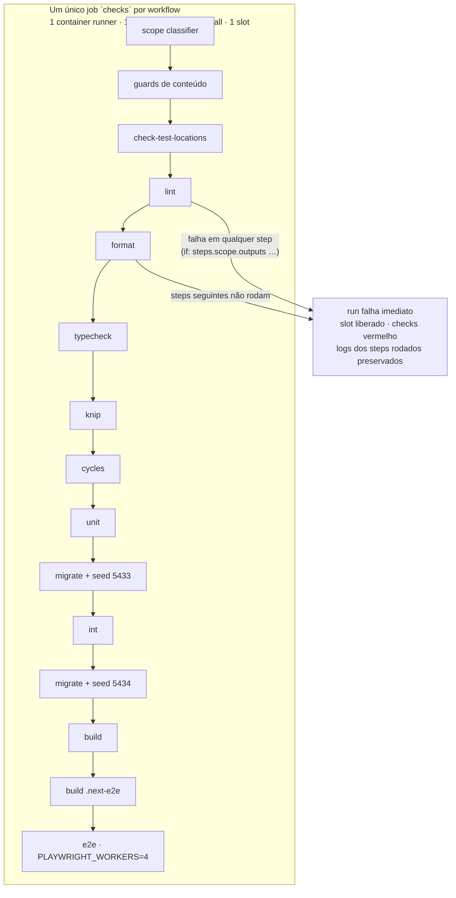

# Impl: OPS62 — CI: fail-fast estrutural por job único sequencial (X1)

Status: aprovado
Atualizado em: 2026-08-18
Issue: #59
Intenção: docs/plans/ops62-ci-fail-fast-forgejo.md
Appetite restante: ~1 dia eng (corte: nada de watchdog/API/upgrade — decidido no gate de execução)

## Leitura da intenção

- **Outcome:** um run de PR (ou de `main`) com **qualquer verificação vermelha** falha o run imediatamente — nada continua rodando depois da primeira falha; o runner é liberado cedo; `checks` vermelho sem esperar o fim dos demais; logs do que já rodou preservados; a suíte **verificada** não muda (mesmas ferramentas e conteúdo: lint, format, typecheck, knip, cycles, unit, int, build, e2e, guards); sem bypass novo além do `--no-verify` documentado.
- **O que NÃO negociar:** anti-goals — não perder diagnóstico (steps preservam logs próprios), não mudar o que o CI _verifica_ (só o envelope de jobs muda), `checks` como gate único (contexto `CI (PR) / checks` preservado para waitForChecks/branch protection); aceitar a perda dos logs do segundo shard de e2e (o e2e perde o paralelismo de jobs — 4 workers num único processo; o gate aceitou perder o shard irmão, e aqui o sharding em si é compensado por workers).
- **Divergência do aceite da intenção (aprovada pelo humano no gate de execução, 2026-08-18):** o aceite "Forgejo do homeserver roda versão com a API de cancel" e "mesmos jobs, mesma cascata" são **substituídos** — a arquitetura escolhida (X1: 1 job sequencial) torna a API de cancel e o upgrade **desnecessários** (fail-fast é estrutural) e muda o agrupamento de jobs (o que é verificado permanece idêntico). O plano de intenção fica como histórico; este impl plan é a forma aprovada.

## Abordagem recomendada

**Opções consideradas (gate de execução):** X1 | Y | Z
**Recomendação (escolhida pelo humano):** **X1** — 1 job único por workflow, steps sequenciais, fail-fast **estrutural**: falhou um step → os seguintes nem começam → job falha → run falha → slot liberado. Zero dependência de API de cancel (a rota nem existe no Forgejo 9.0.3), zero watchdog (não há slot extra, token, upgrade, nem risco de infra no homeserver — o Forgejo **não** é atualizado). O paralelismo do e2e é recuperado por `PLAYWRIGHT_WORKERS=4` (o Playwright roda workers dentro de um processo — mesma carga de 2 shards × 2 workers de hoje).

**Rejeitadas:**

- **Y — fase 1 sequencial + fase 2 em matrix `fail-fast: true`:** preserva verde ≈ atual e cancela irmãos nativamente, mas depende de o Forgejo 9.0.3 cancelar de fato os irmãos de matrix (comportamento de servidor a verificar ao vivo; se falhasse, virava "tudo roda até o fim" na fase 2), mantém 2 slots em vez de 1, e o YAML de matrix por `mode` é mais complexo de manter que steps em série. **Rejeitada** por simplicidade máxima pedida.
- **Z — watchdog + upgrade do Forgejo 16:** o risco de infra (upgrade de produção no homeserver, compatibilidade runner × v16) deixou de se justificar quando o fail-fast estrutural cobre o aceite com menos peças. **Rejeitada.**
- **Watchdog em `runs-on: host`:** ci-pr jamais roda host (pin OPS53). **Rejeitada.**
- **Paralelizar steps com processos `&`/`wait`:** logs interleaved + fail-fast manual = mini-watchdog em bash. **Rejeitada.**

### Componentes / mudanças

- **`.forgejo/workflows/ci-pr.yml`** (reescrito — X1): 1 job `checks` (nome default → contexto `CI (PR) / checks` preservado; **o nome do job é o contrato** do waitForChecks OPS61-2b e da branch protection). Steps em série, cada um com `if:` de skip do classifier: `scope` (`id: scope`; outputs `code_mode/build_mode/test_mode/e2e_mode/e2e_specs` via `$GITHUB_OUTPUT` — mesmo comando do job atual, com `set -euo pipefail`), guards de conteúdo (changelog append-only, aggregate, conflict markers, plans-only — movidos para o começo: falham rápido e são sobre o PR), `check-test-locations`, `lint`, `format:check`, `typecheck`/`knip`/`cycles` (`if: steps.scope.outputs.code_mode != 'none'`), `unit` (full/changed), `migrate`+`seed:minimal` (DB int), `int` (full/changed), `migrate`+`seed:minimal` (DB build/e2e), `build` (if `build_mode != 'none'`), `build .next-e2e` + `e2e` (if `e2e_mode != 'none'`; full = `pnpm test:e2e` sem shard com `PLAYWRIGHT_WORKERS=4`; selected = specs do output). **2 services Postgres alcançados por NOME na rede do job** (`postgres-int` / `postgres-build` na 5432, **sem publish host** — o OPS50 publicava portas no gateway; o X1 remove o publish: o job único seguraria as portas fixas pelo run inteiro e runs concorrentes colidiriam, e o Forgejo 9 não expande expressões em `services.ports` (medido ao vivo: run 730 falhou em 1s com a string literal da expressão) — o DNS da rede do job é a solução canônica e mata a colisão de raiz). Isolamento preservado (o e2e nunca herda a sujeira dos testes int; o build de prod e o de e2e compartilham o service build/e2e). `timeout-minutes: 50` (soma esperada ~21 min + margem; o run nunca segura o slot além disso). Sem `needs`/`if: always()`/matrix/jq de rollup (não há irmãos). Comentário de cabeçalho reescrito: OPS62 substitui o parágrafo "Forgejo has no cancel-run plumbing; job timeouts cover that role" — o fail-fast é estrutural (1 job), sem API de cancel. **Trade-off assumido:** `migrate`+`seed:minimal` do int rodam também em PR docs-only (mode none) — intencional (a cadeia stale é pega em todo PR), custo ~1–2 min por PR de docs.
- **`.forgejo/workflows/ci.yml`** (reescrito — X1): mesma estrutura no `main`; `static` (já era job único sequencial) se funde ao job `checks` com int/build/e2e; `deploy` permanece `needs: [checks]` (inalterado — OPS53). `timeout-minutes: 50`. Services por nome, sem publish (mesma mecânica do ci-pr).
- **`scripts/lib/cli.mjs` + `tests/helpers/assertTestDatabase.ts`** (editar — guards fail-closed): `LOCAL_HOSTS`/allowlist do teste ganham `postgres-int` e `postgres-build` (nomes dos services do CI na rede do job — hosts internos do runner, inalcançáveis de fora; o contrato continua rejeitando qualquer host remoto real; o gateway RFC1918 do OPS50 permanece por compatibilidade). Pin em `tests/unit/localHosts.unit.spec.ts`.
- **`tests/unit/ciSkipInvariants.unit.spec.ts`** (editar — pin da arquitetura): invariantes novos — os dois workflows têm **exatamente um job** cujo id é `checks`; os steps-chave existem na ordem (lint antes de e2e; guards antes de lint); o ci-pr não contém `runs-on: host` (pin OPS53), nem `matrix:`, nem `fail-fast:`; `PLAYWRIGHT_WORKERS: 4` presente; `.next-e2e` continua pinado (invariante existente); o ci.yml mantém o job `deploy` com `needs: [checks]`.
- **`docs/AGENT-OPS.md`** (editar): tabela de CI — ci-pr/ci agora 1 job `checks` sequencial com fail-fast estrutural; remover menção a "fase 1→2 em cascata" se houver; nota "Dono do PR, dono do CI" intacta (o próprio PR define seu CI).
- **`docs/changelog/2026-08-18-ops62.md`** (novo) + `pnpm changelog:build`.
- **Migration / Access / Consent / UI:** N/A (Impeccable A).
- **Fora do repo:** nada — **o upgrade do Forgejo é cancelado** (decisão X1); o homeserver não é tocado.

### Dados → forma (se aplicável)

N/A — chore de DX/processo.

## Fases verificáveis

1. **Workflows X1** — reescrever `ci-pr.yml` e `ci.yml` (job único, 2 services, steps condicionais); `bash`/YAML válido (sem parser YAML no repo — validar por leitura + os invariantes). Gates parciais: `pnpm lint`, `format:check`, `typecheck`, `knip`, `check:cycles`.
2. **Invariantes** — `ciSkipInvariants.unit.spec.ts` (pin da arquitetura: 1 job `checks`, ordem dos steps, sem host/matrix/fail-fast no ci-pr, deploy no ci.yml); `pnpm test:unit` (spec novo).
3. **Docs + fechamento** — AGENT-OPS, changelog + `changelog:build`; gates completos (`pnpm test` int incluso, `pnpm build`); push via `pnpm push`.
4. **Validação ao vivo (no próprio PR do OPS62)** — o ci-pr deste PR **já é o X1**: (a) run verde prova que a suíte inteira roda no envelope novo; (b) o CI do PR com um step quebrado (ex.: antes do merge, um push deliberado com `lint` quebrado) prova o fail-fast: run falha no primeiro vermelho, steps seguintes nem começam, logs preservados — verificação documentada no fechamento. Sem passo de infra pós-merge.

## Rabbit holes / Não escopo (engenharia)

- **Watchdog, API de cancel, upgrade do Forgejo, token PAT:** fora — X1 não precisa de nenhum (a intenção fica como histórico).
- **Mudar o que o CI verifica:** fora — mesmas ferramentas, mesmo conteúdo, mesma ordem de suíte; só o envelope muda.
- **Rerun granular de steps** (re-tentar só o que falhou): o Forgejo não tem rerun por API (session-only); re-push continua sendo o caminho — como hoje.
- **Voltar a shards de e2e em jobs separados:** se o tempo de e2e full com 4 workers incomodar (medida no run deste PR), o caminho é Y (matrix fail-fast), não o watchdog — registrar como débito se medir > ~10 min.
- **Timeout do `waitForChecks` (30 min) × job `checks` (50 min)** — débito de CI (revisão /simplify P2): um run verde pode passar dos 30 min com fila do runner/retries de e2e e o automerger lançar "Timeout esperando checks" num PR verde. Gatilho para corrigir: primeiro timeout observado. Alternativa curta (1 linha) registrada: alinhar `timeoutMs` do `waitForChecks`/`autoMerge` no `forgejo-api.mjs` ao timeout do job (50–55 min).

## Riscos e mitigação

- **Tempo de parede do run verde aumenta** (~15–18 → ~21 min esperados: perde a paralelização da fase 1 e os 2 shards de e2e; ganha 1 checkout/install e 1 migrate/seed). **Mitigação:** medido no run deste PR; e2e com 4 workers compensa os shards; o aceite X1 do humano cobre o custo.
- **E2E vermelho é o caso mais lento** (veredito só após todos os steps anteriores). **Mitigação:** guards/lint/format/typecheck falham cedo (os casos comuns); e2e é a falha menos frequente e o report mostra o spec que falhou. Débito registrado (Y) se a frequência exigir.
- **Step `scope` com outputs e steps condicionais** — troca `needs.scope.outputs` por `steps.scope.outputs`: mesma semântica, semântica de skip idêntica (none → steps skipped, não falham). Validado por um PR de docs (mode none) no próprio repo.
- **1 service compartilhado int/e2e** — rejeitado no plano (2 services 5433/5434 preservam o isolamento; risco zero de fixture colidir).
- **`checks` como job único muda o status check de "rollup que espera needs" para "o próprio run"** — contexto e nome preservados (`checks`), então waitForChecks (OPS61-2b) e branch protection continuam vendo o contexto certo; quando o job falha, o status do sha é `failure` — veredito mais direto ainda.
- **Run de main (`ci.yml`)**: com deploy `needs: checks`, qualquer falha agora impede o deploy **imediatamente** (hoje também, mas só no fim dos irmãos) — mesma garantia, veredito mais cedo.

## Aceite de engenharia

- [x] Aceite de produto coberto (forma X1 aprovada pelo humano): qualquer verificação vermelha falha o run no ato; runner liberado cedo; `checks` vermelho sem esperar o fim dos demais; logs preservados (steps com logs próprios); suíte verificada idêntica; sem bypass novo.
- [x] Invariantes AGENTS/engineering-standards: sem migration/access/Consent/UI; pin da arquitetura em spec (1 job `checks`, sem host no ci-pr, sem matrix/fail-fast); identifiers em inglês; copy pt-BR só em labels (inalterado).
- [x] Testes previstos: unit dos invariantes de workflow (não há write path de app).
