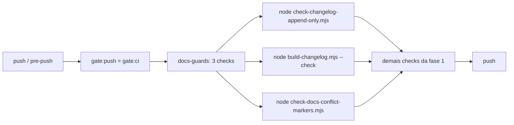

# Impl: OPS63 — Doc-guard também no pre-push (changelog append-only, agregado e marcadores de conflito)

Status: aprovado
Atualizado em: 2026-08-18
Issue: #60
Intenção: docs/plans/ops63-doc-guard-no-pre-push.md
Appetite restante: herdado (~0,5 dia eng; uma mudança aditiva pequena)

## Leitura da intenção

- **Outcome:** `pnpm gate:push` (via `pnpm push` e `.husky/pre-push`) roda os três checks de docs — changelog append-only, agregado up to date (`--check`) e zero marcadores de conflito em markdown — junto da cascata atual; falha bloqueia o push com a mesma mensagem do CI; o CI (`docs-guards` + escape `changelog-rewrite:`) não muda.
- **O que NÃO negociar:** sem bypass novo local (falha local honesta + `git push --no-verify` documentado para o caso raro); sem `plans-only-closes` no pre-push (contrato de body de PR); reuso dos guards existentes, sem duplicar lógica; workflows `.forgejo/*` intocados.
- **O que reavaliar:** nada — a hipótese de direção (adicionar etapa de docs no `scripts/gate-ci.mjs`) confere após leitura do código: os três scripts existem, são autossuficientes (default `origin/main` quando `GITHUB_BASE_REF` ausente) e o gate local é exatamente o espelho serial que omite o job `docs-guards`.

## Abordagem recomendada

**Opções consideradas:** A | B | C
**Recomendação:** A — chamadas diretas dos três scripts existentes na fase 1 (cheap) do `scripts/gate-ci.mjs`, com labels espelhando os steps do job `docs-guards` do `ci-pr.yml`. Porque: zero duplicação (os scripts são o CI), o espelho local continua sendo o único ponto de cascata, custo ~1s por check e os scripts já fazem no-op quando não há diff. É o mesmo padrão dos `check-test-locations`/`lint`/`format:check` (incondicionais).
**Rejeitadas:** B — wrapper novo `scripts/gate-docs.mjs` (indireção sem volatilidade: 3 chamadas virariam um arquivo; os scripts individuais continuariam sendo a fonte). C — script pnpm `gate:docs` no `package.json` (package.json ganha um agregado que só o gate usa; chamar `node scripts/...` direto espelha os steps do CI e não mexe em nada além do espelho).

### Componentes / mudanças

- **`scripts/gate-ci.mjs`**: 3 blocos `run()` na fase 1 (após `format:check`, antes do bloco condicional de typecheck — incondicionais, como o job `docs-guards`): `node scripts/check-changelog-append-only.mjs`, `node scripts/build-changelog.mjs --check`, `node scripts/check-docs-conflict-markers.mjs`. Header do arquivo ganha menção ao OPS63. Linha final `✓ all checks passed` menciona os docs guards. Nada mais muda no arquivo.
- **`package.json` / `.husky/pre-push` / `scripts/git-push.mjs`**: intocados — `gate:push` = `gate:ci` continua sendo a cadeia única.
- **`.forgejo/workflows/ci-pr.yml` / `ci.yml`**: intocados — `docs-guards` continua dono do escape `changelog-rewrite:` (PR body); sem mudança.
- **Migration:** sem migration.
- **Access / Consent:** N/A.
- **UI:** Impeccable A — N/A (sem superfície UI).

## Fases verificáveis

1. **Espelho** — editar `scripts/gate-ci.mjs` (fase 1 + header + linha final). Verificação: os três checks green nesta branch (sem diff de changelog ainda → "no changelog diff"/"no markdown changes"/"aggregate up to date"); caminho de falha validado com um commit descartável que remove linha do agregado (append-only deve falhar).
2. **Docs do fluxo** — `.agents/rules/engineering-standards.mdc` (linha do gate: "espelho do ci-pr.yml sem e2e" → "sem e2e, com docs-guards OPS63"), `.agents/rules/agent-pr-workflow.mdc` (item 2 do fluxo do agente), `docs/AGENT-OPS.md` (contrato item 4 — OPS44: os três checks rodam também no pre-push local; o escape `changelog-rewrite:` segue só no CI/PR body). Verificação: grep final por descrições do gate que omitam os docs guards.
3. **Changelog + gates** — `docs/changelog/2026-08-18-ops63.md` + `pnpm changelog:build`; `pnpm gate:ci` local (cascata completa em `teqo_test`; os docs guards rodam na fase 1 — esta PR é a primeira que os exercita de verdade, pois o agregado muda); CI roda full no PR (`scripts/gate-ci.mjs` é HIGH_RISK).

## Rabbit holes / Não escopo (engenharia)

- **`plans-only-closes` no pre-push** — depende do body do PR; CI-only por design da intenção.
- **Escape local para o append-only** — a restauração legítima (D8) falha localmente sem o PR body; decisão da intenção já fixada: mensagem acionável do guard + bypass documentado `git push --no-verify`.
- **Flag/env de "pular docs"** — anti-goal explícito da intenção.
- **Varredura da working tree vs HEAD** — `check-docs-conflict-markers` lê `HEAD:` (commitado), como o CI lê o diff do PR; rascunho não commitado fica fora — consistente, sem mudança.
- **Novo script pnpm / wrapper** — rejeitado (opções B/C acima).

## Riscos e mitigação

- **Falha local de append-only em PR que usa o escape `changelog-rewrite:`** (ex. restauração D8): o guard falha com a mensagem do CI sem o escape; o agente usa `git push --no-verify` (escape já documentado em AGENT-OPS). O CI continua aceitando o escape via PR body — nenhuma entrega legítima fica presa. Mitigação: nota no impl do changelog/AGENT-OPS.
- **`origin/main` desatualizado no worktree**: merge-base velho pode acusar diff inexistente ou deixar passar diff novo. Mesmo comportamento dos guards existentes (`ci-scope` usa `origin/main`); o `fetch` do rebase obrigatório no fluxo reduz a janela. Sem ação nova.
- **Acoplamento com OPS59** (mesmo arquivo): já mergeado em `main`; a branch deste worktree nasceu dele — mudança aditiva sem conflito; rebase obrigatório antes do `pnpm push` de qualquer forma.

## Aceite de engenharia

- [ ] Aceite de produto da intenção ainda coberto (três checks no pre-push; CI intocado)
- [ ] Invariantes AGENTS/engineering-standards (gate bare; `format:check`; knip/cycles sem arquivos novos)
- [ ] Testes de domínio previstos: nenhum teste novo (nenhum módulo compartilhado muda); suíte unit + `pnpm gate:ci` verdes; caminho de falha do append-only verificado manualmente com commit descartável
