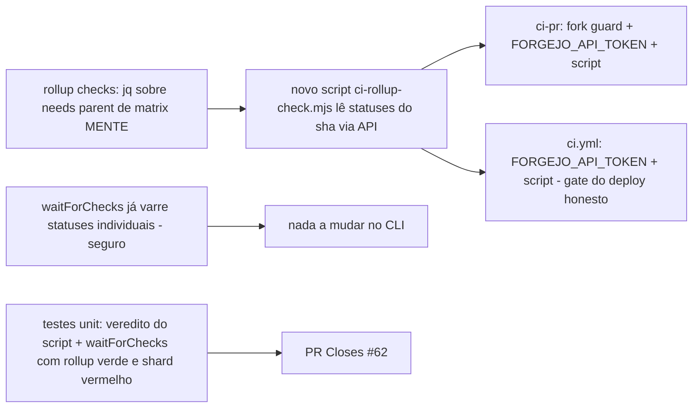

# Impl: OPS64 — forgejo-pr-automerge: waitForChecks conta o próprio status pendente (deadlock → timeout, merge nunca acontece) + rollup `checks` sem agregação de shards

Status: em execução (entregue — ver desfecho no final)
Atualizado em: 2026-08-18
Issue: #62
Intenção: body da Issue (sem plano de intenção separado — body é a spec)
Appetite restante: herdado (~1 dia de ops)

## Leitura da intenção

- **Outcome:** (primário) o safety net `ready-automerge` deixa de se auto-bloquear no próprio status `pending` e mergea PRs com CI verde; (secundário) o rollup `checks` do `ci-pr.yml` (e o do `ci.yml`, que gateia o deploy) deixa de reportar SUCCESS com um shard de e2e vermelho — o gate do servidor (branch protection) e o UI param de mentir.
- **O que NÃO negociar:** merge só com CI verde de verdade (a classe OPS52 — merge manual/automático com shard vermelho — não pode voltar); `waitForChecks` continua ignorando o próprio contexto; nada de fork rodando código com o PAT do repo (guarda do OPS61); sem edição de Issues `in-progress` de terceiros; nada de prod DB.
- **O que reavaliar:** a intenção lista três correções possíveis para o primário (filtrar próprio context / `merge_when_checks_succeed` nativo / timeout > 40 min) — **a evidência mostra que o primário já foi entregue pelo OPS61** (issue criada antes do OPS61 subir); o trabalho real do OPS64 é o **secundário** (agregação de shards no rollup), que está vivo e medido.

## Achados da exploração (evidência ao vivo 2026-08-18)

1. **Primário (deadlock do próprio pending) — JÁ ENTREGUE pelo OPS61** (`8b989306`, em `main`): `waitForChecks` filtra contextos `PR Ready + auto-merge` (`verdicts`), gateia no rollup `CI (PR) / checks` presente + success, e o merge POST usa `FORGEJO_API_TOKEN` (409 do pre-receive). **Provado vivo:** runs 710 (PR #67) e 712 (PR #70) do `ready-automerge` terminaram `success` e os PRs foram mergeados no momento do fim do run (21:32:24/21:35:24 vs fim 21:32:27/21:35:31) — o CLI mergeou. O timeout já subiu para 45 min (CLI) / 55 min (workflow). A opção "timeout > 40 min" da intenção também já está entregue.
2. **Secundário (rollup `checks` mente) — VIVO e medido em 5 runs:** o resultado do job-pai de matrix no contexto `needs` do Forgejo 9.0.3 (gitea-1.22.0) é o resultado do **último shard a reportar**, não um AND sobre os shards:
   - runs 604/607/610 (PR #55/#56/#57, ci-pr pré-OPS61 — mesmo jq de hoje): e2e (1)=failure, e2e (2)=success → `checks`=SUCCESS (shard vermelho mascarado);
   - run 716 (PR #71, pós-OPS61): e2e (1)=success, e2e (2)=failure → `checks`=failure (o vermelho era o último — pegou por acaso);
   - run 638: e2e (1)=failure, e2e (2)=success → `checks`=failure **só porque int e build também falharam** (o e2e vermelho continuou mascarado).
     Ou seja: o gate `CI (PR) / checks*` do servidor e o rollup jq (`all(.value.result == "success" or "skipped")`) passam com um shard vermelho quando o último shard é verde.
3. **Por que o CLI ainda é seguro hoje:** `waitForChecks` varre **todos** os statuses individuais (`failed` inclui `CI (PR) / e2e (1)` = failure → throw). Foi por isso que no run 607 "só o waitForChecks pegou o vermelho". O buraco é o **gate do servidor** (branch protection satisfeita por rollup verde) + o UI — e o `deploy` do `ci.yml` (mesmo jq) rodaria com shard vermelho em main.
4. **Não existe `needs.<matrix>.results` no runner do Forgejo 9.0.3:** o `Needs` do act (gitea/act `pkg/exprparser/interpreter.go`) tem só `Outputs` e `Result` — o contrato `.results` do GitHub não existe aqui. A correção do rollup **não pode** vir do contexto `needs`.
5. **`merge_when_checks_succeed` existe neste servidor** (swagger + fonte gitea 1.22: `ScheduleAutoMerge` → `IsPullCommitStatusPass`), mas o OPS50/61 escolheu poll+merge e ele **funciona** (achado 1). Além disso o auto-merge nativo gateia nos contextos exigidos da branch protection — o mesmo rollup mentiroso — então **não** corrigiria o secundário; e o `mergeable` do servidor também usa o mesmo `MergeRequiredContextsCommitStatus`. Decisão: manter poll+merge; corrigir o rollup.
6. **Shards já postam status individuais:** cada shard do e2e posta `CI (PR) / e2e (N) (pull_request)` (e `CI / e2e (N) (push)` no main) — o dado confiável é o status do commit, não o parent do `needs`. É a mesma fonte que o `waitForChecks` usa (`listCommitStatuses`).
7. **Risco RCE ao colocar PAT no ci-pr.yml:** o `ci-pr.yml` roda em PRs de fork (repo público, sem guard no workflow). Injetar `FORGEJO_API_TOKEN` no job `checks` **sem** o guard same-repo seria código do fork rodando com o PAT (a mesma classe que o OPS61 guardou nos pós-merge). Qualquer uso de PAT no `ci-pr.yml` exige `if: head.repo.full_name == github.repository` no job.

## Abordagem recomendada

**Opções consideradas:**

- **A — rollup lê os statuses do commit via API (`listCommitStatuses`), com o mesmo prefixo do workflow (`CI (PR) / `, `CI / `) e excluindo o próprio contexto (`…/ checks`):** veredito honesto por construção, mesma fonte do `waitForChecks`, funciona para o `ci-pr.yml` e o `ci.yml` (gate do deploy).
- B — `needs.<matrix>.results` (contrato GitHub): **inexistente** no act do Forgejo 9.0.3 (fonte, achado 4).
- C — `merge_when_checks_succeed` nativo (opção da intenção): existe no servidor, mas gateia nos contextos exigidos (rollup mentiroso) — não corrige o secundário; poll+merge atual já funciona (achado 1).
- D — quebrar a matrix em jobs explícitos (e2e-1/e2e-2): mexe no contrato OPS34 (`e2eShardConfig` pinado por unit test `shard: [1, 2]`), refatora o classificador de escopo; não é o dono do problema (o dono é o veredito do rollup).
- E — timeout > 40 min (opção da intenção): já entregue (45/55); não corrige a mentira do rollup.
- F — deixar como está (rollup pode mentir, "o CLI pega"): deixa o gate do servidor e o `deploy` vulneráveis à classe OPS52.

**Recomendação:** A — porque é o único caminho que (a) usa a mesma fonte que o CLI já confia (statuses do commit — não o parent de matrix), (b) corrige os dois rollups (PR e main/deploy), (c) não mexe no contrato OPS34, (d) é testável como função pura. O PAT no `ci-pr.yml` entra **com o fork guard** no job `checks` (achado 7).

**Rejeitadas:** B (não existe no runner — falha silenciosa ou dependência de upgrade); C (não corrige o secundário — o auto-merge nativo confiaria no rollup mentiroso; e o poll+merge provado continua); D (refatora contrato OPS34 sem necessidade); E (já entregue, não é fix); F (classe OPS52 no gate do servidor + deploy vermelho em main).

### Componentes / mudanças

- **`scripts/lib/ci-rollup-check.mjs`** (novo, puro, zero-dep): `rollupVerdict(statuses, { prefix, ownPrefix })` → `{ ok, failed: string[], pending: string[] }` — falha (exit 1) se qualquer contexto com o prefixo do workflow (excluindo o próprio rollup) for `failure`/`error`; falha também se houver `pending` (cascata não assentada — fail-closed); falha se a lista vier vazia (API indisponível/estranho — nunca "verde por falta de dado"); success apenas quando todos os demais contextos do workflow estiverem `success` (skipped posta como success, observado). Reusa `listCommitStatuses` do `forgejo-api.mjs`.
- **`scripts/ci-rollup-check.mjs`** (novo, CLI plain Node, padrão `forgejo-pr-automerge.mjs`): `--sha <head-sha> --prefix "CI (PR) / " --own-prefix "CI (PR) / checks"` (no `ci.yml`: `"CI / "` / `"CI / checks"`); imprime os contextos que falharam e sai 1; verde → 0.
- **`.forgejo/workflows/ci-pr.yml`** (job `checks`): `if:` ganha o fork guard (`github.event.pull_request.head.repo.full_name == github.repository`, pré-checkout — mesmo padrão do `ready-automerge`); `env: FORGEJO_API_TOKEN`; steps ganham `actions/checkout@v5` + `actions/setup-node@v5` (node 24, `package-manager-cache: false`) + `node scripts/ci-rollup-check.mjs --sha "${{ github.event.pull_request.head.sha }}" --prefix "CI (PR) / " --own-prefix "CI (PR) / checks"`; o passo jq do `needs` sai (o script o substitui — fonte única). `needs` e `if: always()` permanecem (o job só roda depois da cascata toda — a ordenação que garante "assentou").
- **`.forgejo/workflows/ci.yml`** (job `checks`): idem, sem fork guard (evento push/dispatch não tem fork); `--sha "${{ github.sha }}"`, prefixo `CI / `. Com isso o `deploy` (que `needs: [checks]`) nunca roda com shard de e2e vermelho em main.
- **`tests/unit/forgejoApi.unit.spec.ts`**: novo caso pinando o cenário run-607 — rollup `CI (PR) / checks` = success **com** `CI (PR) / e2e (1)` = failure → `waitForChecks` lança "Checks falharam" (o CLI nunca confia no rollup sozinho).
- **`tests/unit/ciRollupCheck.unit.spec.ts`** (novo): veredito puro — (a) shard vermelho + rollup próprio pending → fail (o run 607 do passado, agora no rollup); (b) shard (2) vermelho → fail (run 716); (c) tudo success → ok; (d) contexto do safety net (`PR Ready + auto-merge`) pending → ignorado (não casa o prefixo); (e) próprio contexto pending → ignorado; (f) lista vazia → fail; (g) variante `CI / ` do main; (h) `skipped` postado como success → ok.
- **Docs:** `.agents/rules/agent-pr-workflow.mdc` (seção "Required checks": rollup agora verifica os statuses individuais via API — o parent de matrix do Forgejo não agrega; nota do fork guard: PRs de fork ficam sem o status `checks` → merges de fork bloqueados pelo servidor, hardening intencional), `docs/AGENT-OPS.md` (linha da branch protection + tabela de workflows), header dos dois workflows, `docs/changelog/2026-08-18-ops64.md` + `pnpm changelog:build`.
- **Migration:** sem migration (não toca schema/DB).
- **Access / Consent:** N/A.
- **UI:** N/A (A).

## Fases verificáveis

1. **Script + veredito puro** — `scripts/lib/ci-rollup-check.mjs` + CLI + unit tests; `pnpm test:unit` local.
2. **Workflows** — `ci-pr.yml` e `ci.yml` com o novo passo; diff completo no PR da entrega.
3. **Gates** — `pnpm gate:fast` local (lint/format/typecheck/knip/cycles/unit); e2e roda no CI (OPS59). Push via `pnpm push`; PR `Closes #62`. **Verificação ao vivo na própria PR:** o run do `ready-automerge` da PR prova o primário de novo (já provado no OPS61); o novo rollup proof na PR — se um shard falhar, `checks` fica vermelho (e o servidor bloqueia), se tudo verde, mergea.

## Rabbit holes / Não escopo (engenharia)

- Não trocar poll+merge por `merge_when_checks_succeed` nativo (achado 5 — não corrige o secundário; poll+merge provado; trocar é item futuro se algum dia o upgrade do Forgejo mudar o contrato).
- Não consertar o parent de matrix do Forgejo (bug upstream do runner; a correção é viver sem ele).
- Não refatorar a matrix e2e (OPS34) nem o classificador de escopo.
- Não adicionar o fork guard aos demais jobs do `ci-pr.yml` (não têm segredos; fora do escopo).
- Não mexer no `waitForChecks` além do teste novo (o CLI já está correto — achado 3).

## Riscos e mitigação

- **PRs de fork perdem o status `checks`** (fork guard no job): merges de fork ficam bloqueados pelo servidor (contexto exigido nunca posta). Hardening intencional e alinhado à política atual ("a merged fork PR would deploy" — o `ready-automerge` já exclui forks); documentado no changelog. Se um dia um merge de fork for legítimo, é o escape documentado do OPS61 (ajustar a regra temporariamente).
- **API indisponível no job `checks` → rollup vermelho:** fail-closed (nunca verde por falta de dado); o job vermelha e o PR fica bloqueado até a infra voltar — visível, não silencioso. O mesmo runner self-hosted que roda os jobs serve a API (mesma rede), e o `ready-automerge` já depende dela.
- **Race status×rollup (status do último shard postado depois do `checks` começar):** o job `checks` só roda após `needs` da cascata toda (a ordenação do workflow garante "assentou"), e o runner posta o status no fim de cada job — o window é o mesmo que o jq atual já tinha; o `waitForChecks` (poll) continua sendo o backstop do merge.
- **O script roda o código do head no job `checks` (same-repo):** mesmo nível de confiança do `ready-automerge` (que também roda script do head com o PAT) — same-repo tem write de qualquer forma.

## Desfecho (gate com o humano — OPS62 mergeou em main durante a execução)

O OPS62 (mergeado às 23:32Z enquanto este item rodava) reescreveu ci-pr.yml e
ci.yml como **jobs únicos sequenciais** — sem matrix, sem shards. O bug de
agregação do parent de matrix que este item atacava **deixou de existir
estruturalmente**: o status do job `checks` agora É o veredito honesto da
cascata. Decisão do gate: **descartar** os edits de workflow e o script
`ci-rollup-check.mjs` (redundantes pós-OPS62), **manter** o teste-pino do
`waitForChecks` (run 607: rollup verde + shard vermelho → CLI lança) e as docs
honestas. Entregue: pin + docs + changelog.

## Aceite de engenharia

- [x] Aceite de produto da intenção ainda coberto (primário já entregue pelo OPS61; secundário eliminado estruturalmente pelo OPS62; o CLI segue com a defesa individual de statuses, pinada por teste)
- [x] Invariantes AGENTS/engineering-standards (sem código morto — script descartado; docs honestas — a mentira do parent de matrix documentada)
- [x] Testes de domínio previstos (waitForChecks run-607 pinado em `forgejoApi.unit.spec.ts`)
- [x] Verificação: unit 2360 verdes; lint/format/typecheck/knip/cycles no gate local; a própria PR prova o ciclo (o `ready-automerge` mergea no fim)
