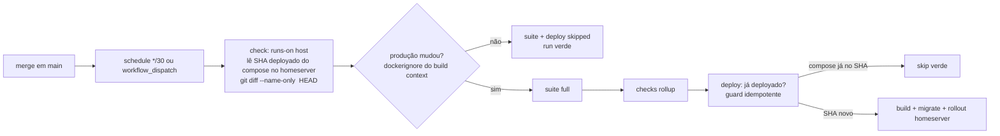

# Impl: CI do main em janela de 30 min + matar o agent-pool

Status: aprovado
Atualizado em: 2026-08-18
Issue: #64
Intenção: docs/plans/ops65-ci-main-janela-30min-e-matar-pool.md
Appetite restante: herdado (~0,5–1 dia eng; um outcome verificável)

## Leitura da intenção

- **Outcome:** a workstation deixa de pagar a CI do main a cada merge e o tick
  do agent-pool. `ci.yml` roda por **janela fixa de 30 min** (`schedule */30` +
  `workflow_dispatch`), com um **gate barato (~segundos, sem pnpm)** que
  classifica "mudança de produção" comparando o HEAD de `main` com o SHA
  **deployado** no homeserver; sem mudança → suite + deploy skipped, run verde.
  Deploy manual (dispatch) continua imediato. `agent-pool.yml` é removido.
- **O que NÃO negociar:** não remover a verificação pós-merge do main (o
  `ci.yml` continua o verificador); deploy continua gated pelo verificador
  verde; sem segundo mecanismo de deploy fora do pipeline; nada de requeue
  estilo cooldown (janela fixa é o corte).
- **O que reavaliar:** a hipótese de "classificar por `.dockerignore`" é
  confirmada — e é a única abordagem que **falha fechado** (qualquer dúvida →
  suite roda; ver anti-goal "não remover a verificação do main"). O exemplo do
  aceite ("só docs/**scripts**/skills/AGENTS → skip") **não** vale literalmente
  sob `.dockerignore`: `scripts/`, `tests/`, `.forgejo/` e `AGENTS.md` **estão
  no build context** (o Dockerfile faz `COPY . .`) → contam como produção.
  Decisão resolvida pela direção explícita do plano (`.dockerignore` é a fonte
  da verdade) + anti-goal: a classificação é **conservadora** (mais runs, nunca
  menos). Só `docs/`, `.agents/`, `.env*`, artefatos etc. viram skip.

## Abordagem recomendada

**Opções consideradas:**

- **A) Gate `check` (runs-on `host`, ~segundos):** checkout com `fetch-depth: 0`
  → `ssh homeserver` lê o SHA deployado do `~/stack/docker-compose.yml`
  (`image: teqo-1313:<sha>`) → `git diff --name-only <sha> HEAD` →
  `scripts/ci-classify-production.mjs` classifica pelos padrões do
  `.dockerignore` (semântica moby, matcher puro em Node stdlib, sem pnpm).
  Job `deploy` ganha guard de idempotência no script remoto ("compose já
  referencia o SHA → exit 0"). Recomendada.
- **B) Gate comparando `HEAD` vs último SHA conhecido do run anterior**
  (estado em arquivo na workstation / Forgejo API). Rejeitada — o estado
  real da produção vive no homeserver; derivar de artefatos de CI mente
  quando um run falha no meio (compose restaurado no rollback = a verdade).
- **C) Whitelist manual de "caminhos de produção"** (src/, public/, Dockerfile…).
  Rejeitada — drift e **falha aberto**: um caminho esquecido → suite pulada
  indevidamente → main não verificado, exatamente o anti-goal. `.dockerignore`
  é auto-mantido e é o que define o artefato.

**Decisões de engenharia (com rejeitadas):**

1. **Gate `check` em `runs-on: host`** (não container): precisa de `ssh
homeserver` (a chave vive no host da workstation — mesmo padrão do job
   `deploy`, OPS53). Segurança: job só em `ci.yml` (main + dispatch), nunca em
   `ci-pr.yml` — mesma premissa já validada no OPS53.
2. **Fail-open no gate:** o gate lê a **revision do container rodando** no
   homeserver (`docker inspect` → label `org.opencontainers.image.revision`;
   o compose pode mentir após rollback falho, pois é trocado antes do rollout).
   Revision desconhecida (label ausente/container sem label) → `production =
true` (suite roda, run verde). Gate **incapaz de classificar** (erro de
   git/`.dockerignore`/sem input) → imprime `production=true` e sai com exit
   não-zero → o run fica **vermelho** (nunca blackout silencioso). Deploy
   nunca roda no escuro: condição dos jobs da suite é
   `needs.gate.result != 'success' || needs.gate.outputs.production == 'true'`.
3. **Deploy condicionado duplo:** `needs: [checks, gate]` + `if:
needs.checks.result == 'success' && needs.gate.outputs.production ==
'true'` — sem isso, um `if` só no output rodaria deploy com suite vermelha
   (semântica do Actions: `if` verdadeiro vence `needs` falho).
4. **Rollup `checks` intocado:** `if: always()` + `all(success or skipped)` já
   aceita jobs skipped → run verde com chips skipped quando nada a fazer.
5. **Classificador:** matcher de `.dockerignore` (moby semantics: padrão sem
   `/` casa basename em qualquer profundidade; `!` negação; `/` ancorado à
   raiz; `/dir/` só diretório; `**`) + CLI `scripts/ci-classify-production.mjs`
   (`--deployed <sha>`/`--files-from`, `--value`; dispatch → produção forçada;
   exit 0 = classificou, exit 1 = não classificou). Sem pnpm, sem deps.
6. **Guard "already deployed" no `deploy-homeserver.sh`:** após o HEAD guard +
   flock, antes de sourcear secrets: se o **container rodando** já tem a
   revision do SHA → `exit 0` ("nothing to do"). Mata o rebuild de ~15 min em
   dispatch duplicado. Container sem label/fora = "não deployado" (procede —
   direção segura). Sem flag FORCE (YAGNI; força = fluxo manual do runbook).
7. **Remoção do `on: push`:** branch protection do main exige apenas
   `CI (PR) / checks*` (cascade do `ci-pr.yml`) — merges não dependem do
   `ci.yml` pós-merge (verificado em `scripts/configure-branch-protection.mjs`
   e `lib/branch-protection.mjs`). `agent-pr-ready-automerge` e
   `issue-done-on-main-merge` são eventos de PR — intocados.
8. **`fetch-depth: 0` no job `gate`** — o diff `<deployado>..HEAD` precisa do
   histórico; custo de 1 clone full a cada 30 min é desprezível vs a suite.
   Overlap de janelas (suite > 30 min, sem `concurrency` no Forgejo):
   limitado e auto-dedup via revision deployada (a segunda janela vê
   deploy == HEAD → skip); flock serializa deploy. Documentado como limite
   conhecido.
9. **Hardening pós-review:** job `gate` com `actions/setup-node@v5` (node 24
   explícito no host), restrito a `github.ref == 'refs/heads/main'` (dispatch
   em branch não roda código do branch no host — a suite roda fail-open em
   containers com secrets de teste), e invocação única do classificador
   (JSON capturado uma vez; `production` extraído via `node -pe`).

### Componentes / mudanças

- **`.forgejo/workflows/ci.yml`**: `on:` vira `schedule */30` +
  `workflow_dispatch` (remove `push`); job `gate` novo (host, main-only,
  output `production`); `static/int/build/e2e` ganham `needs: [gate]` + `if`
  fail-open; `deploy` ganha `needs: [checks, gate]` + `if` duplo. Cabeçalho
  atualizado.
- **`.forgejo/workflows/agent-pool.yml`**: **removido** (scripts/skills/docs do
  pool ficam dormentes — aceite).
- **`scripts/lib/dockerignore.mjs`** (novo): `parseDockerignore` /
  `isIgnoredPath` — matcher puro de `.dockerignore` (moby semantics), stdlib.
- **`scripts/ci-classify-production.mjs`** (novo): CLI — dispatch → true;
  SHA deployado ausente → true; senão `git diff --name-only <sha> HEAD` →
  classifica; JSON no stdout (`--value` para o workflow); erro interno → true
  - stderr (fail-open), exit 0.
- **`scripts/deploy-homeserver.sh`**: guard "already deployed" (compose já
  referencia o SHA → skip verde) após o flock, antes dos secrets.
- **`scripts/lib/test-affected-core.mjs`**: `HIGH_RISK_EXACT` +=
  `scripts/ci-classify-production.mjs`, `scripts/lib/dockerignore.mjs`
  (mudar o classificador força suite full no PR — padrão existente).
- **Migration:** sem migration.
- **Access / Consent:** N/A.
- **UI:** Impeccable A — sem UI.

### Dados → forma

N/A — política de infra/CI.

## Fases verificáveis

1. **Classificador core** — `lib/dockerignore.mjs` + `ci-classify-production.mjs`
   - specs unit (matcher contra o `.dockerignore` real; classify pure; CLI via
     `--files-from`; fail-open: sem SHA deployado / dispatch / erro → true).
2. **Workflow + pool** — `ci.yml` (schedule + gate + ifs), delete
   `agent-pool.yml`, `HIGH_RISK_EXACT`, pins do `ciSkipInvariants` (janela 30,
   sem `push`, gate existe, ifs fail-open) e `deployScript` (guard
   "already deployed").
3. **Docs + changelog** — runbook `docs/ops/teqo-1313-deploy.md` (janela,
   gate, "already deployed", falhas conhecidas: ssh do gate falha → fail-open;
   overlap), `AGENTS.md` (parágrafo CI/deploy), `docs/AGENT-OPS.md` (linhas de
   `ci.yml` e `agent-pool.yml`), `docs/changelog/2026-08-18-ops65.md` +
   `pnpm changelog:build`, status `entregue` no plano de intenção.
4. **Gates** — `pnpm gate:fast`, `pnpm format:check`, `pnpm knip`,
   `pnpm check:cycles`, `pnpm build` local. Sem mudança em `src/` → e2e do PR
   skip por affected.

## Rabbit holes / Não escopo (engenharia)

- Reimplementar cooldown GitHub (defer/requeue) — corte do plano; janela fixa.
- Classificação fina por tipo de arquivo (whitelist) — corte do plano;
  `.dockerignore` é a fonte da verdade.
- Flag FORCE no deploy / UI de deploy — runbook basta.
- Limpar scripts/skills/docs do pool — dormentes por aceite.
- Mover a CI para VPS/homeserver — fora de escopo do plano.

## Riscos e mitigação

- **`ssh homeserver` falha no gate** → fail-open (suite roda); deploy fica para
  a próxima janela (≤30 min, auto-cura). Runbook documenta.
- **Overlap de janelas** (suite > 30 min) → segunda suite no mesmo SHA
  (raro, limitado); flock serializa; SHA deployado dedupa a janela seguinte.
- **Dispatch do mesmo SHA** → suite roda (intenção explícita), deploy skip
  verde "already deployed"; força via fluxo manual do runbook.
- **Remoção do `push` → "merge != deploy imediato"** → aceite explícito da
  intenção (≤30 min); dispatch cobre urgência; falha de deploy continua
  vermelha e o site fica no container antigo.
- **Deploy antigo sobrescrevendo push novo** → HEAD guard + flock intactos.

## Aceite de engenharia

- [x] Aceite de produto da intenção ainda coberto (janela 30 min; run verde
      com skipped; pool morto; dispatch imediato; deploy gated)
- [x] Invariantes AGENTS/engineering-standards (sem segredos novos; guards de
      dev/test intocados; nada de Neon; host jobs só em ci.yml)
- [x] Testes previstos (unit: matcher + classificador + pins de workflow e
      script de deploy)

Self-score decision-quality: 1) decisões caras com rejeitadas ✓ 2) cabe no
appetite ✓ 3) rabbit holes nomeados ✓ 4) reusa padrões existentes (OPS53 host
job + ssh, flock, HEAD guard, ciSkipInvariants/deployScript pins, HIGH_RISK) ✓ 5) aceite da intenção preservado, com uma divergência explícita de exemplo do
aceite (scripts/tests/AGENTS contam como produção por `.dockerignore` —
conservador, alinhado ao anti-goal) ✓ — 5/5.
