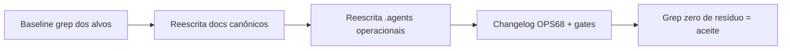

# Impl: OPS68 — docs: drift GitHub-era no AGENT-OPS/README — reescrita da parte 2 do OPS50

Status: aprovado
Atualizado em: 2026-08-19
Issue: #74
Intenção: o body da Issue é a spec (frontmatter `id: OPS68, depends: [OPS61], priority: P3`); o escopo ancora na parte 2 do OPS50 (reescrita de docs canônicos) e no título (drift GitHub-era: `gh pr`, secrets Vercel, fonte canônica GitHub)
Appetite restante: P3, ~meio dia de engenharia (docs-only)

## Leitura da intenção

- **Outcome:** os docs canônicos operacionais do paradigma (AGENT-OPS, README, roadmap, AGENTS.md e as skills/rules always-on de operação) descrevem a realidade Forgejo/homeserver de 2026-08 — zero resíduo GitHub-era (comandos `gh`, links github.com/fsolla, "GitHub Issues" como fonte canônica) e zero resíduo Vercel-era (secrets `VERCEL_*`, "Neon" como banco de prod, "deploy Vercel").
- **O que NÃO negociar:** nada de produto — é docs. Não tocar docs congelados/históricos (`docs/plans/*`, `docs/changelog/*` + `CHANGELOG-AGENTS.md` insert-only, `docs/GUARDRAILS.md` — os links GitHub lá são registro histórico das issues/PRs da época; `docs/CUTOVER-MAIN-ONLY.md` — checklist histórico do cutover, já anotado pelo OPS61; a linha histórica do `nucleos-eleitorais.mdc` que cita "mirror GitHub" descreve uma entrega de 2026-07-23 e permanece como registro). A "fonte canônica" passa a ser Forgejo sem ambigüidade — uma fonte só.
- **O que reavaliar:** a hipótese do título (AGENT-OPS/README) é o núcleo, mas a exploração mostra que a mesma classe de drift vive em mais 5 arquivos operacionais always-on — o sweep segue a classe nomeada no título ("gh pr", "Vercel secrets", "fonte canônica GitHub"), não só os dois arquivos.

## Abordagem recomendada

**Opções consideradas (largura do sweep — decisão cara):**

- **A)** Só `docs/AGENT-OPS.md` + `README.md`. **Rejeitada** — deixa a regra always-on `agent-pr-workflow.mdc` (com `gh pr create/merge/checks` de verdade, e `gh` não existe em nenhuma máquina — achado OPS50) e as skills de fluxo (`work-issue`/`execution-pipeline`/`plan-issue`) instruindo comandos fantasma; o próprio `/work-issue` desta sessão lê `gh issue view` no Passo 1. Um OPS69 nasceria na semana.
- **B)** Canônicos operacionais (recomendada): `docs/AGENT-OPS.md`, `README.md`, `docs/roadmap.md` (só a linha de fonte canônica — o resto continua congelado), `AGENTS.md` (refs Neon/era-Vercel + nome do job do gate), `.agents/rules/agent-pr-workflow.mdc` e as 7 skills de operação com drift (`work-issue/SKILL.md`, `work-issue/execution-pipeline.md`, `plan-issue`, `project-status`, `capture-review-debts`, `engineering-audit`, `worktree-next-issue`, `agent-pool`). Edições **pontuais** (só as linhas do drift), nunca reescrita/refrase de conteúdo são.
- **C)** OPS50 parte 2 integral = varrer também conteúdo genérico de skills de terceiros (`impeccable` hooks.md, `clean-code` references, etc.). **Rejeitada** — aquilo é biblioteca de skill, não operação do Teqo; "GitHub Copilot"/"Jira/GitHub Issues" em conteúdo genérico é referência ao mundo, não drift do repo.

**Recomendação: B** — cobre a classe do título inteira no mínimo de arquivos com risco de diff; o critério de saída é verificável por grep.

### Decisões de engenharia (todas caras o bastante para registar)

1. **Fluxo de PR documentado (o que substitui `gh pr …`).** Realidade verificada: `gh` não existe na máquina do humano nem nos workers (OPS50); o merge é feito pelo safety net `agent-pr-ready-automerge.yml` (`scripts/forgejo-pr-automerge.mjs`, plain Node) quando o rollup `CI (PR) / checks` posta verde — para TODA PR same-repo → main (OPS57), draft não-`cursor/*` = veto; a branch protection no servidor bloqueia merge com o contexto exigido vermelho (OPS61, 405). Criação de PR é via API/MCP do opencode (humano) ou `ManagePullRequest` `draft:false` (Cursor Cloud). Documentar: `pnpm push -u origin HEAD` → PR via API/MCP (Ready, base `main`, `Closes #N`) → safety net espera o rollup e mergea por rebase; `gh pr checks --watch` não tem equivalente (quem espera é o safety net). **Nunca documentar comando que não existe.**
2. **"Só humano" (AGENT-OPS L24 + README L17).** O que sobrou de fato: envs de prod vivem no homeserver (`~/stack/teqo-1313.env`, fora do repo; o deploy lê via BuildKit secrets), reaplicar branch protection é `pnpm configure:branch-protection` (idempotente, já aplicado 2026-08-18), runbook/rollback manual em `docs/ops/teqo-1313-deploy.md`. Segredo de repo único ativo: `FORGEJO_API_TOKEN`; `CURSOR_API_KEY` só existe para o pool dormente. `POOL_GITHUB_TOKEN` é legado — o próprio `scripts/agent-pool.mjs` avisa "legado presente no env — ignorar" (L470); remover da tabela de secrets ou marcar `legado`.
3. **Deploy descrito como ele é (OPS53+OPS65).** `ci.yml` do main em janela fixa de 30 min; job `gate` (o AGENTS.md escreve `check` — corrigir para `gate`, job key real no YAML) classifica mudança de produção via `.dockerignore` + revision do container; job `deploy` (runs-on `host`) streama `scripts/deploy-homeserver.sh` — migrações aplicadas pelo serviço de maintenance `teqo-1313-migrate` antes do rollout. A frase do README "every Vercel deploy automatically applies pending migrations" morre; a do AGENT-OPS L96 ("deploy Vercel removido no OPS50") está correta e fica.
4. **Roadmap congelado, ponteiro vivo.** `docs/roadmap.md` L5: trocar só o ponteiro da fonte canônica (GitHub → Forgejo, `git.solla.dev/fsolla/teqo/issues`); a declaração "congelado em 2026-07-30, não é mais editado" permanece — o ponteiro é instrução de leitura, não conteúdo do roadmap.
5. **Pool dormente.** `agent-pool/SKILL.md` fica (histórico, como o AGENT-OPS já declara), mas a descrição "GitHub Actions" e a referência `.github/workflows/agent-pool.yml` (L14) ganham a marca de removido OPS65 — a skill ainda é descoberta e lida. `archive-cursor-agent.yml` ganha linha na tabela CI do AGENT-OPS (existe no `.forgejo/workflows/` e não está na tabela; dormente com o pool).

### Componentes / mudanças

- **`docs/AGENT-OPS.md`** — L3 "só GitHub"→"só Forgejo"; L21 fonte canônica → Issues do Forgejo; L23 fluxo do agente (sem `gh`); L24 "Só humano" (decisão 2); L59 item 3 do Contrato de PR (decisão 1); L92 tabela secrets (`POOL_GITHUB_TOKEN` → legado; nota pool dormente); tabela CI ganha linha `archive-cursor-agent.yml` (dormente); L96 verificado e mantido.
- **`README.md`** — cheatsheet L7–18 reescrito (5 linhas: claim → implementa+push → PR via API/MCP + safety net → ci.yml janela 30 min → deploy homeserver; secrets humanos `FORGEJO_API_TOKEN` + envs do homeserver; CI `.forgejo/workflows/`); L38 "electoral nuclei"→"municípios" (vocabulário era Praça); L52 Neon→homeserver Postgres; L65 `PROD_DATABASE_URL` = `DATABASE_URL` de `~/stack/teqo-1313.env`; L87 `REVALIDATE_SECRET` no env do homeserver; L100 migrações no deploy → maintenance service `teqo-1313-migrate` (decisão 3); L116 "GitHub mirror"→Forgejo Actions; L127 papéis de campanha atuais (`coordinator|advisor|candidate|leader`); L133 Issues → link Forgejo.
- **`docs/roadmap.md`** — L5 ponteiro da fonte canônica (decisão 4).
- **`AGENTS.md`** — L30/L32/L159 refs "Neon" → homeserver Postgres (era-Vercel, mesma classe do parêntese do título); L15 "(`check`"→"(`gate`" (job key real); L147 "no Neon risk" → "no prod-DB risk" (idem).
- **`.agents/rules/agent-pr-workflow.mdc`** — create (L14), ManagePullRequest (L32), auto-merge (L54), checks (L74/L77): comandos `gh` → API/MCP + safety net; L69 "There is no deploy from CI … outside this repo" → deploy step no `ci.yml` (janela, OPS53/OPS65) — contradição factual com AGENT-OPS L96; L81 promote idem.
- **`.agents/skills/work-issue/SKILL.md`** — L45–48 "consulte o GitHub" / `gh issue view <N>` → Forgejo/API da issue.
- **`.agents/skills/work-issue/execution-pipeline.md`** — L38–40: `gh pr create/merge/checks` → API/MCP + safety net; "ignore Vercel Git" morre.
- **`.agents/skills/plan-issue/SKILL.md`** — L16/L32/L153: "GitHub Issue rastreável"/"Nada no GitHub"/`gh issue create`/`gh pr create`/`gh pr merge --auto` → Forgejo/`pnpm agent:register`/safety net.
- **`.agents/skills/project-status/SKILL.md`** — L3+L8 "GitHub Issues rastreáveis" → "Issues do Forgejo".
- **`.agents/skills/capture-review-debts/SKILL.md`** — L3 "trackable GitHub Issues" → Forgejo.
- **`.agents/skills/engineering-audit/SKILL.md`** — L16/L169 `gh pr merge --auto --rebase` → safety net (mesma mecânica dos outros).
- **`.agents/skills/worktree-next-issue/SKILL.md`** — L34 "a skill lê o resto do GitHub" → Forgejo.
- **`.agents/skills/agent-pool/SKILL.md`** — descrição "GitHub Actions" → Forgejo Actions; L14 `.github/workflows/agent-pool.yml` → marcada removida OPS65 (decisão 5).
- **Migration:** sem migration. **Access/Consent:** N/A. **UI:** A — sem UI (docs-only).

## Fases verificáveis

1. **Baseline** — grep dos alvos registra o inventário do drift (já medido na exploração); o diff do PR prova o que mudou.
2. **Docs canônicos** — AGENT-OPS → README → roadmap → AGENTS.md (verificação de fato contra `.forgejo/workflows/ci.yml`, `deploy-homeserver.sh` e `docs/ops/teqo-1313-deploy.md` durante a escrita).
3. **`.agents` operacionais** — rule + 8 skills, edições pontuais por linha.
4. **Gates + entrega** — `pnpm format:check` (prettier cobre .md), `pnpm changelog:build` + `pnpm changelog:check` após criar `docs/changelog/2026-08-19-ops68.md`; grep de saída zero; `pnpm push -u origin HEAD` → PR via MCP (Ready, base `main`, `Closes #74`); docs-only → CI roda os docs-guards (a suíte unit não roda por scope); safety net mergea.

## Rabbit holes / Não escopo (engenharia)

- Docs congelados/históricos (`docs/plans/*`, changelog insert-only, `GUARDRAILS.md`, `CUTOVER-MAIN-ONLY.md`, linha histórica do `nucleos-eleitorais.mdc`) — reescrever registro para a era Forgejo seria falsificar história.
- Conteúdo genérico de skills de terceiros (`impeccable` hooks, `clean-code` references etc.).
- Comentários de código/scripts com drift (ex.: header do `check-push-chain.mjs` citando Neon; `agent-status.mjs` "gh issue list") — fora: são código, não docs canônicos; se alguém quiser, item futuro.
- Reescrita de frases sãs só para "uniformizar" — diff mínimo é o objetivo.
- Reformatar arquivos inteiros com prettier — editar só as linhas do drift.

## Riscos e mitigação

- **Descrever fluxo errado** (risco principal de docs). Mitigação: cada afirmação nova verificada contra o YAML real dos workflows, `forgejo-api.mjs`/`forgejo-pr-automerge.mjs` e `AGENTS.md` (que está limpo na maior parte); o AGENT-OPS L96 e a tabela CI já estão corretos — não reescrever o que está certo.
- **Diff grande nos `.agents`** convidando refrase acidental. Mitigação: edições linha-a-linha; `git diff` revisado contra o inventário do Passo 1.
- **docs-guards do pre-push (OPS63)** — changelog append-only + agregado sync: a entrada nova é additions-only e `changelog:build` regenera o agregado; nenhuma restauração. Sem escape.
- **P3 docs-only merge rápido** — sem migration/access/Consent, sem risco de prod (`.agents/`, `AGENTS.md`, `docs/` são skip de deploy pelo `.dockerignore`).

## Aceite de engenharia

- [ ] Aceite de produto da intenção coberto: docs canônicos operacionais descrevem Forgejo/homeserver; zero resíduo das classes `gh pr`, `VERCEL_*`/Neon como prod, "GitHub Issues" como fonte canônica nos 12 arquivos-alvo
- [ ] Invariantes AGENTS/engineering-standards (sem segredos; docs congelados intactos)
- [ ] Grep de saída zero nos alvos: `gh pr`, `gh issue`, `github.com/fsolla`, `GitHub Issues`, `VERCEL_`, `POOL_GITHUB`, `Neon` (com as exclusões explícitas de conteúdo genérico/histórico)
- [ ] `pnpm format:check`, `pnpm changelog:build` + `pnpm changelog:check` verdes; CI docs-guards verde no PR
