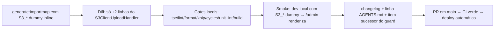

# Impl: Admin do Payload abre em branco em produção (importMap sem o handler do storage S3)

Status: aprovado
Atualizado em: 2026-08-19
Issue: #77
Intenção: docs/plans/ops69-admin-branco-importmap-s3.md
Appetite restante: herdado (~0,25–0,5 dia eng)

## Leitura da intenção

- **Outcome:** o `/admin` renderiza o formulário de login em produção; o importMap commitado volta a ser consistente com o config que as envs de produção ativam; dev/test sem `S3_*` seguem com storage local.
- **O que NÃO negociar:** não mexer no contrato `/api/media/file/...`, não mudar o storage (Garage S3), não mudar o comportamento do plugin em dev/test, não tocar em nada além do fix mínimo do P0.
- **O que reavaliar:** a hipótese "regenerar com envs S3 + diff só de storage" — verificado em evidência da intenção (reprodução local); a mecânica do `payload generate:importmap` foi confirmada no código (gera sem tocar DB; plugin só registra o handler quando ativo; env inline no processo vence os env-files via `loadEnvConfig` do `@next/env`).

## Abordagem recomendada

**Opções consideradas:** A | B | C | D

**Recomendação:** **A — regenerar o importMap com as 4 envs `S3_*` (valores dummy inline) e commitar o diff**, porque é o fix mínimo que elimina exatamente a divergência dev/prod: o `generate:importmap` walka o config via `iterateConfig` (sem DB), o plugin `s3Storage` registra o `ClientUploadHandler` da collection `media` só quando `mediaStorage.enabled`, e o CLI carrega env-files com `@next/env` **sem sobrescrever** envs já no processo — valores dummy inline garantem o enable sem depender de `.env.local`/secrets.

**Alternativas rejeitadas:**

- **B — editar `importMap.js` à mão:** arquivo gerado; o próximo `pnpm generate:importmap` apaga a edição e a divergência volta sem aviso; nenhuma verificação de consistência.
- **C — tornar o `s3Storage` incondicional (sempre ativo, inclusive sem envs):** quebra dev/test (anti-goal da intenção — storage local sem `S3_*`), exigiria Garage local em todo dev e muda o aceite OPS52.
- **D — guard de CI embutido neste item (rodar `generate:importmap` com envs dummy no gate e falhar se o arquivo commitado divergir):** é a resposta certa para a classe de bug, mas a intenção cortou explicitamente melhorias de build/deploy do fix mínimo (questão em aberto → "C como item sucessor"). Registra-se como Issue sucessora no fechamento (`depends` em #77).

### Componentes / mudanças

- **`src/app/(payload)/admin/importMap.js`** (gerado, commitado): ganha 2 linhas — import + entrada `@payloadcms/storage-s3/client#S3ClientUploadHandler` (export confirmado em `node_modules/@payloadcms/storage-s3/dist/exports/client.js`). Nenhuma outra entrada muda.
- **`package.json` / scripts:** nada muda; usa-se o `pnpm generate:importmap` existente com envs inline.
- **`AGENTS.md`:** uma linha na checklist de verificação local — `generate:importmap` deve rodar com as envs `S3_*` setadas (dummy ok) enquanto o plugin de storage for condicional; sem elas o importMap fica órfão do handler (classe OPS69).
- **Migration:** sem migration. **Access / Consent:** não se aplica. **UI:** Impeccable A — sem UI nova.

### Guardas de consistência da regeneração

Antes de commitar: `git diff` do `importMap.js` deve conter **exclusivamente** as 2 linhas do storage S3. Se aparecer qualquer outra entrada (drift de componentes admin desde a última regen, `a638a8ac`), **parar e investigar**: se o drift é real (componente admin novo sem regen posterior), incluí-lo é consistência correta, mas exige conferir o commit que o introduziu; nunca commitar um diff não compreendido.

## Fases verificáveis

1. **Regeneração** — `S3_BUCKET=teqo-media S3_ENDPOINT=http://localhost:3900 S3_ACCESS_KEY_ID=test S3_SECRET_ACCESS_KEY=test pnpm generate:importmap`; diff restrito às 2 linhas do S3. (Quota: minutos)
2. **Verificação de consistência + smoke** — `git grep` do handler no importMap; `pnpm dev` local com as mesmas envs dummy: `/admin/login` renderiza o formulário (o repro da intenção documenta que com S3 ativas + importMap órfão o admin fica branco; com o handler presente, renderiza). O e2e `admin.e2e.spec.ts` roda sem `S3_*` (CI) e continua passando — a entrada extra fica inerte.
3. **Gates** — `tsc --noEmit`, `pnpm lint`, `pnpm format:check`, `pnpm exec knip`, `pnpm check:cycles`, `pnpm test`, `pnpm build` (DB local). E2e: CI (PR).
4. **Fechamento** — `docs/changelog/2026-08-19-ops69.md` + `pnpm changelog:build`; linha no AGENTS.md; registrar Issue sucessora do guard via capture-review-debts (`depends` #77).

## Rabbit holes / Não escopo (engenharia)

- **Regenerar e ver drift** — acima: diff não compreendido = parada obrigatória.
- **"Aproveita e roda o guard no CI já"** — item sucessor, não este P0.
- **Perseguir o erro de beacon do Cloudflare** — ruído de console, fora de escopo (já cortado na intenção).
- **Testar upload real contra Garage local no dev** — o smoke só precisa que a view renderize; o fluxo de upload S3 já é coberto pelo OPS52 em produção.

## Riscos e mitigação

- **Regeneração traz drift além do S3** (componente admin adicionado desde `a638a8ac` sem regen): parar, conferir o commit que introduziu o componente, incluir só se for consistência legítima.
- **Alguém regenera sem envs no futuro e reintroduz o bug:** mitigado pela linha do AGENTS.md + Issue sucessora do guard de CI (que falha o gate na divergência).
- **Deploy em produção com o importMap novo:** verificação pós-deploy pelo runbook `docs/ops/teqo-1313-deploy.md` — `/admin` abre o login e o log do container não re-emite `getFromImportMap: PayloadComponent not found in importMap` para `@payloadcms/storage-s3/client#S3ClientUploadHandler`.

## Aceite de engenharia

- [ ] Aceite de produto da intenção ainda coberto (admin renderiza em prod; upload S3 intacto; dev/test sem `S3_*` intactos)
- [ ] Invariantes AGENTS/engineering-standards (nenhum schema/access/UI tocado; importMap é arquivo gerado e commitado)
- [ ] Diff do importMap restrito às 2 linhas do handler S3, verificado e compreendido
- [ ] Gates verdes (tsc/lint/format/knip/cycles/unit+int/build; e2e no CI)
- [ ] Changelog + AGENTS.md + Issue sucessora do guard registrada
