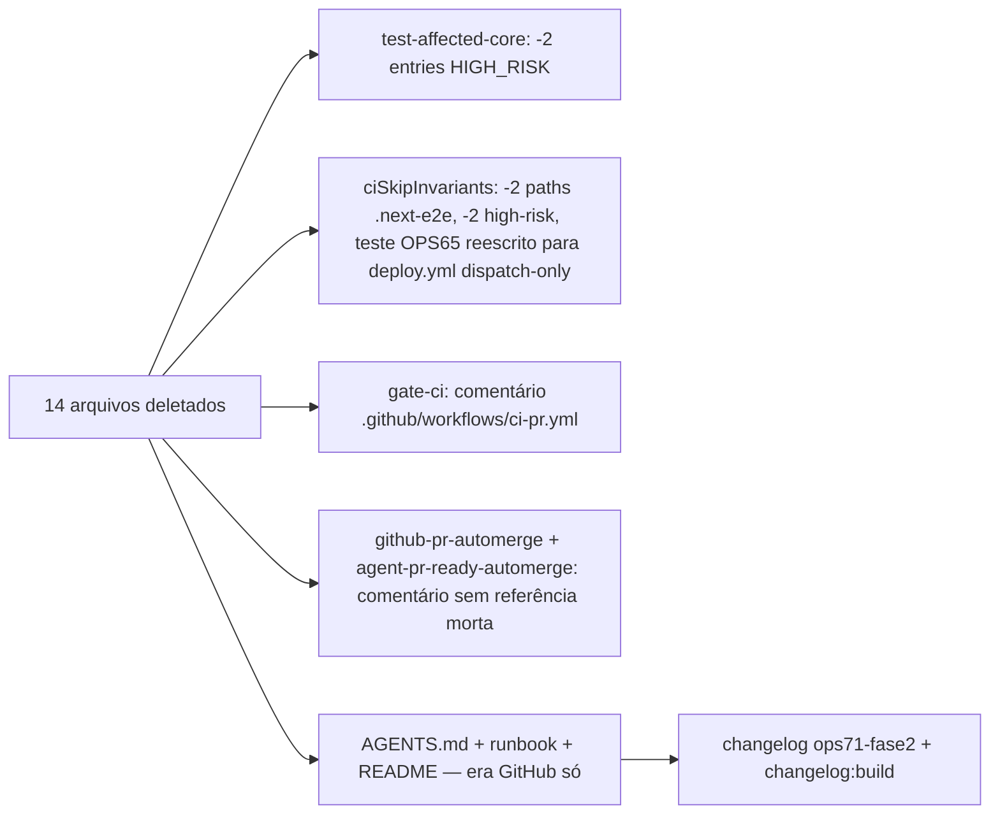

# Impl: OPS71 Fase 2 — remover arquivos do Forgejo (workflows/scripts) após validação do GitHub Actions

Status: aprovado
Atualizado em: 2026-08-19
Issue: #111
Intenção: docs/plans/ops71-ci-github-actions-tracker-forgejo.md (§"Fase 2 — entrega sucessora", linha 99-101 do impl da Fase 1)
Appetite restante: pequeno — remoção + fixups de consumidores + docs (1 sessão)

## Leitura da intenção

- **Outcome:** o fluxo GitHub Actions (OPS71 Fase 1, validado ao vivo: PRs #742/#743 — CI verde, auto-merge nativo, flips via API) é a única via de CI/PR/deploy no repo; os arquivos do fluxo Forgejo saem do tree; docs residuais atualizados; nada do tracker é tocado.
- **O que NÃO negociar:** tracker no Forgejo (Issues/labels/claims/flips via API) — `forgejo-api.mjs`, `agent-*.mjs`, `issue.mjs`, `forgejo-issue-transition.mjs`, `agent-promote-related-on-merge.mjs` **ficam**; `.forgejo/worktree.env` fica (fora do escopo `workflows/*`, consumido pelo provisionamento de worktree); desligar o runner do Forgejo é passo manual do runbook (fora do código); `ci.yml` de main não volta (deploy = dispatch manual).
- **O que reavaliar:** a hipótese da intenção dizia "grep `forgejo-pr-automerge|forgejo-dispatch|ci-classify|dockerignore` como saída" — a varredura achou **dois consumidores funcionais** além de docs, não listados no escopo literal: `scripts/lib/test-affected-core.mjs` (HIGH_RISK_EXACT com os 2 paths mortos) e `tests/unit/ciSkipInvariants.unit.spec.ts` (lê `.forgejo/workflows/ci.yml`+`ci-pr.yml` e pina o gate OPS65). Ambos **precisam ser editados** — são o contrato que quebraria se os arquivos sumissem. Também achado: `README.md` ainda descreve o fluxo Forgejo pré-Fase 1 (janela de 30 min, deploy automático, linha de CI apontando `.forgejo/workflows/`).

## Abordagem recomendada

**Opções consideradas:**

- **A — Remoção seca + fixups mínimos dos consumidores** (o escopo do body + os 2 consumidores funcionais + 3 docs). Nada de novo é criado; invariantes de CI re-ancorados no `.github/workflows/`.
- **B — Reescrever `ciSkipInvariants` para pinar "`.forgejo/` não existe"** — redundante: a deleção é o próprio diff do PR; e o teste que importa é o invariante _vivo_ (deploy nunca automático), que re-pino no `deploy.yml`.
- **C — Deletar o teste OPS65 inteiro** (remover o teste da janela de 30 min e pronto) — perderia o pin "nunca deploy automático" sem reposição; o GitHub manteve o espírito (dispatch manual), o teste deve continuar existindo apontando para o arquivo certo.

**Recomendação:** A — porque os consumidores são pequenos e bem delimitados, a substituição do pin OPS65 pelo pin equivalente da era GitHub (`deploy.yml` sem trigger `push`/`schedule`; `ci-pr.yml` sem o gate morto) preserva a invariante de deploy manual, e nada além do escopo declarado é tocado.

**Rejeitadas:**

- **Manter os arquivos como rollback inerte** — o propósito da Issue é a remoção; rollback passa a ser git history (o main congelado do Forgejo é uma cópia íntegra da era Forgejo; o PR é um commit reversível).
- **Deletar `forgejo-issue-transition.mjs`/`agent-promote-related-on-merge.mjs`/`forgejo-api.mjs`/`agent-*.mjs`** — anti-goal explícito (tracker vivo).
- **Deletar `.forgejo/worktree.env`** — fora do escopo (`workflows/*`); consumido pelo provisionamento de worktree.
- **Editar `docs/plans/*`, `docs/changelog/*`, `docs/CHANGELOG-AGENTS.md`** — história congelada/insert-only; a narrativa de "preservados até Fase 2" vive nos changelogs antigos e permanece.
- **Tocar `docs/AGENT-OPS.md`** — já é era-GitHub (grep não acha referência a nenhum arquivo removido).

### Componentes / mudanças

- **Deletados (14):** `.forgejo/workflows/` (6: ci-pr.yml, ci.yml, agent-pr-ready-automerge.yml, issue-done-on-main-merge.yml, plan-issue-ready-on-main-merge.yml, archive-cursor-agent.yml); `scripts/forgejo-pr-automerge.mjs`, `scripts/forgejo-dispatch.mjs`, `scripts/ci-classify-production.mjs`, `scripts/lib/dockerignore.mjs`, `scripts/lib/branch-protection.mjs`; specs `tests/unit/ciClassifyProduction.unit.spec.ts`, `tests/unit/dockerignoreMatch.unit.spec.ts`, `tests/unit/branchProtection.unit.spec.ts`. Nenhuma importação viva aponta para eles (grep: só `test-affected-core` + `ciSkipInvariants` + docs).
- **`scripts/lib/test-affected-core.mjs`**: remove `scripts/ci-classify-production.mjs` e `scripts/lib/dockerignore.mjs` de `HIGH_RISK_EXACT` (paths mortos nunca aparecem em diff; listas devem espelhar o tree).
- **`tests/unit/ciSkipInvariants.unit.spec.ts`**: (1) tira `ci.yml`+`ci-pr.yml` do loop `.next-e2e`; (2) tira os 2 paths do pin de high-risk; (3) reescreve o teste "main CI 30-min window (OPS65)" para a era GitHub: lê `.github/workflows/deploy.yml` e pina `workflow_dispatch:` presente, `push:`/`schedule:` ausentes (deploy nunca automático) e `.github/workflows/ci-pr.yml` sem `ci-classify-production.mjs` (gate morto).
- **`scripts/gate-ci.mjs`** (comentário do header): "Local mirror of `.forgejo/workflows/ci-pr.yml`" → `.github/workflows/ci-pr.yml`.
- **`scripts/github-pr-automerge.mjs` + `.github/workflows/agent-pr-ready-automerge.yml`**: comentários com o parêntese "(forgejo-pr-automerge.mjs)" → referência genérica à era Forgejo (arquivo não existe mais).
- **`AGENTS.md`**: frase "The Forgejo-era files (...) are preserved as rollback until the OPS71 Fase 2 removal" → removidos na Fase 2; rollback via git history (main congelado do Forgejo / revert do PR).
- **`docs/ops/teqo-1313-deploy.md`** (§"Rollback do cutover"): "os workflows de `.forgejo/workflows/` seguem no repo até a Fase 2" → arquivos removidos; restauração via git history do main congelado do Forgejo.
- **`README.md`**: bloco de fluxo stale (janela 30 min, deploy automático, linha `CI: .forgejo/workflows/ci-pr.yml + ci.yml`) → fluxo era-GitHub (PR → `CI (PR) / checks` → auto-merge nativo → deploy manual dispatch).
- **Changelog:** `docs/changelog/2026-08-19-ops71-fase2.md` + `pnpm changelog:build`.
- **Migration:** sem migration (nenhum schema).
- **Access / Consent / UI:** N/A.

## Fases verificáveis

1. **Deleção + fixups de código** — `git rm` dos 14 arquivos; edita `test-affected-core.mjs`, `ciSkipInvariants.unit.spec.ts`, comentários de `gate-ci.mjs`/`github-pr-automerge.mjs`/`agent-pr-ready-automerge.yml`. Gate: `pnpm test:unit` (ciSkipInvariants/testAffected/github\*).
2. **Docs + changelog** — AGENTS.md, runbook, README, `docs/changelog/2026-08-19-ops71-fase2.md` + `pnpm changelog:build`.
3. **Gates finais** — `pnpm exec tsc --noEmit`, `pnpm lint`, `pnpm format:check`, `pnpm exec knip`, `pnpm check:cycles`, `pnpm test` (unit+int), `pnpm build`; grep de saneamento (`forgejo-pr-automerge|forgejo-dispatch|ci-classify|dockerignore.mjs|branch-protection.mjs` → só histórico/docs/changelogs); push → PR GitHub → CI (PR) / checks → auto-merge.

## Rabbit holes / Não escopo (engenharia)

- Re-engenharia do `ciSkipInvariants` além do re-pino — não; só o que o arquivo lê muda.
- `pnpm configure:branch-protection`/github libs — intocados (era GitHub).
- Pool/`agent-pool*` dormente (OPS65) — intocado.
- Desligar o runner do Forgejo — passo manual no runbook, não código.
- `.dockerignore` (o arquivo) — **permanece**: o `docker build` do `deploy-homeserver.sh` o consome; só o lib `dockerignore.mjs` (parse de regras, gate OPS65) morre.

## Riscos e mitigação

- **`ciSkipInvariants` quebrar por leitura de arquivo removido** — os 3 pontos são editados na mesma fase da deleção; gate local `pnpm test:unit` antes de qualquer push.
- **Pin perdido do "deploy manual"** — mitigado pelo teste reescrito (dispatch-only, sem `push:`/`schedule:`); se um dia o `ci.yml` voltar com trigger, o teste acende.
- **Referência morta residual fora do grep** — saneamento final com o grep do escopo + knip (dead exports/deps é CI-blocking); docs históricos (plans/changelogs antigos) são allowlist consciente.
- **Knip acusar `branch-protection.mjs`/`dockerignore.mjs` como órfãos na Fase 1→Fase 2** — a deleção é atômica com a remoção das referências (mesma fase); nada fica órfão no diff.
- **PR de plano vs `check-plans-only-pr-closes`** — este PR tem código (não é plans-only); guard não se aplica.

## Aceite de engenharia

- [x] Aceite de produto da intenção ainda coberto (remoção completa + docs; tracker intacto)
- [x] Invariantes AGENTS/engineering-standards (sem migration/schema; nada do tracker; docs históricos intocados; changelog insert-only)
- [x] Testes de domínio previstos: ciSkipInvariants re-ancorado na era GitHub (deploy dispatch-only); unit suíte verde
