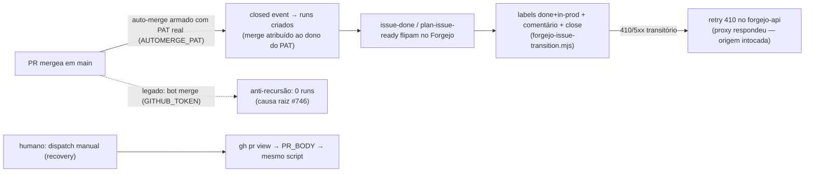

# Impl: OPS71-FLIP — Flip pós-merge falhou/silencioso no fluxo GitHub — validar e endurecer issue-done-on-main-merge

Status: aprovado
Atualizado em: 2026-08-20
Issue: #119
Intenção: body da Issue (sem plano linkado — o body é a spec)
Appetite restante: herdado (chore P2, sem appetite declarado — escopo = as 4 ações sugeridas + fix de raiz)

## Leitura da intenção

- **Outcome:** todo PR mergeado em `main` com `Closes #N` deve flipar a Issue no Forgejo para `done`+`in-prod` + comentário + **close** — de forma **não silenciosa** (falha visível) e com **caminho de recuperação manual** quando o evento do GitHub não criar run.
- **O que NÃO negociar:** tracker continua no Forgejo (flips via `FORGEJO_API_TOKEN`); fork guard (RCE) preservado; flips nunca mentem (OPS61: job vermelho se qualquer flip falhar); CI green é o único gate de merge.
- **O que reavaliar:** a hipótese da Issue ("tipos de evento / entrega do GitHub") estava certa só pela metade — a causa real é a **anti-recursão do GITHUB_TOKEN** (merge atribuído a `github-actions[bot]` não cria runs); a hipótese "410 é transitório, só pin/retry" é insuficiente — o 410 quebrou o run do #742 **depois** do evento ter criado o run; os dois problemas são independentes.

## Investigação (root cause — evidência ao vivo, GitHub API pública)

Comparação dos dois merges (timeline `issues/{n}/timeline` + `actions/runs`):

|                          | PR #742 (Fase 1)                                                  | PR #746 (Fase 2)                                                        |
| ------------------------ | ----------------------------------------------------------------- | ----------------------------------------------------------------------- |
| `auto_rebase_enabled`    | `github-actions[bot]` 21:20:38Z                                   | `github-actions[bot]` 00:02:32Z                                         |
| `merged` / `closed`      | **`fsolla`** 22:17:20Z                                            | **`github-actions[bot]`** 00:20:11Z                                     |
| Runs criados no `closed` | 32308114529 (falhou 410) + 32308114530 (skipped), 3s após o merge | **0 runs** (nenhum evento, nenhum head — janela 00:00–00:45 verificada) |

**Causa raiz:** o auto-merge nativo armado via `enablePullRequestAutoMerge` (GraphQL) com o **GITHUB_TOKEN** do workflow executa o merge como `github-actions[bot]`. O GitHub **documenta** ("Automatic token authentication", anti-recursão): eventos acionados por ações feitas com o `GITHUB_TOKEN` **não criam workflow runs** (exceção: `workflow_dispatch`, `repository_dispatch`). O `closed` fica no timeline do PR, mas o Actions não gera run nenhum — nem `pull_request`, nem `push` (0 runs na janela do merge). Toda auto-merge por bot vai pular os dois flips pós-merge **em silêncio** (run nem é criado — nunca vai aparecer vermelho).

O 410 é falha **separada**: o run do #742 foi criado normalmente (merge por humano) e o `GET /issues/97/labels` respondeu 410 Gone (nginx) — transitório, endpoint ok às 00:3x. O retry do OPS67 cobre fetch-rejection + 5xx-no-GET; 410 (4xx) nunca retenta; o corpo nginx HTML entra no erro só como slice cru de 400 chars (imprestável para log).

## Abordagem recomendada

**Opções consideradas (fix de raiz):** A | B | C
**Recomendação:** **A + recuperação manual + close + retry 410** — a trinca atende os 4 pontos da Issue e conserta a causa que a torna _silenciosa_.
**Rejeitadas:**

- **B — manter arming com GITHUB_TOKEN e só adicionar dispatch manual:** o flip continua quebrado em todo merge de bot (o "silencioso" do título); o humano vira o flip de todo PR. Rejeitada porque a Issue é exatamente sobre o silêncio.
- **C — poller (schedule) que varre PRs mergeados:** disparo a cada N minutos com API lendo PRs fechados = latência, races, e um "verificador" novo que o OPS71 eliminou de propósito; PAT + evento nativo é mais simples e imediato.

**Opções consideradas (recuperação manual):** A | B
**Recomendação:** **A — `workflow_dispatch` com input `pr`** (o script já aceita `PR_BODY`; o step de dispatch busca body+merged via `gh` e repassa). B (rodar o script local com `PR_BODY`) é o fallback final do runbook, sem YAML novo.
**Rejeitadas:** C — GitHub App só para isso (peso de registrar app; o repo já usa PATs).

**Opções consideradas (410):** A | B
**Recomendação:** **A — 410 entra no retry do `forgejo-api.mjs` para QUALQUER método** (não só GET): 410 vem do proxy (nginx/Cloudflare) — a origem **nunca viu** o request, então retentar escrita não duplica efeito colateral (diferente de 5xx, onde a origem pode ter aplicado o write — esse continua fail-closed). Corpo não-JSON vira marker compacto no erro.
**Rejeitadas:** B — 410 só no GET (o flip faz `removeLabels` GET → `addLabels` POST → `addComment` POST; um 410 no POST continuaria quebrando o flip apesar da classificação "transitório conhecido").

### Componentes / mudanças

- **`.github/workflows/agent-pr-ready-automerge.yml`**: passa `AUTOMERGE_PAT: ${{ secrets.AUTOMERGE_PAT }}` ao step; comentário do porquê (anti-recursão).
- **`scripts/github-pr-automerge.mjs`**: **fail-closed** — se `AUTOMERGE_PAT` ausente, `exit 1` com mensagem nomeando o secret e o motivo (nunca fallback silencioso para GITHUB_TOKEN); `enableAutoMerge` passa a usar `createApi({ token: AUTOMERGE_PAT })` (o `markPullRequestReady` continua com o token do run — PATCH draft:false não precisa gerar evento: nada consome `ready_for_review` além do próprio workflow, e o CI corre no `synchronize` do push do agente).
- **`.github/workflows/issue-done-on-main-merge.yml`** + **`plan-issue-ready-on-main-merge.yml`**: `on: workflow_dispatch` com input `pr` (required); job `if:` = evento (`closed` + merged + main + same-repo) **ou** dispatch com input; permission `pull-requests: read` (gh); step de dispatch: `gh pr view` → valida `merged == true` + `baseRefName == main` + `headRepository.nameWithOwner == github.repository` (mesmo contrato do evento — um dispatch num PR de fork/aberto é skip) → `PR_BODY` via `GITHUB_OUTPUT`; step do node usa `steps.pr.outputs.* || github.event.pull_request.*` (um caminho só, sem override vazio). O script já no-ops sem `Closes`/`Related`.
- **`scripts/forgejo-issue-transition.mjs`**: no loop do flip, após labels+comentário → **`api.closeIssue(number)`** (era-Forgejo o close era nativo do merge do PR; era-GitHub o PR não toca o tracker — sem o PATCH toda Issue mergeada fica `OPEN` com `done`+`in-prod`). Falha de close = `flipFailed` (OPS61: vermelho, nunca mentir). Comentário ganha menção ao close.
- **`scripts/lib/forgejo-api.mjs`**: `RETRYABLE_BEFORE_ORIGIN = new Set([410])` retentado em qualquer método (comentário: proxy respondeu — origem intocada, sem risco de efeito duplicado; 5xx segue GET-only); erro `!response.ok` com corpo HTML → marker compacto `corpo não-JSON (proxy/nginx — HTTP <status>): <120 chars>` em vez do slice cru.
- **`scripts/lib/github-api.mjs`**: **intocado** (o 410 observado é do proxy do Forgejo; github-api não recebe o mesmo tratamento por escopo — política documentada nos headers de ambos).
- **`docs/AGENT-OPS.md`**: tabela de workflows (rows dos dois flips ganham "dispatch manual de recuperação"), tabela de secrets (`AUTOMERGE_PAT`), parágrafo do flip com o porquê bot-merge não cria run + runbook de recuperação (dispatch com número do PR; fallback local `PR_BODY`).
- **`AGENTS.md`**: frase curta no parágrafo do OPS71 (auto-merge armado com `AUTOMERGE_PAT` — merge por bot não cria runs).
- **Migration:** sem migration. **Access/Consent:** n/a. **UI:** n/a.
- **Changelog:** `docs/changelog/2026-08-20-ops71-flip.md` + `pnpm changelog:build`.

## Fases verificáveis

1. **Lib + script do flip** — `forgejo-api.mjs` (410 + closeIssue + marker HTML), `forgejo-issue-transition.mjs` (close). Unit specs novas em `tests/unit/forgejoApi.unit.spec.ts` (410 GET retry, 410 write retry, 410 esgotado → marker HTML, closeIssue PATCH pin). Verificação: `pnpm test` (spec), `pnpm exec tsc --noEmit`, lint/format.
2. **Auto-merge com PAT** — `github-pr-automerge.mjs` fail-closed + workflow env. Verificação: tsc/lint; comportamento real no próprio PR desta entrega (CI verde → auto-merge armado com o PAT).
3. **Workflows de recuperação** — `workflow_dispatch` nos dois flips. Verificação: YAML válido (CI do PR), gate do humano.
4. **Gates + docs + changelog** — `pnpm gate:fast`; `pnpm changelog:build`; AGENT-OPS/AGENTS.
5. **Pós-merge (validação ao vivo, humano):** criar o secret `AUTOMERGE_PAT` **antes** do merge deste PR (senão o auto-merge do próprio PR falha fail-closed); conferir o flip da #119 (run criado pelo `closed` do merge — agora atribuído ao humano) e, como recovery proof, disparar o dispatch manual do `issue-done` uma vez.

## Rabbit holes / Não escopo (engenharia)

- Retry 410 no `github-api.mjs` (simetria): sem evidência de 410 no GitHub API; política documentada, gatilho = ocorrência real.
- GitHub App dedicado para o merge (B do fix de raiz): rejeitado no gate — PAT fine-grained basta.
- `agent-promote-related-on-merge.mjs` (`setLabels` do `agent-forgejo.mjs`): intocado — só o workflow dele ganha o dispatch.
- Poller/`schedule` de verificação de merges (C): rejeitado — o evento nativo + dispatch cobre.
- Drift do `ci-pr.yml` / branch protection: fora de escopo.

## Riscos e mitigação

- **Secret `AUTOMERGE_PAT` ainda não existe no merge deste PR** → o fail-closed derruba o auto-merge de todo PR até o humano criar. Mitigação: passo 5 da fase pós-merge declara criar o secret **primeiro**; sem o secret, merges manuais continuam funcionando (o bot não arma, o humano mergea — `closed` por humano gera runs, comportamento #742).
- **Fine-grained PAT sem permissão de merge** → `enablePullRequestAutoMerge` GraphQL falha → job vermelho (visível, não silencioso). Mitigação: runbook documenta escopos (`pull-requests: write` + `contents: write` no repo fsolla/teqo).
- **Dispatch manual num PR não mergeado / fork** → skip (validação `merged` + `baseRefName` + `headRepository` no step), mesma semântica do evento.
- **`gh` no runner hosted**: pré-instalado no `ubuntu-latest`; `GITHUB_TOKEN` injetado automaticamente; sem dependência nova.

## Aceite de engenharia

- [x] Aceite de produto da intenção ainda coberto (flip sempre acontece; falha é visível; recovery existe)
- [x] Invariantes AGENTS/engineering-standards (fork guard nos dois workflows, OPS61 exit-1, zero-dep plain Node, DRY <3 call sites)
- [x] Testes de domínio previstos (unit: retry 410 GET/write, marker HTML, closeIssue, fail-closed PAT)
- [x] Self-score decision-quality: 5/5 (decisões caras com rejeitadas; abordagem no appetite; rabbit holes nomeados; depth check ok — reusa createApi/PR_BODY; intenção preservada)
