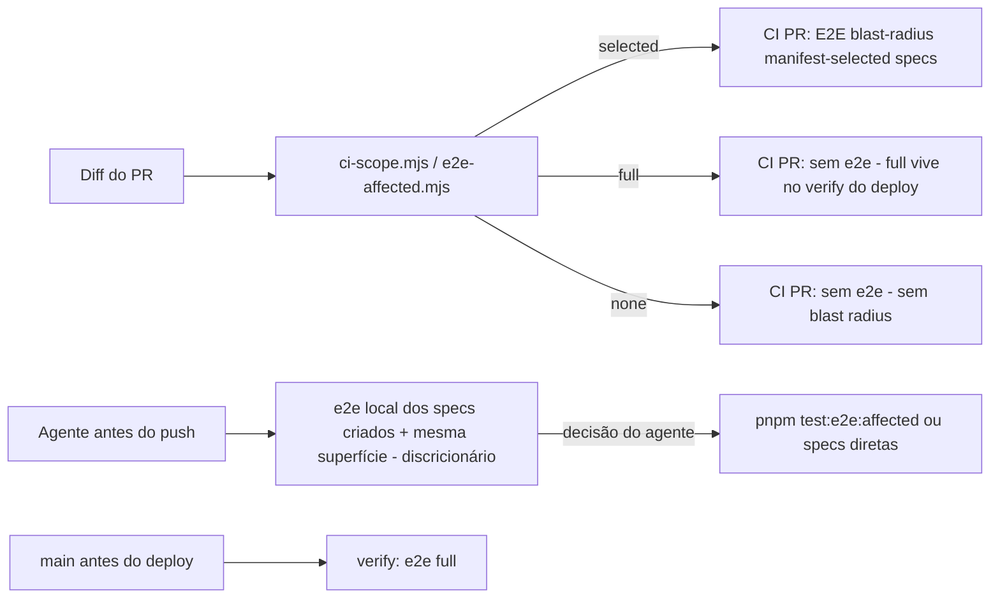

# Impl: E2E local apenas para os testes afetados — CI de PR sem e2e full

Status: aprovado
Atualizado em: 2026-08-19
Issue: #98
Intenção: docs/plans/ops72-e2e-local-afetado-ci-sem-full.md
Appetite restante: ~0,5–1 dia eng (herdado)

## Leitura da intenção

- **Outcome:** (1) skill `work-issue` (e irmãs do fluxo) exige que o agente rode localmente **os e2e que criou + os da mesma superfície afetada** — **discricionário**: o agente decide quais; `pnpm test:e2e:affected` é a ferramenta, não um gate mecânico; (2) CI de PR roda o **blast-radius** (e2e que o classifier detecta como tocados — modo `selected`, nunca `full`); (3) e2e **full** roda na **main, antes do deploy** (`verify` do deploy manual — rede de segurança pré-publicação); (4) limitação da #72 documentada na skill.
- **O que NÃO negociar:** full no deploy/verify de main; gate local (`gate:push`) sem e2e (passo explícito da skill, não hook); mecânica do classifier/manifest intocada; CI selected (blast radius) mantido como rede — o local é discricionário por design, o CI não.
- **O que reavaliar:** hipótese de "`.github/workflows/ci.yml` (verificador de main)" — **não existe mais**: OPS71 eliminou o `ci.yml`; a suíte full vive só no job `verify` do `deploy.yml` (confirmado). A hipótese do ci-pr.yml já ter os dois steps e2e (`full` + `selected`) dirigidos por `ci-scope.mjs` se confirma — o trabalho é **remover o full** e reorientar o texto.

## Abordagem recomendada

**Opções consideradas:** A | B | C  
**Recomendação:** A — remover o step e2e `full` do `ci-pr.yml`; quando o classifier emitir `full` (diff high-risk: schema/lockfile/harness), o CI de PR simplesmente não roda e2e (o step `selected` tem `if: e2e_mode == 'selected'` e é pulado; build-for-e2e segue rodando). O espelho local (`run-e2e-affected.mjs`) roda **full localmente** nesse mesmo caso — mesma mecânica, sem gap: o único caminho para "full" é diff high-risk, e aí o agente viu o full na máquina dele e o `verify` do deploy roda full antes de publicar. Ciência: um diff high-risk sem e2e no CI é um risco deliberado (rabbit hole "full só no deploy cria gap de regressão" já aceito no gate).
**Rejeitadas:** B — manter o step `full` no CI (status quo): viola o gate "nunca full por PR" e devolve o custo 40+ min por PR de infra. C — mapear `full` → falha/aviso no CI: criaria bloqueio artificial em PRs legítimos de infra/schema (o diff high-risk é exatamente o que o local roda full); o verify do deploy já é o gate honesto.

### Componentes / mudanças

- **`.github/workflows/ci-pr.yml`**: remover o step `E2E tests (full suite, single job, 4 workers)`; atualizar o comentário do header ("e2e policy: selected (affected) specs on PRs — never full; full lives in deploy verify — OPS72"); o step `E2E tests (manifest-selected specs)` fica funcionalmente intacto.
- **`scripts/gate-ci.mjs`**: mensagens informativas do escopo e2e (texto-only, ~linhas 153–162) — "e2e verified in CI" vira "e2e selected no CI (PR); full só no `verify` do deploy; local: `pnpm test:e2e:affected` (passo da skill)". Comportamento intocado (e2e fora do gate — aceite). Mensagens não são pinadas por unit tests (verificado).
- **`.agents/skills/work-issue/execution-pipeline.md`** (corpo compartilhado das duas skills): seção "Executar" item 3 (Gates) ganha o passo **e2e local (discricionário)** antes do `pnpm push`; nova seção curta "E2E local afetado" documentando: o agente roda **os specs e2e que criou + os da mesma superfície afetada**, decidindo quais (discricionário); a ferramenta (`pnpm test:e2e:affected` — espelho do classifier; ou specs diretas via `--no-deps`), e a **limitação da #72** (`--no-deps` + projetos paralelos colidem no `seedTestUser` → `--workers=1` ou a cadeia padrão de projetos; só conveniência local, CI é sequencial por construção).
- **`.agents/skills/work-issue/SKILL.md`**: checklist item 4 e Passo 4 ganham o passo (humano): "rode localmente os e2e que você criou + os da mesma superfície afetada — você decide quais (`pnpm test:e2e:affected`)".
- **`.agents/skills/agent-work-issue/SKILL.md`**: delta pool — mesmo passo **quando o worktree tiver browsers Playwright**; Cursor Cloud sem browser → registra justificativa e segue (CI selected é a rede) — opção B da intenção com registro, não silêncio.
- **`AGENTS.md`**: reescrever o parágrafo "O e2e não roda mais no gate local (OPS59)" → política OPS72: e2e afetado local = passo obrigatório da skill; CI de PR = selected; full = `verify` do deploy manual.
- **`docs/AGENT-OPS.md`**: item "Agente faz sozinho" ganha o passo e2e local afetado; linha do `ci-pr.yml` na tabela CI passa a "e2e selected (nunca full — OPS72)".
- **`.agents/rules/agent-pr-workflow.mdc`**: linha 41 (`pnpm gate:push` descrição) reflete a política nova.
- **Migration:** sem migration. **Access / Consent:** n/a. **UI:** Impeccable A — sem UI.
- **Changelog (OPS44):** `docs/changelog/2026-08-19-ops72.md` + `pnpm changelog:build` + `changelog:check`.

### Dados → forma (se aplicável)

- N/a — não apresenta dados; apenas política/CI/skills.

## Fases verificáveis

1. **CI** — `.github/workflows/ci-pr.yml`: step full removido + comentários; `scripts/gate-ci.mjs`: mensagens (texto-only). Verificação: `pnpm exec prettier --check` nos arquivos; diff limpo.
2. **Skills** — `execution-pipeline.md` (passo + seção #72), `work-issue/SKILL.md`, `agent-work-issue/SKILL.md`.
3. **Docs** — `AGENTS.md`, `AGENT-OPS.md`, `agent-pr-workflow.mdc`.
4. **Changelog** — entrada OPS72 + build + check.
5. **Gates** — `pnpm gate:fast`; `pnpm format:check`; `pnpm test:unit --changed` (nenhum pin quebra — mensagens de console não são pinadas); e2e local discricionário (este diff não cria specs nem toca superfície e2e — nada a rodar); `pnpm push`; PR Ready `Closes #98`.

## Rabbit holes / Não escopo (engenharia)

- Não tocar `ci-scope.mjs`, `e2e-affected.mjs`, `e2e-affected-manifest.mjs`, `test-affected-core.mjs`, `run-e2e-affected.mjs` — mecânica funciona; só muda onde/em que modo roda (fora de escopo da intenção).
- Não implementar o fix da #72 (fica na fila; só documentação).
- Não adicionar e2e ao `gate:push`/`gate:ci` (aceite explícito: passo da skill, não hook).
- Não mexer no `deploy.yml` (já roda full no `verify`).
- Não criar script novo — `pnpm test:e2e:affected` já existe.

## Riscos e mitigação

- **Diff high-risk no CI sem e2e** (ex.: PR de schema): o PR não roda e2e no CI. Mitigação: espelho local roda full no mesmo diff; `verify` do deploy roda full antes de publicar; documentado no workflow e no gate-ci.
- **Agente pula o e2e local**: discricionário por design (decisão do usuário) — o agente decide quais specs rodar e pode decidir não rodar. Mitigação: CI selected (blast radius) pega a superfície quando o diff é selecionável; full no `verify` do deploy fecha o ciclo antes de publicar.
- **Mensagem do gate-ci desatualizada vs CI**: texto ajustado na mesma entrega; nada pinado.
- **Serialização**: a intenção serializa `ci-pr.yml` e `.agents/skills/work-issue/`; OPS71 já mergeou — sem concorrência pendente (OPS72 é o primeiro a tocar no ci-pr.yml novo pós-OPS71).

## Aceite de engenharia

- [x] Aceite de produto da intenção ainda coberto (e2e local discricionário documentado na skill; CI/PR = blast-radius selected, nunca full; full na main antes do deploy; #72 documentada; gate local intocado)
- [x] Invariantes AGENTS/engineering-standards (edita o dono — execution-pipeline é o corpo compartilhado; nada duplicado)
- [x] Testes de domínio previstos: nenhum pin quebra (mensagens de console não pinadas); `test:e2e:affected` com modo `none` valida o fluxo novo
