# Impl: Admin do Payload segue em branco em produção — re-home S8/S9 no GitHub + fix importMap + deploy + verificação

Status: aprovado
Atualizado em: 2026-08-20
Issue: #114
Intenção: docs/plans/ops73-deploy-admin-prod.md
Appetite restante: herdado (~0,5 dia); ajuste: +1 PR de re-home (premissa da intenção se provou falsa)

## Leitura da intenção

- **Outcome:** `/admin` de produção renderiza o formulário de login (tela preta some); editor loga e abre uma coleção; log do container sem `getFromImportMap: PayloadComponent not found in importMap` para `@payloadcms/storage-s3/client#S3ClientUploadHandler`.
- **O que NÃO negociar:** nada de schema/migration/Consent/UI nova nesta entrega; não reabrir o diagnóstico OPS69 (#77); não introduzir features novas; o deploy é do que já está aprovado.
- **O que reavaliar (premissa FALSA):** a intenção afirma que "o fix OPS69 está em main desde 7162c65e e produção nunca o recebeu — basta deployar o main". **Verificado ao vivo (2026-08-19 23:56–2026-08-20 00:40), a premissa está errada em dois pontos:**
  1. **Produção JÁ recebeu um deploy às 23:09 UTC** (revision `8c734ba`, "docs(S8)", build 23:09:47, container up 23:09:48) — mas essa revision **não tem o handler no importMap**: o commit S9 (`8d2352c0`, captura de novidades na home) regenerou o importMap **sem** as envs `S3_*` e removeu as 2 linhas do fix OPS69. O erro `getFromImportMap` persiste no log desde o start do container e `/admin` continua em branco (0 inputs/botões/links; shell HTML ok, título "Painel de Controle - Payload"). A revision ANTERIOR (`fbfbfb1`) **tinha** o handler (2 matches) — confirma o relato "funcionou e no deploy seguinte parou de funcionar de novo".
  2. **O main do GitHub diverge do main do Forgejo (pós-cutover OPS71):** GitHub main = `3ea16243` (OPS69 fix com handler ✓, OPS71 infra ✓, plans S11/OPS73 ✓) mas **NÃO contém as features S8 (seção "Nossa história") e S9 (captura de novidades/newsletter)** que produção roda desde o deploy das 23:09 (árvore de 8c734ba tem `CampaignNewsletterForm.tsx`, `CampaignStorySection.tsx`, migration `20260819_192605_add_campaign_newsletter_capture`, e o GitHub main não — 404 via API; `git diff 8c734ba 3ea16243` mostra os arquivos como `D`). O Forgejo main congelou em `e339ceec` (S8/S9/S10); o workspace do homeserver ainda aponta `origin = http://localhost:3000/fsolla/teqo.git` (o Forgejo local) — por isso sua visão de "main" era o e339ceec. **Deployar o main do GitHub como está REGREDIRIA as features S8/S9 em produção** (some a seção "Nossa história" e o form de newsletter).

## Abordagem recomendada

```mermaid
flowchart LR
  A[cherry-pick S9 8d2352c0 + S8 488dcf7d sobre main 3ea16243] --> B[resolver conflito importMap: manter handler]
  B --> C[regen importMap com S3_* dummy: diff vazio = prova de consistencia]
  C --> D[gates locais: tsc/lint/format/knip/cycles/unit/int/build]
  D --> E[PR OPS73 em main com auto-merge]
  E --> F[confirmar no main: handler + S8/S9 presentes]
  F --> G[deploy via ssh homeserver: deploy-homeserver.sh sha]
  G --> H[verificar: revision label + log + /admin renderiza + home S8/S9 + editor loga]
```

**Opções consideradas:** A | B | C
**Recomendação:** **A — PR único OPS73** que re-homa no GitHub main as features S8+S9 já aprovadas e mergeadas no Forgejo (cherry-pick dos commits de feature `8d2352c0` + `488dcf7d`), resolve o conflito do importMap **mantendo o handler** e prova consistência rodando `generate:importmap` com envs `S3_*` dummy (diff deve ser vazio) — porque: (1) o aceite "admin no ar" exige o handler no build; (2) o aceite "não regredir prod" exige S8/S9 no main antes do deploy; (3) o main do GitHub é a fonte da verdade do deploy (guard de HEAD + `TEQO_REPO_URL`); (4) cherry-pick do código já aprovado ≠ feature nova (anti-goal preservado: nada de design/schema novo).
**Rejeitadas:**

- **B — PRs separados (re-home S8, re-home S9, depois fix/deploy):** ownership nominalmente mais limpo, mas 3 PRs em fila, admin fora do ar por mais tempo e o deploy continua dependendo do último; sem ganho de risco.
- **C — deploy do main atual aceitando a regressão S8/S9:** regressão pública (seção "Nossa história" + form de novidades somem) — viola o aceite "o time editorial e de campanha volta a trabalhar" e reverteria features `in-prod` no tracker.

### Componentes / mudanças

- **`src/app/(payload)/admin/importMap.js`** (gerado, commitado): estado final = com `@payloadcms/storage-s3/client#S3ClientUploadHandler` (idêntico ao de 3ea16243 — o conflito do cherry-pick do S9 resolve mantendo o handler; a regen com envs `S3_*` dummy fecha a prova de consistência com diff vazio).
- **S9 (cherry-pick `8d2352c0`):** `CampaignNewsletterSection.tsx`, `submitCampaignNewsletter.ts`, `CampaignNewsletterForm.tsx`, `campaignConsentKeys.ts`, `schemas/campaignNewsletter.ts`, mudanças em `Contact.ts`/`Subscription.ts`/`CampaignHero.tsx`/`CitySelect.tsx`/`StateSelect.tsx`/`page.tsx`/`styles.css` + migration `20260819_192605_add_campaign_newsletter_capture` + docs/changelog. **ImportMap do commit NÃO entra (remover as -2 linhas é o que quebrou; manter o handler).**
- **S8 (cherry-pick `488dcf7d`):** `CampaignStorySection.tsx`, `page.tsx` (+2), e2e `frontend.e2e.spec.ts`/`fixtures/e2eTest.ts`, `.gitignore`, plans/changelog.
- **Migration:** o cherry-pick traz a do S9; o deploy aplica **zero migrations novas** vs prod (8c734ba já a tem aplicada — `20260819_192605` rodou no deploy das 23:09). Sem migration nova neste PR.
- **Access / Consent:** não se aplica (S8/S9 já aprovados; `campaignConsentKeys.ts` é parte do S9 já mergeado no Forgejo).
- **UI:** Impeccable A — nenhuma UI nova; features S8/S9 já aprovadas (copy aprovado nos respectivos PRs).

## Fases verificáveis

1. **Cherry-picks + conflito** — `git cherry-pick 8d2352c0` (resolver importMap: manter o handler) e `488dcf7d` sobre `origin/main` (3ea16243); conferir que o diff final vs 3ea16243 contém S8/S9 completos (sem truncamentos) e que o importMap fica com handler. (Quota: ~30 min)
2. **Prova de consistência do importMap** — `S3_BUCKET=teqo-media S3_ENDPOINT=http://localhost:3900 S3_ACCESS_KEY_ID=test S3_SECRET_ACCESS_KEY=test pnpm generate:importmap` → `git diff` do importMap deve ficar **vazio** (estado já consistente). Se aparecer drift não compreendido: parar e investigar (guard do OPS69).
3. **Gates** — `pnpm exec tsc --noEmit`, `pnpm lint`, `pnpm format:check`, `pnpm exec knip`, `pnpm check:cycles`, `pnpm test` (unit+int), `pnpm build` (DB local). E2e: no CI do PR (frontend S8/S9 specs + admin).
4. **PR → merge** — push da branch, PR para main, auto-merge (required check `CI (PR) / checks`); conferir no main pós-merge: `importMap.js` com handler, `CampaignNewsletterForm.tsx`/`CampaignStorySection.tsx` presentes, migration do S9 presente.
5. **Deploy (caminho B — runner #113 ainda não instalado)** — `ssh homeserver 'bash ~/teqo-deploy/scripts/deploy-homeserver.sh <sha-do-main>'` (o script re-pointa o origin do workspace para o GitHub, guard de HEAD, flock, build migrator → migrate (no-op) → build runner → up → healthcheck → smoke). Executado pelo agente via SSH (acesso validado: `ssh homeserver` ok, docker ok, envs em `~/stack/teqo-1313.env`), com o humano acompanhando; alternativa: humano roda o mesmo comando. ~15–20 min.
6. **Verificação pós-deploy** — (a) `docker inspect` revision label == sha deployado; (b) `docker logs teqo-1313 --since <start>` sem `getFromImportMap` para o handler (aceite #3 da intenção); (c) `/admin` de prod renderiza o formulário de login no browser (Playwright + screenshot → `docs/plans/ops73-deploy-admin-prod-fixed-evidence.png`); (d) home pública mantém seção "Nossa história" (S8) e form de novidades (S9); (e) **editor loga e abre uma coleção — passo manual do humano** (credenciais de prod não ficam com o agente).
7. **Fechamento** — changelog `docs/changelog/2026-08-20-ops73.md` + `pnpm changelog:build`; comentários na Issue #114 com evidência; reforçar no AGENTS.md a lição do S9 (regen sem envs re-órfão o handler) e a necessidade do guard #87; registrar débito da divergência de plataformas (workspace homeserver aponta para Forgejo local; S10 re-home pendente — S10 NÃO está em prod nem no GitHub main, e sua Issue está in-prod no tracker).

## Rabbit holes / Não escopo (engenharia)

- **Arqueologia do rewrite do main (S10 force-push/rebase sobre o Forgejo):** a divergência das plataformas está documentada acima; reconstituir quem-mergeou-onde não muda o plano. Corte: verificação por conteúdo (API + árvore), não por linhagem.
- **Re-home do S10 (pixel):** S10 não está em prod (8c734ba só tem o `facebookPixel.ts` antigo do petition pages, `be1106f8`) nem no GitHub main — é PR próprio, fora deste escopo; registrar como débito.
- **Instalar o runner (#113)/deploy automático:** fora de escopo (a intenção já corta; caminho B é o que desbloqueia hoje).
- **Guard de CI do importMap (#87):** segue pendente; este incidente (regen do S9) é a segunda ocorrência da mesma classe — reforça a prioridade, não muda o escopo.

## Riscos e mitigação

- **Main do GitHub anda durante o trabalho (agentes paralelos S10/S11):** re-verificar `git ls-remote origin main` antes do cherry-pick, antes do push e antes do deploy (o guard do script re-checa). Se o main mudar, rebase e re-valida.
- **Conflito no cherry-pick além do importMap (page.tsx, Contact.ts, etc.):** base do S8/S9 = 693d2e48 (comum aos dois mains); o delta GitHub (OPS69/OPS71/plans) não toca os arquivos do S9 exceto importMap — conflitos esperados só no importMap; resolver mantendo o handler.
- **Deploy falhar no meio:** rollback automático do script (restore do compose + up) + runbook `docs/ops/teqo-1313-deploy.md`; zero migrations novas → janela de rollback limpa.
- **Admin continuar branco pós-deploy (fix insuficiente):** verificação por browser na fase 6 é o gate; se persistir, o erro no log apontará o próximo passo (o importMap está correto no main — cenário improvável, mas o log decide).
- **Screenshot de evidência sem ferramenta de visão:** usar Playwright (DOM: inputs/buttons > 0) + `design-vision` para descrever a imagem.

## Aceite de engenharia

- [ ] Aceite de produto da intenção coberto: `/admin` renderiza login em prod; log sem o erro do handler; editor loga e abre coleção (humano)
- [ ] Sem regressão: S8/S9 presentes no main do GitHub e servidos em prod (história + newsletter na home)
- [ ] Invariantes AGENTS/engineering-standards: nada de schema/Consent/UI novo; importMap é arquivo gerado e commitado; gates verdes
- [ ] Prova de consistência do importMap: regen com envs `S3_*` dummy → diff vazio
- [ ] Changelog + Issue #114 documentada com evidência (antes/depois); débitos registrados (S10 re-home, guard #87 reforçado, workspace homeserver origin)
