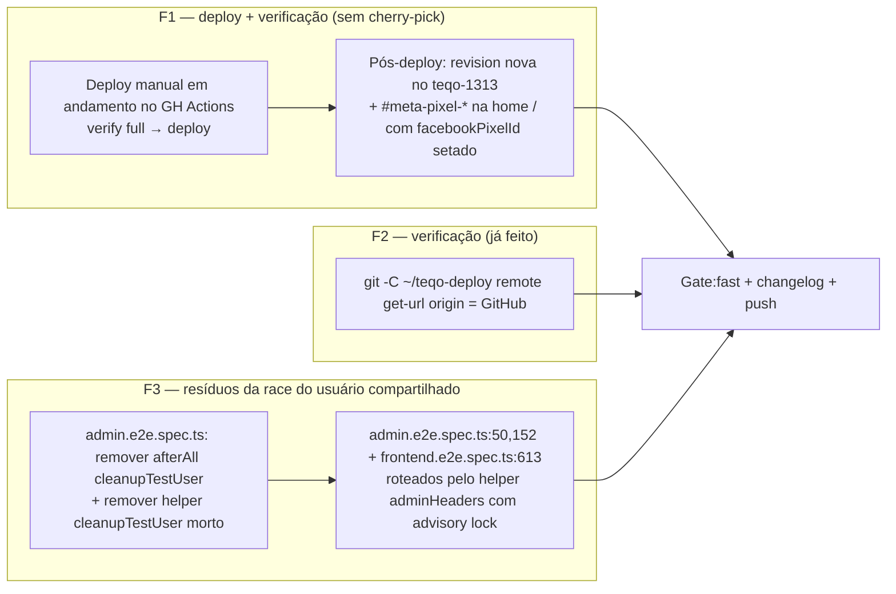

# Impl: Follow-up pós-OPS73 — re-home S10 no GitHub, origin do workspace homeserver + fix da race de seedUser do e2e

Status: rascunho
Atualizado em: 2026-08-23
Issue: #760
Intenção: docs/plans/ops73-followup-rehome-s10-infra.md
Appetite restante: ~0,4 dia (herdado)

## Leitura da intenção

- **Outcome:** (1) S10 (pixel Meta na home de campanha) no GitHub main **e rodando em prod**; (2) `~/teqo-deploy` no homeserver com origin = GitHub; (3) e2e full do GitHub CI estável no `seedTestUser` (sem flake de duplicate email).
- **O que NÃO negociar:** DB de prod intocável (testes/dev nunca apontam pra ele); migration `20260819_213947_add_site_settings_facebook_pixel_id` já registrada — imutável; o usuário compartilhado `dev@payloadcms.com` e a home `/` de campanha com `#meta-pixel-*` são contratos existentes; e2e full do CI continua rodando com 4 workers paralelos.
- **O que reavaliar:** a hipótese central da intenção — "S10 não está no GitHub main" — **está errada**. O merge de convergência OPS75 `c723d6ac` (2026-08-21) trouxe o S10 completo para o main (os 11 arquivos S10 são byte-idênticos entre `504f6c37` e `origin/main`; diff vazio). **Não há cherry-pick a fazer.** F2 também já está feito (`origin = https://github.com/fsolla/teqo.git` verificado no homeserver). O único **código real** restante é o resíduo de F3: logins sem advisory lock e o `cleanupTestUser()` deletando o usuário compartilhado no meio da suíte paralela.

## Abordagem recomendada

**Opções consideradas:** A | B | C (duas decisões independentes em F3)

**Decisão 1 — destino do `cleanupTestUser()` (admin.e2e.spec.ts:18-20):**
**Recomendação:** **B** — remover a chamada no `afterAll` **e** o helper `cleanupTestUser` de `tests/helpers/seedUser.ts`. O `seedTestUser` já é create-if-missing com credenciais constantes: o delete no fim da suíte não serve a nada e abre a janela "user vanished" + invalidação de tokens para workers paralelos ainda rodando. Remover só a chamada (opção A) deixaria um export morto — knip roda com `"exports": "error"` (knip.jsonc) e o projeto inclui `tests/**/*.ts`, então o gate de CI quebraria; código morto também viola o princípio de simplify.
**Rejeitadas:** A — remover só a chamada e manter o helper (export morto → knip `exports: error`); C — manter o `afterAll` mas neutralizar o delete (código morto idêntico, pior: ritual enganoso).

**Decisão 2 — rotear os logins diretos pelo lock:**
**Recomendação:** **A** — substituir os logins diretos (admin.e2e.spec.ts:50 e :152) por `adminHeaders(request, baseURL)` do helper `tests/helpers/adminApi.ts`, e no frontend.e2e.spec.ts **apagar a função local `adminHeaders` (:613-620)** e importar o helper. O advisory lock `pg_advisory_lock(727001)` já é o ponto único de serialização da sessão read-modify-write do Payload — um lock por login, um por suite inteira; rotear os call sites existentes (608, 810, 968, 1001, 1082, 1135, 1199, 1289, 1347 no frontend) custa zero mudança de comportamento além da serialização. O `campaignHomePixel.e2e.spec.ts` e o `campaignNewsletter.e2e.spec.ts` já usam o helper.
**Rejeitadas:** B — adicionar lock ad hoc em cada login inline (duplica a mecânica do lock em N pontos; o helper já existe — DRY, viola depth check de pass-through); C — serializar os arquivos com `test.describe.configure({ mode: 'serial' })` (mata o paralelismo de 4 workers, infla o wall-clock do full, e trata o sintoma de perda de sessão com perda de throughput).

**F1/F2:** nenhuma decisão de engenharia — monitorar o deploy em andamento e verificar. Se o deploy atual não cobrir o main com S10, re-disparar `deploy.yml` manual (`workflow_dispatch`).

### Componentes / mudanças

- **`tests/e2e/admin.e2e.spec.ts`**: remove `cleanupTestUser` do import (:2) e do `afterAll` (:18-20); troca os dois logins diretos (:50-55 e :152-156) por `adminHeaders(request, baseURL)` do helper.
- **`tests/e2e/frontend.e2e.spec.ts`**: apaga a definição local `adminHeaders` (:613-620, que sobrescreve o helper no arquivo) e importa `adminHeaders` de `../helpers/adminApi`; todos os ~9 call sites passam a usar o helper — a assinatura exige `baseURL` (já definido no arquivo), então cada chamada passa `request, baseURL`.
- **`tests/helpers/seedUser.ts`**: remove o export `cleanupTestUser` (zero call sites após a mudança acima).
- **`tests/helpers/adminApi.ts`**: sem mudança — dono do lock (1 lock `727001` serializa a suíte inteira).
- **Migration:** sem migration (só testes/e2e; schema intocado).
- **Access / Consent:** N/A — nada de prod, PII ou Consent.
- **UI:** N/A.
- **Changelog:** `docs/changelog/2026-08-23-ops73-followup.md` + `pnpm changelog:build`.

### Dados → forma (se aplicável)

N/A — sem mudança de dados; as mudanças são exclusivamente em specs e helper de teste.

## Fases verificáveis

1. **F1 — verificar deploy do S10** (dominante no appetite): monitorar o `workflow_dispatch` em andamento (verify full → deploy). Pós-deploy no homeserver: conferir revision nova no container `teqo-1313` e `#meta-pixel-*` presente na home `/` com `SiteSettings.facebookPixelId` setado. Se o deploy atual não cobrir, disparar `deploy.yml` manual. Verificação via SSH/`docker` no homeserver (leitura apenas).
2. **F2 — verificação barata**: `git -C ~/teqo-deploy remote get-url origin` → deve devolver `https://github.com/fsolla/teqo.git`. Sem code change.
3. **F3 — código + gates**: editar os 3 arquivos de teste conforme Componentes/mudanças; `pnpm gate:fast` (lint + typecheck + unit; knip entra no cascade do CI); e2e afetado: `admin`, `frontend`, `campaignHomePixel`, `campaignNewsletter` (o `deploy.yml` `verify` roda a full e é o juiz final).

## Rabbit holes / Não escopo (engenharia)

- **Não** reabrir o diagnóstico do admin (OPS73 fechado).
- **Não** re-homar S8/S9 (já em main via PR #751).
- **Não** reescrever `seedTestUser`/`assertTestDatabase`/chave do lock nem mudar `dev@payloadcms.com`.
- **Não** editar a migration `20260819_213947_...` nem schema.
- **Não** reduzir workers (4→1) nem serializar specs para "consertar" a race.
- **Não** mexer no retry 403→relogin do `campaignHomePixel.e2e.spec.ts:41`: com todos os logins no lock ele fica inerte — removê-lo é polish barato, deferível, sem gatilho de risco.
- Guard #87 (importMap sem envs S3) é Issue própria.
- F1/F2 não exigem cherry-pick nem arquivos do repo.

## Riscos e mitigação

- **Deploy em andamento falha no verify (flake)**: o próprio resíduo de F3 pode flakear o full em prod mode → mitigação: F3 reduz essa flakiness; após merge, re-disparar `deploy.yml` se necessário.
- **Pixel ausente em prod mesmo com deploy ok**: `SiteSettings.facebookPixelId` vazio no admin de prod faz a home renderizar sem `#meta-pixel-*` → mitigação: passo explícito de verificação em F1; se vazio, o ID real precisa ser configurado no admin (é dado de produto — perguntar ao humano, nunca inventar ID).
- **Shadowing no frontend.e2e.spec.ts**: `adminHeaders(request)` sem `baseURL` em :608 quebra na assinatura do helper → mitigação: passar `request, baseURL` em todos os call sites; o typecheck pega antes do push.
- **Knip pega resíduo inesperado ao remover o helper**: gates locais (`gate:fast` + knip) antes do push.
- **Usuário persistente entre runs após remover o cleanup**: aceito — credenciais constantes, create-if-missing, é o estado pós-seed atual.

## Aceite de engenharia

- [ ] Aceite de produto da intenção ainda coberto (S10 em main + prod verificado; origin homeserver = GitHub; e2e full sem flake de duplicate email)
- [ ] Invariantes AGENTS/engineering-standards (testes/dev nunca tocam prod; migration imutável; sem collection/Consent/URL nova)
- [ ] Testes de domínio previstos onde write paths mudam: sem write path de app — e2e afetados (`admin`, `frontend`, `campaignHomePixel`, `campaignNewsletter`) verdes no full
- [ ] Changelog `docs/changelog/2026-08-23-ops73-followup.md` + `pnpm changelog:build`
- [ ] `pnpm gate:fast` verde (lint + typecheck + unit) e knip sem export morto

---

**Self-score decision-quality: 5/5** (gate ≥4)

1. Decisões caras têm rejeitadas? **Sim** — as duas decisões reais (destino do `cleanupTestUser`; roteamento dos logins) têm A/B/C documentado.
2. Abordagem cabe no appetite? **Sim** — F1/F2 são verificação/monitoramento; F3 é edição pontual em 3 arquivos de teste; ~0,4 dia cabe.
3. Rabbit holes nomeados? **Sim** — seção própria com 7 itens (incl. workers, retry 403, migration, S8/S9).
4. Depth check: reusa shells/helpers? **Sim** — roteia tudo pelo `adminHeaders`/advisory lock existente; não cria helper novo nem duplica lock.
5. Intenção permanece satisfeita? **Sim** — aceite de produto intacto; a divergência é só a hipótese de direção ("S10 fora do main"), corrigida e documentada em Leitura da intenção.
