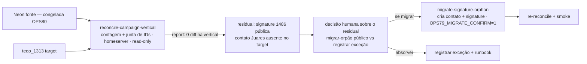

# Impl: Última migração de dados em produção: plataforma antiga → nova (vertical campanha)

Status: aprovado (executado em 2026-08-23)
Atualizado em: 2026-08-23
Issue: #797
Intenção: docs/plans/ops79-ultima-migracao-dados-campanha.md
Appetite restante: herdado (~2–3 dias; aqui cabe em 1 sessão — corte explícito do escopo à luz dos achados empíricos)

## Leitura da intenção

- **Outcome:** nenhum dado de operação de campanha (lideranças, pledges, apoiadores, atividades, demandas, alocação, usuários) viver só na plataforma antiga no momento do desligamento; contagens conferem; nada órfão, nada duplicado; `/campanha` preserva o acesso dos usuários.
- **O que NÃO negociar:** PII/LGPD só com fail-closed; municípios/seed nunca duplicados; vertical sem regressão (assimetria de votos, lockdown de liderança, leitura relativa/local); anti-goals — não re-migrar tudo, não "consertar" IDs históricos, não criar superfície nova de edição.
- **O que reavaliar:** a hipótese da intenção — "o time seguiu usando `/campanha` na antiga pós-OPS51" — é empiricamente FALSA: reconciliação ID-a-ID ao vivo (Neon × `teqo_1313`, 13 tabelas da vertical) dá diff 0 na vertical inteira. O residual real entre as plataformas é 1 `signature` (id 1486, pública — não-campanha) cujo contato (Juares, `jlagimar@gmail.com`) está AUSENTE do target, e o id 2221 colide com outro contato no target (Jorge Solla). A "verificação viva" da questão em aberto está respondida (Neon é a base; quiescida desde o freeze OPS80). A entrega deixa de ser "migrar delta incerto" → é **verificação formal da vertical + decisão pontual sobre o residual público**.

## Abordagem recomendada

**Opções consideradas:** A | B | C
**Recomendação:** B — reconciliar formalmente a vertical inteira por contagem/IDs (baseline: dump OPS51; já diff 0) e tratar o residual único verificável (uma `signature` pública) com decisão explícita (migrar o contato+signature com id novo vs registrar como exceção). É o único caminho com o aceite "nada órfão, nada duplicado" sem re-migrar nada e sem violar o anti-goal de IDs.
**Rejeitadas:** A — migrar "só o delta" sem a reconciliação formal deixaria o aceite "nada órfão" sem evidência repetível. C — re-migração completa: anti-goal explícito; a vertical já está íntegra.

### Decisões de engenharia

- **(i) O que copiar.** Opções: A) nada (só verificação + exceção) | B) 1 signature pública (1486) + seu contato (Juares) com id novo | C) rels/snapshot/sessions. **Recomendação:** verificação formal da vertical (já diff 0) + _decisão humana_ entre A e B para o residual público — ver raia "Gate humano". `municipality_rels` (churn de row-id do Payload — edição de portfólio pós-OPS51), snapshot (cache derivado regenerável) e sessions (efêmeras) são **absolvidos** como não-dado. `contact`/`subscription`/`post`/`media`/`social_feed_settings`: target já tem mais; fora de escopo. **Rejeitadas:** C.
- **(ii) Via de cópia (se migrar o residual público).** Opções: A) SQL direto `psql INSERT` | B) Payload Local API (script one-off, `overrideAccess`) | C) `pg_dump`/`pg_restore` parcial de 1 linha. **Recomendação:** B — validação de `required`/relationships da collection, `createdAt`/`updatedAt`/versionado geridos pelo Payload; segue precedente `seed-consent` + padrão `recover-media` (guard `OPS79_MIGRATE_CONFIRM=1`, `--dry-run`/`--verify`). **Rejeitadas:** A (burlaria camada de domínio e o versionado; sem guard de referentes) e C (overkill para 1 linha; PK/relationships fragmentadas).
- **(iii) Contato ausente / ID colide.** Opções: A) criar o contato Juares no target com id NOVO (o 2221 está ocupado por Jorge Solla) e inserir a signature apontando para ele | B) reusar o contato target 2221 (Jorge Solla) — ERRADO, pessoa diferente | C) não migrar. **Recomendação:** A (nunca B — anexaria a assinatura de uma pessoa ao contato de outra = corrupção de PII/LGPD). Prép-check fail-closed por _email_ no target (se `jlagimar@gmail.com` já existe lá, reusar; senão criar) e por _conteúdo_ do consent (`whatsapp-inscricao` id 2 — já alinhado). Aborto com relatório em ambiguidade (0/>1 match de email/consent).
- **(iv) Verificação pós.** Opções: A) contagem por coleção | B) contagem + junta de IDs + smoke | C) só smoke. **Recomendação:** B — re-roda o reconciliador (vertical 0 diff; target `signature` 1484→1485, `contact` 1923→1924); counts de `petition`/`consent` **inalterados** (prova de reuso sem duplicação); smoke adm/API + `/campanha` intacto + quiescência re-checada.
- **(v) Runbook.** Opções: A) seção em `docs/ops/teqo-1313-deploy.md` + falhas conhecidas + rollback | B) só changelog | C) nada. **Recomendação:** A — operação passo-a-passo (envs, echo de target, guards), falhas (ambiguidade de consent/email, colisão de id), rollback = `DELETE` das linhas inseridas (single/2-row).

### Componentes / mudanças

- **`scripts/reconcile-campaign-vertical.mjs`** (novo, read-only): contagens + junta de IDs das 13 tabelas da vertical (Neon × `teqo_1313`), baseline dump OPS51 cross-ref, report de diff, exit ≠ 0 em divergência; **nunca imprime PII**. Reusa `scripts/lib/cli.mjs` (`loadCliEnv`, `dieWithLabel`).
- **`scripts/migrate-signature-orphan.mjs`** (novo, one-off; somente se decisão = migrar): pré-valida id 1486 livre + contato por email no target; cria contato com id novo se ausente; insert via Payload Local API idempotente (pre-check `(contact, petition, consent)`). Guard `OPS79_MIGRATE_CONFIRM=1` no `--apply`; `--dry-run` sem guard. Reusa padrão `recover-media`/`seed-consent`.
- **Runbook:** seção OPS79 em `docs/ops/teqo-1313-deploy.md`.
- **Changelog:** `docs/changelog/2026-08-23-ops79.md` + `pnpm changelog:build`.
- **Migration:** sem migration (nenhum schema).
- **Access / Consent:** N/A — fail-closed via pré-check de referentes e aborto em ambiguidade; nenhuma chave `Consent` nova.
- **UI:** Impeccable A — N/A (operação de dados).

### Dados → forma (se aplicável)

Não há superfície de decisão. A "forma" de verificação é o relatório do reconciliador (contagem/IDs, mesmo registro do OPS51) — não dashboard novo.

## Fases verificáveis

1. **Tracer (read-only)** — `reconcile-campaign-vertical.mjs` no homeserver: report da vertical (já diff 0). **Gate humano:** confirmar report == recon ao vivo.
2. **Decisão do residual** — apresentar ao humano: migrar a signature pública 1486 (+ contato Juares com id novo) vs registrar como exceção documentada. **Gate humano duro.**
3. **(Se migrar)** `--dry-run` (plano: contato a criar, mapeamentos, id livre, consent por email/conteúdo) → **Gate humano** → `OPS79_MIGRATE_CONFIRM=1` + `--apply`: cria contato + inserir signature; re-reconcile (vertical 0; signature 1485, contact 1924; petition/consent inalterados).
4. **Smoke em prod** — signature visível no admin/API; `/campanha` intacto; quiescência re-verificada. **Gate humano.**
5. **Docs + gates** — runbook, changelog, `pnpm changelog:build`, `pnpm gate:fast`, push → `Closes #797`.

## Rabbit holes / Não escopo (engenharia)

- Re-migração da vertical inteira (anti-goal; já íntegra e verificada).
- Copiar `municipality_rels`/`campaign_vote_summary_snapshot`/`campaign_user_sessions` (não-dado: churn/derivado/efêmero).
- Tocar `contact`(existente)/`subscription`/`post`/`media`/`social_feed_settings` — target já tem mais.
- Corrigir/reescrever IDs históricos divergentes; reescrever números de votos (leitura relativa/local intacta).
- Desativar/cancelar infra da URL antiga ou Neon (OPS81); redirect de DNS.
- SQL/insert sem validação de referentes — nunca criar órfão.
- Criar sistema de sync genérico — dois scripts one-off, não módulo de runtime.

## Riscos e mitigação

- **Operar em prod (PII/LGPD)** — 100% no homeserver; PII nunca sai dele; `OPS79_MIGRATE_CONFIRM=1`; dry-run antes de apply; echo de target/host; `ALLOW_REMOTE_DB` explícito (operação de prod, padrão `recover-media`).
- **Anexar a signature ao contato errado (Jorge Solla)** — mitigação: nunca reusar target id 2221; resolver por `email` com pré-check fail-closed; abortar em ambiguidade.
- **Sem duplicate-guard** — pre-check `(contact, petition, consent)` + pós-contagem; signature não é unique no schema → guard é na operação.
- **Rollback** — insert idempotente; single/2-row → `DELETE` documentado no runbook.
- **Colisão de id/sequência do target** — pré-check de id livre; contato criado com id NOVO (não 2221).

## Aceite de engenharia

- [ ] Aceite de produto da intenção ainda coberto (contagens conferem; nada órfão/duplicado; `/campanha` preservado; leitura relativa/local intacta)
- [ ] Invariantes AGENTS/engineering-standards (100% homeserver; PII fora da workstation; guards/dry-run; sem migration de schema; sem re-migração; anti-goals respeitados)
- [ ] Testes de domínio previstos: sem mudança de access/write paths — verificação do report do reconciliador (0 diff) + dry-run do migrador; `pnpm gate:fast` verde

## Adiado com gatilho (débitos da sessão)

- **`connectReadOnly` duplicado (2 scripts one-off):** DRY prematuro com <3 call
  sites — **gatilho**: um 3º script conectando em Postgres passa a viver em
  `scripts/lib/cli.mjs`.
- **`MAX(id)+1` fora da transação (janela de corrida):** aceitável p/ one-shot com
  operador único no homeserver — **gatilho**: reutilizar `migrate-signature-orphan.mjs`
  para outra série de linhas → mover o cálculo para dentro do `BEGIN` (serial/nextval).
- **`ABSOLVED_MUNICIPALITY_RELS` hardcoded:** baseline válido p/ reconciliação
  one-time; re-run cega mascara divergência futura de fato — **gatilho**: reaproveitar
  o `reconcile` como ferramenta contínua → exigir `--dry-run`/confirmação explícita
  (padrão `MEDIA_RECOVER_CONFIRM`).
- **URL antiga `pt.jorgesolla.com.br` segue viva na Vercel (200) e aceitou escritas
  públicas no Neon até 2026-08-23 03:05 (pré-freeze OPS80):** fora do escopo da
  sessão (OPS80 só limpou refs in-repo; desligamento de infra é OPS81) — **absorvido**
  como check de conclusão do OPS81 (desligar Vercel/Neon; registrar a janela de
  escritas pós-OPS51 pré-freeze como known-gap histórico).

## Self-score decision-quality (gate ≥4)

1. Decisões caras têm rejeitadas? Sim — (i)–(v) com Opções/Recomendação/Rejeitadas. **1/1**
2. Abordagem cabe no appetite? Sim — 1 sessão; corte do escopo por evidência empírica. **1/1**
3. Rabbit holes nomeados? Sim. **1/1**
4. Depth check? Sim — reusa `cli.mjs`, padrão `recover-media`, Local API do `seed-consent`; scripts one-off. **1/1**
5. Intenção satisfeita? Sim — não reescreve o outcome. **1/1**

**Self-score: 5/5**
