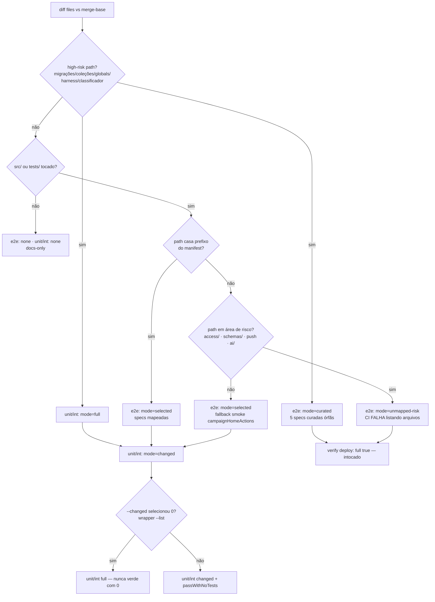

# Impl: OPS86 — Blast radius dos testes: PRs quebram testes que não rodaram no CI do PR

Status: aprovado (gate humano 2026-08-24)
Atualizado em: 2026-08-24
Issue: #832
Intenção: docs/plans/ops86-blast-radius-testes-prs.md
Appetite restante: herdado (~1 dia eng)

## Leitura da intenção

- **Outcome:** nenhum PR de código passa no CI sem executar exatamente os testes que o diff pode quebrar — e2e e unit/int —, com falha visível (e lista de specs) quando a cobertura não existe. Concretamente: (1) diff de alto risco (coleções/globals/migrações/acesso) executa no PR um conjunto curado de e2e — nunca zero; (2) módulos de risco (acesso, schemas, push, IA) nunca caem em "nenhum e2e" sem explicação; (3) seleção vazia unit/int dispara fallback explícito (nunca "0 testes, verde"); (4) código sem cobertura declarada roda fallback ou falha apontando a lacuna.
- **O que NÃO negociar:** guardrails — PR nunca roda e2e full (full só no verify do deploy); custo médio do job não sobe; classificador e mapa só mudam com os testes de invariante existentes verdes; `deploy.yml` intocado; guards de banco local inegociáveis.
- **O que reavaliar:** onde o fallback de seleção vazia vive (classificador vs YAML vs script wrapper); a semântica do mode `full` para e2e no PR (hoje "zero e2e por design" — OPS72); o raio do fail-closed (só áreas de risco, não "mapa de tudo").

## Abordagem recomendada

**Opções consideradas:** A | B | C (por decisão, abaixo)
**Recomendação:** o conjunto de mudanças abaixo — curadoria explícita vivendo no manifesto (Decisão 1: A), mode novo `curated` sem redefinir `full` (Decisão 2: B), mapeamento das áreas de risco + fail-closed só para área de risco (Decisão 3: A+B), fallback unit/int full na seleção vazia via wrapper (Decisão 4: A), órfãs viram o conjunto curado (Decisão 5: mapear) — porque cada mudança fica onde o contrato correspondente já vive (manifesto + núcleo puro + YAML + gate), é pinned pelos mesmos testes de invariante e não reescreve nenhuma semântica de deploy.
**Rejeitadas:** hardcode no YAML (Decisão 1: B); redefinir `full` no PR (Decisão 2: A); fail-closed para todo `src/` (Decisão 3: B isolado); rodar "só a superfície" ou falhar pedindo mapeamento no unit/int (Decisão 4: B/C); deixar as órfãs declaradas (Decisão 5: não-mapear).

### Componentes / mudanças

- **`E2E_CURATED_SPECS`** (novo export, `scripts/lib/e2e-affected-manifest.mjs`): o conjunto curado de e2e high-risk — congelado nas 5 specs órfãs (`campaignPermissionProfile`, `campaignDemandVisibility`, `campaignAiTranscribe`, `campaignAgendaFeed`, `campaignNewsletter`). Crescer exige editar o pin de invariante (intencional). São exatamente as specs que hoje "só rodam em full" e cobrem as áreas de risco da intenção: RBAC, visibilidade por demanda, IA/transcrição, agenda, newsletter.
- **`E2E_RISK_PREFIXES`** (novo export, mesmo módulo): o predicado de "área de risco" do fail-closed — `src/utilities/access/`, `src/utilities/campaignAccess.ts`, `src/lib/schemas/`, `src/utilities/campaignPushClient.ts`, `src/utilities/ai/` (auth já está mapeado no manifest). Curado e pequeno; **não** é "todo src/".
- **Entradas novas no `E2E_AFFECTED_MANIFEST`** (mesmo módulo): prefixos de risco → specs correspondentes (ex. `src/utilities/access/` + `src/utilities/campaignAccess.ts` → `campaignPermissionProfile`; `src/utilities/ai/` → `campaignAiTranscribe`; `src/lib/schemas/` → smoke de formulários; `src/utilities/campaignPushClient.ts` → `campaignNewsletter`; agenda → `campaignAgendaFeed`). Reusa o formato `{prefixes, specs}` e os pins existentes (`e2eAffectedManifest.unit.spec.ts`: spec existe no disco, prefixo `src/` sem trailing slash).
- **`selectE2eSpecs`** (`scripts/lib/test-affected-core.mjs`): ramo high-risk (linhas 197-204) passa a retornar `mode: 'curated'` com `specs: E2E_CURATED_SPECS` (e `reason` explicando o curado); arquivo `src/` sem match no manifest → se `E2E_RISK_PREFIXES` casa, retorna `mode: 'unmapped-risk'` (specs `[]`, `unmapped` preenchido — o CI falha com a lista); senão (não-risco), mantém o warning `unmapped` mas retorna `mode: 'selected'` com `specs: ['campaignHomeActions']` (fallback smoke — o mesmo smoke que o manifest já usa para domínios sem família e2e). Assimétrico com `classifyTestScope` (src/ novo → `full` em unit/int) mas deliberadamente: e2e nunca fica em `none` com código tocado.
- **`classifyTestScope`** (`test-affected-core.mjs`): **intocado** — `full`/`changed`/`none` unit/int já está correto; o fallback de seleção vazia vive no wrapper, não no classificador.
- **`scripts/vitest-changed-or-full.mjs`** (novo): wrapper que decide entre `--changed` e full: roda `vitest <suite> --changed <base> --list` (lista de arquivos sem executar; config unit/int conforme o arg); se 0 arquivos → roda a suíte full; senão → roda `--changed <base> --passWithNoTests` (comportamento atual). Fallback documentado se `--list` não honrar `--changed` na versão do vitest: rodar `--reporter=json` + `--passWithNoTests` e contar `numTotalTestSuites` (a execução já é a entrega; o custo da contagem é zero quando há testes). Spawna via `pnpm test:unit`/`pnpm test:int` (env e guards atuais preservados — o `DATABASE_URL` inválido do script unit e o `VITEST_MAX_WORKERS` da CI seguem vindo do ambiente).
- **`.github/workflows/ci-pr.yml`**: passo e2e e preparação do banco build/e2e passam a gatear em `e2e_mode == 'selected' || e2e_mode == 'curated'` (linhas 182, 188, 191, 199, 207, 215, 221); passo novo `Fail on unmapped risk paths` com `if: e2e_mode == 'unmapped-risk'` que emite `::error::` com a lista (`e2e_unmapped` vira output novo do passo scope, além de `e2e_mode`/`e2e_specs` — aditivo, sem renomear) e `exit 1`; passos unit/int `changed` (linhas 152, 179) passam a chamar o wrapper em vez do vitest cru.
- **`scripts/gate-ci.mjs`**: ramos `changed` de unit/int (linhas 106-112, 137-143) chamam o wrapper; seção e2e informativa (linhas 155-165) ganha mensagens para `curated` (specs que o CI vai rodar) e `unmapped-risk` (lista de arquivos + aviso de que o CI falhará). O gate local segue sem rodar e2e (OPS72) — mirror honesto do que o CI fará.
- **`scripts/run-e2e-affected.mjs`** (espelho local): `curated` → roda full local (preserva o contrato documentado do OPS72: localmente high-risk roda a suíte toda; o custo local é irrelevante, é passo de skill); `unmapped-risk` → imprime a lista e roda o curado com warning (divergência documentada: CI falha, local avisa — ferramenta de debug é soft, o gate é o CI).
- **Pins de invariante** (atualizados no MESMO PR — o classificador é self-touching via `HIGH_RISK_EXACT`): `tests/unit/testAffected.unit.spec.ts` (linhas 120-121: high-risk deixa de pinar `mode: 'full'` e passa a pinar `'curated'` + specs; novos casos: risco-unmapped → `unmapped-risk`, não-risco-unmapped → `selected` com smoke), `tests/unit/e2eAffectedManifest.unit.spec.ts` (pins do `E2E_CURATED_SPECS`: não-vazio, todo no disco, tamanho congelado), `tests/unit/ciSkipInvariants.unit.spec.ts` (linhas 93-108: `HIGH_RISK_EXACT` ganha `scripts/vitest-changed-or-full.mjs`; linhas 123-142: cobertura de domínios segue, agora com as entradas de risco).
- **Docs**: AGENTS.md (parágrafo da política e2e OPS72 — high-risk não é mais "zero e2e no PR"; é curado no PR, full no local e no verify), headers de `test-affected-core.mjs`/`ci-pr.yml`/`gate-ci.mjs`/`run-e2e-affected.mjs`, e entrada curta em `docs/changelog/<data>-ops86-impl.md` + `pnpm changelog:build` (append-only).
- **Migration:** nenhuma. **Access/Consent:** nenhum (mexe só no classificador/CI). **UI:** Impeccable A — N/A.

### Dados → forma

N/A (sem UI)

## Fases verificáveis

1. **Tracer — núcleo** (quota principal): `E2E_CURATED_SPECS` + `E2E_RISK_PREFIXES` + entradas de risco no manifesto; ramos novos em `selectE2eSpecs`; wrapper `vitest-changed-or-full.mjs`; pins de invariante atualizados. Verificações: `pnpm test:unit` verde (pins novos e alterados); classificador rodado à mão sobre diffs sintéticos (high-risk → curated com as 5 specs; `src/utilities/access/novo.ts` → selected RBAC; `src/utilities/access/` sem entry → unmapped-risk; componente novo não-risco → smoke) e sobre um diff real de alto risco; `--list` honrando `--changed` (ou fallback JSON contado — decidido aqui, com o resultado no PR).
2. **Wiring CI + gate**: ci-pr.yml (condições `selected || curated`, passo de falha `unmapped-risk`, output `e2e_unmapped`, wrapper nos passos changed) + gate-ci.mjs (wrapper + mensagens) + run-e2e-affected.mjs (curated→full, unmapped-risk soft). Verificações: `pnpm gate:ci` espelhando o CI; `pnpm test:e2e:affected` num diff high-risk rodando full; dry-run do JSON do `ci-scope.mjs` com os 4 modes novos.
3. **Docs + entrega**: AGENTS.md, headers, changelog + `pnpm changelog:build`; **Gates** — `pnpm gate:fast` na iteração (e `pnpm gate:ci` completo antes do push); push via `pnpm push` (gate `gate:push` = `gate:ci` — self-touching garante que a suíte cheia roda no CI do próprio PR).

## Rabbit holes / Não escopo (engenharia)

- **Não tocar `deploy.yml`** nem o verify full (contrato de deploy intacto).
- Não criar "mapa de tudo": fail-closed cobre só `E2E_RISK_PREFIXES`; módulos não-risco sem mapeamento rodam o smoke, não falham (corte da intenção).
- Não mudar `classifyTestScope` (unit/int já distingue `full`/`changed`/`none` corretamente; o problema é só o `--passWithNoTests`).
- Não mexer nas demais specs órfãs (agenda google sync/mobile, ai follow-ups, home pixel, ioss zoom, deliberation, responsive columns, register demand, table sticky, updates mobile, seedParity/setup): ficam full-only como hoje — gap conhecido, fora das áreas de risco nomeadas pela intenção (registrar no changelog, não engenhar).
- Não adicionar lock/coordenação entre ci-pr e verify (sem migração concorrente nova).
- Não mudar o contrato JSON do `ci-scope.mjs` além de valores novos de enum + campo `e2e_unmapped` (aditivo).

## Riscos e mitigação

- **Classificador é self-touching** (`test-affected-core.mjs` está em `HIGH_RISK_EXACT`): o PR desta entrega roda a suíte full (unit/int) — esperado e desejado; pins de invariante devem ir no mesmo commit do núcleo, senão o CI quebra vermelho.
- **Contrato JSON do `ci-scope.mjs`** consumido por ci-pr.yml E gate-ci.mjs: mudanças aditivas (novos valores de `e2e.mode`, output `e2e_unmapped`), nunca renomear campos existentes; validar os dois consumidores no tracer.
- **`--list` do vitest pode não honrar `--changed`** na versão instalada: tracer verifica primeiro; fallback `--reporter=json` documentado (a contagem é a própria execução — sem custo extra).
- **Custo médio do job**: high-risk passa de 0 e2e para 5 specs curadas (~+3 min nos PRs de alto risco, que são minoria); unmapped não-risco ganha 1 spec smoke; unit full na seleção vazia é barato (suíte unit rápida); int full na seleção vazia é raro (mode `changed` exige diff src/tests E nenhum spec int depender do arquivo tocado) e limitado por suíte — congelar o curado em 5 specs via pin impede deriva.
- **knip (`exports: error`)**: o novo wrapper é entry via glob `scripts/*.mjs` e é chamado por ambos os consumidores; `E2E_CURATED_SPECS`/`E2E_RISK_PREFIXES` são importados pelo core e pelos pins — sem exports mortos se os pins forem escritos junto.
- **Divergência local vs CI no `unmapped-risk`** (local avisa, CI falha): documentada no header do `run-e2e-affected.mjs` e no AGENTS.md — o gate de verdade é o CI.

## Aceite de engenharia

- [ ] Aceite de produto da intenção ainda coberto (4 aceites: curado nunca-zero no high-risk; risco sempre mapeado ou falhando; seleção vazia unit/int com fallback; código sem cobertura roda fallback ou falha — com lista de specs visível no check)
- [ ] Invariantes AGENTS/engineering-standards (deploy.yml intocado; guards de banco local intocados; contrato `ci-scope` aditivo; knip/cycles/lint verdes; changelog append-only)
- [ ] Testes de domínio previstos (unit/int) onde access/write paths mudam: pins de `testAffected`/`e2eAffectedManifest`/`ciSkipInvariants` atualizados no mesmo PR + tracer manual do classificador (4 modes) + wrapper verificado com seleção vazia e não-vazia

---

### Self-score de decision-quality: 4/5

Todas as 5 decisões têm Opções/Recomendação/Rejeitadas ancoradas em linhas verificadas do código, e cada recomendação respeita os guardrails (full nunca no PR, custo estável, contrato aditivo, pins no mesmo PR). Não dou 5 porque duas incertezas ficam para o tracer resolver (comportamento do `--list` do vitest com `--changed`; raio exato do predicado de risco frente a novos módulos de auth/push que a curadoria pode não antecipar) — resolvidas por fase de verificação explícita, não por decisão assumida.
